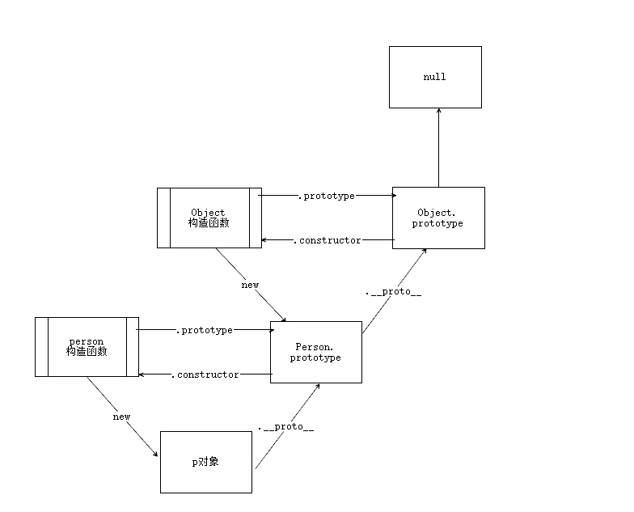
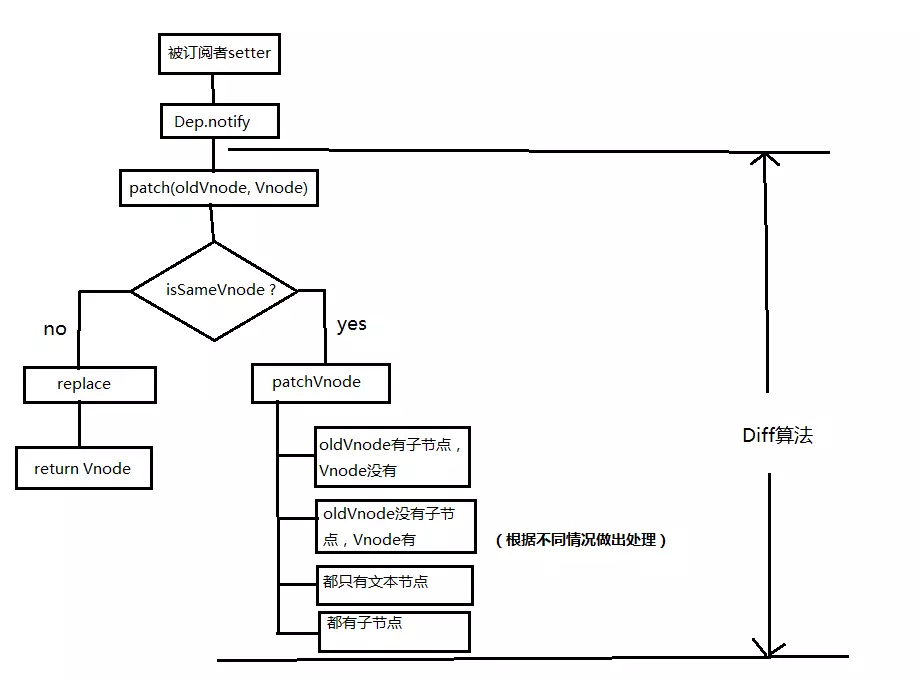
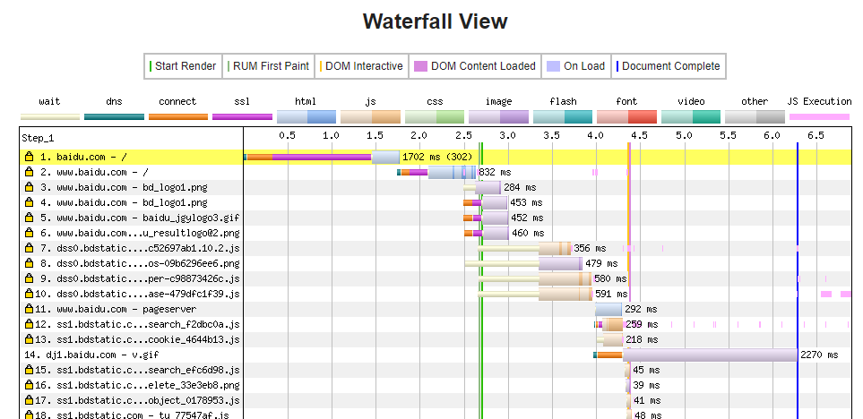
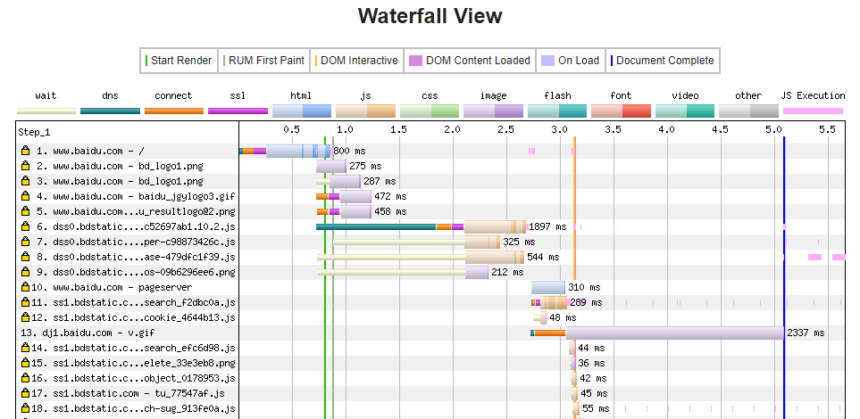
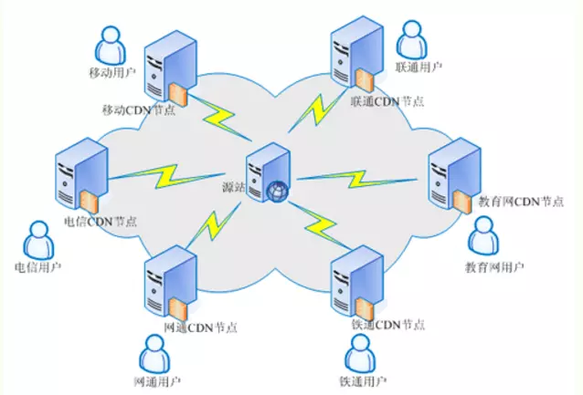

> "全方位总结一下所遇到的面试题目，与大家共同学习，也是对自己的一次总结"


## 01 前言

2020是不平凡的一年，这一年里发生许多事情，大家也都知道。对于互联网行业来说也是一次重大的打击，也有一些企业在这次疫情中倒闭了，所以可能对于今年2020年毕业的同学来说是一次很大的考验，也关乎我们的前途。

今年的面试基本上都不会线下面试，都是采取线上电话/视频的形式来进行，今天我就总结一下，分享一下自己所遇到的一些面试题，希望大家在这次春招中能够拿到满意的offer！毕竟自己当初也是看了很多师兄姐的面经，算是一个回馈社区。共勉！


## 02 目录

下面是这篇文章的目录结构，一般比较简单的问题我就一笔带过了，主要是分享一下比较有难度的知识点，答案来自网上，如果有版权问题我会删除。还有本文只是给出一个大概的知识点，如果想要深入学习还要靠自己去查一下哦！

如果答案有错误，欢迎指正！

- 计算机基础
- 前端基础（HTML/CSS）
- JavaScript
- 前端框架
- 浏览器渲染
- 计算机网络
- 手写代码
- Webpack
- Node
- ES6

## 03 计算机基础


##### **进程与线程的区别**

[查看详情](http://blog.alanwu.site/2020/03/06/process/)

- 进程是系统进行资源分配和调度的一个独立单位
- 线程是CPU调度和分派的基本单位,它是比进程更小的能独立运行的基本单位
- 一个进程至少有一个线程组成

线程自己基本上不拥有系统资源,只拥有一点在运行中必不可少的资源(如程序计数器,一组寄存器和栈)，但是它可与同属一个进程的其他的线程共享进程所拥有的全部资源

##### **进程间通信方式**

- 管道通信
- 消息队列通信
- 信号量通信
- 共享内存通信
- 套接字通信

##### **函数库与系统库**

- 系统库调用运行在内核模式，函数库运行在用户模式
- 系统调用是os提供的服务，处于内核态且不能直接调用，而要使用类似int 0x80的软中断陷入内核
- 库函数中有很大部分是对系统调用的封装
- 函数库属于过程调用，开销小；系统库需用户空间和内核上下文环境切换，开销大
- 用户态可以调用系统提供API接口调用内核来切换成内核态（中断方式）

##### **二叉树**

- 二叉树每一个节点不能多于两个孩子
- 没有孩子的节点就是叶子节点
- 一个节点有左右两个指针，若无则指向null
- 深度为h的二叉树最多有2^h-1个结点(h>=1)，最少有h个结点
- 二叉树的遍历三种方式，如下： 
（1）前序遍历（DLR），首先访问根结点，然后遍历左子树，最后遍历右子树。简记根-左-右。 
（2）中序遍历（LDR），首先遍历左子树，然后访问根结点，最后遍历右子树。简记左-根-右。 
（3）后序遍历（LRD），首先遍历左子树，然后遍历右子树，最后访问根结点。简记左-右-根

##### **数据库索引**

- 索引是一种数据结构（B+树）

- 不推荐使用索引

（1）表记录太少；
（2）数据重复且分布平均的字段（只有很少数据值的列）；
（3）经常插入、删除、修改的表要减少索引；

- 使用索引

（1）主键，unique字段；
（2）和其他表做连接的字段需要加索引；
（3）在where里使用＞，≥，＝，＜，≤，is null和between等字段；
（4）使用不以通配符开始的like，where object like 'Math%'；
（5）order by和group by字段；

##### **数据库引擎**

- InnoDB存储引擎
- MyISAM存储引擎
- MEMORY存储引擎
- Archive存储引擎

##### **虚拟内存及缓冲区溢出**

###### 虚拟内存

- 虚拟内存是计算机系统内存管理的一种技术
- 应用程序认为它拥有连续的可用的内存，实际分隔成多个物理内存碎片，还有部分暂时存储在外部磁盘存储器上
- 虚拟内存技术可以通过覆盖或者把处于不活动状态的程序以及它们的数据全部交换到磁盘上等方式来实现

###### 缓冲区溢出

- 计算机向缓冲区填充数据时超出了缓冲区本身的容量，覆盖合法数据

###### 危害

- 堆栈溢出，可以改变返回程序地址
- 程序崩溃，拒绝服务
- 执行非法代码，获取非法权限
- 程序运行失败，系统宕机，重启

##### **排序算法**

[查看详情](http://blog.alanwu.site/2020/03/18/jsSortMethods/)

- 快速排序（nlogn）
- 选择排序（n^2）
- 插入排序（n^2）
- 希尔排序（n^1.5）
- 归并排序（nlogn）
- 冒泡排序（n^2）

##### **常用git指令**

- 下载一个项目和它的整个代码历史  git clone [url]
- 添加指定目录到暂存区，包括子目录   git add [dir]
- 提交暂存区到仓库区   git commit -m [修改信息]
- 同步到远程仓库， git　push
- 列出所有本地分支  git branch
- 新建一个分支，并切换到该分支  git checkout -b [branch]

##### **路由器与交换机**

- 路由器可以给你的局域网自动分配IP，交换机只是用来分配网络数据的
- 路由器在网络层，路由器根据IP地址寻址，路由器可以处理TCP/IP协议，交换机不可以
- 交换机在中继层，交换机根据MAC地址寻址
- 路由器提供防火墙的服务，交换机不能提供该功能


## 04 前端基础（HTML/CSS）

##### **flex容器布局**

- [查看详情](http://blog.alanwu.site/2020/03/18/flexLayout/)

###### 主轴属性

- flex-direction
- flex-wrap
- flex-flow
- justify-content
- align-items
- align-content

###### 交叉轴属性

- order
- flex-grow
- flex-shrink
- flex-basis
- flex
- align-self


##### **BFC/IFC**

BFC（Block Formatting Context）叫做“块级格式化上下文"

（1）内部的盒子会在垂直方向，一个个地放置；
（2）盒子垂直方向的距离由margin决定，属于同一个BFC的两个相邻Box的上下margin会发生重叠；
（3）每个元素的左边，与包含的盒子的左边相接触，即使存在浮动也是如此；
（4）BFC的区域不会与float重叠；
（5）BFC就是页面上的一个隔离的独立容器，容器里面的子元素不会影响到外面的元素，反之也如此；
（6）计算BFC的高度时，浮动元素也参与计算。

触发条件
（1）float的属性不为none；
（2）position为absolute或fixed；
（3）display为inline-block，table-cell，table-caption，flex；
（4）overflow不为visible

IFC（inline Formatting Context）叫做“行级格式化上下”

（1）内部的盒子会在水平方向，一个个地放置；
（2）IFC的高度，由里面最高盒子的高度决定；
（3）当一行不够放置的时候会自动切换到下一行；


##### **CSS3的filter属性详解**

- [查看详情](http://blog.alanwu.site/2020/03/07/cssFilter/)

- blur
- brightness
- contrast
- grayscale
- hue-rotate
- invert
- opacity
- saturate
- sepia

##### **CSS的继承属性**（部分）

- font-size：设置字体的尺寸
- text-indent：文本缩进
- text-align：文本水平对齐
- text-shadow：设置文本阴影
- line-height：行高
- 元素可见性：visibility
- 光标属性：cursor

##### **CSS盒模型**

- W3C 标准盒模型：
属性width,height只包含内容content，不包含border和padding

- IE 盒模型：
属性width,height包含border和padding，指的是content+padding+border

content-box（标准盒模型）
border-box（IE盒模型）

##### **CSS的四种定位**

- **Static**

  这个是元素的默认定位方式，元素出现在正常的文档流中，会占用页面空间。

- **Relative**

  相对定位方式，相对于其父级元素（无论父级元素此时为何种定位方式）进行定位，准确地说是相对于其父级元素所剩余的未被占用的空间进行定位（在父元素由多个相对定位的子元素时可以看出），且会占用该元素在文档中初始的页面空间，即在使用top，bottom，left，right进行移动位置之后依旧不会改变其所占用空间的位置。可以使用z-index进行在z轴方向上的移动。

- **Absolute**

  绝对定位方式，脱离文档流，不会占用页面空间。以最近的**不是static定位的父级元素**作为参考进行定位，如果其所有的父级元素都是static定位，那么此元素最终则是以当前窗口作为参考进行定位。可以使用top，bottom，left，right进行位置移动，**亦可使用z-index在z轴上面进行移动**。当元素为此定位时，如果该元素为内联元素，则会变为块级元素，即可以直接设置其宽和高的值；如果该元素为块级元素，则其宽度会由初始的100%变为auto。

  注意：当元素设置为绝对定位时，在没有指定top，bottom，left，right的值时，他们的值并不是0，这几个值是有默认值的，默认值就是该元素设置为绝对定位前所处的正常文档流中的位置。

- **Fixed**

  绝对定位方式，直接以浏览器窗口作为参考进行定位。其它特性同absolute定位。当父元素使用了transform的时候，会以父元素定位

##### **CSS权重计算**

- 第一等级：代表内联样式，如style=""，权值为 1000
- 第二等级：代表id选择器，如#content，权值为100
- 第三等级：代表类，伪类和属性选择器，如.content，权值为10
- 第四等级：代表标签选择器和伪元素选择器，如div p，权值为1
注意：通用选择器（*），子选择器（>），和相邻同胞选择器（+）并不在这个等级中，所以他们的权值为0


##### **CSS优化技巧**

- 合理使用选择器
- 减少DOM操作，减少重绘和重排
- 去除无效的选择器
- 文件压缩
- 异步加载文件
- 减少@import的使用

##### **px/em/rem/vh/vw**

- px像素（Pixel）。相对长度单位。像素px是相对于显示器屏幕分辨率而言的
- em是相对长度单位。相对于当前父元素的字体尺寸。如未设置，则相对于浏览器的默认字体尺寸
- rem是CSS3新增的一个相对单位。使用rem为元素设定字体大小时，仍然是相对大小，但相对的只是HTML根元素
- css3新单位，view width的简写，是指可视窗口的宽度。假如宽度是1200px的话。那10vw就是120px
- css3新单位，view height的简写，是指可视窗口的高度。假如高度是1200px的话。那10vh就是120px


## 05 JavaScript

##### **闭包以及作用域**

- [查看详情](http://blog.alanwu.site/2020/03/04/this/)

- 作用域是可访问变量的集合，可以分为全局作用域和局部作用域。
- 闭包就是将函数内部和函数外部连接起来的一座桥梁
- this是在函数运行时，在函数体内部自动生成的一个对象，只能在函数体内部使用

##### **事件循环机制**

- [查看详情](http://blog.alanwu.site/2020/03/06/eventLoop/)

- 宏任务与微任务的区别
- Node中的事件循环机制

##### **JS垃圾回收与V8垃圾回收**

- JS：标记清楚法/引用计数法
- V8：标记清除发/标记压缩法/增量标记法/压缩算法  [查看详情](http://blog.alanwu.site/2020/03/03/nodeCollect/)


##### **原型与原型链**

- 所有原型链的终点都是 Object 函数的 prototype 属性
- 每一个构造函数都拥有一个 prototype 属性，此属性指向一个对象，也就是原型对象
- 原型对象默认拥有一个 constructor 属性，指向指向它的那个构造函数
- 每个对象都拥有一个隐藏的属性 __ proto __，指向它的原型对象



##### **JavaScript基本类型及其判断**

- boolean
- string
- number
- null
- undefined
- symbol
- object

```javascript
function getType(obj) {
  const str = Object.prototype.toString.call(obj);
  const map = {
    '[object Boolean]': 'boolean',
    '[object Number]': 'number',
    '[object String]': 'string',
    '[object Function]': 'function',
    '[object Array]': 'array',
    '[object Date]': 'date',
    '[object RegExp]': 'regExp',
    '[object Undefined]': 'undefined',
    '[object Null]': 'null',
    '[object Object]': 'object'
  };
  return map[str];
}
```

##### **JavaScript数组API**

[查看详情](http://blog.alanwu.site/2020/03/18/jsArrayAPI/)

- push()        pop()
- shift()        unshift()
- sort()         reverse()
- concat()      slice()  
- splice()       join()
- indexOf()     lastIndexOf()
- forEach()      map()
- filter()         every()
- some()       reduce()
- reduceRight()


##### **JavaScript设计模式**

[查看详情](http://blog.alanwu.site/2020/03/17/designMode/)

- 单例模式
- 适配器模式
- 代理模式
- 发布-订阅模式
- 策略模式
- 迭代器模式

##### **操作节点API总结**

###### 查找节点

- document.getElementById ：根据ID查找元素，大小写敏感，如果有多个结果，只返回第一个
- document.getElementsByClassName ：根据类名查找元素，多个类名用空格分隔，返回一个 HTMLCollection 。
- document.getElementsByTagName ：根据标签查找元素， * 表示查询所有标签，返回一个 HTMLCollection 。 
- document.getElementsByName ：根据元素的name属性查找，返回一个 NodeList 。 
- document.querySelector ：返回单个Node，如果匹配到多个结果，只返回第一个。 
- document.querySelectorAll ：返回一个 NodeList。 
- document.forms ：获取当前页面所有form，返回一个 HTMLCollection ；

###### 创建节点

- createElement创建元素
- createTextNode创建文本节点
- cloneNode 克隆一个节点
- createDocumentFragment 创建文档碎片，主要是用来存储临时节点，大量操作DOM时用它可以大大提升性能

###### 修改节点

- appendChild
- insertBefore
- removeChild
- replaceChild


## 06 前端框架

##### **vue的双向数据绑定原理**

- 监听器 Observer ，用来劫持并监听所有属性（转变成setter/getter形式），如果属性发生变化，就通知订阅者
- 订阅器 Dep，用来收集订阅者，对监听器 Observer 和 订阅者 Watcher 进行统一管理
- 订阅者 Watcher，可以收到属性的变化通知并执行相应的方法，从而更新视图
- 解析器 Compile，可以解析每个节点的相关指令，对模板数据和订阅器进行初始化


##### **vue不能检测哪些属性变化**

###### 数组

- 使用下标更新数组元素
- 使用赋值方式改变数组长度
- 使用下标增删数组元素

官方应对方法：
- Vue.set( target, key, value )
- vm.items.splice(indexOfItem, 1, newValue)

###### 对象

- 增删元素

官方应对方法：

- Vue.set(target,  propertyName, value);
- Vue.delete( target, propertyName/index )

##### **虚拟DOM**

[查看详情](http://blog.alanwu.site/2020/03/03/virtualDom/)

- 用 JavaScript 对象模拟真实 DOM 树，对真实 DOM 进行抽象
- diff 算法 — 比较两棵虚拟 DOM 树的差异
- pach 算法 — 将两个虚拟 DOM 对象的差异应用到真正的 DOM 树

##### **vue模板解析**

[查看详情](http://blog.alanwu.site/2020/03/08/vueTemplate/)

- 模板变成AST（解析器）
- AST遍历静态节点（优化器）
- 生成渲染函数（代码生成器）

##### **diff算法**

- diff算法是比对组件中的节点异同的情况



##### **vue的生命周期**

- beforeCreate
- created
- beforeMount
- mounted
- beforeUpdate
- updated
- beforeDestroy
- destroyed
- activated
- deactivated
- erroeCaptured

##### **vuex**

[查看详情](http://blog.alanwu.site/2020/03/10/vuex/)

- state：用于数据的存储，是store中的唯一数据源
- getters：如vue中的计算属性一样，基于state数据的二次包装，常用于数据的筛选和多个数据的相关性计算
- mutation：类似函数，改变state数据的唯一途径，且不能用于处理异步事件
- action：类似于mutation，用于提交mutation来改变状态，而不直接变更状态，可以包含任意异步操作
- modules：类似于命名空间，用于项目中将各个模块的状态分开定义和操作，便于维护

##### **vue组件通信方式**

- props / $emit 适用 父子组件通信
- ref 与 $parent / $children 适用 父子组件通信
- EventBus （$emit / $on） 适用于 父子、隔代、兄弟组件通信
- $attrs/$listeners 适用于 隔代组件通信
- provide / inject 适用于 隔代组件通信
- Vuex 适用于 父子、隔代、兄弟组件通信

##### **watch/computed的区别**

- computed是计算属性，依赖其它属性值，并且 computed 的值有缓存，只有它依赖的属性值发生改变，下一次获取 computed 的值时才会重新计算 computed 的值
- watch是观察监听的作用，类似于某些数据的监听回调 ，每当监听的数据变化时都会执行回调进行后续操作
- 当我们需要进行数值计算，并且依赖于其它数据时，应该使用 computed
- 当我们需要在数据变化时执行异步或开销较大的操作时，应该使用 watch

##### **v-if与v-show的区别**

- v-if 是真正的条件渲染，直到条件第一次变为真时，才会开始渲染
- v-show是由display样式决定，不管初始条件是什么都会渲染
- v-if 适用于不需要频繁切换条件的场景；v-show 则适用于需要非常频繁切换条件的场景

##### **vue中的路由模式**

###### history模式

- - HTML5中的两个API：pushState和replaceState，改变url之后页面不会重新刷新，也不会带有#号，页面地址美观，url的改变会触发popState事件，监听该事件也可以实现根据不同的url渲染对应的页面内容
  - 但是因为没有#会导致用户在刷新页面的时候，还会发送请求到服务端，为避免这种情况，需要每次url改变的时候，都将所有的路由重新定位到跟路由下

###### hash模式

- - url hash: http ://foo.com/#help
  - \#后面hash值的改变，并不会重新加载页面，同时hash值的变化会触发hashchange事件，该事件可以监听，可根据不同的哈希值渲染不同的页面内容

##### **vue 3.0中proxy数据双向绑定**

- Proxy 可以直接监听对象而非属性；
- Proxy 可以直接监听数组的变化；
- Proxy 有多达 13 种拦截方法,不限于 apply、ownKeys、deleteProperty、has 等等是 Object.defineProperty 不具备的；
- Proxy 返回的是一个新对象,我们可以只操作新的对象达到目的,而 Object.defineProperty 只能遍历对象属性直接修改；
- Proxy 作为新标准将受到浏览器厂商重点持续的性能优化，也就是传说中的新标准的性能红利；


## 07 浏览器渲染

##### **输入网址到现实的过程**

1. 重定向
2. 查看缓存
3. DNS解析，获取IP地址
4. TCP连接建立
5. 发送报文请求
6. 响应报文数据
7. 浏览器解析数据
8. 渲染

补充：这里值得注意的是，很多同学都会忽略**重定向**这个过程，其实重定向是一个很重要的部分。我们尝试使用webpagetest工具测试一下百度的网址。

第一次是输入 https://baidu.com后测试的效果



第二次是输入https://www.baidu.com后测试的效果，可见两次请求相差1.8s左右，这是一个很慢的过程。




##### **节流与防抖**

###### 节流

比如公交车站等车，每经过30分钟就会发车，不管后面还有没有人都会发车。这就是节流的过程。

###### 防抖

以最后一个乘客为准，再等30分钟，如果30分钟内都没有人上车，就会发车。如果在期间有人上车，那么重新等30分钟。这就是防抖的过程。


##### **浏览器缓存**

[查看详情](http://blog.alanwu.site/2020/01/31/navigatorCache/)

###### 缓存位置

- Service Worker
- Menory Cache
- Disk Cache
- Push Cache

###### 缓存策略

- 强缓存

```
Expires:Wed, 22 Oct 2018 08:41:00 GMT
Cache-control:Cache-control: max-age=30
```

- 协商缓存

```
Last-Modified
If-Modified-Since
ETag
If-None-Match
```


##### **BOM对象模型**

- screen
- window
- navigator
- location
- document
- history

##### **Location对象属性**

- hash               设置或返回从#开始的URL 
- host               设置或返回主机名和当前URL的端口号 
- hostname       设置或返回当前URL的主机名 
- href                 设置或返回完整的URL 
- pathname       设置或返回当前URL的路径部分 
- port                 设置或返回当前URL的端口号 
- search             设置或返回从?开始的URL(查询部分)

##### **跨域相关问题**

[查看详情](http://blog.alanwu.site/2020/03/06/crossOrigin/)

- JSONP
- CORS
- document.domain
- postMessage
- nginx
- window.name

##### **cookie与session**

- cookie保存在客户端（浏览器）；session保存在服务端（redis）
- Session是由应用服务器维持的一个服务器端的存储空间，用户在连接服务器时，会由服务器生成一个唯一的SessionID,用该SessionID 为标识符来存取服务器端的Session存储空间

例子：

当客户端第一次请求登录服务器的时候，服务器随机下发一个字符串sessionId给浏览器，以cookie的形式保存在客户端。当下次登录的时候会带上这个cookie，从而识别你是谁。

cookie的优点：

1.极高的扩展性和可用性
2.通过良好的编程，控制保存在cookie中的session对象的大小。
3.通过加密和安全传输技术（SSL），减少cookie被破解的可能性。
4.只在cookie中存放不敏感数据，即使被盗也不会有重大损失。
5.控制cookie的生命期，使之不会永远有效。偷盗者很可能拿到一个过期的cookie。

cookie的缺点：

1.cookie数量和长度的限制。每个domain最多只能有20条cookie，每个cookie长度不能超过4KB，否则会被截掉。
2.安全性问题。如果cookie被人拦截了，那人就可以取得所有的session信息。即使加密也与事无补，因为拦截者并不需要知道cookie的意义，他只要原样转发cookie就可以达到目的了。
3.有些状态不可能保存在客户端。例如，为了防止重复提交表单，我们需要在服务器端保存一个计数器。如果我们把这个计数器保存在客户端，那么它起不到任何作用。

##### **浏览器存储**

|     特性     |                   cookie                   |       localStorage       | sessionStorage |         indexDB          |
| :----------: | :----------------------------------------: | :----------------------: | :------------: | :----------------------: |
| 数据生命周期 |     一般由服务器生成，可以设置过期时间     | 除非被清理，否则一直存在 | 页面关闭就清理 | 除非被清理，否则一直存在 |
| 数据存储大小 |                     4K                     |            5M            |       5M       |           无限           |
| 与服务端通信 | 每次都会携带在 header 中，对于请求性能影响 |          不参与          |     不参与     |          不参与          |

##### ****


## 08 计算机网络


##### **TCP/UDP协议**

[查看详情](http://blog.alanwu.site/2020/03/05/tcpAndUdp/)

TCP是一种面向来连接的、可靠的、基于字节流的传输层通信协议。在计算机网络的OSI模型中，它完成第四层传输层所指定的功能。

- 面向连接
- 仅支持单播传输
- 面向字节流
- 可靠传输
- 提供全双工通信

UDP是一种简单的面向数据报、面向无连接、不可靠的通信协议，位于OSI模型的传输层。在网络中它与TCP协议一样用于处理数据包，是一种无连接的协议。

- 面向无连接

- 不可靠传输
- 提供单播、多播和广播
- 面向报文

##### **TCP如何保证数据传输**

[查看详情](http://blog.alanwu.site/2020/03/07/howToEnsureTcp/)

- 检验和
- 序列号/确认应答
- 超时重传
- 最大消息长度
- 滑动窗口控制
- 拥塞控制

##### **GET/POST的本质区别**

[查看详情](http://blog.alanwu.site/2020/03/18/getandpost/)

GET/POST的最大区别是GET请求有幂等性，但是POST请求没有。什么是幂等性呢？我们知道使用GET方法请求同样的接口，返回来的数据是不会改变的，但是对于POST请求，实现一些增删改查的操作的时候可能会发生重复提交的问题。

也就是说我们如果使用GET请求做增删改查的时候，遇到网络不好可能会多次操作，造成数据库的混乱，这是一个很严重的问题，但是使用POST就不会有这种情况。

##### **http与https的区别**

[查看详情](http://blog.alanwu.site/2020/03/08/https/)

###### https握手

- 首先客户端发起请求到服务端，服务端处理后发送一个公钥给客户端
- 客户端进行验证公钥，看公钥是否有效和是否过期
- 客户端验证通过会产生随机值key，然后用公钥进行加密回传给服务端
- 服务端用私钥解密后获得客户端的随机值key
- 利用随机值key加密数据后传输给客户端
- 客户端利用key值进行解密数据
- 客户端获取真正的数据

##### **CDN的优化原理**

CDN的全称是(Content Delivery Network)，即内容分发网络。其目的是通过在现有的Internet中增加一层新的CACHE(缓存)层，将网站的内容发布到最接近用户的网络”边缘“的节点，使用户可以就近取得所需的内容，提高用户访问网站的响应速度。

CDN的工作原理就是将您源站的资源缓存到位于全球各地的CDN节点上，用户请求资源时，就近返回节点上缓存的资源，而不需要每个用户的请求都回您的源站获取，避免网络拥塞、缓解源站压力，保证用户访问资源的速度和体验




##### **HTTP 2.0 的新特性**

[查看详情](http://blog.alanwu.site/2020/03/03/http2/)

- 二进制分帧
- 多路复用
- 首部压缩
- 流量控制
- 请求优先级
- 服务器推送

##### **常见HTTP首部**

###### 通用首部

- Cache-Control: 控制缓存的行为
- Connection：逐跳首部，连接的管理
- Date：创建报文的日期时间
- Pragma：报文指令
- Trailer：报文末端的首部一览
- Transfer-Encoding：指定报文主体的传输编码方式
- Upgrade：升级为其他协议

###### 请求首部

- Accept: 用户代理可处理的媒体类型
- Accept-Charset: 优先的字符集
- Accept-Encoding: 优先的内容编码
- Accept-Language: 优先的语言
- Authorization: web 认证信息
- From: 用户的电子邮箱地址
- Host: 请求资源所在服务器
- if-Match: 比较实体标记
- if-Modified-Since: 比较资源的更新时间
- if-None-Match: 比较实体标记（与if-Match相反）
- if-Range: 资源为更新时发送实体Byte的范围请求
- if-Unmodified-Since: 比较资源的更新时间
- Referer: 对请求中的 Url 的原始获取方法
- User-Agent: HTTP 客户端程序的信息

###### 响应首部

- Accept-Ranges: 是否接受字节范围请求
- Age: 推算资源创建经过时间
- ETag: 资源的匹配信息
- Location: 令客户端重定向至指定的URL
- Proxy-Authenticate: 代理服务器对客户端的认证信息
- Rety-After: 对再次发起请求的时机要求
- Server: HTTP服务器的安装信息
- Vary: 代理服务器缓存的管理信息
- WWW-Authenticate: 服务器对客户端的认证信息

##### **Web安全**

[查看详情](http://blog.alanwu.site/2020/03/18/webSecurity/)

- 浏览器安全
- 跨站脚本攻击(XSS)
- 跨站请求伪造(CSRF)
- 点击劫持(ClickJacking)

##### **扫码登录实现原理**

[查看详情](http://blog.alanwu.site/2020/03/03/scanCodeToLogin/)

###### 二维码与网页服务器

当我们打开微信的网页版的时候，查看控制台发现发送了一个请求登录的请求，然后网页服务器就随机产生了一个uuid返回给浏览器，而且这个uuid是和二维码绑定在一起的。服务器会把uuid作为key存进redis缓存服务器里面，类似 uuid：xxxx 的形式。

###### 二维码与手机服务器

手机进行扫描二维码，然后手机携带uuid和用户信息向手机的服务器发送请求，手机服务器收到之后携带uuid去redis服务器查询用户，并把uuid与用户信息绑定在一起。查询用户成功之后返回一个Token给网页服务器，通过解析这个Token可以拿出用户的信息，然后浏览器就成功登录微信了。

##### **前后端鉴权**

[查看详情](http://blog.alanwu.site/2020/03/04/Authorization/)

前后之间进行数据交互，当然后端要判断你是否是真正的操作者，只有符合条件的用户才可以操作。也就是说必须要有一个身份证明你是一个好人。通常会有四种方式：

- HTTP Basic Authentication
- session-cookie机制
- Token验证
- OAuth开放授权

##### **单点登录的实现**

[查看详情](http://blog.alanwu.site/2020/03/03/singleSignOn/)

- 实现一个认证中心，登录并保存用户信息
- 访问A系统先定向到认证中心
- 访问B系统先定向到认证中心
- 则A/B系统就可以间接打通

##### **HTTP请求方法**

- head（获取报文首部）
- put（传输文件）
- delete（删除文件）
- options（询问支持方法）
- trace（追踪路径）
- connect（要求用隧道协议连接代理）

##### **ajax/axios/fetch区别**

###### ajax

- 不符合现在前端MVVM的浪潮
- 基于原生的XHR开发，XHR本身的架构不清晰
- jQuery整个项目太大，单纯使用ajax却要引入整个jQuery

###### axios

- 从 node.js 创建 http 请求
- 支持 Promise API
- 客户端支持防止CSRF
- 提供了一些并发请求的接口

###### fetch

- 更加底层，提供的API丰富（request, response）
- 脱离了XHR，是ES规范里新的实现方式
- fetch只对网络请求报错，对400，500都当做成功的请求，需要封装去处理
- fetch默认不会带cookie，需要添加配置项
- fetch没有办法原生监测请求的进度，而XHR可以

##### **webSocket通信原理**

- 客户端会先发送一个HTTP请求，包含一个Upgrade请求头来告诉服务端要升级为WebSocket协议
- 服务器就会返回101状态码并切换为WebSocket协议建立全双工连接，后续信息将会通过这个协议进行传输

有几个头信息需要注意一下：

Sec-WebSocket-Key：客户端随机生成的一个base64编码
Sec-WebSocket-Accept：服务端经过算法处理后回传给客户端
Connection和Upgrade字段告诉服务器，客户端发起的是WebSocket协议请求


## 09 手写代码


由于手写代码部分需要的篇幅比较多，我就简单列举出来需要熟悉哪一些手写的知识点，大家可以自行谷歌。

- bind/call/apply
- class与原形链实现继承
- promise的简单版
- 深拷贝实现
- 节流与防抖函数
- 函数柯里化
- new的原理实现
- 常用算法排序（快排）
- 常见设计模式
- 实现水平垂直居中

**重要的是多刷题，可以看剑指offer，leetcode！**


## 10 Webpack


webpack参考深入浅出webpack的书本内容，里面介绍非常到位，大家可以一看。

##### **webpack作用**

- 代码转换
- 文件优化
- 代码分割
- 模块合并
- 自动刷新
- 代码校验
- 自动发布

##### **打包原理**

（1）初始化参数：从配置文件和 Shell 语句中读取与合并参数，得出最终的参数；
（2）开始编译：用上一步得到的参数初始化 Compiler 对象，加载所有配置的插件，通过执行对象的 run 方法开始执行编译；
（3）确定入口：根据配置中的 entry 找出所有入口文件；
（4）编译模块：从入口文件出发，调用所有配置的 Loader 对模块进行翻译，再找出该模块依赖的模块，再递归本步骤直到所有入口依赖的文件都经过了本步骤的处理；
（5）完成模块编译：在经过第 4 步使用 Loader 翻译完所有模块后，得到了每个模块被翻译后的最终内容及它们之间的依赖关系；
（6）输出资源：根据入口和模块之间的依赖关系，组装成一个个包含多个模块的 Chunk，再将每个 Chunk 转换成一个单独的文件加入输出列表中，这是可以修改输出内容的最后机会；
（7）输出完成：在确定好输出内容后，根据配置确定输出的路径和文件名，将文件的内容写入文件系统中；

##### **loader与plugin的区别**

loader，它是一个转换器，文件内容进行翻译，，比如将es6转换为es5，单纯的文件转换过程

plugin是一个扩展器，它丰富了webpack本身，针对是loader结束后。webpack打包的整个过程，它并不直接操作文件，而是基于事件机制工作，会监听webpack打包过程中的某些节点，并且执行相对应的任务

##### **HappyPack的原理**

webpack中最耗时的就是loader的转换过程，转换的流程很长。happypack的原理就是把这部分的任务拆解成多个子进程去并行处理，减少构建时间。

通过new HappyPack()实例化，然后把任务交由实例统一调度分配。核心调度器会将一个个任务分配给空闲的子进程。处理完毕后发送给核心调度器。

##### **如何优化webpack配置**

###### 缩小文件查找范围

- 优化loader
- 优化resolve.modules
- 优化resolve.mainFields
- 优化resolve.alias
- 优化resolve.extensions
- 优化module.noPaese

###### 使用DllPlugin

- 基础模块抽离，打包到动态链接库
- 需要使用模块，直接去动态链接库查找

###### 使用HappyPack

- 单线程变多进程

###### 使用ParallelUglifyPlugin

- 开启多进程压缩代码，并行执行

###### 使用CDN加速

- 静态资源放到CDN服务器上面

###### Tree Shaking

- 剔除无用的代码

###### 提取公共代码

- 防止相同资源重复加载
- 减少网络流量及服务器成本

###### 使用prepack

- 编译代码时提前计算结果放到编译后的结果中，而不是在代码运行才求值


## 11 Node


##### **Node的特点**

[查看详情](http://blog.alanwu.site/2020/03/03/nodeCharator/)

- 异步IO
- 事件驱动
- 单线程
- 跨平台

##### **V8垃圾回收机制**

[查看详情](http://blog.alanwu.site/2020/03/03/nodeCollect/)

- 新生代：Scavenge算法
- 老生代：Mark-Sweep算法、Mark-Compact算法、Incremental Marking算法

##### **PM2进程守候**

- 内建负载均衡（使用 Node cluster 集群模块）
- 后台运行
- 0 秒停机重载，我理解大概意思是维护升级的时候不需要停机.
- 具有 Ubuntu 和 CentOS 的启动脚本
- 停止不稳定的进程（避免无限循环）
- 控制台检测
- 提供 HTTP API
- 远程控制和实时的接口 API ( Nodejs 模块,允许和 PM2 进程管理器交互 )

##### **Buffer对象**

[查看详情](http://blog.alanwu.site/2020/03/04/buffer/)

- Buffer是一个像Array的对象，它的元素都是16进制的两位数。是一个典型的JavaScript与C++结合的模块，设计性能的相关部分采用了C++实现，而非性能部分采用了JavaScript实现。**Buffer对象可以用来操作二进制数据流**。
- Buffer对象的内存分配不是在V8的堆内存中的，而是由Node的C++层面实现的内存申请的

分配机制

###### 小对象

slab 内存分配机制**。它是一种动态内存管理机制，采用的是**预先申请，事后分配**的方式，简单来说它就是一块申请好的固定大小的内存区域。有如下3种状态：

- full：完全分配
- partial：部分分配
- empty：没有被分配

###### 大对象

如果这个对象是超过了 slab 的大小，那么就不会占用slab块，直接使用C++层面分配你所需要的大小，这块空间就会被你一直占有


## 12 ES6


##### **promise**

[查看详情](http://blog.alanwu.site/2020/03/06/promise/)

在阮一峰老师的ES6入门标准中说到，所谓promise就是一个容器，里面保存着某个未来才会结束的事件（通常是是一个异步事件）。它有两个特点：

- **状态不受外界影响**：拥有三种状态（Pending、Fullfilled、Rejected）。状态只取决于异步执行结果，其他过程无法改变这个状态。
- **状态改变不会再变**：初始状态为Pending状态，它只可以变成Fullfill或者变成Rejected，但是一旦发生改变就不会再变。

promise可以使得异步操作的写法像同步写法一样优雅，代码可读性更高。但是缺点就是中途无法取消promise，一旦新建就会执行，假如没有设置回调函数，Promise内部如果出现错误不会反应到外部。

###### 实例方法

- then()/catch()
- all()/race()
- resolve()/reject()
- done()/finally()

##### **proxy**

[查看详情](http://blog.alanwu.site/2020/03/04/proxy/)

Proxy可以理解为，当你试图访问一个对象的时候必须先经过一个拦截或者代理，你才可以进行对对象的操作。这种机制的好处就是可以对外界的访问进行过滤和改写。

- get(target, propKey, receiver) 拦截对象属性读取
- set(target, propKey, value, receiver) 拦截对象的属性设置
- has(target, propKey) 拦截propkey in proxy
- deleteProperty(target, propKey) 拦截delete proxy[propKey]
- ownKeys(target)
- getOwnPropertyDescriptor(target, propKey) 返回对象属性的描述对象拦截
- defineProperty(target, propKey, propDesc)
- proventExtensions(target)
- getPrototypeOf(target)
- isExtensible(target)
- setPrototypeOf(target, proto)
- apply(target, object, args)
- construct(target, args) 拦截 proxy 实例作为构造函数调用的操作
- revocable(target, handler) 方法返回 一个可取消 Proxy实例

###### **ES6的新特性**

[查看详情](http://blog.alanwu.site/2020/03/11/ES6/)

ES6新增了很多新特性，这里不可能每一个都详细讲述，面试中我遇到的有以下几个，你把它们都讲述清楚就可以过关了。

- let、var、const区别
- 箭头函数
- 解构赋值
- 模板字符串
- Set、Map数据结构
- Promise对象
- Proxy

##### **class继承**

```javascript
class Parent {
  constructor(value) {
    this.val = value
  }
  getValue() {
    console.log(this.val)
  }
}
class Child extends Parent {
  constructor(value) {
    super(value)
    this.val = value
  }
}
let child = new Child(1)
child.getValue() // 1
child instanceof Parent // true
```

## 13 推荐书籍


《JavaScript高级程序设计》
《ES6标准入门》
《深入浅出NodeJS》
《深入浅出webpack》
《深入浅出vue.js》
《JavaScript设计模式与开发实践》
《图解HTTP》
《图解TCP/IP》
《剑指offer》

## 14 思考与感悟


其实整个备考的过程中，心态也是很重要的一部分，就好像我们当年高考的时候，心态一定要好。可能同学们经过很长的时间备考，然后投递了很多简历却没有面试机会。

首先要看一下是不是简历写得不好，一般没有机会大部分都是因为这个原因，可以找一下师兄姐聊一下如何修改简历。然后重新投递试试。或者有了面试机会却没有下轮面试了，那就是可能因为你的技术不够扎实，好好准备自己的基础，我推荐你：

##### **写技术博客**

不用自己去搭建一个博客（要是可以就更好了），选择一个平台，CSDN或者掘金都是不错的平台，然后就可以开始你的表演了。可以写一些最近的学习心得，面试技巧以及黑科技工具的使用等等。写博客的好处有很多，不仅可以锻炼的表达逻辑，还可以巩固你的知识体系。两全其美，何乐而不为？

另外就是可以多逛一下技术社区，了解前端的动态，多关注最近出了什么新技术、新框架、新八卦等等。试着去帮别人解答一些问题，别人也很愿意去听，但是不要抬杠。乐于分享的心态比技术本身更重要。

##### **写项目**

找一个idea，把之前所学的知识点用一下，或者用新的知识来重构一下旧的项目，都是一种产出的方法。如果你担心知识不够牢固可以上一下github找一些优质开源项目，看别人是怎么写的。项目中要把用到技术的那一块注释出来，不然过一个月都不知道是你写的。

##### **交流心得**

要是可以的话，可以找同学一起交流最近的学习成果。技术学习的路上是枯燥的，找到相同的学习伙伴很重要，能够给你一种学下去的动力，两个相互切磋相互进步也是一种产出的方法。

面试。如果你觉得技术还可以，基础还不错的话就尝试去面试一下，面试官一般比你的层次高很多，知识储备也比你多，所以面试是一个非常重要的过程，还可以查漏补缺，完善自己的知识体系。


参考文章：

- https://www.ruanyifeng.com/blog/2015/12/git-cheat-sheet.html 常用 Git 命令清单
- https://yq.aliyun.com/articles/636314 Mysql四种常见数据库引擎
- https://www.nowcoder.com/discuss/258810?type=post&order=time&pos=&page=3 个人秋招经验总结（前端方向）
- https://www.jianshu.com/p/2fa55947921d css四种定位
- http://www.nowamagic.net/csszone/css_SeletorPriorityRules.php CSS选择器的权重与优先规则
- https://www.runoob.com/w3cnote/px-em-rem-different.html px、em、rem区别介绍
- https://cn.vuejs.org/ vue官方文档——生命周期
- https://zhangmingemma.github.io/2018/10/16/vueRouter-achieve.html vue-router实现原理
- https://juejin.im/post/5d59f2a451882549be53b170 30 道 Vue 面试题，内含详细讲解（涵盖入门到精通，自测 Vue 掌握程度）
- https://blog.csdn.net/qq_30114149/article/details/73741771 cookie，session优缺点
- https://blog.fundebug.com/2019/03/22/differences-of-tcp-and-udp/ 一文搞懂TCP与UDP的区别
- https://www.imydl.com/work/4073.html  使用 CDN 的好处和注意事项
- https://segmentfault.com/a/1190000012836882 Jquery ajax, Axios, Fetch区别之我见
- https://juejin.im/post/5be406705188256dbb5176f9#heading-14 PM2简易使用手册
- 深入浅出 vue.js
- 深入浅出 webpack
- JavaScript设计模式与开发实践


