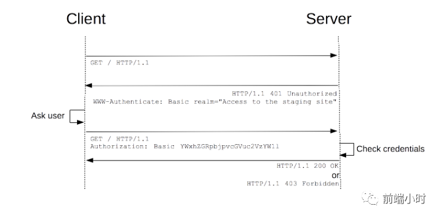
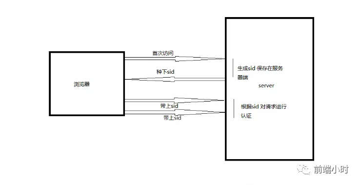
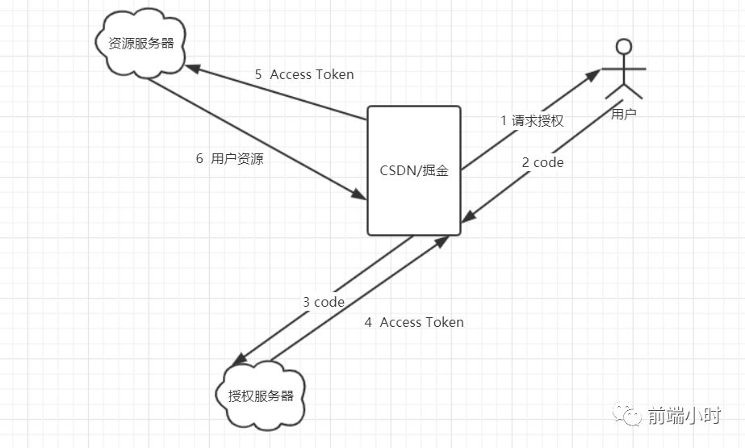

# 关于前后端鉴权的几种方式

> 人生亦有命，安能行叹复坐愁

## 01 前言

最近看的比较多的方面都是关于计算机网络的内容，不得不说这个方面是真的很广泛，然后花了一些时间来了解一下如何实现前后端鉴权的方式，查阅了一下文章，也顺便写一下总结。

## 02 鉴权方式

前后之间进行数据交互，当然后端要判断你是否是真正的操作者，只有符合条件的用户才可以操作。也就是说必须要有一个身份证明你是一个好人。通常会有四种方式：

- HTTP Basic Authentication
- session-cookie机制
- Token验证
- OAuth开放授权

**1、HTTP Basic Authentication**

在HTTP中，基本认证是允许http用户代理（浏览器）在请求时，提供用户名和密码的一种方式。是一种十分简单的技术，使用的是HTTP头部字段强制用户访问网络资源，而不是通过cookie、sessionId、登陆页面等非获取访问控制的手段。

很多网页浏览器都支持这个，但是很少可以在公网上使用，因为他并没有为传送凭证提供数据保护，使用简单的base64编码后直接发送，编码可逆且安全性低。还有一个缺点就是用户在打开浏览器的情况下用户无法登出，也就是无法注销你已登录。解决方法一般是服务器准备一个注销的账号，当服务器接收到的账号密码是注销账号时就会注销。

如果用户在没有验证的情况下会返回401状态码提示用户进行授权，上图中的Authorization字段就是加密用户名和密码后的base64字符串，服务端解密比对验证后会将用户请求数据返回。基本上就是一种密码机制，中间可能会被截取和修改字段，所以是很不安全的机制。

**2、session-cookie机制**

利用服务端的session和浏览器的cookie来实现前后端鉴权，我们知道http是一种无状态的请求，用户请求完成就会关闭。如果要维持状态就需要浏览器第一次请求的时候在服务端创建一个session，session有一个唯一的标识就是sessionId。一般生产sessionId之后经过加密（可不用加密）返回给客户端，以cookie的形式保存在浏览器中。

当下一次请求时就会在请求头中加入cookie信息，服务器取出sessionId与之前生成的sessionId比对是否一致，来判断请求是否合法。

这种方法一般用在老版本的web系统，因为信息也是存储在cookie当中，也有不安全的成分在里面，一般现在的系统也不会采用这种形式的鉴权。

**3、Token验证**

Token又称为一个令牌，比如我们熟悉的QQ都有一个令牌，而且这个令牌隔一段时间是会变化的，上一种利用cookie的形式是不会变的。所以Token的鉴权方式更为安全也用的比较多。

就拿我们一个网站举例，当我们输入用户名和密码点击登陆的时候，加入网站是以Token进行鉴权的话，会有以下的步骤产生：

- 用户名和密码请求登陆
- 服务端验证是否为数据库用户
- 成功，下发令牌Token给客户端
- 客户端以后每次请求都会带上令牌
- 服务端每次都会验证令牌

其实看起来和上一个的验证方法差不多呀，到底有哪些区别呢？

session和cookie机制是在客户端与服务端之间保持一个状态，服务端创建session对象也是需要开辟一定的内存空间来保存登陆状态的，但是利用Token的话就不会保持状态，只需比对令牌是否有效即可。

也就是说Token是不存储在服务器的，这个Token本身就保存着登陆状态，服务器根据事先定义好的规则进行解密就可以知道该Token是否合理。初次之外，我们知道不只是浏览器是代理客户端，手机APP也是，在手机上面cookie是不起作用的，那么久限制了客户端类型，Token验证就不会有这个问题。

**4、OAuth开放授权**

这种方法用的是最多的，我们常见的一些网站比如CSDN、掘金等都可以利用微信和QQ进行登陆的，无须使用其他的用户名和密码。这种方式就可以省略了很多步骤，使得用户体验良好。

那么它是怎么操作的呢？

- 向用户请求授权
- 用户授权，返回凭证code给第三方（CSDN/掘金）
- 利用code向授权服务器请求Access Token
- 返回Access Token
- 利用Access Token向资源服务器请求用户资源
- 获取用户资源，登陆成功

## 03 小结

用户鉴权在前端安全方面起着至关重要的作用，企业或者大型应用都会有自己独特的鉴权方法，但是原理还是离不开以上的步骤，而以上都是比较经典也是有代表性的鉴权方式，大家可以多了解多观察其他企业的做法。

**参考文章**

- 前后端鉴权方式总结
- 维基百科 HTTP Basic Authentication
- 维基百科 安全令牌

