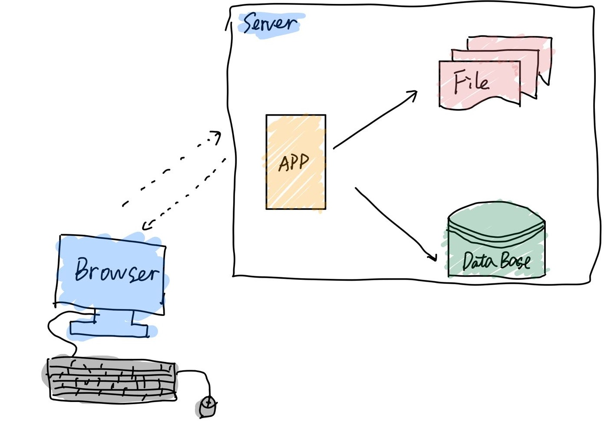
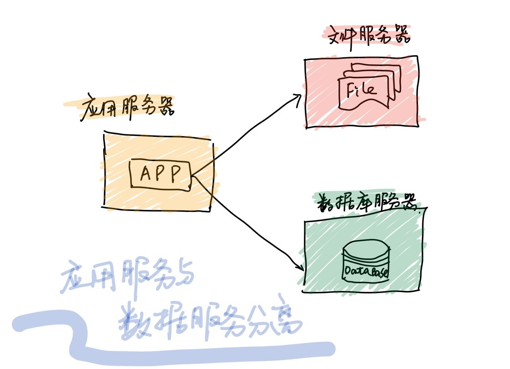
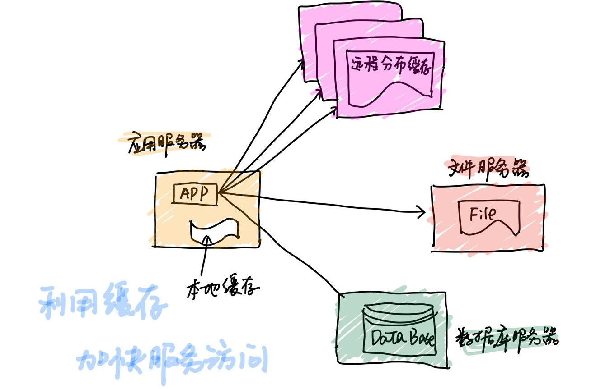
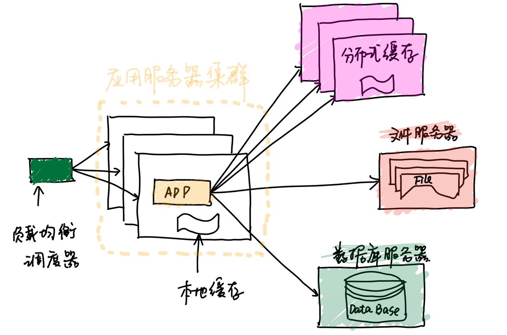
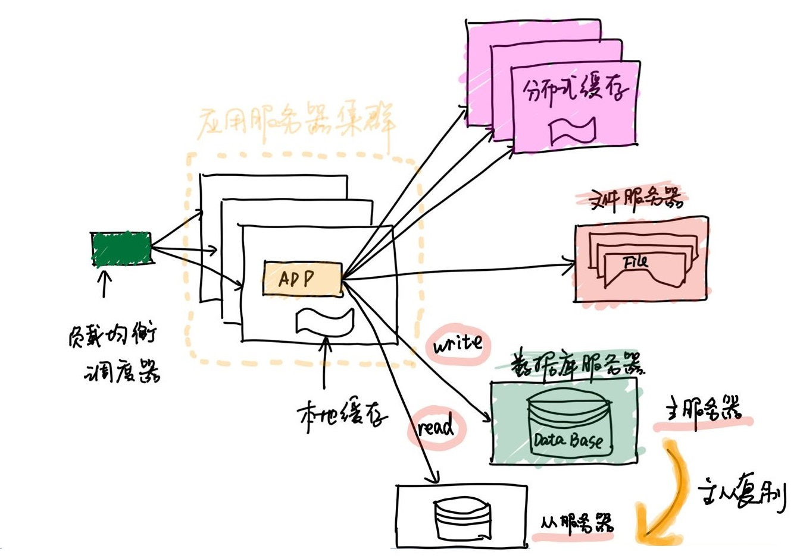
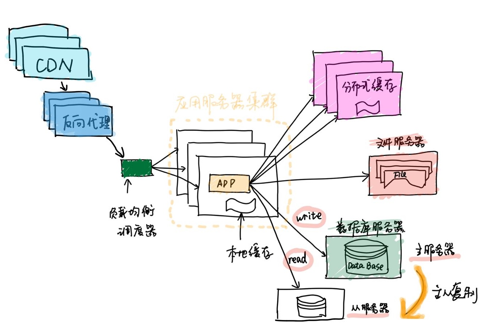
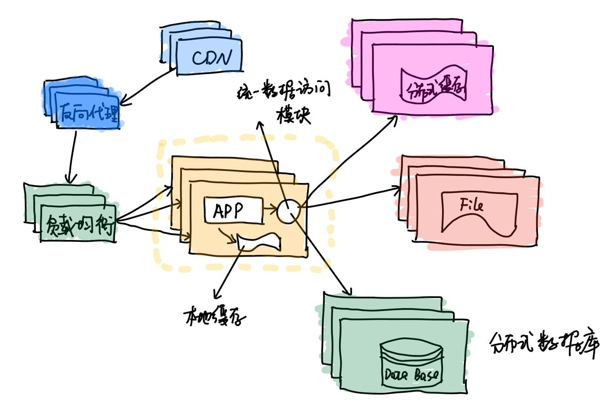
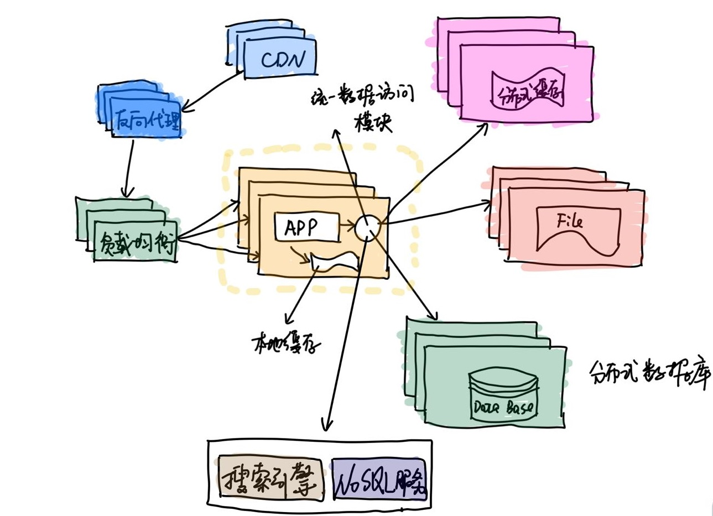
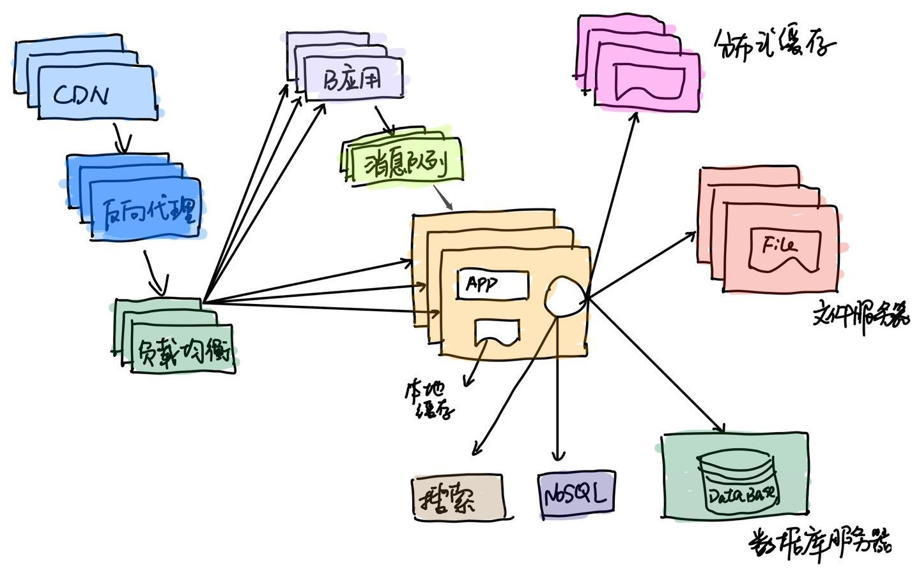
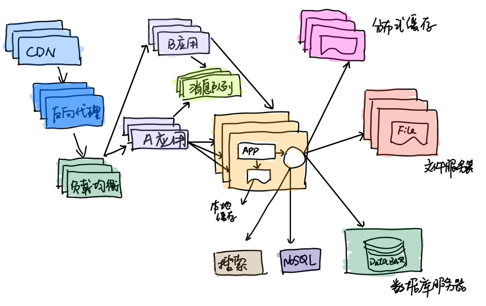

# 小白看大型网站架构设计方案

> 大型网站的架构设计一般与小型的网站差别很大，考虑的技术点也是不一样的

## 01 前言

最近对大型网站的架构比较感兴趣，就看了一本关于架构的书籍，顺便记录一下自己的所思所想。

我们知道想淘宝、微博、12306等的软件设计，必然与我们平时使用的软件设计不同，原因是前者涉及到大量的数据存储，大量的用户访问，还有就是高并发量（瞬间访问量）。假如有其中的一个环节没有做好的话肯定是影响整体的性能，因此就会出现短板效应。

我们看到的例如准点抢票、双十一抢购、微博热搜等都可能会导致服务器宕机，网络瘫痪等结果，一方面可能是网络拥挤，但是更重要的是网站的架构设计，是否能够满足高并发、高可用（7*24小时）的状态。下面就看一下大型网站的架构设计是怎么一步步实现的。

## 02 网站特点

我们从表面上看到的特点就是这两个，网站访问量大，网站并发量高。除此之外，我们就不会关心其他的事情了，这是用户能想到的，也是用户最想解决的两个迫切的问题。但是在开发的技术人员看来，却要考虑很多的因素，总的来说有以下几点：

- 高并发

网站要承受一瞬间访问的量是多少，比如双十一的抢购并发量可以达到亿的级别，这么高的并发是普通网站根本承受不了的压力，不仅仅是服务器多少的问题，还要考虑服务器之间的设计方案等因素。

- 高可用

一开始我也不懂什么是高可用，简单来说就是7*24小时保持服务正常。因为你不能保证用户在大半夜会不会浏览你的网站，所以我们要保证服务是一直正常的。通常来说，一些小型的网站或者系统会在晚上0点就进行更新操作，限制人员的访问。

- 海量数据存储

涉及到大型网站，一般用户都是海量的，需要考虑如何存储用户数据、用户浏览信息等。比如我们每天用的微信，每天发布的朋友圈以及聊天的信息都是海量的，存储在腾讯专门的服务器集群（很多服务器）。

- 安全系数高

不可否认我们每天都会涉及一些银行交易，微信转账或者支付宝转账等操作，其实你想一下你的现金变化只是一个数字的改变而已，想想都觉得令人担忧。比如你的支付宝余额仅仅是一个数字躺在那里，钱已经被支付宝用于其他途径了，但是你提现等操作又会调度回来。这其中的种种过程都要保证安全才可以。

- 需求频繁更新

因为后台会收集用户的一些信息用来改善产品功能和产品的体验，或是用户希望增加某一种功能。这时候就会有用户需求，需要更新产品功能。每一款软件的发展都是满足一种功能，然后不断更新迭代发展的。

- 渐进式发展

无论多大的网站都是从很小的开始，无论多大的高楼都是一砖一瓦构成。渐进式发展与传统的软件开发与设计不一样，没有软件完整的期望与功能整体的预见性，都是在不断发展中完善自我。通过对产品的不断运行，适应用户需求，适应时代的潮流。

## 03 设计演化

不知道大家是否听过“LAMP”这个词语，这就是早期的网站设计方案，只适用于小型的网站，如今是肯定不行的。由于开始的数据量不大，一台服务器足以支撑真个网站的运行，操作系统使用Linux，服务器用Apache，数据库使用mysql还有语言使用PHP开发。

网站经过业务的发展，不断改进、不断演化，形成了一个有章可循的技术方案。经历的每一个阶段都是由业务的驱动，假如你的网站没有这种需求，程序员是不是搞这些大的设计方案的。正如书中所说的，是业务成就了技术，是事业成就了人。

##### **初始发展阶段**

业务需求量不高，使用简单的配置，免费开源的软件就可以搭起一套系统。

##### **应用数据与服务数据分离**

随着业务的发展，网站的性能必然下降，所以这时候就可以把服务进行分离。

##### **使用缓存**

参考二八法则，我们知道80%的用户访问网站20%的功能，所以我们只需要把用户最需要的功能做好，那么我们就可以用到缓存的技术，能够及时快速地把用户需要的资源返回给用户。

##### **应用服务器集群**

随着你的业务量的增加，以及功能的不断增加，一台服务器的处理可能会顶不住，那这样的话我们就放多台服务器同时处理这个业务。就比如把用户的请求交给多个人去做一样，性能肯定会提升。

##### **数据库读写分离**

不仅是应用层面，数据的操作也是同样重要的，我们知道数据不是读就是写，一般来说用户读操作比较多。所以我们就把数据库读写分离，一台数据库提供数据，另一台写入用户的数据，然后中间进行数据同步（主从备份）。

##### **负载均衡与CDN**

对于业务量比较大的网站，如遍布全国乃至全球的，就需要使用CDN了。因为南方的用户访问北方的服务器，中间也会有延迟；或者美国的用户访问中国，那么延迟就更大了。CDN的就是内容分发网络，离用户最近的服务器就会直接返回数据，这样就快很多了。

还有就是负载均衡，加入CDN的数据过期，用户需要访问数据中心的时候就会先到负载均衡服务器，这里也有缓存，如果没有命中就统一把你的请求分发给压力比较小的应用服务器。总的来说，CDN与负载均衡服务器的原理就是利用了缓存技术。

##### **分布式文件系统与分布式数据库系统**

分布式其实就是对原来的数据存储再进行拆分，把不同业务的数据存储到不同的服务器当中，减少其余服务器的压力。举个例子，可以把用户的订单数据存储到A数据库服务器，用户的信息放到B数据库服务器。

##### **NoSQL和搜索引擎**

搜索引擎是为了应对网站的搜索功能。

##### **业务拆分**

把一个网站拆分成多个不同的应用，每个应用独立部署和维护。比如可以把某个功能独立出去，提供接口嵌入网站里面，本身的逻辑处理是在别的服务器。

##### **分布式服务**

把公共的业务提取出来，然后独立部署，通过分布式服务调用共用服务完成具体业务操作。

## 04 小结

我们可以看一下当前的互联网公司，能称得上BAT级别的也就是这么几个，毕竟大部分都是小公司，正在逐步发展属于自己的业务。他不可能每一个领域都有时间和精力去研究、去开发。但是一般的公司都会有自己的专业点，你只要把自己的业务发展好，服务好我们的用户足矣，有时候搞很多花里胡哨的东西反而没有益处。

> 小型网站最需要做的就是为用户提供好的服务来创造价值，得到用户的认可，活下去，野蛮生长。——李智慧《大型网站技术架构》

有的公司因为看到最近新出了很多技术，所以也想把自己的架构改造一下，这就是为了技术而技术。有时候自己的出发点是好的，但是也有可能带来坏的结果，没有顺应自己的业务发展趋势。还有也不要盲目模仿大公司的技术方案，要发展自己的独立业务，发展自己的独立技术。

总的来说，现在每个公司都有自己的一套技术方案，是否重构你的技术方案或者是否改变你的服务器分布等都取决于你是否有这个需要。不过现在互联网技术发展越发成熟，有一些资源你都可以付费购买，像阿里云、腾讯云等都可以使用，而且技术稳定，质量过关。毕竟是大公司。你要多优质的资源，取决于的钱给多少，非常简单，没有后顾之忧（已经帮你决解好了）。

最后也向大家推荐一下这本书《大型网站技术架构：核心原理与案例分析》，本书作者的技术非常好，分析独到，值得深入阅读。

参考文章

- 李智慧 《大型网站技术架构：核心原理与案例分析》

