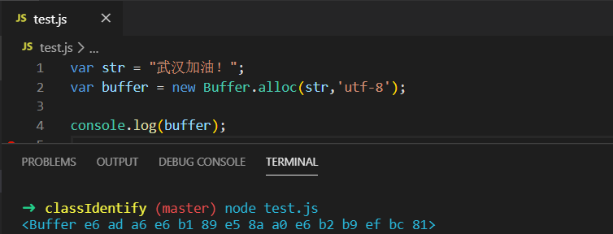
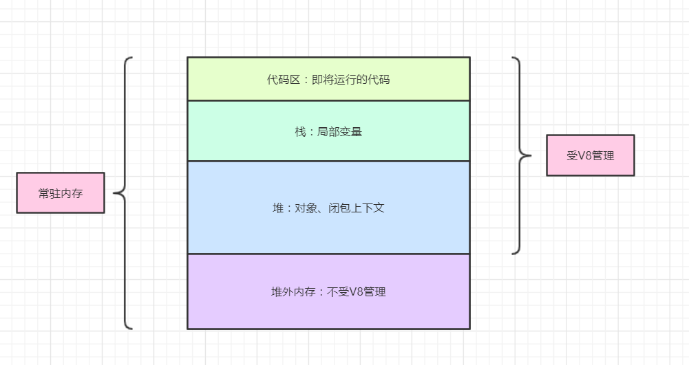
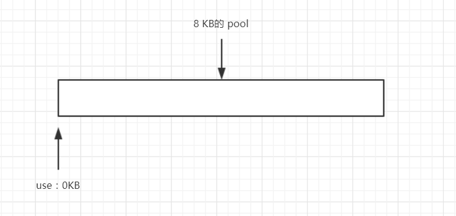
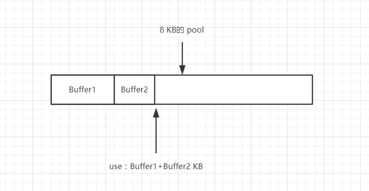
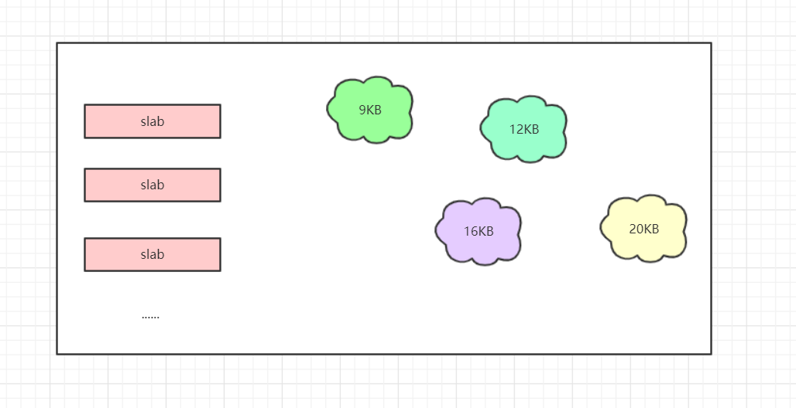
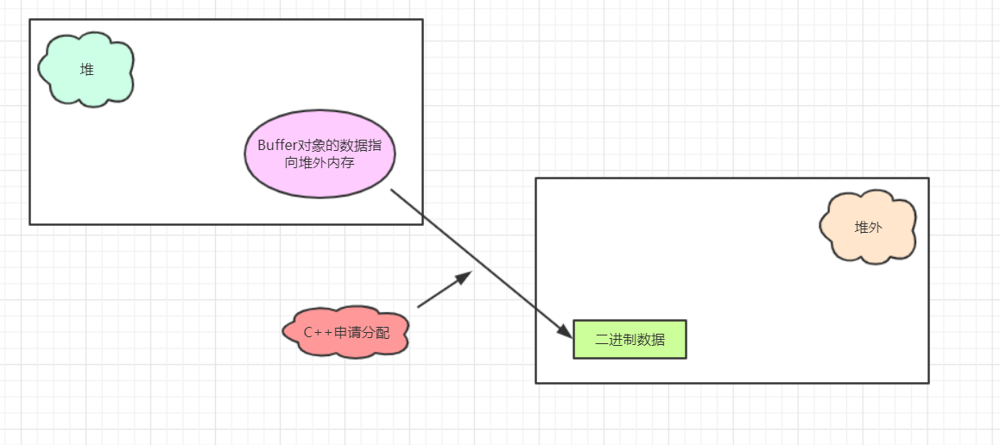

# Node.js之Buffer对象浅析

> 前端开发的盲点，Node开发的基础

## 01 前言

前端的开发人员一般是不会去关注Buffer的对象的，在大多数人看来前端就是写页面的程序员，但现在随着Node的发展，越来越多的前端工程师关注一些后端的开发流程。撇开前端的业务开发，我们来了解一下Node的工作都和哪些知识点打交道。

与应用型的场景不一样，Node中需要处理网络协议、操作数据库、处理图片、接受上传文件等。我们知道在网络当中，数据都是以二进制的形式传播，现有的JavaScript已经不能满足要求了，所以Buffer应运而生。

## 02 Buffer

Buffer是一个像Array的对象，它的元素都是16进制的两位数。是一个典型的JavaScript与C++结合的模块，设计性能的相关部分采用了C++实现，而非性能部分采用了JavaScript实现。**Buffer对象可以用来操作二进制数据流**。

由于Buffer经常用于字符串以及大文件等操作，我们知道Node有垃圾收集机制，大对象不太可能存放在堆中，不然内存很快就会满了。buffer所占用的内存其实不是堆中的，而是堆外内存。Node在加载的时候就已经加载这个对象，并把它放在了全局对象上面。

## 03 内存管理模型

Node程序在运行过程中，此进程占据的所有内存成为常驻内存。它由以下几个部分组成：

- 代码区
- 栈
- 堆
- 堆外内存

他们之间的关系如下图：

## 04 Buffer内存分配

我们知道，**Buffer对象的内存分配不是在V8的堆内存中的，而是由Node的C++层面实现的内存申请的**。由于大对象的存储空间是不确定的，不可能向操作系统申请，会对操作系统造成压力。所以Node在内存的使用上面应用的是C++层面申请内存，在JavaScript中分配内存的策略。

那么它的具体分配策略是怎么样的呢？大对象和小对象的分配方式采用的算法是否是一样的呢？

首先来介绍一下 **slab 内存分配机制**。它是一种动态内存管理机制，采用的是**预先申请，事后分配**的方式，简单来说它就是一块申请好的固定大小的内存区域。有如下3种状态：

- full：完全分配
- partial：部分分配
- empty：没有被分配

这种机制是以 **8KB为界限**来决定当前分配的对象是大对象还是小对象，也就是每一个slab的值。在JavaScript层面以它作为单位单元进行内存的分配。

##### **①小对象内存分配**

我们在这里引入一个pool局部对象，Buffer在小对象的分配过程中会使用pool作为中间处理对象。

上图这个是刚申请的slab内存块的状态是 empty 状态，等待被分配，而下图是被两个小对象分配后的状态，为partial状态。值得注意的是，在一个小对象分配之前会判断这个 pool 空间是否还够，如果不够的话就会重新申请一块新的8KB内存来分配。

所以一块 slab 可以被多个对象占有，加入第一次分配了1KB，但是下一个内存则要8KB，那么就造成了内存的浪费。这个1KB的小对象就占据了一整块内存。而且内存的释放规则是所有的对象释放之后，这块8KB的slab才会回收。

V8 GC 对其不直接起作用，Buffer 对象被 GC 的时候会触发一个回调（C++ 层面的回调），而 Node.js 源码中定义的那个回调里面做的事就是释放那块内存。

##### **②大对象内存分配**

如果这个对象是超过了 slab 的大小，那么就不会占用slab块，直接使用C++层面分配你所需要的大小，这块空间就会被你一直占有。举个简单的例子就是：

就像银行办理普通业务的客人一样，都规矩地在前台办理，但是VIP客户可以直接找银行行长。这里每一位银行业务员都是一个个slab，都是预先分配好的，然后VIP客人的需求可能更大，那么就直接找行长办理，无需繁杂的手续。

这里我们总结一下，**Buffer对象都是在JavaScript层面的，能够被V8的垃圾回收机制标记回收的**。但是Buffer操作的字节真正的内存是在Node的C++层面提供的，JavaScript层面只是使用它。不论是小 Buffer 对象还是大 Buffer 对象，内存分配是在 C++ 层面完成，内存管理在 JavaScript 层面。如果解除两者的引用，Buffer对象最终还是可以被 V8 的垃圾回收标记所回收。

## 05 小结

Buffer对象是Node服务端的一个重要的概念，占据着很重要的位置。不论我们读写文件还是网络请求都会用到这个对象，可能前端的开发人员不会过多关注这个东西。

通过对buffer对象的内存分配，我们在以后的编程当中应该时刻关注着变量的分配，因为如果内存一旦泄露，1G的服务器内存也会很快地被占用完，严重的话会造成服务器的崩溃。

**参考文章**

- 深入浅出Node.js
- 探究不在V8堆内存中存储得Buffer对象

