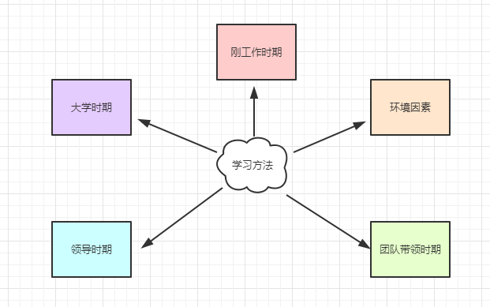
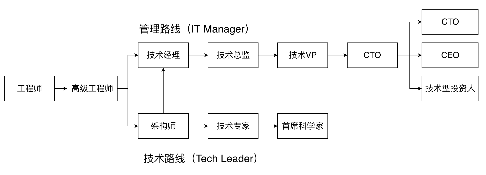

> 无论什么样的学校，都会有同样的牛人

## 01 前言

不知道大家知道程序员最重要的一个技能是什么呢？没错就是CV操作，复制粘贴。作为一个天天被产品压榨的卑微身份，不得不练成了这一本领（其实是与生俱来）。由于产品的更新速度太快了，开发难免会跟不上这个逆天的节奏，老板就只会说我只要结果不要过程，所以就找一些开箱即用的就美滋滋了。

但是不得不说近年来的前端技术发展十分快速，以至于让人觉得CV操作是大家都公认可行的方法，框架技术层出不穷，确实让前端的开发简单快速友好。虽说是简单好用，但是面试却很逆天，例如你知道这个东西是怎么做出来的吗？你知道它的原理是什么吗？         小白：......

所以针对这个问题，我们不得不从零开始看别人造轮子。因为只有这样，以后你来当面试官的时候你就可以翘着二郎腿问对面的小白（有可能是大佬）这里面的原理是啥？但是也有可能被对方碾压，另说。

## 02 学习方法与技术选择

学习方法与技术选择是基于你的方向来决定的，并不是一个大方向的概念。与其说大学四年怎么选择，不如说大三大四该如何选择你的方向，因为我感觉大部分的同学在学校的头两年是不会怎么学习的，刚从高考放出来你又让我进去？想得美。

所以从社团、学生会、协会等混的风生水起，俨然一个成功大佬的样子。但是我们也要时刻提醒自己，跟你一起玩的小伙伴可能是富二代而不用关心前途，但是你确实要充实自己而不要被大众的思想迷惑了自己。有自己的独立思想和独立思维，才是一个大学生应该有的样子。所以我们结合自身的优势，来决定自己将来适合哪一个方向的发展。

##### **学习方法**

学习方法大家都是不一样的，从小白到大牛，中间可谓是困难重重。自身的学习方法不是摸索出来之后就一直适合自己，而是一直在改变。为什么这么说呢？我们从人生两个重要的阶段，大学与工作谈一下。首先大学是一个时间相对工作是比较充裕的，有属于你的自由度比较高的时间。除了上课时间之外，剩下的就全部由你自己来安排，说来愧疚，自己也没有很好地安排时间。现在才知道工作后你很大可能是没有你自己的个人时间。

大学时期可以根据自己的课表安排技术学习，所以这里就有你自己的学习方法和学习规律，也仅限于大学时期。然后工作过后你就只有下班的时间来学习，这就是很大的不同。而且说实在的话，你下班过后很可能也不学习了，这就是为什么大部分人都说程序员35岁都会有的中年危机。

摸索出来的学习方法还有一个重要的点就是要坚持。不得不说，选择了技术这一条路，是没有尽头的。为什么呢？因为你看的每一本书，读的每一篇文章，都可能有你不理解的地方或者引发你思考的地方。前期你读的越多，你就会发现你不会的越多，后面读的越多你就会发现其实知识之间也会有联系的，你就会越来越轻松。这就是书越读越厚，阅读越薄的道理。

方法之指引，关键还是看自己的理解。之前看到的一句话我觉得是很对的，计算机基础决定了你能走多远。技术千万种，基础第一种。我个人理解的计算机学科，其实他的精髓所在就是一种思想，而这种思想的形成确实一种不断积累和阅读的过程。这就有了非科班出身与科班出身的差别。

##### **技术选择**

我们知道学科的学习是很广泛的，就我的学习过程来说，大学学习了C/C++基础编程，这里其实学习的就是编程思想，后来我们学习了java和.net以及接触了html/javascript语言，而这里学习的其实就是技术的广度。中间的学习过程中穿插着计算机组成原理/数据结构/计算机网络/数据结构等课程，这里学习的就是计算机基础，最重要的核心部分，是一种统筹全局的基础。其他的思想或者技术原理大部分是从这里延伸的。

比如我们学习JavaScript的时候，DOM操作涉及到的线程的概念就是计算机基础的内容。所以无论大家选择的是哪一种技术，必学的确实计算机基础的内容。之前我们可能都已经忽略了这个，上课总是不认真听讲，认为我们的学习时间还不如用来好好学习最新的技术好。其实这也是可以理解的，毕竟我们是在一个浮躁的时代，大部分同学们都有急于求成的心态。

## 03 如何快速学习

我的学习方法很简单，刚开始决定学技术的时候，就只有看视频这个方法，因为本人开始不喜欢看书，认为这个书讲的很高深且不容易懂，更重要的是看不到效果。所以开始我就跟着一些大佬敲着看不太懂的代码，虽然是很艰难的过程，也有一些地方也跟不上，但最后不得不说视频用来启蒙的效果是不错的。

由于自己的起步比较晚，开始也没有注意到以后要走技术这一条路，便开始了懵懂的学习，也没有人带。所以技术之路比较曲折，也很高兴自己能够坚持下来。一开始对什么都是一种兴趣的驱动，从学习英语到现在转向学习技术的过程，都是很大部分是兴趣驱动，技术的话也有毕业就业的压力在里面。

上面我是说快速学习，但是学习任何一种技术，从来都是靠一直的积累才可以理解的，只有理论基础支撑着你才能渐渐融会贯通。快速学习只是学习一种思想，但是原理实现或者作者的思维过程你是要慢慢去理解的，思想高度不到的话是很难理解的，你想一下人家工作几年的职场老鸟，而你只是一个应届的菜鸟小白，差距一想就知道。

关于如何才是真正的学懂弄通，我觉得这一张图正好是很好地解释了这个道理。大家也可以参考一下自己到了哪个地步。从被动学习到主动学习是要经过一个漫长的过程的，我觉得大部分应该是在听讲和阅读阶段，正如老师所说，听懂了不代表你会了。

##### **被动学习**

我们平时去上课，看书的过程都是一个被动学习的过程，甚至有时候你上台讲解一个PPT都是被动学习。作为一名刚入门的小白，我相信大家都会经历这里面的每一个步骤。从看书阅读之中，我们所有接收的知识都是跟着作者的思路，而不是你自己的思路。当然你也可以在书上写出你自己的想法，这也和演示的过程一样，都属于被动学习。

我们看到一个被动学习的同学，记住的知识的概率并不高。根据遗忘曲线，我们在不复习的情况之下很快就会忘记了，因为记忆早期是存在于短期记忆中。当然如果你经常复习，记忆就会存储到长期记忆当中，根据个人经验，确实只有通过主动学习才会印象深刻。

##### **主动学习**

当你慢慢学会主动学习之后，你就应该通过小组讨论、然后把结果付诸实践之后你才会形成自己的见解，假如你能够传授给他人，那么证明你是真正学会了这个知识点。这也是为什么课堂教学最好采用小组讨论的形式比较好吧。其实我们也可以进行主动学习，一般来说有两个比较好的方法：

技术分享和博客总结，首先技术分享并不是经常有机会的，环境也有要求，也不是经常技术分享的机会来给到你，所以这个我们就暂时不考虑了。我们知道，阅读听课等都是输入的过程，我们注重的是知识的输出，所以输出的方式有很多种，除了技术分享外还可以写博客的方式，也是一种学习总结的过程，推荐这个方式。

## 04 关于方向的思考

其实一开始学习技术的时候，并没有对方向有多大的理解和感悟，只是随着时间的推移，觉得自己做的是正确的选择。正如一开始所说的，人都会有浮躁的时候，如果一开始选择的是后端方向，自己很有可能坚持不下去。因为这是一个看不到效果的东西。

如果给自己的方向定义一个方向的话，大概是这样的情况。有两种情况，一个是走技术的方向，而另一个则是走管理的方向，可能自己很大的概率会走管理的路线。

## 05 小结

通过上面的讲解，我们回顾一下：

首先是学习方法和学习技术，一旦自己可以确定下来，就努力深挖，找到适合自己的路线配以学习方法，一定会有属于你自己的收获。还有就是关于如何学习，这里也提出两个建议，可以以技术博客和技术分享的形式巩固自己的知识点。最后是关于职业的思考，制定长远的路线，然后就开始付诸实践，从不断的总结中找到适合自己的路！

共勉！

