# 前端配色设计技巧

> “ 一日不书，百事荒芜”

## 01 前言

近来忽然看到一篇文章，说的也是关于前端面试的问题，“是否对色彩有研究”。我一看这不是设计师该考虑的问题吗？面试官的问法也是在意料之内，想想前端的任务就是把设计师的设计图用代码实现，配色问题我们也是可以提出意见和看法，这也关乎到用户体验的问题。

从色彩理论上来看，颜色的选择是可以看出一个人的性格，情绪和情感甚至回忆。所以当颜色理论用于网站设计的时候就必须要慎重，特别是一些官网的设计，要符合产品、公司理念或者公司特色。

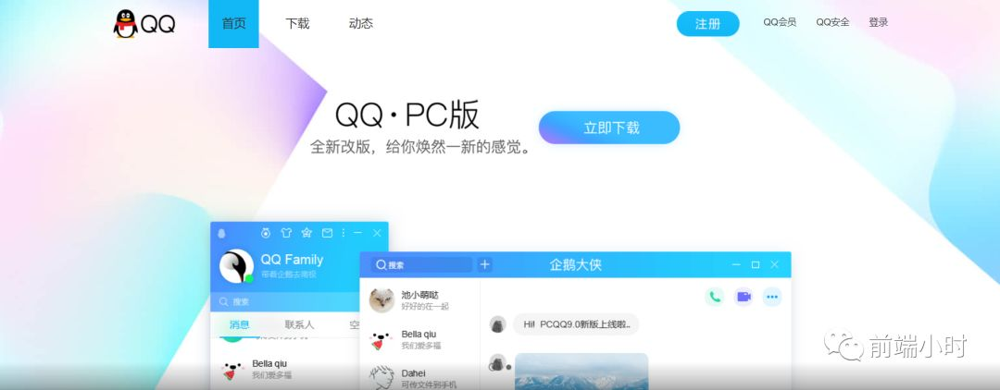

## 02 颜色来源

所有的颜色基本其实都是来源于三原色，就是前端所熟悉的RGB调色。三原色指的就是红蓝黄。开始解释之前我们先来了解一下以下的信息：

- 原色        间色     三级颜色
- 互补色      相似色   三角色
- 分散互补色  四方色   四方补色
- 明暗色      暖色     冷色

**原色**：也就是前端熟悉的RGB，所有颜色的源头都是从原色中产生，比如电视屏幕等像素点越多，显示的颜色点就越多，就是分辨率高。

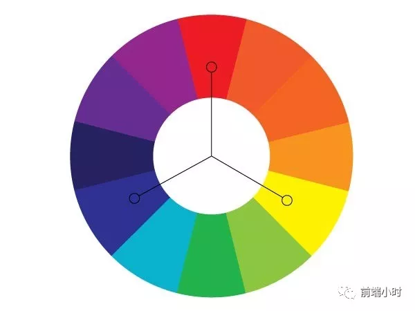

**间色：**
间色其实就是把红蓝、红黄、黄蓝相互混合，就会出现紫色、橙色、绿色。

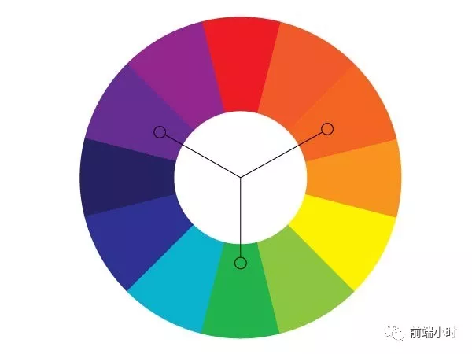

**三级颜色**：

三级颜色就是从原色与间色之间的融合，会产生比较多样的颜色，常见的有蓝绿色、黄绿色等。

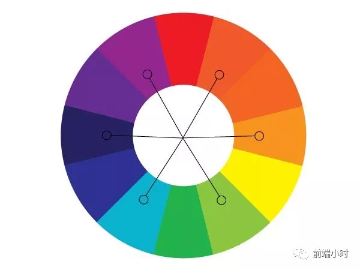

**互补色**：

我们从色轮上看到的对向的两种颜色，就称为互补色。比如红色和绿色，它的特点就是色彩对比强烈，即有所冲突又有协调的感觉。

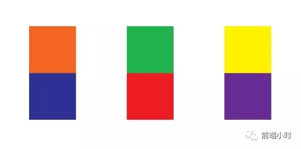

**相似色**：

就是色轮上面相似的三种颜色。

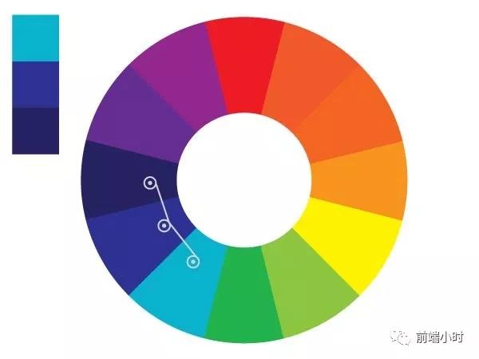

**三角色**：

通过在色轮上面绘画一个等边三角形，所对应的颜色就是三角色。

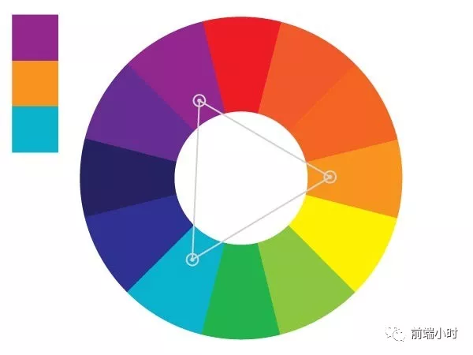

**分散互补色**：

与互补色比，其实就是去互补色的两边颜色。颜色有对比也更丰富。

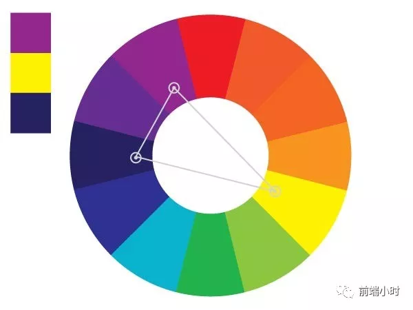

**四方色**：

在色轮上面画一个正方形，所对应的颜色就是四方色。

**四方补色**：

四方补色采用一个矩形样子，所对应的就是四方补色。

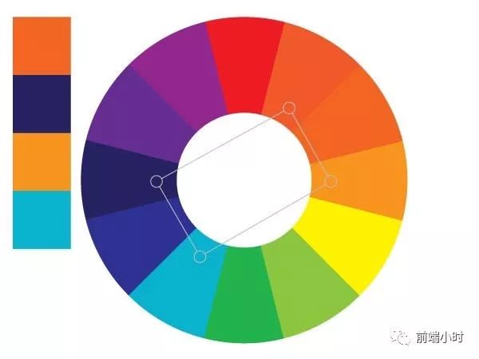

**明暗色：**

就是通过对一种颜色进行明暗处理。产生的颜色非常丰富，可用于一些文字或者背景图，但不想太明显的地方。给人一种缓和感。

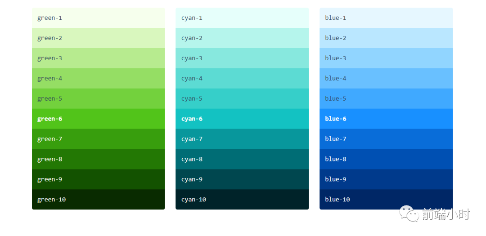

**暖色**：

给人一种温暖的感觉。比如如果你在夏天穿一件红色的衣服，就会给人一种更加热的感觉。

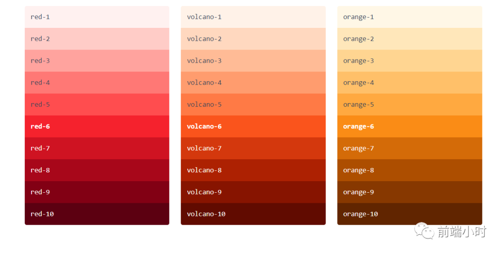

**冷色**：

冷色所具有的意义很多，比如悲观，秋天，夜晚。但又可能是一种宁静，安静的感觉。 

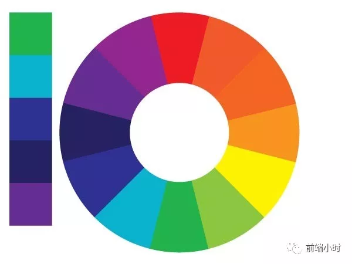

## 03 实践

颜色搭配我们要秉承的是一种和谐稳定的原则。慎用那种比较震撼的色彩，比如海报如果使用红绿对比会让人头晕。所以我们配色以温和优雅为主。

##### **色彩平衡**

- 色彩单一，通过明暗处理
- 主色周围使用若干辅色配合
- 高饱和度搭配低饱和度

##### **过渡色**

当你一定要使用互补色等有强对比的颜色时，一定要注意运用间色进行缓冲，平衡过渡，给人一种平衡缓冲的感觉。

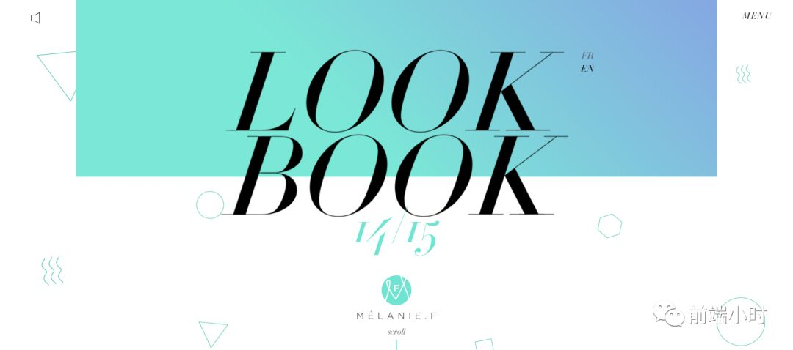

##### **相似色搭配**

相似色的运用得当，会使你的页面布局看起来非常和谐，就比如QQ的下载页面，给人一种温和优雅简洁的感觉。

##### **白色的搭配**

白色给人一种干净，简约的感觉，相信很多人都会喜欢简约的感觉，没有过多的修饰。但是也必须要使用辅色配合，不然会产生一种单调乏味的感觉。

**案例1**：香港地铁的每一个站点都是不用的颜色，可以看出都是利用了原色与其他颜色相混合形成的。

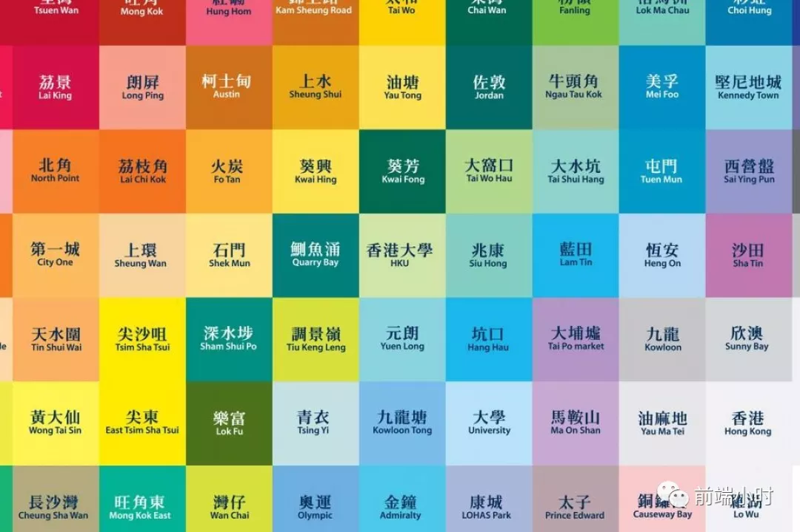

**案例2**：德国柏林消防局的颜色是红色，警察局的颜色是绿色。将红绿两种互补色巧妙地融合在一起。

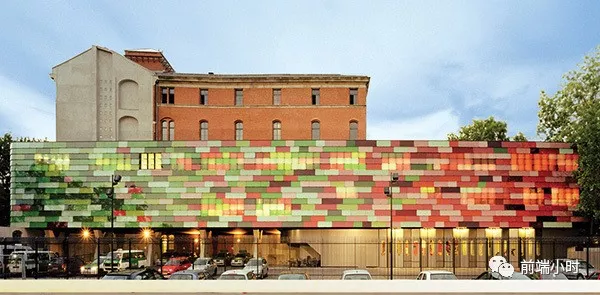

## 04 小结

颜色搭配也是生活中的内容，比如衣服颜色如何搭配，室内的家居设计、墙纸设计等，这些都是颜色的范围。只有当我们能够对配色有一定的了解，我们就可能丰富我们审美上面的灵感。

对于颜色设计和搭配的问题，可以参考国内一些大公司的官网，从中你会取得一些设计灵感的。毕竟写这篇文章只是问了丰富一下自己的知识，前端只需要了解一下即可，并不用细心研究，剩下的你大可以交给UI部门的设计师，很多大公司的分工很明确。

