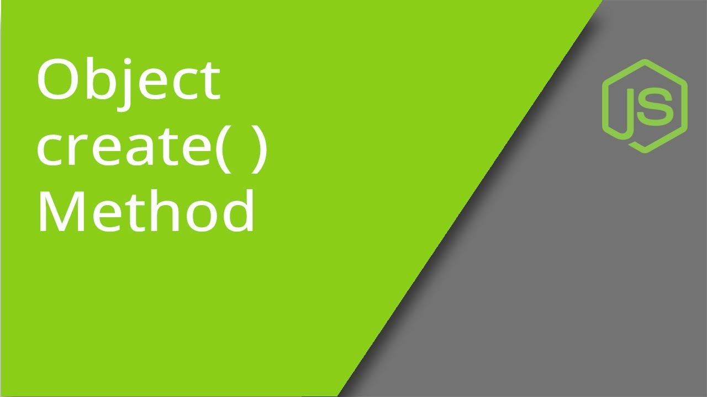
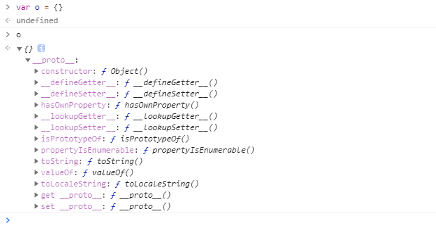
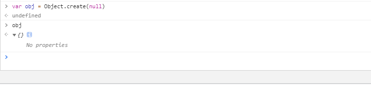
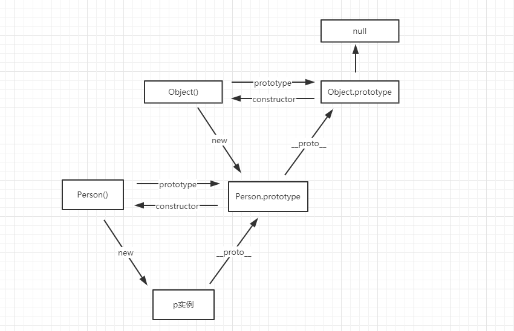

# Object.create()函数浅析

> 创建对象的方式，里面的窍门你知道吗

## 01 前言

不知道大家是否知道创建对象有多少种方法呢？我们通常创建对象都是以字面量的形式，以 var o = { } 的方式创建的对象是会连接到Object的原型上面，但是我们要是想创建一个我们自定义的对象怎么办呢？这就要使用到我们接下来讲解的 Object.create()方法了。

## 02 Object.create()

在MDN上面的定义是：

> Object.create()方法创建一个新对象，使用现有的对象来提供新创建的对象的__ proto __

该方法可以接收两个参数：

- proto：新创建对象的原型对象

- propertiesObject：自身定义的属性，具体如下

  1. `configurable`

     `true` 当且仅当该属性描述符的类型可以被改变并且该属性可以从对应对象中删除。 **默认为 `false`**

  2. `enumerable`

     `true` 当且仅当在枚举相应对象上的属性时该属性显现。 **默认为 `false`**

  - `value`

    与属性关联的值。可以是任何有效的JavaScript值（数字，对象，函数等）。 **默认为 [`undefined`]().**

  - `writable`

    `true`当且仅当与该属性相关联的值可以用[赋值运算符]()改变时。 **默认为 `false`**

  - `get`

    作为该属性的 getter 函数，如果没有 getter 则为[`undefined`]()。函数返回值将被用作属性的值。 **默认为 [`undefined`]()**

  - `set`

    作为属性的 setter 函数，如果没有 setter 则为[`undefined`]()。函数将仅接受参数赋值给该属性的新值。 **默认为 [`undefined`]()**

我们通过使用对象字面量和Object.create()方法看一下有什么区别，下面是普通字面量的形式创建的空对象，可见对象本身是继承了Object的，可以调用类似 toString()等相关方法。

那么如果我们创建的对象不去继承属性怎么办呢？当我们创建的时候发现对象显示 No properties ，也就是说这是一个什么也没有的干净对象，我们是可以自定义toString等相关方法的。

使用null作为参数就等于切断了与Object的原型链了，这样创建出来的对象是没有继承关系的。我们都知道Object的原型最终是指向 Null 的，所以一开始创建的原型就直接指向 null ，没有经过层层的原型链。我们来看一下原型与原型链的关系就知道了。

## 03 小结

所以我们知道这是一个高度可定制的对象，你可以用它来做数据字典，但是如果是对对象本身没有什么要求的话就使用普通字面量的形式创建即可。从一个小的知识点可以引申出JavaScript庞大的知识体系，不论是什么都要好好总结基础的东西。

**参考文章**：

- 详解Object.create(null)
- MDN Object.create()

