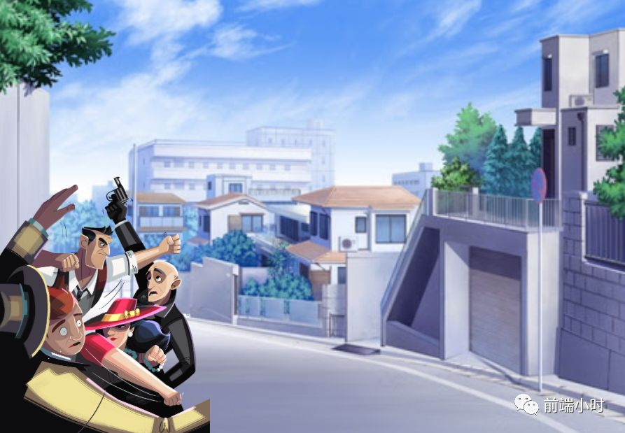
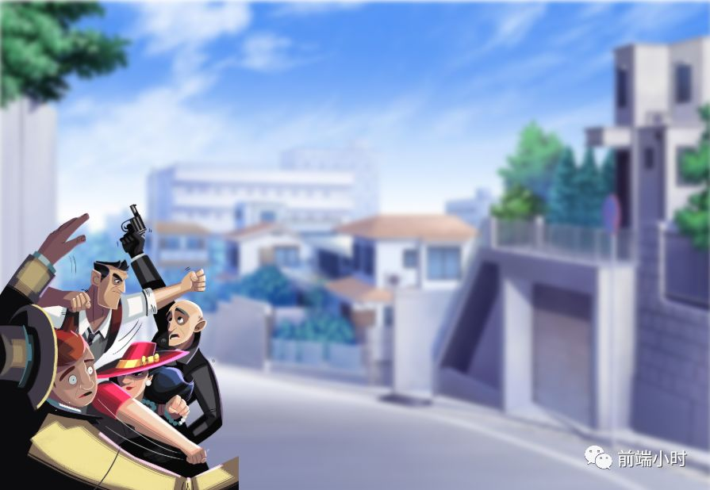
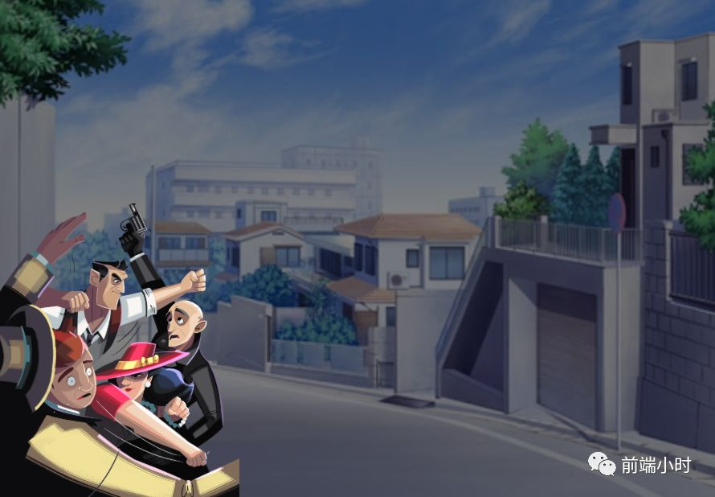
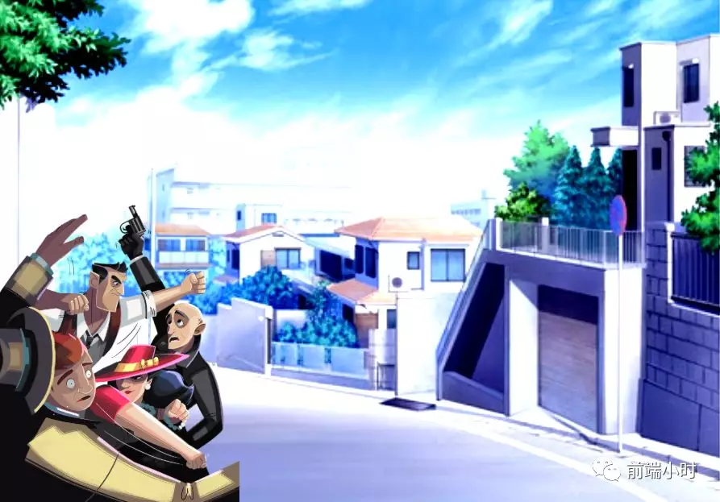
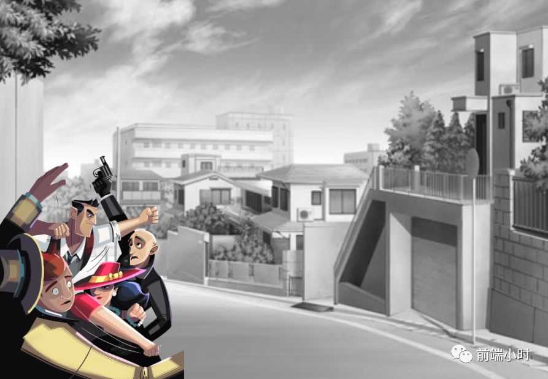
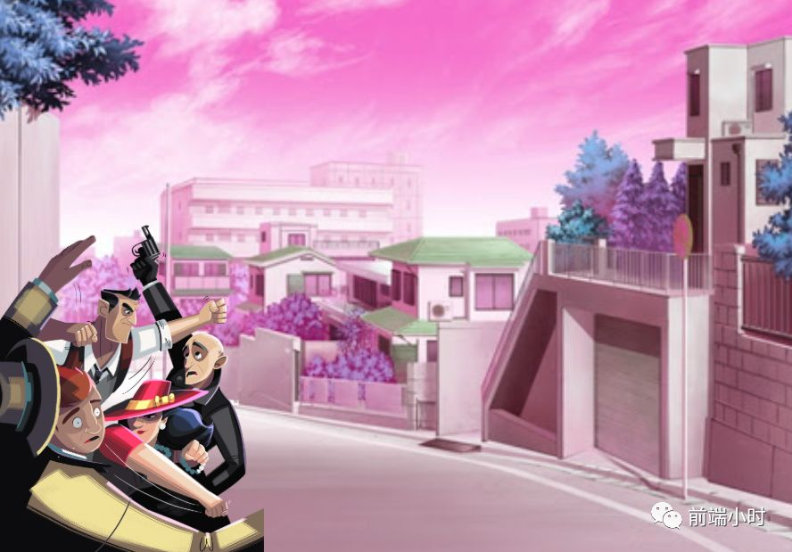
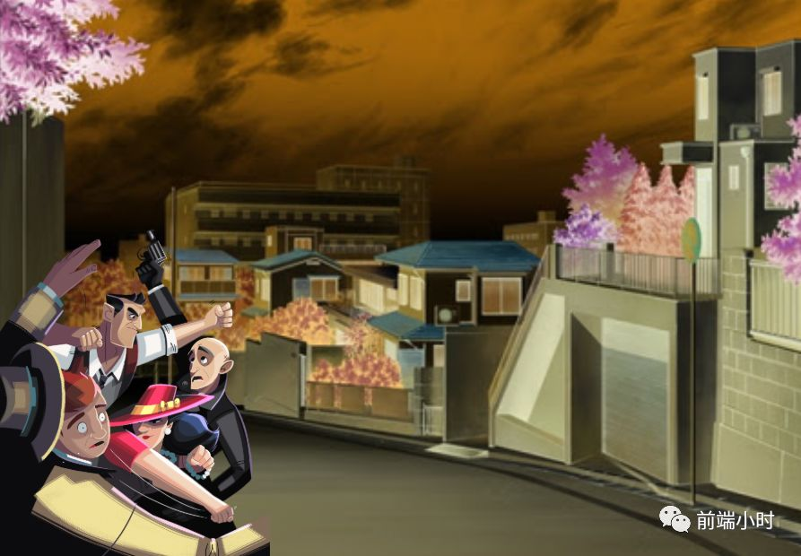
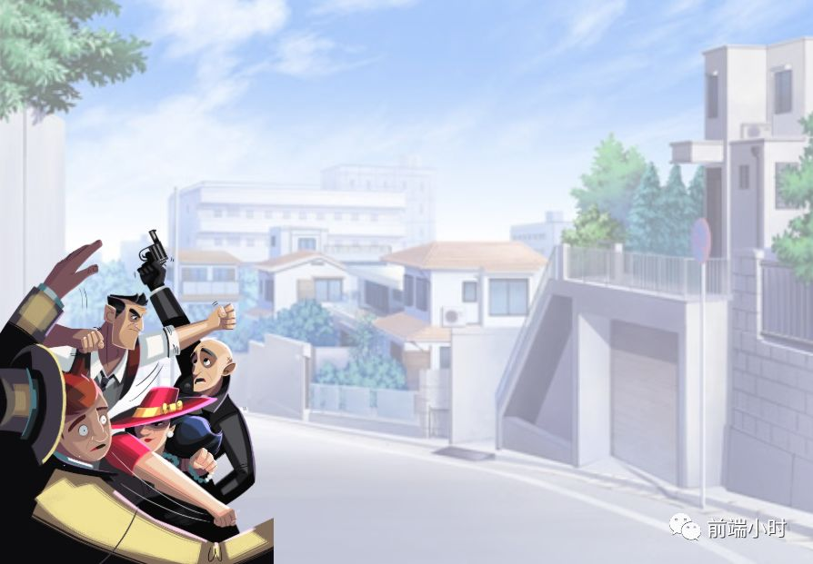
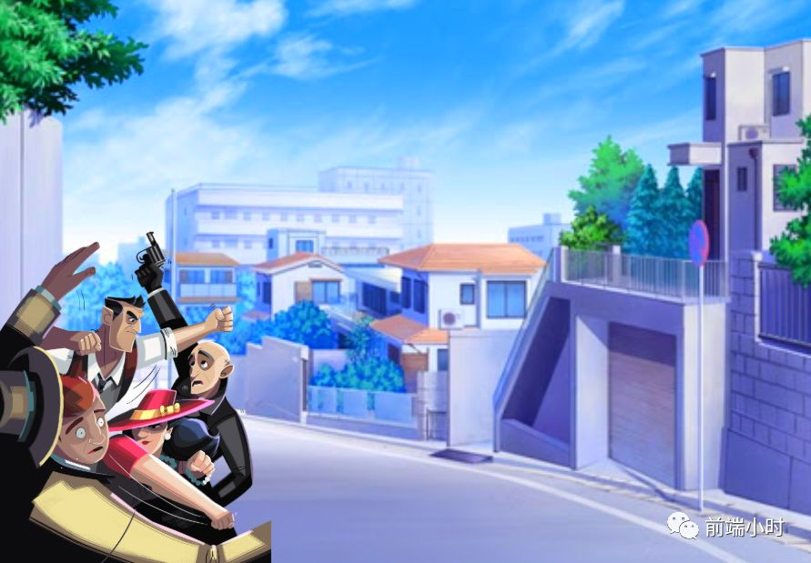
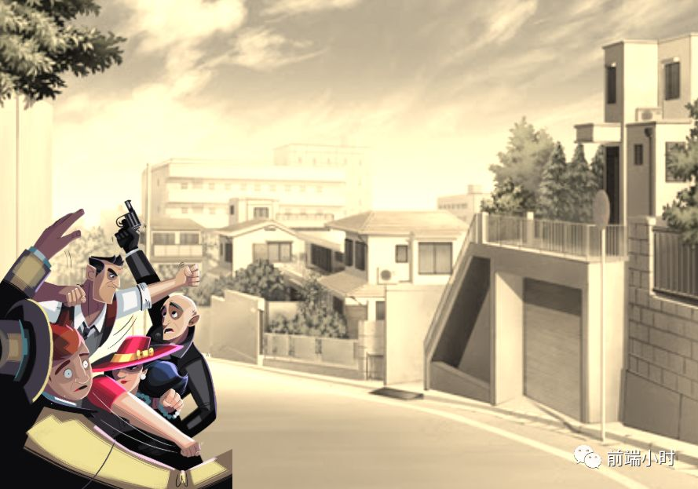

# 带你一文玩转CSS滤镜

>  给背景图披上不一样的衣服

## 01 前言

随着新技术的发展，越来越多的css属性被浏览器所支持，而且更新速度也十分地快。css属性的增多，可以使网页的颜色多样化，更加的丰富。对用户体验上来说都是一件好事，用户的接受度会普遍增加。

在2014年底，css滤镜已经被列入W3C的滤镜效果模块工作草案。接下来介绍不同的滤镜会有什么样的效果：

- blur
- brightness
- contrast
- grayscale
- hue-rotate
- invert
- opacity
- saturate
- sepia

## 02 属性效果

我们使用两个不一样的图片，来验证属性的效果。这是一开始的未经过处理的图片和背景图。

##### **blur**

blur可以给元素添加高斯模糊，只要写入模糊半径参数即可。半径可以使用css的任何单位，可以使用px、em、rem甚至cm。半径越大，滤镜效果就会强，但是不能使用百分比来表示，不然浏览器会认为是无效值，默认应用none。

##### **brightness**

亮度brightness滤镜接受百分比值。当亮度为100%时就会是原来未经处理的颜色，属性值可以在0%~100%之间调整，减少到0就会变成黑色。

##### **contrast**

对比度contrast可以使用百分比单位，当对比度为0时，高亮部分和阴影部分的对比就比较弱，当对比度超过100%时就会比较强烈。

##### **grayscale**

灰度滤镜可以给背景蒙上一层灰色，当灰度值达到100%时，整个元素就会变成灰色。当国家纪念日比如南京大屠杀纪念日，很多网站都会变成灰色，就是把背景加上100%的灰度值即可。

##### **hue-rotate**

色调旋转可以使颜色发生旋转，参数为旋转度数。

##### **invert**

反色invert可以使颜色发生反转。当你从0开始到50%，颜色会慢慢变暗。从50%到100%颜色反转并逐渐加深。

##### **opacity**

透明度，我们已经用的比较多了，元素参数可以使用数字或者百分比来表示。

##### **saturate**

饱和度滤镜，参数使用百分比来表示，超过100%会让饱和度过高。

##### **sepia**

褐色。可以使元素蒙上一层褐色，与其他元素类似都是使用百分比来表示。

## 03 小结

如今CSS可以用来做更多的事情了，而且渲染效率也是非常高的。比如我们之前实现动画都会使用JS来写，现在就可以使用css动画来做了，关于这一块下次再写。大家可以自行实现一下上面的滤镜效果。

