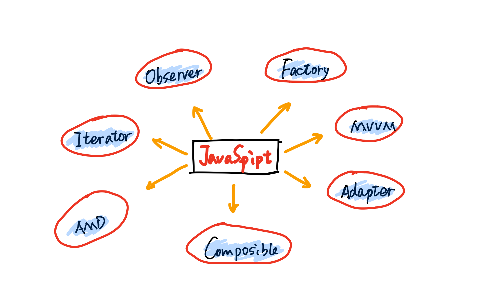
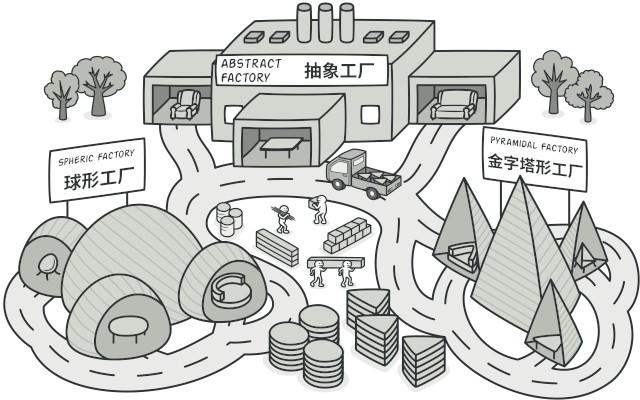
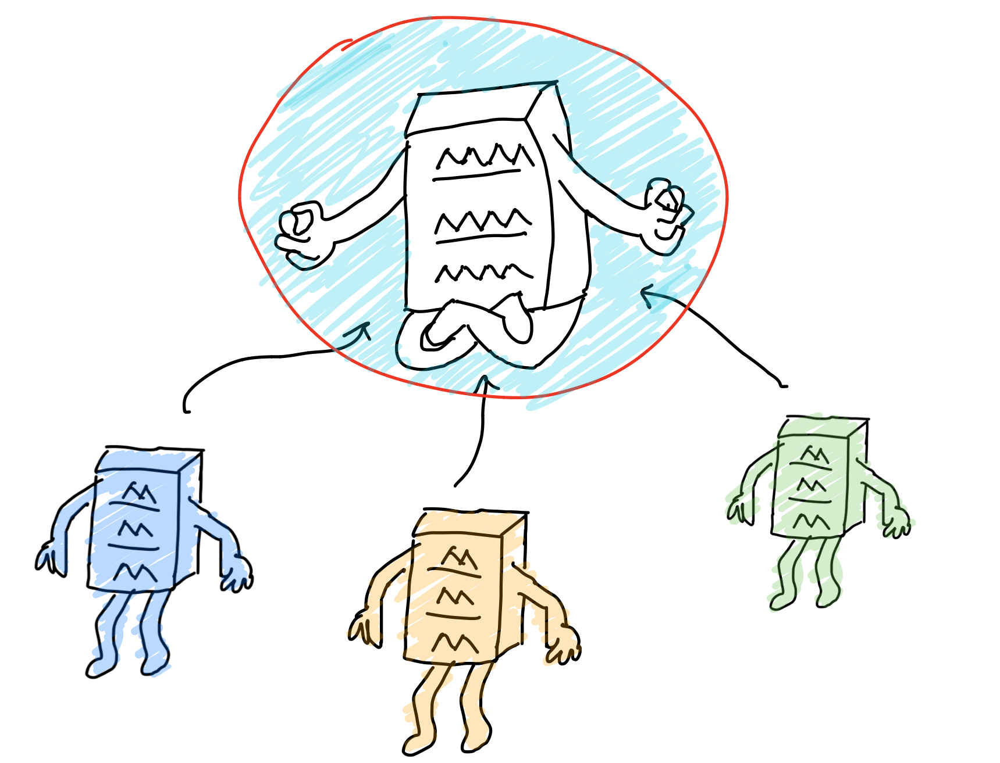
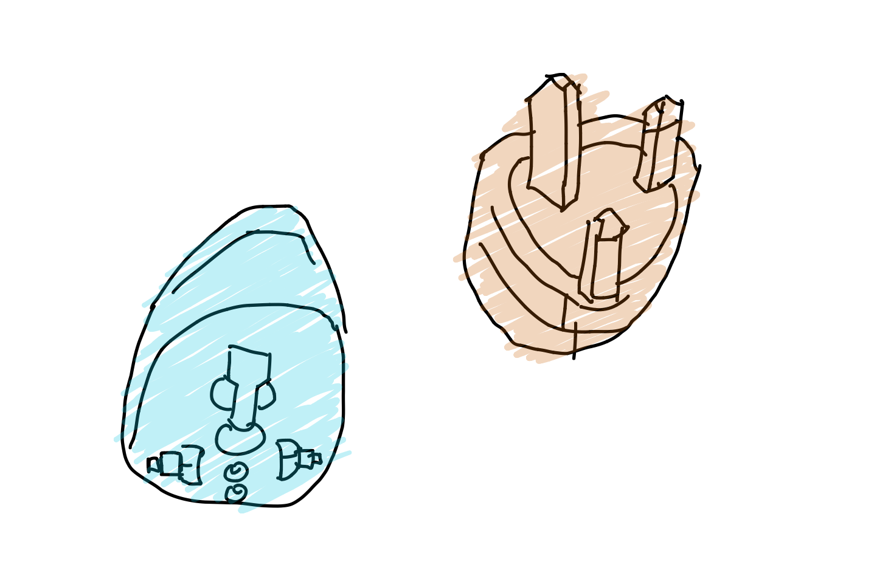
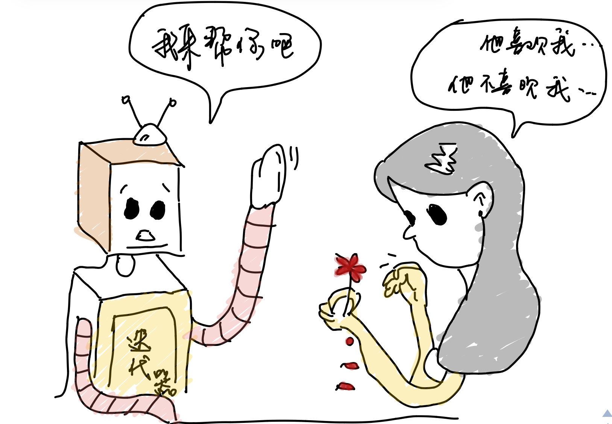

# JavaScript设计模式浅析

>  设计模式最早的起源其实是源于建筑学，针对某一个问题而提出的一个解决方案


## 01 前言


设计模式我们其实听过不少，但是当别人问具体是什么或者有哪些设计模式的时候，我们有可能会不知道或者回答不全。其实我们在开发的过程中可能很少会用到设计模式，因为很多东西别人都帮我们封装好了，我们直接拿过来用即可。

前端的开发经过一遍封装过后变得无比容易，我们在运用的过程中得心应手，只有在源码阅读的过程中才会看到。大概浏览了一下JavaScript设计模式这本书，所以总结一下常用的几种模式，面试也有可能会问到。



## 02 设计模式


##### **工厂模式**

故名思意，我们从字面上的意思就可以看到，可以想象一座工厂源源不断产出一样的产品，流水线作业。没错，工厂模式就是这样。

```javascript
class Person {
    constructor(name) {
        this.name = name
    }
    getName() {
        console.log(this.name)
    }
}
class Factory {
    static create(name) {
        return new Person(name)
    }
}
Factory.create('alanwu').getName()  //alanwu
```

我们首先创建一个工厂，我们只要传递参数进去，里面具体的过程我们不用去关心，最后返回一个对象。



##### **单例模式**

单例模式就是保证一个类仅有一个实例，并提供一个访问它的全局访问点。其实这有一点像我们vuex当中的实现，也是一个全局的状态管理，并且提供一个接口访问。

```javascript
var Singleton = function (name) {
    this.name = name;
}

Singleton.prototype.getName = function () {
    console.log(this.name);
}

Singleton.getInstance = (function(){
        var instance = null;
        return function(name){
            if(!instance){
                instance = new Singleton(name);
            }
            return instance;
        }
    }
)()

var a = Singleton.getInstance('alan1');
var b = Singleton.getInstance('alan2');

console.log(a===b); //true

```



##### **适配器模式**

适配器模式就相当于一个转换接口，大家想想我们手机充电器通常是二岔口的，但是电源只有三岔口的。这时候就需要一个适配器把三岔口的转换成二岔口的。

它的作用其实就是解决两个软件实体间的接口不兼容问题，使用之后就可以一起工作了。



```javascript
var googleMap = {
    show: function () {
        console.log('googleMap show!');
    }
}
var baiduMap = {
    show: function () {
        console.log('baiduMap show!');
    }
}

var renderMap = function (map) {
    if (map.show instanceof Function) {
        map.show()
    }
}
renderMap(googleMap);
renderMap(baiduMap);
```

上面这段程序能够运行是因为百度地图和谷歌地图用的同一种show方法，但是我们在不知道对方使用的函数接口的时候，我们就不能这样用了（可能百度是使用了display方法来显示）。下面的baiduMapAdapter就是我们使用的适配器。

```javascript
var googleMap = {
    show: function () {
        console.log('googleMap show!');
    }
}
var baiduMap = {
    display: function () {
        console.log('baiduMap show!');
    }
}

var renderMap = function (map) {
    if (map.show instanceof Function) {
        map.show()
    }
}

var baiduMapAdapter = {
    show:function(){
        return baiduMap.display()
    }
}
renderMap(googleMap);
renderMap(baiduMapAdapter);
```


##### **代理模式**

我们在事件代理的时候其实就是使用了代理模式，通过把监听事件全部交由父节点进行监听，这样你添加节点或者删除节点的时候就不用去改变监听的代码。

```php+HTML
<ul id="ul">
    <li>1</li>
    <li>2</li>
    <li>3</li>
    <li>4</li>
    <li>5</li>
</ul>
<script>
    let ul = document.querySelector('#ul')
    ul.addEventListener('click', (event) => {
        console.log(event.target);
    })
</script>
```


##### **发布-订阅模式**

这种模式在生活中随处可见，比如你订阅了一个网课，开始前10分钟就会提醒你去听课。这里其实就是发布-订阅的模式，你订阅了它的开课信息，但是你不会接收到另一门的开课信息，因为你没有订阅。

```javascript
document.addEventListener('click', () => {
	console.log("You click me!");
},false)

document.addEventListener('wheel', () => {
	console.log("Your wheel!");
},false)
```

第一个是监听点击事件，而另一个是监听滚轮事件，会打印出来不一样的内容。


##### **策略模式**

根据情况进行不一样的方案，比如你想去旅游，明确自己有多少钱然后选择旅游方式。

- 没钱，走路
- 有钱，飞机
- 还行，火车

这里就涉及到策略的模式了。

```javascript
var strategies = {
    "rich": function () {
        console.log("You can go with plane!");
    },
    "poor": function () {
        console.log("OH, You can go with your feet!");
    },
    "middle": function () {
        console.log("You can go with train!");
    }
}
var howShouldGo = function (money) {
    return strategies[money]();
}
console.log(howShouldGo("rich"));
```


##### **迭代器模式**

迭代器模式是指提供一种按顺序访问的方法。比如说我们经常使用的forEach方法，就是通过顺序访问的模式。我们可以自己去写一下forEach的方法。



```javascript
var myForEach = function (arr, callback) {
    for (var i = 0, l = arr.length; i < l; i++) {
        callback.call(arr[i], i, arr[i]) //把元素以及下标传递出去
    }
}f

myForEach([1, 2, 3], function (item, n) {
    console.log([item, n]);
})
//[ 0, 1 ]
//[ 1, 2 ]
//[ 2, 3 ]
```


## 03 小结


其实设计模式我们用的地方也是有的，只是我们没有注意而已。上面我们说了都是常见的设计模式，还有很多我们没有印象的比如命令模式，享元模式，组合模式，中介模式等等。

如果有兴趣的同学可以去看一下JavaScript设计模式这本书，里面说的都是比较详细的。我大概读了一遍，上面的一些例子也是书本当中的。

