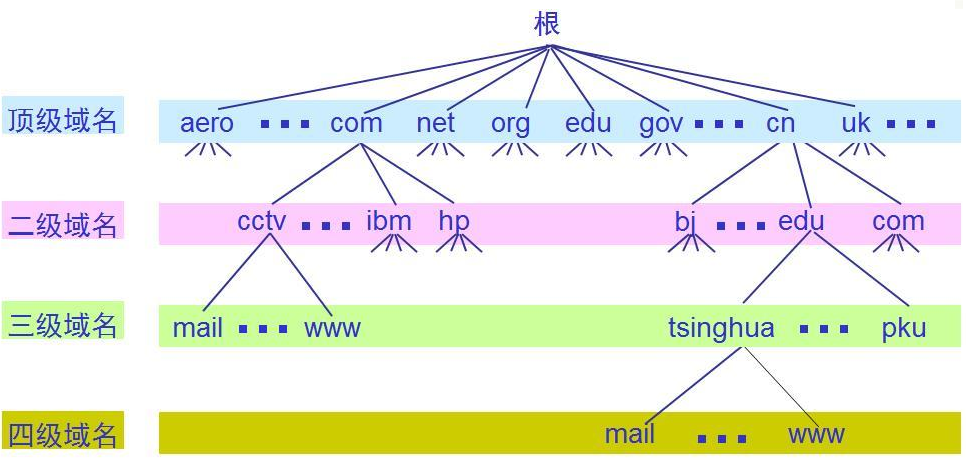
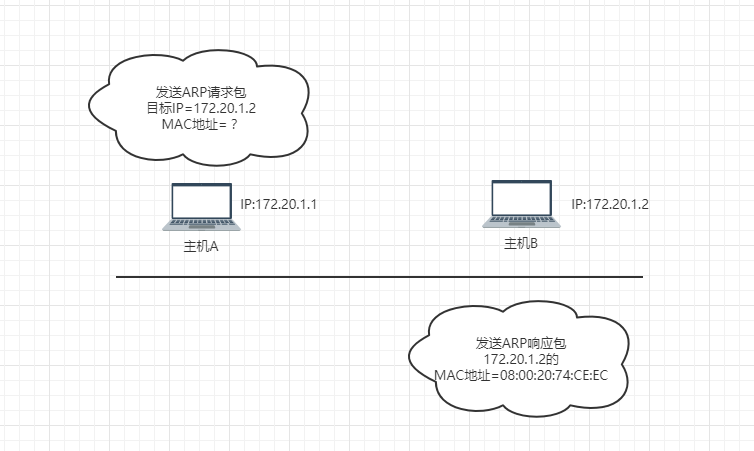

# DNS与ARP的关系与原理解析

> "计算机之间进行通信的只靠IP地址不能完成吗？"

## 01 前言

我们在上网查询某一个网站的时候，比如谷歌搜索，一般都是输入www .google.com进行查询，但是实际上我们是需要得到它的IP地址才可以与主机进行连接的。这个过程就得益于DNS域名解析了，通过域名与IP地址的一个对应关系就可以得到目标的IP地址，从而进行通信。但是有了IP地址还不行，还需要一个MAC地址才可以完成通信，而要得到MAC地址也得益于ARP地址解析协议，整个过程都是大家的相互合作，接下来就说一下中间到底是怎么工作的。

## 02 什么是DNS

通常我们记住一个网站不会去记他的IP地址，因为那样太难记忆了。DNS就是域名解析系统，里面有一个主机名与IP地址的相对应的数据库。它的的作用就是把域名转成IP地址，IP地址是网络上唯一确定的主机名，用以主机的识别。那么它是怎么去解析我们的IP地址的呢？总的来说他有可能经历以下的步骤：

- 查找浏览器时候缓存了IP地址
- 查找操作系统是否缓存了IP地址
- 查找路由器是否缓存了IP地址
- 查找服务运营商时候缓存IP地址
- 查找跟域名服务器对应IP地址

因为网络资源比较宝贵，要是中途没有通过一下缓存的手段，可能会造成网络的阻塞或者网络承受不起中间的庞大请求，所以就必须缓存下来。但是也不是一直都有缓存，过了一定的时间就会消失记录，重新请求然后缓存。

如果浏览器和路由器都没有，一般服务运营商就是中国电信或者中国移动，查找是否缓存了IP地址，如果最后还是没有，就只能去根域名服务器查找了，这一次就一定可以找的到。当IP地址返回的时候，中间的过程会被浏览器，操作系统，运营商等缓存下来，那么下次再进行查找的时候就不会绕这么远的路了。

## 03 什么是域名

> 域名指的是为了识别主机名称和组织机构名称的一种具有分层结构的名称。——图解TCP/IP

域名是有分层结构的，比如有一些域名的后缀是.com/.cn/.org等，都代表了不同的组织机构，也便于域名的管理。域名的分层有点类似于倒挂的树形结构，最顶级就代表了根域名，下面就是二级域名、三级域名等。

图片来源于网络（侵删）

通过上面这张图可以清楚地看到，顶级域名有一个国家顶级域名，比如中国的是以.cn结尾，英国就以.uk结尾。下面我们可以看到一些教育网站都会以.edu结尾的，大学官网都会以这些结尾。

## 04 什么是ARP

ARP是地址解析协议，上面我们知道，通过DNS域名系统可以找到对应主机的IP地址，但是有了IP地址还不够，因为在底层的数据链路层在进行实际通信的时候会找每一个IP地址对应的MAC地址。而从IP地址到MAC地址的时候就要依靠ARP协议。

##### **工作机制**

我们可以以主机A向主机B发送数据为例子，看一下中间的过程是怎么工作的。

主机A为了获取主机B的MAC地址，会先在当前的数据链路上广播发送一个ARP请求包，里面包含目标IP地址。因为在同一个链路上面的主机都会接收到这个请求包，然后每一个主机就会根据IP地址与自己的IP地址相比较，如果与自己的匹配就会接收这个请求包，然后发送响应包，里面就包含自己的MAC地址。

初此之外，ARP请求包里面也含有主机A的MAC地址。当获取了B的MAC地址后也会缓存一下，防止下一次的请求又要发送请求包，节省流量。这样的MAC地址与IP地址相对应的表就是ARP表，MAC地址缓存也是有一定的时间的，超过时间之后就会吧内容清除，然后重新请求。

##### **IP地址与MAC地址的关系**

其实有一段时间我也一直不太明白为什么有了IP后还要MAC来通信呢？这不是多此一举吗？

首先我们要明白一个很重要的区别，IP地址是会变的，一旦你关机重启之后IP就可能会不一样了，但是MAC地址就不一样，永远都是一样的不会改变。相当于我们的身份证号码一样，但是你搬家之后的住址就可能会改变了。

网络通信很大一部分都是不在同一个网络上的，所以数据会经过很多路由器才可以找到你的主机。比如我们网购东西写的地址就是IP地址，快递的分发机制我们都知道，通过省/市/区一层层分发下来，最终就会找到你的位置。但是除了这个位置还不行，你要知道你的名字是啥才会准确分到你的手上，这就是MAC地址的作用。

##### **RARP**

这个其实就是与ARP相反，作用是把MAC地址对应的IP地址找出来。那么这种协议有什么用呢？我们知道DHCP的作用就是动态分配一个IP地址给当前的主机，通过电脑我们可以自己设置，如果不设置就是由DHCP来给你分配一个IP地址。比如我们打印机联网的时候就会用到这个协议，当我们插上电源的时候，就会发送一条“我的MAC地址是xxx，我对应的IP地址是啥？”的请求信息。

那么对应的RARP服务器就会在上面注册你的MAC地址然后分配一个IP地址给你。

## 05 小结

通过上面的解析，我们知道了DNS域名解析系统与IP地址的关系，通过IP地址我们可以利用ARP地址解析协议找到MAC地址。通过IP地址与MAC地址的配合我们就会准确地与目标主机进行通信。这里我们知道ARP就是一个广播的功能，广播的话我们就会用到UDP协议（TCP不支持广播）了，其实各种协议之间也是有一定的联系的。

我们也知道域名之间的层级结构，由顶级域名统一分配，有一定的管理结构，而且域名我们也一般不能随便申请，比如个人就不能申请教育类或者政府类的域名。

