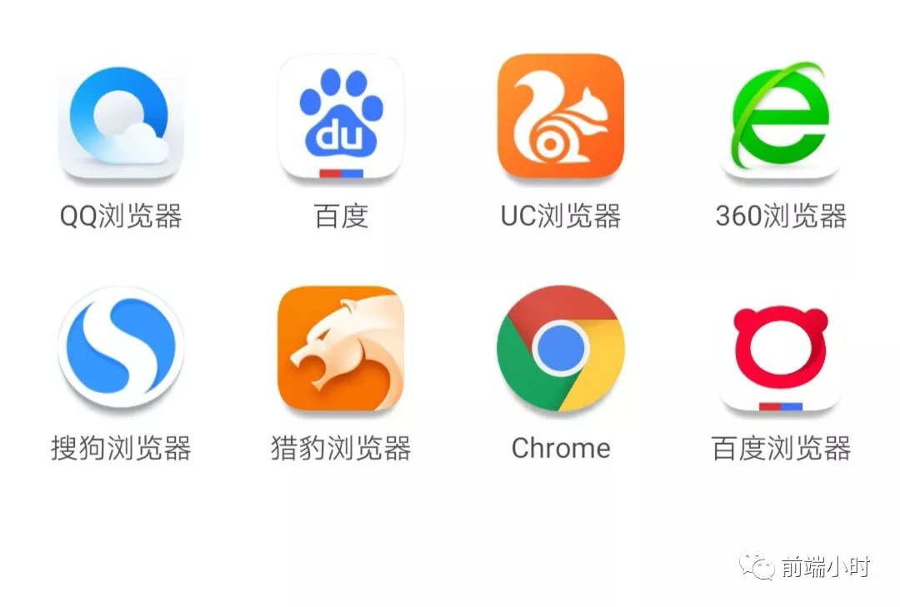
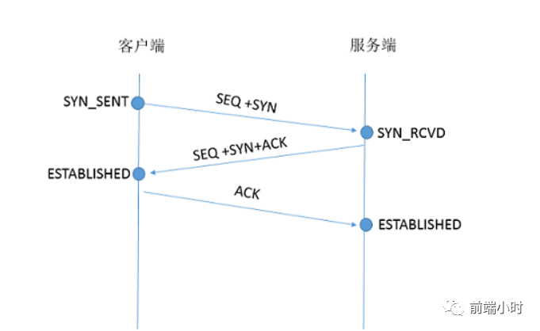

# 浏览器按下回车发生了什么

> "立身以立学为先，立学以读书为本"

## 01 前言

这一篇文章是其实就是讲述浏览器的渲染原理，普通用户虽然操作浏览器只会关注页面是否能够显示出来，但是作为前端程序员是要去关注要是显示异常该如何排查问题。

其实当你深入研究的时候，你会发现中间过程比我们想象的还要复杂。其中包括IP地址的解析、DNS服务器查询，服务器响应等一系列过程，下面我就解析一下浏览器到底是怎么工作的。

## 02 响应过程

从我自己的总结来看，它可以分为以下几个流程：

- IP地址查询
- 建立TCP连接
- 服务器处理
- 响应返回
- 页面渲染

##### **IP地址查询**

假设我们在页面上输入 www . baidu . com ，那么我们是如何得到百度的IP地址呢？我先来插个小插曲，其实百度服务器的IP地址是有多个的，因为对于搜索引擎来说每天都有巨大的访问量，必须有负载均衡的处理，否则就会崩溃挂机。

IP地址的查询其实也通过几个步骤来得到的

- 首先浏览器查询自己的DNS缓存
- 如没有就会去操作系统中进行查找，也会查找一下本机的host是否有缓存
- 如没有就会去路由器中查找
- 再没有就去本地域名服务器中查找，一般是本地的服务运营商，如中国电信
- 操作系统会得到IP地址，并且缓存起来
- 浏览器得到操作系统返回的IP地址，同样也缓存

到了这里浏览器就会得到www . baidu . com 的IP地址了，接下来就会进行地址的访问和连接。

##### **建立TCP连接**

建立TCP连接最重要的就是要进行三次握手

当进行数据发送之前，会把数据经过网络协议的层层封装，经过应用层、传输层、网络层、链路层。当服务器接收数据时会对数据进行拆封，最后才会得到HTTP数据。我们知道TCP/IP分层模型一般会分成以下几层（图），每一层都有不同的协议对应着，保证了数据的传输。

那么每一层对应哪些协议呢？

**应用层**：决定了向用户提供应用服务时通讯的活动。比如FTP（文件传输协议），DNS（域名系统），HTTP（超文本传输协议），Telnet（网络远程访问协议）等。

**传输层**：传输层对上层应用层，提供处于网络连接中的两台计算机之间的数据传输。提供TCP（传输控制协议）和 UDP（用户数据报协议）两种协议，主要是对数据格式化、数据确认和数据丢失重传。

**网络层**：用来处理网络上流动的数据包。数据包是网络传输的最小数据单位。规定了通过怎么样的途径来到达对方的计算机，并传输数据给它。网络层中通过IP协议把数据包传输给对方。IP地址指明结点被分配到的地址，而MAC地址指网卡所属地址（一般不会改）。在IP层中，会通过ARP（地址解析协议）得到相应的MAC地址。

**链路层**：处理连接网络的硬件部分，包括控制操作系统、硬件的设备驱动、网卡以及光纤的物理可见部分。涉及硬件部分就依赖于MAC地址。

##### **服务器处理**

当数据到达服务器就会进行解析处理。处理结果会返回一个状态码，常见的状态码有如下几种：

- 200 OK ：客户端请求成功
- 400 Bad Request ：客户端请求有语法错误，不能被服务器所理解
- 401 Unauthorized ：请求未经授权，这个状态代码必须和WWW-Authenticate报头域一起使用
- 403 Forbidden ：服务器收到请求，但是拒绝提供服务
- 404 Not Found ：请求资源不存在
- 500 Internal Server Error ：服务器发生不可预期的错误
- 503 Server Unavailable ：服务器当前不能处理客户端的请求，一段时间后可能恢复正常

##### **响应返回**

当浏览器接收到服务器返回的数据，会对数据进行预处理，根据状态码来进行不同的处理。比如403状态码，就会允许浏览器使用缓存而无需重新请求。如果是200状态码，可能就是一次新的请求，浏览器可能会对资源进行解压缩、缓存资源等操作。最后一步才是解析资源，渲染页面。

##### **页面渲染**

浏览器接收到数据，会进行以下步骤的操作：

- 解析HTML文件，转换成DOM树
- 解析CSS文件，转换成CSSOM树
- 生产渲染树
- 将信息发送给GPU，合成渲染

我们知道，计算机的传输都是以0101的数据进行传输，所以说我们接收到的数据也是这种格式，我们必须要进行解析。首先将字节数据转换成字符串，也就是我们的代码。然后对字符串进行词法分析转换成token（标记），这一过程就是标记化。下一步就把标记转换成Node，最后根据不同的联系构建出一棵DOM树。

解析CSS的原理一样，两棵树的解析是并行的。

最后就是合并两棵树的操作，注意渲染树会忽略那些不需要显示的节点，比如节点的样式设置为：display:none;

## 03 重绘与回流

重绘与回流影响的是两棵树的解析过程，那么什么是重绘和回流呢？

- 重绘

当我们修改了DOM的一些样式，比如修改文字颜色或者背景色，这些浏览器是不需要重新计算几何属性的，直接绘制新的样式。

- 回流

当我们修改DOM的几何属性，一般有修改元素的宽高等，浏览器就会重新计算位置，然后再进行重新绘制。

那么我们该如何避免呢？

- 减少使用绝对定位，使用transform代替
- 减少使用display，使用visibility代替
- css样式避免节点嵌套过多，匹配规则是从右往左

## 04 阻塞渲染

因为JS运行是单线程的，所以当我们解析HTML代码和JS代码就会有冲突。我们的期望是先把页面渲染出来，然后再执行JS代码。所以我们就要注意以下几个事情：

1. 把< script >标签放在底部
2. 把样式文件放在顶部，防止页面“裸奔”

DOM解析和CSS解析是两个并行的进程，CSS加载不会阻塞DOM的解析

由于渲染树是依赖于DOM树和CSSOM树的，必须等待到CSSOM树构建完成，也就是CSS资源加载完成(或者CSS资源加载失败)后，才能开始渲染。因此，CSS加载是会阻塞DOM的渲染的。

## 05 小结

对于浏览器渲染原理这一部分，面试也是经常考到的，前端必须对这一块非常熟悉。这一块很有深度，对于项目的优化都可以参照以上的过程，只有当每一个过程都达到最优的状态，性能才是最佳。

其实还有很多知识点没有讲解出来，读者可以根据需要去自行查找，总体方向就是以上的过程。

