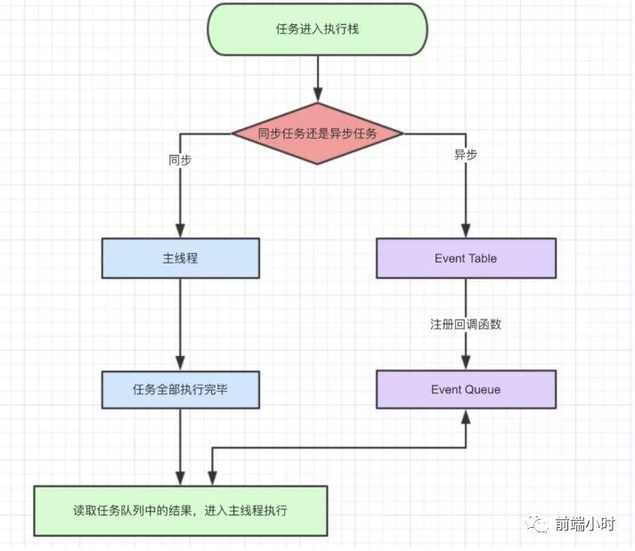
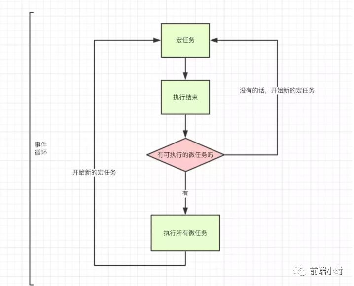
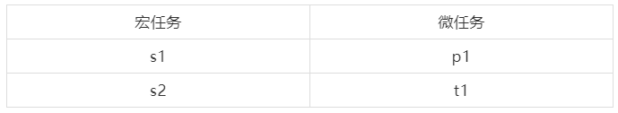
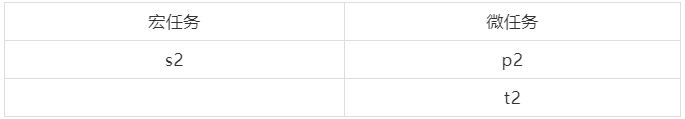
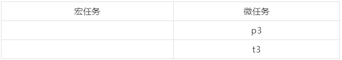
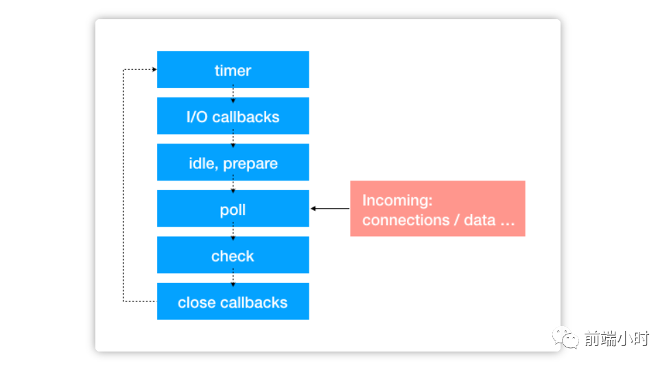

# JavaScript事件循环机制

>  菩提本无树，明镜亦非台


## 01 前言


事件循环机制在前端的面试中可谓是必问的一道题目，这道题目涉及JS的执行顺序问题，可能有些同学执行JS代码的时候老是会出错，执行顺序不对的情况。所以我就借这一篇文章好好深入了解一下。


## 02 事件循环


我们知道JavaScript是单线程的，意思就是一个时间只能做一件事情。就比如车站过安检一样，都会一个个通过，这就是单线程。那么这样问题就来了，假如程序中有一个很慢的http请求，用户必须要等待响应才可以继续后续的操作，这样就不妥了。所以我们就让长时间请求的程序代码挂起，让用户先操作其他事情。

在JavaScript中，我们把任务分为同步任务和异步任务。首先我们看一段代码的执行顺序。

```javascript
console.log('script start');

setTimeout(function() {
  console.log('setTimeout');
}, 0);

Promise.resolve().then(function() {
  console.log('promise1');
}).then(function() {
  console.log('promise2');
});

console.log('script end');

//执行结果：script start=>script end=>promise1 =>promise2=>setTimeout
```


为什么会是这样的结果，因为任务进入执行栈之后会判断一下是否是同步任务，若是同步任务就会进入主线程执行；异步任务就会到事件表里面注册回调函数到事件队列。

- 同步和异步任务分别进入不同的执行"场所"，同步的进入主线程，异步的进入Event Table并注册函数

- 当指定的事情完成时，Event Table会将这个函数移入Event Queue

- 主线程内的任务执行完毕为空，会去Event Queue读取对应的函数，进入主线程执行。

- 上述过程会不断重复，也就是常说的Event Loop(事件循环)

  




## 03 宏任务和微任务


上面我们知道有同步任务和异步任务，那么异步任务里面到底是如何分类呢？其实异步任务是包含宏任务和微任务，他们会加在同一个队列里面，只是执行顺序不一样而已。





**<font color="orange">宏任务</font>**：整体代码script、setTimeout、setInterval、setImmediate

**<font color="orange">微任务</font>**：原生Promise中then方法、process.nextTick、MutationObserver

对于宏任务和微任务我们只要记住以上几种就好。

我们重点来了解一下setTimeout的执行过程：

```javascript
setTimeout(() => {
    task();
},3000)
console.log('执行console');
```

根据事件循环的过程我们知道程序先执行打印操作然后再执行定时器，但是我们稍微修改一下函数

```javascript
setTimeout(() => {
    task()
},3000)
//假设此处同步任务执行时间10秒
```


这时候我们就发现并不会在3秒后执行task()回调函数，而是会等待10秒时间执行完毕后再执行task()任务。我们来分析一下：

- task()异步任务进入到 **<font color="orange">Event Table</font>** 并注册回调事件，开始计时
- 执行同步任务
- 经过3秒，task()进入事件队列（此时task并不能立刻执行）
- 经过10秒后，task()从事件队列中取出放到主线程执行

关于setTimeout要补充的是，即便主线程为空，**<font color="orange">setTimeout(fn,0)</font>**，0毫秒实际上也是达不到的。根据HTML的标准，最低是4毫秒。关于setInterval( fn , ms )来说并不是每隔ms就会执行一遍，而是经过ms后**<font color="orange">回调函数</font>**加入事件队列，所以setInterval未必准确。

最后放一道综合的题目：

```javascript
console.log('1');

setTimeout(function() {
    console.log('2');
    process.nextTick(function() {
        console.log('3');
    })
    new Promise(function(resolve) {
        console.log('4');
        resolve();
    }).then(function() {
        console.log('5')
    })
})
process.nextTick(function() {
    console.log('6');
})
new Promise(function(resolve) {
    console.log('7');
    resolve();
}).then(function() {
    console.log('8')
})

setTimeout(function() {
    console.log('9');
    process.nextTick(function() {
        console.log('10');
    })
    new Promise(function(resolve) {
        console.log('11');
        resolve();
    }).then(function() {
        console.log('12')
    })
})
```


- 整体以script1作为宏任务进入主线程，输出1
- 遇到setTimeout，回调函数分到**<font color="orange">宏任务队列</font>**中，记为s1
- 遇到process.nextTick()，回调函数分到**<font color="orange">微任务队列</font>**中，记为p1
- 遇到promise，直接输出7，then回调函数放置到**<font color="orange">微任务队列</font>**，记为t1
- 遇到setTimeout，回调函数分配到**<font color="orange">宏任务队列</font>**，记为s2
- 结束第一轮事件循环




由于微任务先于宏任务执行，此时输出 1 7 6 8，然后开启第二轮事件循环。从setTimeout1开始。

- 遇到同步任务，打印 2
- 遇到process，放到**<font color="orange">微任务队列</font>**，记为p2
- 遇到promise，打印同步任务输出 4
- 遇到then任务，放到**<font color="orange">微任务队列</font>**，记为t2





第二轮宏任务结束，执行微任务p2，t2。输出 3 、5。然后开启第三轮事件循环，从setTimeout2开始。

- 遇到同步任务，打印 9
- 遇到process，放到微任务队列，记为 p3
- 遇到promise，打印同步任务输出 11
- 遇到then任务，放到**<font color="orange">微任务队列</font>**，记为 t3




第三轮宏任务结束，执行微任务p3，t3，输出 10 、12。到此，三轮事件循环结束。输出顺序为：

```javascript
// 1，7，6，8，2，4，3，5，9，11，10，12
```


## 04 Node中的事件循环





不过，在外部输入数据到来时，是从poll阶段开始的，即：

> 外部数据 -> poll -> check -> close callbacks -> timer -> I/O callbacks
> -> idle,prepare -> poll ...

而这些阶段的功能大致如下：

- timer：执行定时器队列中的回调（如setTimeout、setInterval）
- I/O callbacks：执行除了close事件、定时器、setImmediate之外的所有的回调
- idel,prepare：仅内部使用，无需理会
- poll：等待新的I/O事件，在一些特殊情况下，会阻塞在这里
- check：专门执行setImmediate中的回调
- close callbacks：执行close事件的回调，如socket.on('close', ...)


##### **1、各个阶段详解**

**<font color="orange">timer阶段</font>**
这个阶段会以先进先出的顺序执行所有到期后加入到timer queue里的回调（这些回调是通过setTimeout或者setInterval设置的）

**<font color="orange">I/O callback阶段</font>**
这个阶段主要执行大部分的I/O事件回调，包括为操作系统执行的一些回调（如TCP连接出错时，通过callback拿到错误信息）

**<font color="orange">poll阶段</font>**
V8引擎将JS代码解析后传入libuv，循环首先进入poll阶段，此后：

- 检查poll queue中是否有事件，有任务就按先进先出的顺序依次执行回调
- poll queue为空时，检查是否有setImmediate的callback，有则进入check阶段执行setImmediate的回调
- 检查是否有到期的timer，如果有，按timer的到期顺序放到timer queue中，此后进入到timer阶段时，执行timer queue中的回调
- 如果setImmediate和timer的队列都是空的，则事件循环停留在poll阶段，直到有I/O事件返回，事件循环才立即进入I/O callbacks阶段，并且立即执行回调

**<font color="orange">check阶段</font>**
本阶段专门用来执行setImmediate()的回调，当poll进入空闲状态，且setImmediate queue不为空时，事件循环会进入该阶段

**<font color="orange">close阶段</font>**
当一个socket连接或一个handle被突然关闭时（如调用了socket.destroy()），close事件会被发送到这个阶段执行回调，否则事件会用process.nextTick()方法发送出去


##### **2、process.nextTick**

虽然没有专门一个阶段来执行nextTick，但是存在一个nextTick queue，在事件循环 准备进入下一个阶段 前会先检查nextTick queue是否为空，不为空则需要等执行清空。
所以，如果错误地使用process.nextTick，会导致node进入死循环

## 05 小结


在Node方面可能会有一些情况与JavaScript中不同，我们要注意区分这些情况。通过总结这一次的事件循环，我们应该会彻底了解事件的执行顺序，下次遇到这一类的题目就会迎刃而解。


**<font color="green">参考文章</font>**

- JS事件循环机制（Event loop）之宏任务/微任务

- 彻底理解JavaScript中的Event loop


