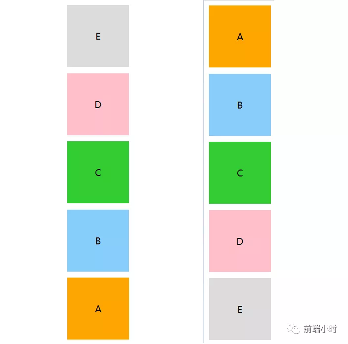

# 一次读懂flex布局

>  千里之行，始于足下。——老子


## 01 前言


前端的页面布局，在之前那是颇为头疼，一个简单的水平垂直居中可能要写上不少代码，但是现在利用一种新的布局方式，三行代码就可以实现。可以说，flex布局是未来布局的首选方案，且兼容性对各大浏览器都良好。


## 02 主轴属性


当容器设置为flex布局之后，可以对里面的各个元素采用不同的排列方式。对于采用flex布局的容器，可以使用以下属性。

- flex-direction
- flex-wrap
- flex-flow
- justify-content
- align-items
- align-content


一个容器默认会存在主轴（main axis）和交叉轴（cross axis）。主轴的开始位置（与边框的交叉点）叫做main start，结束位置叫做main end；交叉轴的开始位置叫做cross start，结束位置叫做cross end。

基本节点结构

```html
<div class="container">
    <div class="box">
        <div class="item1">A</div>
        <div class="item2">B</div>
        <div class="item3">C</div>
        <div class="item4">D</div>
        <div class="item5">E</div>
    </div>
</div>
```

##### **flex-direction**

```css
.box{
   flex-direction: row | row-reverse | column | column-reverse;
}
```

默认情况下，我们的属性值是row，按行排列。

**row**


**row-reverse**


**column / column-reverse**



##### **flex-wrap**

默认情况下，容器内部的item都排在主轴上。该属性定义如果轴线排不下的时候该如何换行。

```css
.box{
  flex-wrap: nowrap | wrap | wrap-reverse;
}
```

默认情况下是不换行，nowrap。下面展示换行wrap和反向换行的情况。

wrap


wrap-reverse


##### **flex-flow**

该属性是flex-direction和flex-wrap的简写方式（一般不用关注）

```css
//默认 flex-flow: row nowrap
.box {
   flex-flow: flex-direction flex-wrap;
}
```

##### **justify-content**

该属性定义了item是如何在主轴上排列

```css
.box {
  justify-content: flex-start | flex-end | center | space-between | space-around;
}
```

默认情况下是flex-start

flex-start


flex-end


space-between


space-around


center


##### **align-items**

```css
.box {
  align-items: flex-start | flex-end | center | baseline | stretch;
}
```

flex-start / stretch / baseline


center


flex-end


##### **align-content**


由于自己写出来的效果不直观，所以就使用官网的例子来进行演示。注意此属性对于单行的弹性盒子模型无效，即 flex-wrap : nowrap


## 03 交叉轴属性


交叉轴上面可以运用的属性有以下6种：

- order
- flex-grow
- flex-shrink
- flex-basis
- flex
- align-self

##### **order**

order属性定义项目的排列顺序。数值越小，排列越靠前，默认为0。

```css
.item {
  order: <integer>;
}
```

给H添加 order : -1


##### **flex-grow**

该属性是指当子元素总宽度和比盒子宽度小的时候，子元素该如何瓜分父元素剩余宽度。下面是分别给ABCD四个元素的flex-grow设置为1，2，3，3

```css
.item {
  flex-grow: <number>; /* default 0 */
}
```


那么元素是如何获得占比值呢？元素实际宽度又是多少呢？

```html
子容器宽度总和为1800（500+400+300+800），（盒子宽度2100）剩余空间为100
A元素的占比：1/(1+2+3+3) = 0.111
A元素的占比值：100*0.111=11.1
A的实际宽度：500 + 11.1 = 511.1
```

##### **flex-shrink**

该属性是指当子元素总宽度和比盒子宽度大的时候，子元素该如何压缩自己适应父元素宽度。下面是分别给ABCD四个元素的flex-shrink设置为1，2，3，2

计算结果如下：

```html
子容器宽度总和为1800，溢出空间为200
总压缩：500 * 1 + 400 * 2 + 300 * 3 +800 * 2= 3800
A的压缩率：500*1 / 3800 = 0.132
A的压缩值：200 * 0.132 = 26.4
A的实际宽度：500 - 26.4 = 473.6
```


##### **flex-basis**

```
MDN定义：指定了 flex 元素在主轴方向上的初始大小
```

项目（item）放进盒子之前，给出一个初始宽度，默认值为auto，即项目本身的实际宽度，浏览器会根据 flex-basis 计算主轴是否有剩余空间。

```css
.item {
  flex-basis: <length> | auto; /* default auto */
}
```

它的值可以与项目的width一样，项目会按此宽度占据。通过设置with和max-width以及flex-basis，他们是有优先级关系的，我把A的width设置为400，flex-basis设置为500，max-width设置为600，通过浏览器依次去掉宽度属性值，得出一下结论：

```css
max-width/min-width > flex-basis > width > box
```

.gif)

##### **flex**

flex属性是flex-grow, flex-shrink 和 flex-basis的简写，默认值为0 1 auto

```css
.item {
  flex: none | [ <'flex-grow'> <'flex-shrink'> <'flex-basis'> ]
}
```

平时写代码直接可以把属性分开来就好，一般不用记住简写方式。但面试可能会考到是哪几种属性简写，还是记下来的好。

##### **align-self**

align-self属性允许单个项目有与其他项目不一样的对齐方式，可覆盖align-items属性。默认值为auto，表示继承父元素的align-items属性。

```css
.item {
  align-self: auto | flex-start | flex-end | center | baseline | stretch;
}
```

此处我给项目B单独设置align-self属性

auto | flex-start | flex-end | baseline


center


flex-end


## 04 小结


flex布局属性可以快速满足我们日常开发的常见布局需要，解决使用定位、浮动等影响其他元素的属性。目前该属性可以支持主流的浏览器，可放心使用。


比如面试官会问你如何实现水平垂直居中的时候你就可以使用flex布局，简单快速：

```css
.item1 {
     width: 400px;
     height: 400px;
     background-color: orange;
     text-align: center;
     line-height: 400px;
     font-size: 30px;
}
.box {
     width: 800px;
     height: 800px;
     margin: 0 auto;
     display: flex;
     justify-content: center;
     align-items: center;
}
```


