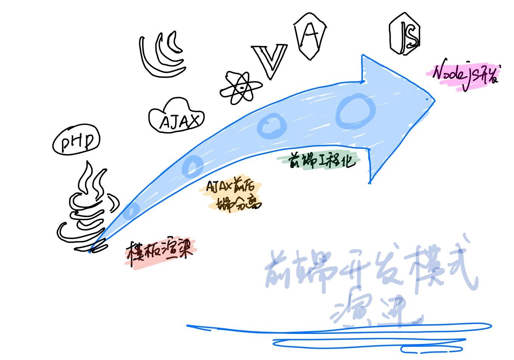
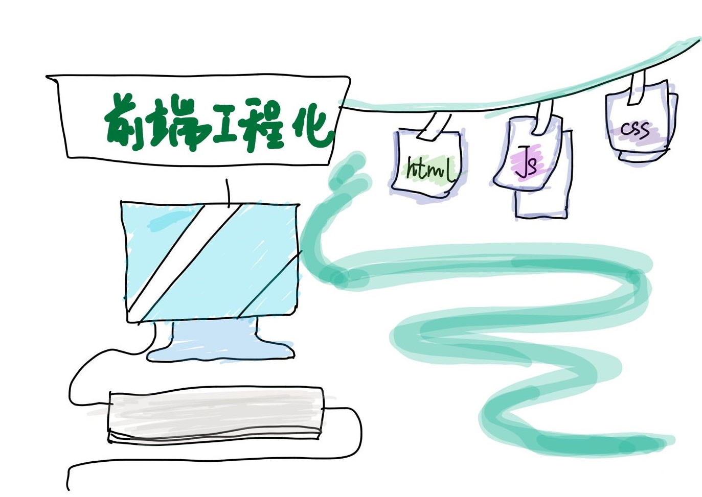

# 小白也能听懂的前端工程化

>  前端工程化最近也是被很多公司或者企业都用起来了，变成了一个很火的名词，所以我就好奇一下中间的前因后果是怎么样的

## 01 前言

前端工程化这个方面的内容我也是近年来才听到的一个信息，我一听就觉得十分地高大上，什么时候前端开始变成了一个工程化的层面了？不过现在随着技术的更新换代我逐渐相信前端的发展了。之前觉得惊讶的时候，我还是大家认为前端该干的事情——切图，套模板。

本文就和大家扯一下前端工程化的前世今生，没有技术在里面。大家可以带着好奇的心情阅读。

## 02 前端开发？切图？

其实之前对于前端的概念基本上是没有的，那时候很多招的就是后端的开发，所以java的开发就很吃香了，差不多站到了鄙视链的顶端。那为什么我不去学后端呢？因为我（后）相（端）信（太）前（难）端（了）的发展。

所以没办法，我就随便找个其他的学一下，由于美工不好那就找前端吧！有点东西还可以马上出效果。

##### **前端历史**

不得不承认的是，现在前端经历了两次的重生。才有今天突飞猛进的发展，第一次是从静态网站变成了动态网站；第二次就是Node.js的推出，可以使脚本语言JavaScript运行在服务器端，这可是解放了生产力，让前端不再卑微了。

很多人都觉得动态网站不是很早就有了吗？一开始我也是这么觉得的，毕竟写一个脚本就可以让页面动起来，但是这里说的动态可不是这个意思，是可以与用户进行交互了。大家可以想想看之前的前端历史，无非就是把几个页面模板拼凑起来，然后使用js加上几个动画，就会觉得你的网站不得了了。那时候的网站基本上是没有交互的，就是给别人看的页面，仅此而已。

有时候你辛苦调试出来的一个完美的页面，发给同学朋友看的时候，页面也可能会乱。没错，那个就是不兼容的时代，会让每一个前端抓狂的时代，而现在就不一样了，很多框架都帮你弄好了，很少会有兼容的问题。

##### **开发模式**

由于本人是没有经历过前后端混合的开发模式，我开始学习前端的时候，vue和elementui这些都已经出来了，所以我就跟高兴晚出生了几年，让前人们帮我们这群人铺平了前端道路。

当我谷歌了前端工程化了之后，发现之前的开始模式是比较混乱的，也是没有很强的逻辑在里面的。大概的开发模式就是切一下图，把设计的部分做了和写一下脚本（相信大家都知道dreamweaver这个软件，既可网页设计也能写前端代码）。然后页面模板就交给后端来做，前后端混合在一起，耦合性非常高。这真的就是牵一发而动全身的局面。相信大家都知道大名鼎鼎的JSP了，我在大学的时候也学了这个，基本上没什么用（下一届取消这门课程）。

后来后端就忍不住了，你这前端的东西啥玩意，零碎的很，又毫无逻辑可言。

好吧，前端本着背锅的心态啃了这块骨头，把所有页面相关的东西都给了前端，后端就负责发给我数据就好了。这就是上面提到的动态网站的开始，这得益于Ajax的诞生。从此以后前端的工作就不用去切图了，你的工作就变成了怎么搞模板，设计与美化页面的工作了。

## 03 前端工程化

之前我们开发完了页面之后，剩下的就等后端来给你数据了。但是你前端的开发快了，但是后端的接口跟不上啊，这可怎么办？聪明的前端就想出了“假数据”这个东西，就是我先把数据自己模拟出来，你后端就必须按照我的格式给我返回数据（与后端沟通好格式）。

这不，出了很多数据模拟的工具，比如easymock等。大家可以脱离后端的控制单飞了，我们可以把这个项目同步进行开发，每一个过程都是完整可交付的状态，可以随时给客户演示这个过程而不用等后端的接口。项目组一看，前端做的不错（升职加薪）。但是这和工程化的概念还很远呢，我们知道项目大概可以分成四部分：设计，开发，测试，部署。

##### **设计**

这里的设计主要是由产品经理与UI设计一起，设计这款产品的愿景以及要实现的功能，简单一点就是把用户需求的功能通过产品设计出来，交给开发。

前端就主要通过产品页面的评估，主要是评估开发周期以及项目的难度，然后是技术栈的选择。后端会对系统进行架构设计，包括系统接口，权限控制，性能，可维护可复用等的设计。基本上前后端设计的都是关于技术类型的。

##### **开发**

接下来就会进行开发的状态，根据需求进行开发。这个阶段就要注意一些小功能的开发，是否可以通过所有的测试用例。不知道大家是否听过敏捷开发的技术，这是一种高效的模式，确保开发的过程中每个部分的功能都可以使用。他的初衷就是能够高效地开发迭代，快速地转变用户需求。前端的组件化、模块化的设计就是能够保证敏捷开发的前提。

##### **测试**

测试的作用就是进行小范围的对功能本身的验证，一般来说会有很多测试用例，只有你通过了所有的用例测试之后就可以进行下一部的操作。测试是直接面向用户的，这时候就站在用户的角度去体验这个产品，把用户可能出现的操作都测试一遍看服务或者数据是否正常，前端工程师是主要责任人。通常可能还会包含压力测试等，用来测试产品的性能，这时候就是后端的主要责任。

##### **部署**

部署的流程就是一个很重要的一部分，假如前期的工作做得不够好，项目上线之后可能会遇到很多问题，让你难以定位问题出在哪，项目难以维护等。前后端分离的开发模式可以有效的减少故障的发生，能够快速定位问题，解决问题。其实这里也是得益于单元测试以及项目工程拆分的过程。

这里的部署可以把一些静态的文件部署到静态服务器或者CDN，把涉及数据交互的放在web服务器，做到类似“读写分离”的功能，能够最大程度提升性能。

在开发的过程中就可以使用前后端分离的开发模式，这是一种与技术无关的模式，就是一种工程思维的考量。很多面试都会问你谈谈前端工程化的理解，其实无非就是为什么有前端工程化、怎么做才可以、有什么好处等。基本上这就是一种工程的思维，与技术的关系不大。总的来说有以下三个优点：

- 并行开发，缩短开发周期
- 快速定位问题，迅速解决问题
- 部署可以动静分离，简化流程，提升程序的健壮性

## 04 小结

其实我发现一些书籍把前端工程化的概念讲的很深，比如可能会说前端的打包工具、持续集成等。当然这也是前端工程化的一部分，简单来说它的核心就是“解耦”，让之前的纠结不清的脉络重新整理出来，变成一个可维护可复用的状态。

总结一下前端工程化就是为了简化开发流程，并行开发，互不影响且能够方便合并整个项目。核心目标就是建立一种开发环境，提升整体的开发效率。

