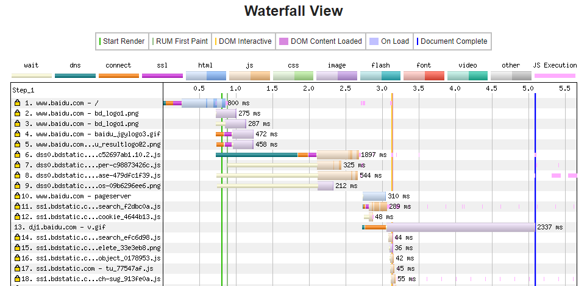

# 如何建设一个高性能的网站

>  网站是否高性能，我们第一眼看的就是响应是否快速，运行是否流畅，但是开发人员应该怎么做才可以做到高性能呢？


## 01 前言


最近在进行项目构建的时候遇到很多难题，首先我们最容易忽略的问题就是关于性能优化的。为什么这么说呢？我相信很多小伙伴开发网站都是在本地进行构建的，我们发现项目跑起来之后根本是没有什么延迟的问题出现，或许我们根本就不会注意到这个问题，尤其是那些刚开始接触工程化项目开发的时候。通过本地进行项目构建我们是本地起的http服务，但是假如我们线上的话就不一样了，服务器是在很远的地方放着，肯定会有你意想不到的延迟。

那么我们在项目中应该怎么去做才能有更好的效果呢？大家可以从一道很经典的面试题目《[网站从按下回车到显示的过程](http://blog.alanwu.site/2020/03/11/enterProcess/)》来思考，其实这里无非就是两个方面，一个就是减少请求，一个是压缩请求。一个是减少数量，一个是减少项目体积大小，解决了这两个问题，基本上你的网站就可以优化很多了，我之前也写过一篇关于性能优化的文章《[前端性能该如何优化](http://blog.alanwu.site/2020/03/08/optimize/)》，现在就补充一些其他的内容。接下来就介绍一些规则。


## 02 建设指南

##### 减少HTTP请求

我们网站假如有很多小图片的话就可以用到合并图片的方法，把所有的图片都放到同一张图片当中，然后根据位置来显示图片的内容。这样的话我们就可以做到只发送一次请求然后获取多个图片的方法，这就是我们常说的“雪碧图”。不过这种方法在一些图标或者logo这样的小图片上用的比较多，一般大的图片都会使用一些新类型的图片格式如webp格式、svg格式等。

另一个减少请求的做法就是合并js和css文件。假如项目比较小的话我们尽管把样式代码放到同一个文件当中，注意选择器的使用和类命名规范就不会出现大问题。但是项目比较大的话我们可以选择提取公共的样式代码文件，命名为common.css这样，减少相同样式的请求，一般都是一些全局的公共样式文件。js文件也是同样的道理，把js文件进行模块化，然后放进同一个js文件当中。

##### 使用CDN

我们之前也说过CDN的原理，CDN(Content Delivery Networks)内容分发网络。他的原理就是当你请求一个内容的时候，他会在离你最近的服务器进行内容的返回。但是这个前提就是我们的网站资源应该提前放到不同的缓存服务器，一般都是一些不常更改或者依赖较少的静态资源文件。这样的举措不仅可以是请求内容快速返回，而且在web流量高峰的时候可以缓解源服务器的请求压力。

##### 添加Expires头

我们知道这是一个与缓存相关的响应头，假如我们的网站动态内容较少的时候，可以把一些css样式文件、图片文件、静态脚本等进行缓存，当你下一次进行请求相同资源文件的时候，假如文件没有过期（Expires设定什么时候过期），就可以直接从缓存里面进行读取。但是缺点就是会受本地时间影响，你如果更改本地时间它会以你的本地时间为准。

使用Cache-Control，克服受本地时间的影响，可以设置一段时间内才会过期，比如24小时内不会过期。详情可以查看我的另一篇文章《[系统总结浏览器缓存](http://blog.alanwu.site/2020/01/31/navigatorCache/)》。

##### 压缩组件

这个方面就关于减少体积方面的内容了，假设你最后合并到只有一个文件，但是这个文件就有10MB，即使你的网络没有问题也会至少请求10s左右，这对用户来说是难以接受的。减少体积的方法也是有很多方面的，比如减少代码，去除一些无关的代码以及注释以及打印信息相关的代码。当然假如你对webpack熟悉的话就很简单了，交给插件来处理就好。另一个需要服务器的配合，就是你需要开启服务器的Gzip压缩，可以大幅度地进行代码压缩，可以配置Gzip的压缩等级，压缩等级越高你的文件越小，但是会对服务器有压力（花费CPU周期完成压缩），自己视情况而定。

##### 样式文件放顶部/脚本文件放底部

这也是由于代码都是从上到下依次执行的，所以我们为了防止页面出现“裸奔”的情况，必须要先加载样式文件，然后再去解析DOM节点，最后才执行JS脚本。这也是因为我们执行JS代码的时候，DOM树的构建会阻塞。通过这样，我们的首页文件就会比较快速地显示出来，白屏时间减少，首屏时间也减少。

如果这样你还不满意的话，可以在加载之前进行一些骨架屏的加载，就是模仿一些内容大体骨架，待内容返回之后再显示具体内容，不会让用户觉得你的网站卡住一般。如这样的加载方式，也是很不错的实现方式。


##### 正确使用CSS选择器

我们知道css代码的解析是从右往左开始的，因为官方经过很多实验得知从右开始匹配的方式，能够快速匹配到节点文件。但是我们应该也要注意不要使用嵌套过多的css选择器，避免css解析器的递归查询与匹配。这里我们注意的是不要使用通配符选择器*，之前我们不知道这个危险的选择器就会经常写这样的代码：

```css
*{
	margin:0;
	padding:0;
}
```

这个选择器的原理就是递归操作，把所有节点的样式都设置一遍，假如你的页面节点比较多的时候就比较久了，而且效率低下。正确的方法就是使用一些reset.css文件，这个文件网上一查就有，假如你是使用npm的话更简单，直接安装这个包然后使用即可，它们其实就是把一些需要设置的节点进行设置而不是所有设置。

除此之外，正确使用选择器可以有效地防止重绘和回流的情况，比如同样是隐藏一个节点，使用display:none;就会造成节点位置重新计算造成回流，开销较大；但是你使用opacity:0;仅会重绘，开销较少。

##### 避免重定向

我们知道DNS就是通过域名来查找IP地址，然后进行TCP三次链接的。但是大家可能会忽略一个很重要的过程，就是重定向。之前我们《[2020中高级前端面试题](http://blog.alanwu.site/2020/03/18/interview/)》这篇文章说过。我们可以看到重定向（302）花费的时候是比较多的，相当于多了一次请求。





## 03 小结


前端如今是一个比较重要的职位，因为我们是离用户最近的开发人员，我们应该在性能优化方面尽可能做到令用户满意，尽可能减少一些不必要的请求以及合并代码等操作。当然这些用户是不怎么关心的，只关心你的网站是否好用，运行是否流畅等。大家可以发现其实HTML文档是比较小的，大部分你时间都是等待下载一些组件或者第三方包。

所以我们必须明确用户到底把时间都花在等待哪些东西上面，才能对症下药。比如最近做的一个vue项目打包功能，发现打包之后vendor.js文件非常之大，足有10M左右。当然这是不能忍受的，通过谷歌的控制台我发现其实它一直在请求一个.map文件，我通过webpack配置一下，不生成.map文件之后体积下降10倍，仅有1M。其实这也很大，因为把vue，vue-router以及elementui都打包进去了，我尝试使用CDN进行外部引入，打包之后项目的vendor.js文件变成700k，发现也有很多问题没有成功，最后还是换回来了。

好了，今天我们就聊到这里了，关于性能优化部分我自己也是一直在学习，以后有新的解决方案都会记录和更新一下。


