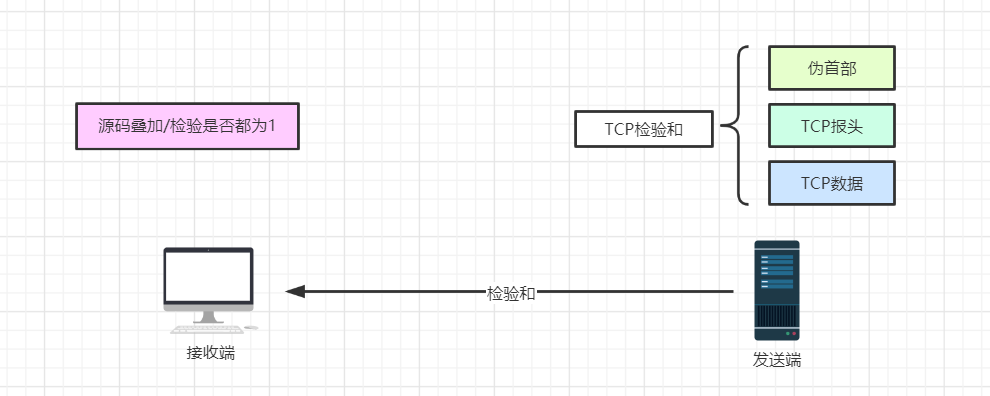
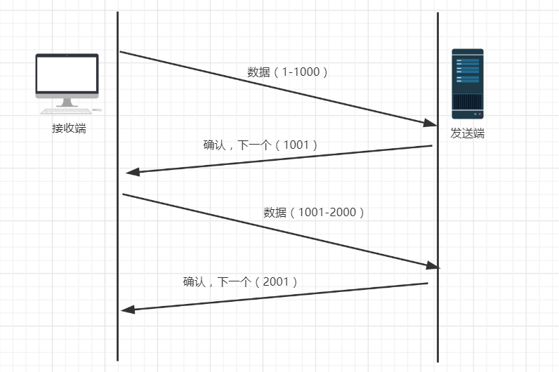
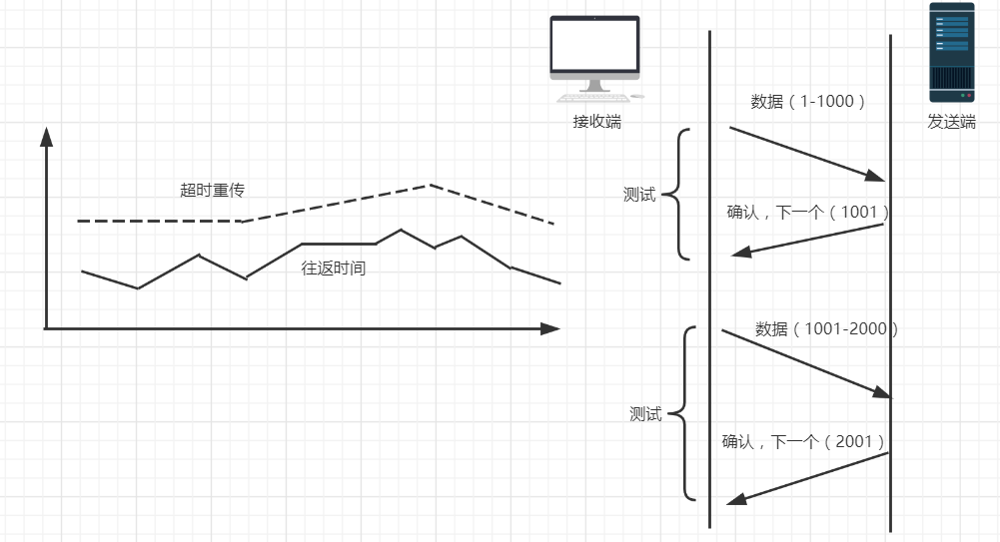
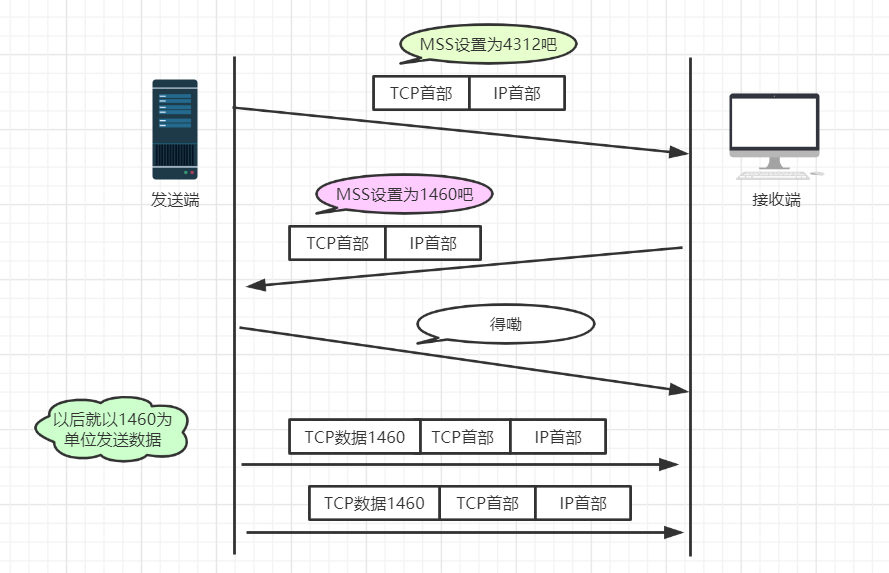
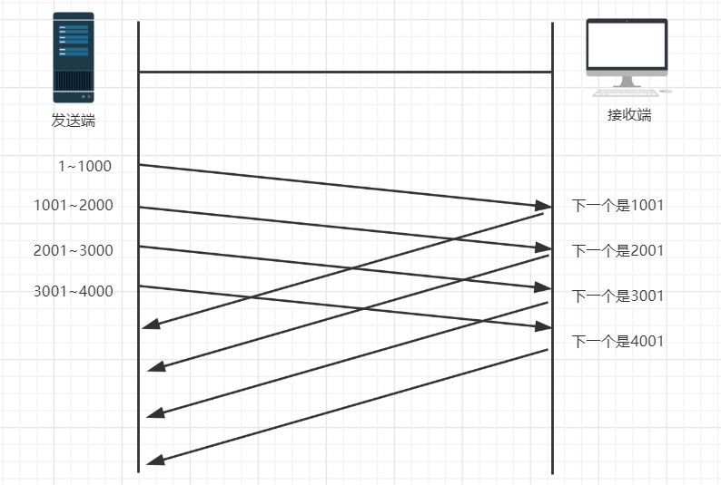
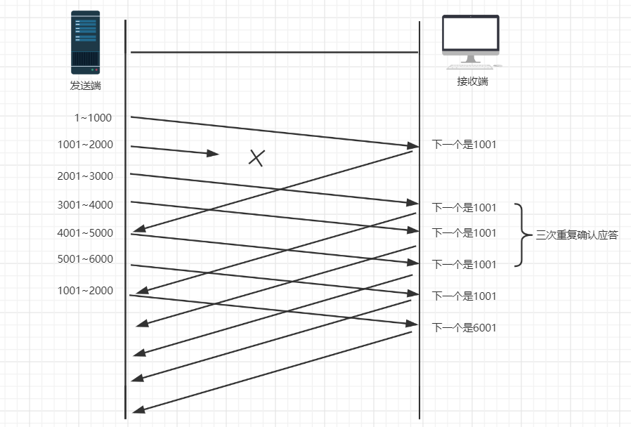
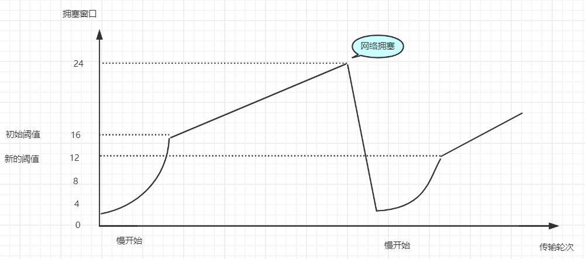

# TCP的可靠性传输是如何保证的

> 系统总结TCP连接中，它是如何保证数据的传输

## 01 前言

------

我们之前介绍过TCP的连接比UDP连接复杂，也比较安全，但是我们想知道它是如何保证这些数据的安全的？数据的发送先后有什么秘诀呢？接下来我就一一去总结这些细节性的问题。

## 02 保证数据安全的方法

------

TCP主要提供了检验和、序列号/确认应答、超时重传、最大消息长度、滑动窗口控制等方法实现了可靠性传输。

##### **检验和**

通过检验和的方式，接收端可以检测出来数据是否有差错和异常，假如有差错就会直接丢弃TCP段，重新发送。TCP在计算检验和时，会在TCP首部加上一个12字节的伪首部。检验和总共计算3部分：TCP首部、TCP数据、TCP伪首部

##### **序列号/确认应答**

这个机制类似于问答的形式。比如在课堂上老师会问你“明白了吗？”，假如你没有隔一段时间没有回应或者你说不明白，那么老师就会重新讲一遍。其实计算机的确认应答机制也是一样的，发送端发送信息给接收端，接收端会回应一个包，这个包就是应答包。

上述过程中，只要发送端有一个包传输，接收端没有回应确认包（ACK包），都会重发。或者接收端的应答包，发送端没有收到也会重发数据。这就可以保证数据的完整性。

##### **超时重传**

超时重传是指发送出去的数据包到接收到确认包之间的时间，如果超过了这个时间会被认为是丢包了，需要重传。那么我们该如何确认这个时间值呢？

我们知道，一来一回的时间总是差不多的，都会有一个类似于平均值的概念。比如发送一个包到接收端收到这个包一共是0.5s，然后接收端回发一个确认包给发送端也要0.5s，这样的两个时间就是RTT（往返时间）。然后可能由于网络原因的问题，时间会有偏差，称为抖动（方差）。

从上面的介绍来看，超时重传的时间大概是比往返时间+抖动值还要稍大的时间。

但是在重发的过程中，假如一个包经过多次的重发也没有收到对端的确认包，那么就会认为接收端异常，强制关闭连接。并且通知应用通信异常强行终止。

##### **最大消息长度**

在建立TCP连接的时候，双方约定一个最大的长度（MSS）作为发送的单位，重传的时候也是以这个单位来进行重传。理想的情况下是该长度的数据刚好不被网络层分块。

##### **滑动窗口控制**

我们上面提到的超时重传的机制存在效率低下的问题，发送一个包到发送下一个包要经过一段时间才可以。所以我们就想着能不能不用等待确认包就发送下一个数据包呢？这就提出了一个滑动窗口的概念。

窗口的大小就是在无需等待确认包的情况下，发送端还能发送的最大数据量。这个机制的实现就是使用了大量的缓冲区，通过对多个段进行确认应答的功能。通过下一次的确认包可以判断接收端是否已经接收到了数据，如果已经接收了就从缓冲区里面删除数据。

在窗口之外的数据就是还未发送的和对端已经收到的数据。那么发送端是怎么样判断接收端有没有接收到数据呢？或者怎么知道需要重发的数据有哪些呢？通过下面这个图就知道了。

如上图，接收端在没有收到自己所期望的序列号数据之前，会对之前的数据进行重复确认。发送端在收到某个应答包之后，又连续3次收到同样的应答包，则数据已经丢失了，需要重发。

##### **拥塞控制**

窗口控制解决了 两台主机之间因传送速率而可能引起的丢包问题，在一方面保证了TCP数据传送的可靠性。然而如果网络非常拥堵，此时再发送数据就会加重网络负担，那么发送的数据段很可能超过了最大生存时间也没有到达接收方，就会产生丢包问题。为此TCP引入慢启动机制，先发出少量数据，就像探路一样，先摸清当前的网络拥堵状态后，再决定按照多大的速度传送数据。

此处引入一个拥塞窗口：

发送开始时定义拥塞窗口大小为1；每次收到一个ACK应答，拥塞窗口加1；而在每次发送数据时，发送窗口取拥塞窗口与接送段接收窗口最小者。

慢启动：在启动初期以指数增长方式增长；设置一个慢启动的阈值，当以指数增长达到阈值时就停止指数增长，按照线性增长方式增加至拥塞窗口；线性增长达到网络拥塞时立即把拥塞窗口置回1，进行新一轮的“慢启动”，同时新一轮的阈值变为原来的一半。

## 03 小结

------

其实上面所说的知识在学校也学过，但是重来不会认真对待这些看似没有用的知识，所以现在就好好总结一下了。对于网络优化的部分可以参照上面的方法来进行优化，可以利用这些方法提供高速、可靠的通信服务。

**参考文章**

- 图解TCP/IP
- TCP是如何保证数据的传输

