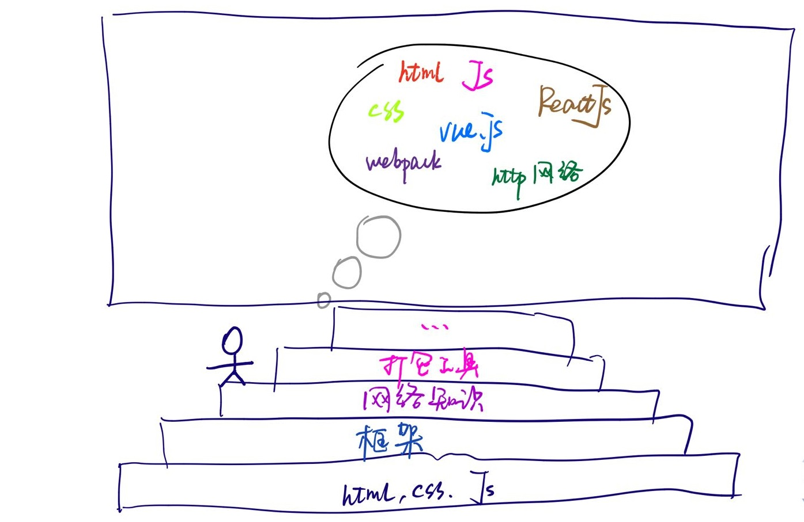
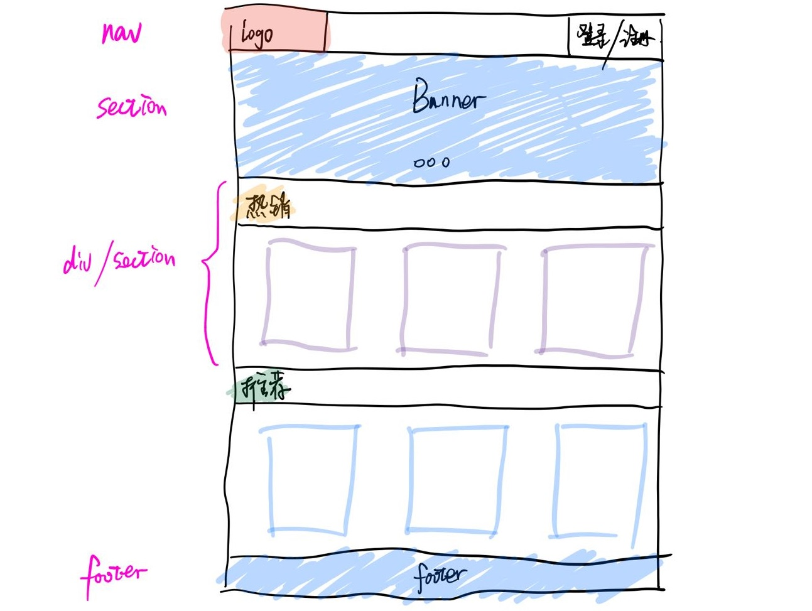
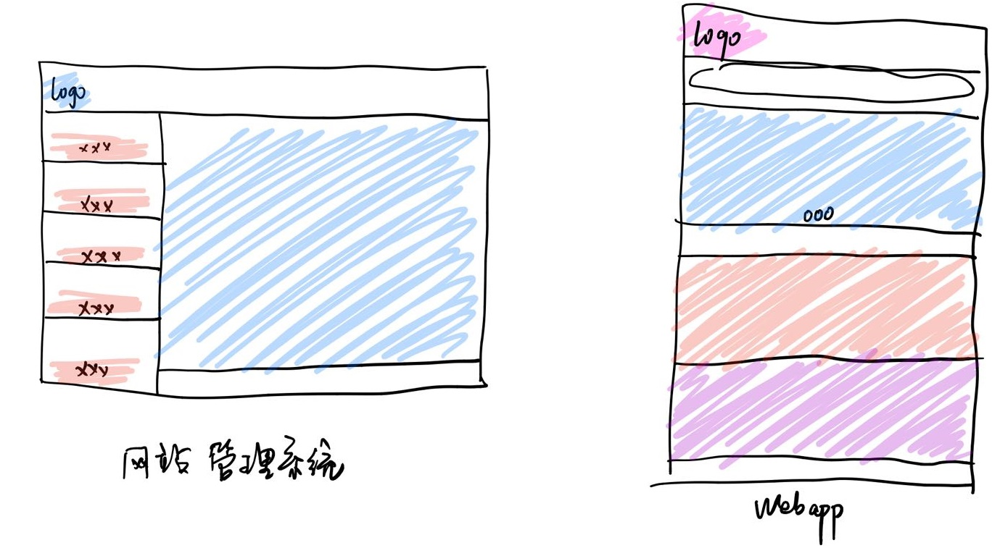
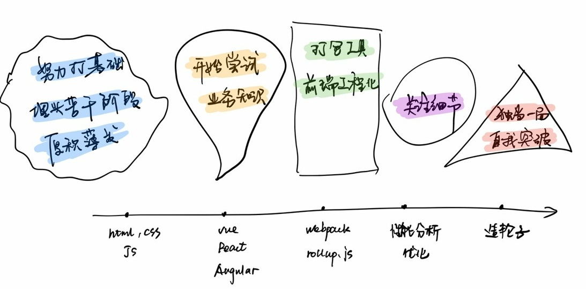
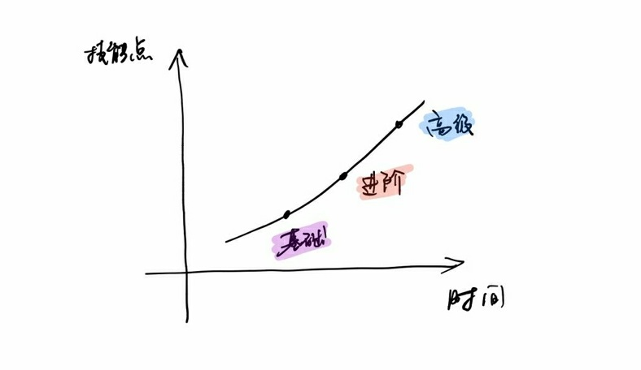
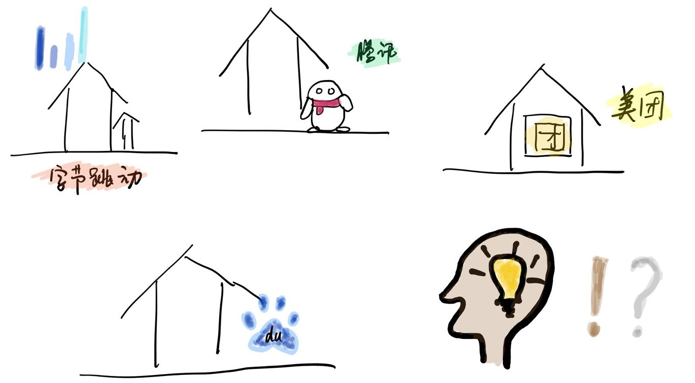

> 没有一种技术是学不会的，10小时可以入门一门新技术，10000小时可以成为一个领域的专家。

## 01 前言

互联网在当今的世界显得异常火爆，每一个人都尝试挤破头脑去学习、去进入这一行业。作为一个前端从零开始学习的过来人，下面我的会详细说一下当初是怎么过来的，希望大家都会从我的这一段经历找到自己的出发点。如果大家对前端是没有一点概念的话，其实这只是一个方向的技术。比如我们看到华丽的网站，打开的一个微信小程序，还有打开的APP，其实都是前端方向的内容。

这时候大家有可能会问了，这么多的技术我们都要去学会吗？其实不然，现在基本上你能够掌握其中的一种技术，你就可以找到一份很好的工作，把每一项的技术都精通的人其实是很少的。

## 02 爬坡阶段

##### **青铜阶段**

我们从最基本的前端基础知识开始讲起，这里也是我们最初的出发点。在这个过程当中呢，你会觉得前端的世界是那么的小，做什么事情都是的得心应手的，一度沉浸在自己的世界里不能自拔。你自己想走出去，但是又害怕外面的世界，所以你可能会在这里徘徊一段时间，等你觉得自己可以有信心打怪升级的时候自然会攀越过去。

我自己也是从html和css这两个基本的知识出发，经过编写一些静态的网页能在本地打开运行，能够看到自己的成果。其实这个过程我甚至不知道网页需要部署在服务器上面，也不知道那些所谓的动画和交互是什么出现的。总之你不会太过关注自己的不懂得知识，反而会默默欣赏自己的作品。

其实在这个阶段你也可以找一些网页模板看一下，主要就是学习一些结构方面的知识。也就是说你要知道在哪里放div，在哪里写p或者h1标签，就可以了。结构搭建好了之后你就可以关注一下css这些属性有什么用，到底这一块的红色是哪里来的，这里的蓝色背景哪里设置的。

这里可以推荐大家去看：

- 菜鸟教程
- w3c school
- 拿别人的页面研究（静态）

##### **白银阶段**

在前一个阶段里面，你已经学会了如何去制作一个简单/复杂的静态网页，但是都是一些写死的内容。所以在这个阶段里面你就大可以学习动画的制作，有了JavaScript这门脚本语言，简直就是如虎添翼。我在个阶段的时候，很关心页面是怎么动起来的，只是用到一个定时器的函数，仅此而已。

假如现在，大家一定不会去写这些函数来使页面动起来，有很多现成的组件或者框架等。可能前两年大家不是很关心这些东西，但是现在各种框架层出不穷，我们已经不会去关心底层的原理实现了，只关心开箱即用。

这里推荐大家去看：

- JavaScript入门经典（书）
- JavaScript高级程序设计（第三版）（这本书是有难度的，适合各个阶段的人学习）

##### **黄金阶段**

当你掌握了前端的”三件套“，我们就应该可以做点东西出来了，是时候检验自己的学习成果的时候了。但是你先别急，在这个阶段里面有很多可以让你头疼的东西，根本的原因是——你前面两个阶段没有学好。

没错，在这个阶段里面，你主要的任务就是去选择一门比较热门的框架来学习，然后了解这一门框架的周边生态，上手的难度如何，还有是否迎合当前的公司环境。其实现在看来你大可放心去学习vue/react/angular这三大框架，因为很多大公司都基本会使用这些技术。而且基本上都要你掌握其中一门技术。

这里大家可以选择上手难度比较小的vue框架，这个框架一直在维护，现在已经准备要发布3.0版本了，大家又要准备好好去学习了。除此，vue的周边生态非常好，全球都有人使用，官网的文档丰富全面，你可以在上面找到你想要的知识。也正是由于这个原因，基于vue的框架也出了很多，都是支持vue的语法的。比较好的有uniapp，可以变成多种终端，它的目标就是打造多端统一的框架。

你可以使用vue的模板轻松配置出好看的、可以使用的后台管理系统模板以及一些webapp。

这里推荐大家去看：

- 框架的官网
- vue.js实战（书）
- 深入浅出vue.js（书）
- github关于vue的项目

##### **钻石阶段**

当年很庆幸自己已经熬过去了，你以为人生终于走上了巅峰。但是你错了，你的前端人生才刚刚开始，前面所做的各种事情只不过是为了现在能够正式开始而已。这也是为什么很多小伙伴都会觉得前端的水很深，以至于后面越学越怀疑人生，不懂为什么要这样对自己，直接告诉我前端水深就好了不行吗？但是我想说的是，既然路是自己选的，那么就开心地走下去，你会感激的。

在经过前面的阶段后，你已经可以找到一份可以实习的工作了。你可以自己去锻炼一下你之前所学的内容，看是否与自己所学的有出入。但是如果你是去到一个小公司实习，里面的东西也可能不是你自己学的，因为每一个公司都有自己内部的框架，你有可能需要重新学习。所以去之前一定要了解一下公司用的技术栈是什么？

这个阶段一般你要学习前端打包工具，比如webpack的使用，以及前端工程化的内容，代码合并、代码分割、单元测试、性能优化、自动构建、部署上线等内容。这里面也是有很大的学问，思想不是一时能够学会的，必须经过很长一段时间的积累才可以有所领悟。而且这些东西理论学习的作用是不大的，必须亲自体验才会领悟精髓。

这里推荐大家去看：

- 深入浅出webpack（书）
- 前段工程化（书）

这里小结一下：

能够到达这个阶段是很不容易的，起码要半年左右一直在学习实践，这也是为什么很多的培训机构都会有4~6个月的培训期，但是我可以告诉你们的是培训教会你的只是业务的知识，教你怎么去开发页面而已。如果你想自己学习一定要学习它的理论原理知识，这才是有用的，也是你通过面试的关键部分。总的来说，就好像这下面的图一样，你以为终于出头了，但是仅仅是开始......

##### **王者阶段**

一般来说，当你到达这个阶段的时候，人生就可以熬出头了，如无意外你将可以独立带领一个小团队开发产品，负责某一个生产线的项目，也就是leader级别的人物了，而且很多面试都是你来负责的。

但是这个阶段只有很少一部分人可以到达，有人可能到了上一个阶段就放弃了转而继承家产也不一定。由于没有到达这个阶段，我也不知道该怎么去说，也不知道推荐什么。当我有能力的时候，在来与大家详谈吧，话题保留。

## 03 面试基础

这一部分也是一直贯穿在整个学习的过程当中的，因为你最终还是要进入一家公司工作。但是你要明白只有通过面试才能进去，否则即使你有很强的技术，但是你没有通过面试也是白忙活而已。

这里建议大家一定要多关注一些计算机的基础知识，这些一般在第一轮面试中问的比较多，也是比较基础的。但是我发现很多同学都对这一部分不关注，认为没有必要，将来也不会用到这些很偏的知识。简单一点的就会问你线程与进程的区别，这些就是计算机基础，简单吗？简单。难吗？确实是挺难的。

每一个公司考核的偏重点是不一样的，比如字节跳动比较偏算法方面的知识，每一轮的面试都会叫你手写算法，这样的面试对于不会算法的同学就是找虐的过程。但是比如腾讯公司，他有可能会偏重一部分的知识，比如计算机网络。

无论怎么样，想要通过面试最好的方法就是多看师兄师姐的面经，然后总结一套题库，这样面试自然就不会慌了。但是你要理解里面的原理，还有能够举一反三，靠背答案是不能通过面试的。

这里推荐大家：

- 剑指offer（书）（）面向算法/刷题
- 图解http（书）
- 图解tcp/ip（书）
- 牛客网（看面经）

## 04 小结

具体比较深入的知识我就不细说了，上面只是前端学习比较大体的方向，而且这也是我本人的学习方向，并不代表前端就应该是这样子的过程。但是一般来说大部分同学都会经历这样的一个过程，学习总归是有一个步骤的，很多事情并不是一蹴而就的，相信大家可以根据自己的自身情况，打造出属于自己的学习路线。

能够有自律的习惯就不要去报名培训机构，能够有钱的情况下多买几本书，现在的投资是对未来的负责。       

                                                                                                   