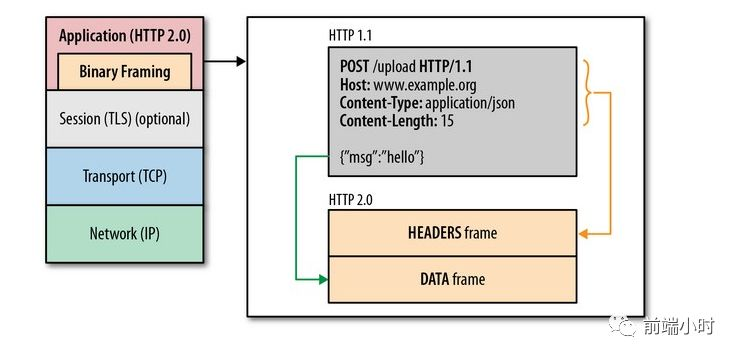
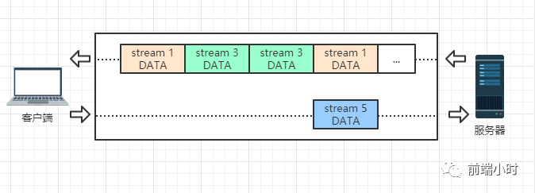
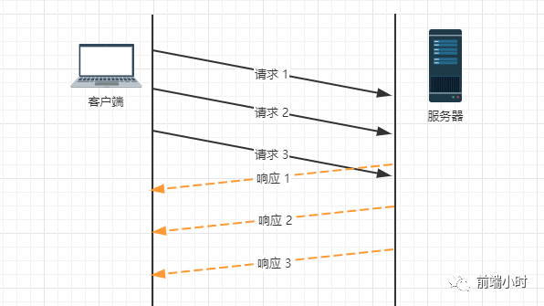
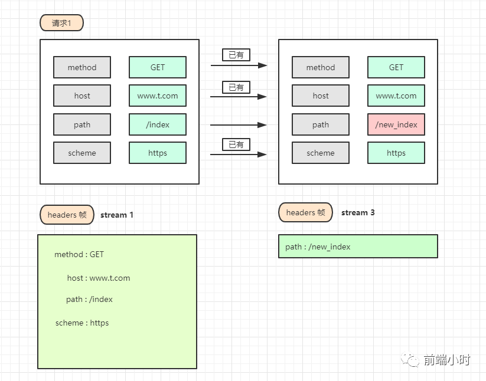

# HTTP 2.0有什么新特性

> "只在此山中，云深不知处"


## 01 前言

今天看了一下腾讯微信的鹅厂卧谈会，主要是介绍校招/社招生如何利用自身的优势，或者如何准备面试的一些问题。我们知道社交的公司一般都会注重一些计算机网络的知识，毕竟涉及到实时传输、通讯等技术。

其中有一句话讲的很准确，校招生是不需要样样精通技术的，你可以选择一个你比较熟悉的领域或者你认真研究过的方向，一旦写上你精通某种技术，我都会问的很深。所以为了你的大好前途，千万不要给自己埋坑。接下来我浅谈一下HTTP的相关内容。


## 02 HTTP 2.0特性

我们知道http是一种超文本传输协议，是客户端与服务端之间的请求和应答的标准，通常会使用TCP协议。HTTP 2.0就是在基础上再一次进行升级，为了解决HTTP 1.0+协议存在的问题，并且提高网络传输性能、优化网络传输过程。那么，到底相比于HTTP 1.0 有什么新的变化呢？


##### **01 二进制分帧**

HTTP 2.0最大的特点：不会改动HTTP 的语义，HTTP 方法、状态码、URI 及首部字段，等等这些核心概念上一如往常，却能致力于突破上一代标准的性能限制，改进传输性能，实现低延迟和高吞吐量。而之所以叫2.0，是在于新增的二进制分帧层。

既然又要保证HTTP的各种动词，方法，首部都不受影响，那就需要在**<font color="#FF7F50">应用层和传输层</font>**之间增加一个二进制分帧层。

在二进制分帧层上，HTTP 2.0 会将所有传输的信息分割为更小的消息和帧,并对它们采用二进制格式的编码 ，其中HTTP1.x的首部信息会被封装到Headers帧，而我们的request body则封装到Data帧里面。



当我们建立连接的时候，就可以承载任意数量的双向数据流，每一个数据流都以消息的形式发送，消息有一个或多个帧组成，可乱序发送。每个帧首部都会有一个标识位，接收到之后就可以重装。

这样就解决了http 1.0 中一应一答的低效率模式，能够有效地提高传输效率，连接吞吐量更大且内存占用更少。




##### **02 多路复用**

HTTP 1.0的模式是，建立连接请求数据完毕之后就立即关闭连接；后来采用了keep-alive保活模式使得可以复用连接不断开，可以利用这次连接继续请求数据。但是始终会有一个缺点，就是你必须等待服务器返回上一次的请求数据你才可以进行下一次的请求。

万一我们遇到有一个请求很久都不返回数据，那后面的请求只能继续等待。如何解决这个问题呢？HTTP 2.0就提出了多路复用的技术，就是你可以连续发送多个请求，可以不用收到回复就继续发送请求。



多路复用的优点：

- **并行交错发送请求，请求之间互不影响**
- **TCP连接一旦建立可以并行发送请求**
- **消除不必要延迟，减少页面加载时间**
- **可以最大程度利用HTTP 1.x**


##### **03 首部压缩**

HTTP 1.x首部是没有压缩的，Gzip只会对请求体进行压缩，现在HTTP 2.0 提供了首部压缩方案。现在SPDY和HTTP 2.0都支持首部压缩，前者使用的是DEFLATE算法，而后者使用专门设计的HPACK算法。




首部压缩可以使得头部帧可以最大程度复用，减少头部的大小，有利于减少内存和流量。比如我们第一次发送请求，里面包含头部的各种信息；但是后来我们又发送另外的请求，发现大部分的字段是可以复用的，我们只要发送一个当前请求特有的头部帧即可。由于首部表在HTTP 2.0 的连接存续期内始终是有效的，客户端和服务端共同更新。


##### **04 流量控制**

HTTP 2.0 “流” 的流量控制最终的目标是在不改变协议的情况之下允许采用多种流量控制算法。

流量控制特点：

- 流量基于HTTP连接的每一跳进行，非端到端控制
- 流量基于窗口更新帧进行，接收方可广播准备接收字节数甚至对整个连接要接收的字节数
- 流量控制有方向性，接收方可以根据自身情况进行控制窗口大小
- 流量控制可以由接收方禁用，包括个别流和整个连接
- 只有DATA帧服从流量控制，其他类型帧不会消耗控制窗口的空间


##### **05 请求优先级**

客户端可以通过在打开流的HEADERS帧中包含优先次序信息来为一个新流指定优先级。在其它任意时间，可以使用PRIORITY帧来改变流的优先级。每个流都可以带有一个31bit的优先值：<font color="#FF7F50">0表示最高优先级；2的31次方-1表示最低优先级</font>。

客户端明确指定优先级，服务端可以根据这个优先级作为交互数据的依据，比如客户端优先设置为.css>.js>.jpg。服务端按此顺序返回结果更加有利于高效利用底层连接，提高用户体验。然而，在使用请求优先级时应<font color="#FF7F50">注意服务端是否支持请求优先级</font>，是否会引起队首阻塞问题，比如高优先级的慢响应请求会阻塞其他资源的交互。

服务器可以根据流的优先级控制资源分配（CPU、内存、宽带），而在响应数据准备好之后，优先将最高优先级的帧发送给客户端。浏览器可以在发现资源时立即分派请求，指定每个流的优先级，让服务器决定最优的响应次序。这样请求就不用排队了，既节省了时间，又最大限度的利用了每个连接。


##### **06 服务器推送**

一般HTTP请求都是由客户端发起，服务器收到请求进行返回。但是HTTP 2.0 可以使**<font color="#FF7F50">服务器主动返回资源</font>**给客户端用户。比如前端请求 /index.html 资源，但服务器把 /index.css ， index.png 都返回了。这样就可以提高了性能。


服务器推送工作过程：

- PUSH_PROMISE帧是服务端有意向客户端推送资源
- PUSH_PROMISE帧只包含预推送资源的首部。如果客户端对此帧没有意见，服务端就会发送DATA帧响应。假如客户端缓存了可以拒绝推送。
- 服务器遵守同源策略，不会随意推送第三方资源。

那么服务器怎么知道要给客户端推送什么资源呢？

```Bash

location / {
      root   /usr/share/nginx/html;
      index  index.html index.htm;
      http2_push /style.css;
      http2_push /example.png;
 }
```

这是Nginx的实现方法，意思是当用户请求 / 路径时返回style.css和example.png文件。服务器推送可以减轻数据传送冗余步骤，加快页面响应速度，提升了用户体验。


## 03 小结

总的来说，HTTP 2.0 给我们带了很多新的特性，简单总结一下：

- 二进制分帧
- 多路复用
- 首部压缩
- 流量控制
- 请求优先级
- 服务器推送

如今网络已经成为了人们不可分离的一部分，如何把现有的网络资源来尽可能利用是提升网络性能的一个关键部分，把网络优化好了，不仅可以节约大量的服务器资源和用户流量。


<font color="#32CD32">参考文章</font>

- 一篇文章让你入门HTTP 2.0
- HTTP 2.0 的时代来了
- 阮一峰 HTTP/2服务b器推送


