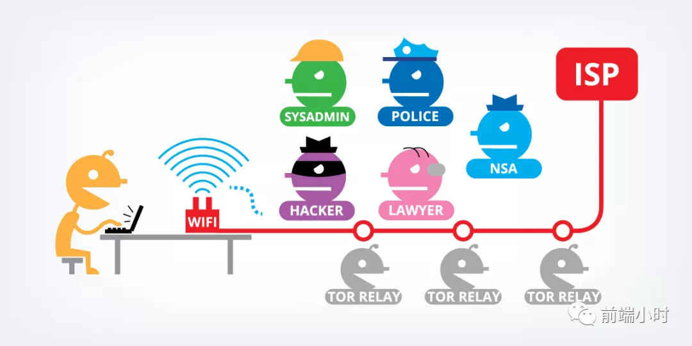
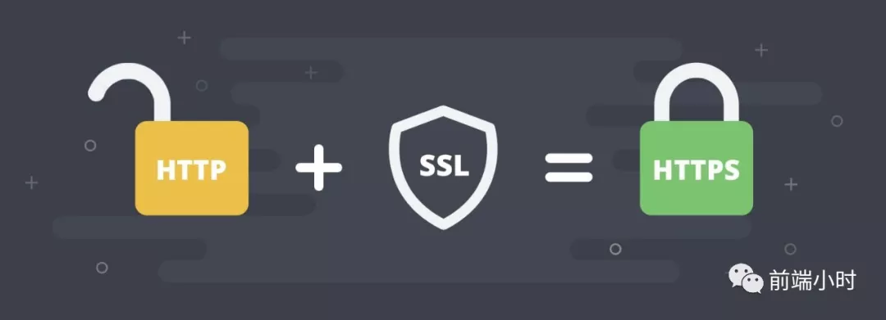
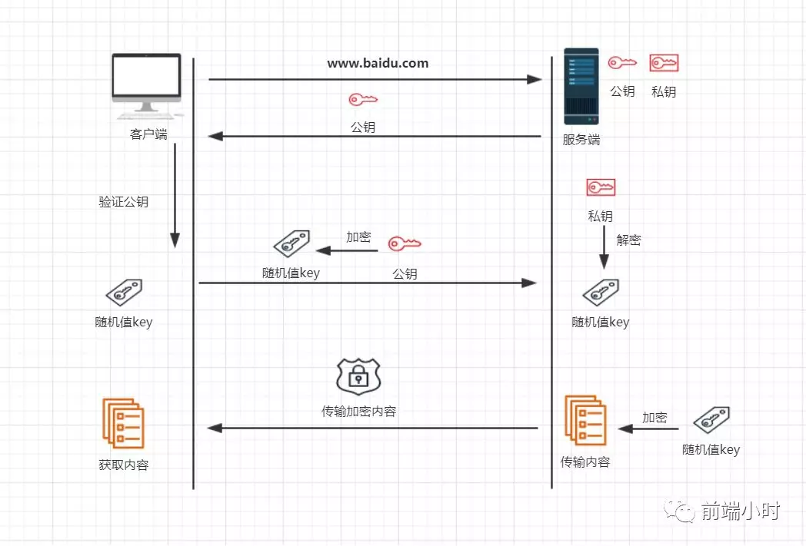

# 面试官：讲一下 https 和 http 的区别

> "时无重至，华不再阳"

## 01 前言

因为http协议传输的数据都是以明文的形式传输的，内容没有经过加密操作，这就造成了传输不安全的情况。如果传输的数据中存在着银行卡，身份证等敏感信息，容易被他人盗取，实施诈骗。

所以人们就想出了一种能够安全传输的协议，https协议。该协议可以在信息传输前进行加密，加密之后接收方需要解密才可以得到信息，否则即使你截获了传输数据也无济于事。

## 02 区别

那么https相比于http有哪些区别呢？是不是一种新的协议呢？其实https只是在http的基础上建立的，我们知道http协议在数据传输之前会进行TCP的三次握手，然后才会传输数据。其实https同样也会进行三次握手操作，只是在应用层和传输层之间添加了SSL/TLS层而已。

首先我们来看一下https是怎么连接的？

1. 首先客户端发起请求到服务端，服务端处理后发送一个公钥给客户端
2. 客户端进行验证公钥，看公钥是否有效和是否过期
3. 客户端验证通过会产生随机值key，然后用公钥进行加密回传给服务端
4. 服务端用私钥解密后获得客户端的随机值key
5. 利用随机值key加密数据后传输给客户端
6. 客户端利用key值进行解密数据
7. 客户端获取真正的数据

通过上图我们就应该了解了https握手阶段，其实上面不仅是SSL握手，还包括建立连接的TCP三次握手。

既然https能够保证安全传输，是不是所有网站都使用https协议呢？

其实现在最关键的就是证书问题，用于证明你的网站是安全的而不是危险的。这就需要第三方信任度高的权威机构来对网站进行证书颁发，就好比给你授权一样。比如国内我们会相信支付宝，所以愿意把钱都存进余额宝一样的道理。

一般来说免费的证书是比较少的，很多都要收费，而且价格不菲。只有那些大型的公司或者安保系数比较高的电商网站等需要使用，一般个人的就不需要了。所以总结一下https的不足之处：

- 证书问题，价格高
- 握手阶段会额外消耗时间
- SEO搜索响应慢
- 加密范围比较有限
- 若权威公司的证书泄露，一样是不安全的

## 03 小结

对于加密的流程，无非就是一个算法的问题，利用算法对随机值进行一个加密的操作，假如你的算法强度高，复杂性也比较高，那么没有解密方法的情况下是很难破解的。

算法这一块就不是我们考虑的范围了，我们只要好好理解这个过程就好了，前端工程师无需深究其中的细节部分。只要你面试的时候能够说出以上的流程，那么就没有问题了。

