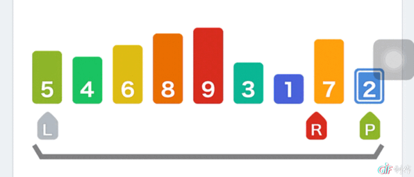
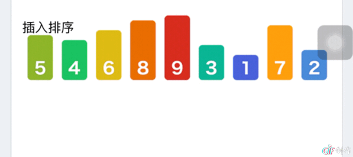
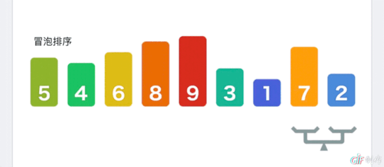
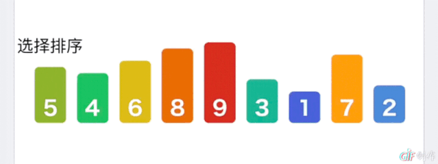
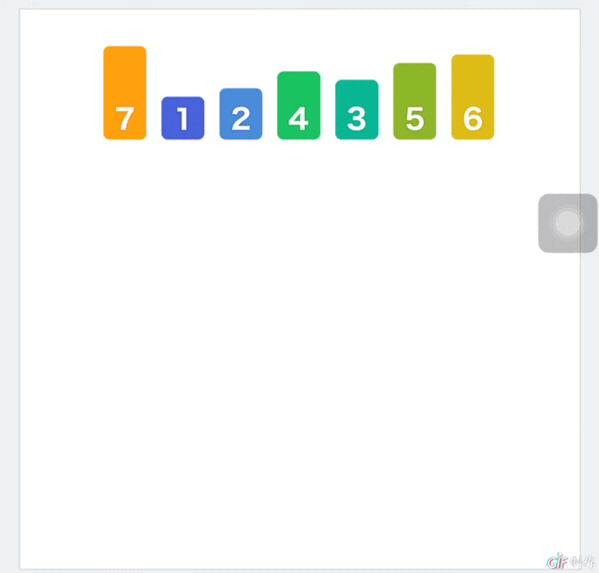
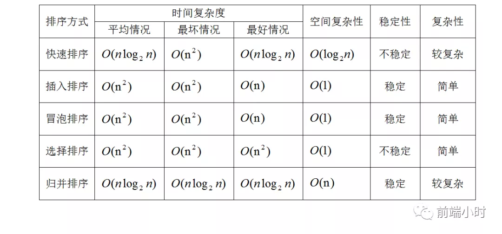

> "失之东隅，收之桑榆"


## 01 前言


前端面试中，手写代码常常会要求你写一些常见的排序算法，虽然不是每次都会遇到手写代码的部分，但是BAT的大厂可能就要你熟悉了。总之多懂一点也不是坏事。接下来我将把几种常见的算法用JavaScript的方法实现。


## 02 算法实现


我们常见的排序算法中，我就列举常考的5种。

- 快速排序
- 插入排序
- 冒泡排序
- 选择排序
- 归并排序

##### **快速排序**

快速排序的基本思想就是分治法的思想，寻找中间点，并对其左右的序列递归进行排序，直到左右都排序完成。

```javascript
function quickSort(arr){
    if(arr.length==0){
        return arr
    }
    var pirotIndex=Math.floor(arr.length/2)
    var pirot = arr.splice(pirotIndex,1)[0]
    var left=[],right=[]
    for(var i=0;i<arr.length;i++){
        if(arr[i]>pirot){
            right.push(arr[i])
        }else{
            left.push(arr[i])
        }
    }
    return quickSort(left).concat(pirot,quickSort(right))
}
console.log(quickSort([2,4,6,1,7,8,4,9,99,6]))
```



##### **插入排序**

将数组分为无序区和有序区两个区，然后不断将无序区的第一个元素按大小顺序插入到有序区中去，最终将所有无序区元素都移动到有序区完成排序

```javascript
function insertionSort(arr) {
    var preIndex, current;
    for (var i = 1; i < arr.length; i++) {
        preIndex = i - 1;
        current = arr[i];
        while(preIndex >= 0 && arr[preIndex] > current) {
            arr[preIndex+1] = arr[preIndex];
            preIndex--;
        }
        arr[preIndex+1] = current;
    }
    return arr;
}
console.log(insertionSort([2,4,6,1,7,8,4,9,99,6]))
```




##### **冒泡排序**

比较相邻的元素。如果第一个比第二个大，就交换他们两个。对每一对相邻元素做同样的工作，从开始第一对到结尾的最后一对。在这一点，最后的元素应该会是最大的数。

```javascript
function bubbleSort(arr){
    if(arr.length==0){
        return arr
    }
    for(var i=0;i<arr.length;i++){
        for(j=0;j<arr.length-1;j++){
            if(arr[j]>arr[j+1]){
                [arr[j],arr[j+1]]=[arr[j+1],arr[j]] //ES6解构
            }
        }
    }
    return arr
}
console.log(bubbleSort([2,4,6,1,7,8,4,9,99,6]))
```




##### **选择排序**

第一次从待排序的数据元素中选出最小（或最大）的一个元素，存放在序列的起始位置，然后再从剩余的未排序元素中寻找到最小（大）元素，然后放到已排序的序列的末尾。以此类推，直到全部待排序的数据元素的个数为零。

```javascript
function selectionSort(arr) {
    if (arr.length == 0) return arr
    var minIndex;
    for (var i = 0; i < arr.length; i++) {
        minIndex = i;
        for (var j = i; j < arr.length; j++) {
            if (arr[j] < arr[minIndex]) {
                minIndex = j
            }
        }
        [arr[i], arr[minIndex]] = [arr[minIndex], arr[i]]
    }
    return arr
}
console.log(selectionSort([2, 4, 6, 1, 7, 8, 4, 9, 99, 6]))
```



##### **归并排序**

基本思想是把数组分半，不断递归排序，最后进行已排序的数字进行合并。

```javascript
function mergeSort(arr) {
    if (arr.length < 2) return arr
    var middle = Math.floor(arr.length / 2)
    var left = arr.slice(0, middle)
    var right = arr.slice(middle)
    return merge(mergeSort(left), mergeSort(right))
}

function merge(left, right) {
    var result = []
    while (left.length && right.length) {

        if (left[0] <= right[0]) {
            result.push(left.shift())
        } else {
            result.push(right.shift())
        }
    }
    while (left.length) {
        result.push(left.shift())
    }
    while (right.length) {
        result.push(right.shift())
    }
    return result
}
console.log(mergeSort([2, 4, 6, 1, 7, 8, 4, 9, 99, 6]))
```




## 03 算法复杂度




## 04 小结


前端的排序算法虽然很少在项目中用到，但是可能用的比较多的是对后端数据进行处理的时候会用到，一般后端返回来的数据都会经过预处理。因为后端处理一般会比前端容易，只要早数据库查询的时候加上排序就好。

但是特殊时候可能就要前端的算法来大展身手啦，所以大家还是理解一下比较好。养兵千日用兵一时，而且面试还会考到的，这也是前端面试和别人拉开距离的地方，不仅考察业务能力，基础能力也是很重视的。


