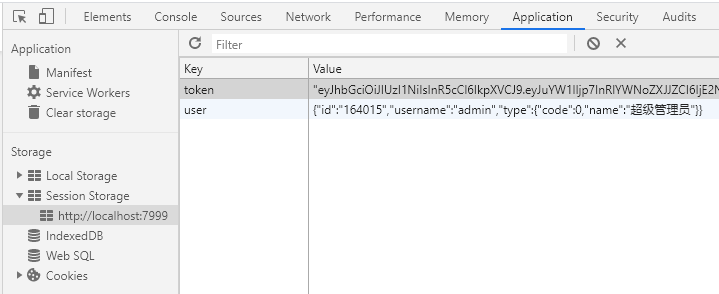

# 如何使用JWT做简单的登录操作

> 注册登录方面的鉴权对于一个网站来说是及其重要的，不仅可以保护你的个人信息，还可以方便后续的操作。


## 01 前言


今天和大家聊一下我们的登录注册流程是怎么样的。我们知道登录方面有很多种情况，比如可以使用账号密码进行登录，可以使用扫码登录，还可以使用第三方的账号登录，其实原理都是大同小异的，无非就是验证你的账号是否合理以及你的登录信息是否有效。

但是本文就是用简单的登录流程给大家说一下其中的奥妙。一般来说我们登录成功之后服务端会返回一个token，大家不要以为这是一个毫无逻辑的字符串，一开始我就是这么认为的。其实token里面就保存了我们账号的信息，只不过经过加密操作而已，我们进行解密之后就可以拿到信息了。


## 02 准备工作

大家可能一开始不知道jwt是什么，简单来说这个就是用户信息的加密版，可以加密你的账号，也可以解密。理解了这个我们就可以使用它来做一点事情了，我们这里使用的是vue+jwt+node+mysql这样一个简单的架构，我们可以在vue页面简单写一下登录的操作，使用node写一个login的接口就可以了。

为了照顾大部分的小伙伴们，我把流程再说详细一点。开始我们肯定要装mysql和jsonwebtoken这两个插件的，为了更加方便之后，我还装了express，目的就是为了使用路由的时候方便操作。

##### **打通数据库**

```javascript
api.js文件
const mysql = require('mysql');
const sqlMap = require('./sqlMap');

//创建链接对象
const pool = mysql.createPool({
    host: 'xx.xx.xxx.xxx',
    user: 'root',
    port: 3306,
    password: 'xxxxxx',
    database: 'xxxxxx',
    multipleStatements: true    // 多语句查询
})
//写一个登录接口
module.exports = {
    login(req, res, next) {
      var username = req.query.username;
      var password = req.query.password;
      pool.getConnection((err, connection) => {
        var sql = sqlMap.login; //这里有一个sqlMap对象，用来写sql语句
        connection.query(sql,[username,password] ,(err, result) => {
            res.json(result);
            connection.release();
        })
      })
    },
    //接下来可以写更多的接口
}
```


还有写一个接口的路由，就是你请求这个的时候就会连接数据库和查询数据库

```javascript
router.js文件
const express = require('express');
const router = express.Router();
const api = require('./api'); //这里引入上面的文件

router.get('/login', (req, res, next) => {
  api.login(req, res, next);
});

//最后记得导出
module.exports = router;
```


上面我还有用到一个sqlMap的一个对象，我们单独写一个，就是为了以后方便，而且耦合性更低，容易扩展。

```
var sqlMap = {
    login: 'select * from teacher where teacherName = ? and `password` = ?;',
}
//最后也记得要导出
module.exports = sqlMap;
```

这样我们在文件中引入的时候就可以使用这个对象了，这里面还可以写很多sql的语句查询。

说了这么多，我们肯定要启动服务的，那么我们就简单起一个服务，可以调用我们写的所有接口，这是一个主文件，我们把它命名为index.js文件

```
const routerApi = require('./router');
const path = require('path');
const bodyParser = require('body-parser'); // post 数据解析
const express = require('express');
const app = express();

app.use(bodyParser.json());
// 后端api路由
app.use('/api', routerApi);

// 监听端口
app.listen(3000);
console.log('success listen at port:3000......');
```

这样我们node index.js之后就会监听3000端口了，到此我们的服务启动完毕，数据库部分也就打通了。


##### **前端页面**

这里我们作为讲解，就不用写一些很好看的页面，有两个输入框就可以了，vue有双向数据绑定的功能，这样我们就可以很方便地获取输入框里面的内容，使用账号密码传给后端做sql查询。怎么样，是不是特别简单？

```javascript
form: {
    username: "",
    password: "",
}
```

比如在data下面我们就这样来存储输入框的数据，如果大家可以做一些验证之类的操作，使用elementui组件库，你会发现新的世界。这里就不展开了。

然后再methods里面写一个login方法，用来与后端进行数据交互，这里也是很简单的操作。

```javascript
//在script标签下面引入：
//const jwt = require("jsonwebtoken");
//const secret = "your string"; //自己的密钥

login() {
      this.$axios
        .get("/api/login", {//请求的接口
          params: { username: form.username, password: form.password }//传递参数
        })
        .then(res => {
          if (res.data.length > 0) {//假如返回有数据就使用token加密一下
            const token = jwt.sign(
              {
                name: res.data[0]//这里就是数据库返回的用户相关的信息
              },
              secret,//这是一个密钥，可以使用你喜欢的字符串
              {
                expiresIn: 86400 //秒，到期时间，一天
              }
            );
            this.$store.commit("SET_TOKEN", token);//写入token
            this.$router.replace("home");//跳转到主页
          } else {
            this.$message.error("登录失败");
          }
        });
    }
```

大家可以看到我把token写到了vuex里面以及放到了sessionStorage，就是以一个全局的状态进行管理，比如以后再首页显示你的名字以及以后做权限控制等方面都很实用。以后可以使用this.$store.state.user的形式获取用户信息。



假如大家在哪里需要使用用户数据的时候可以直接解析token，这里我为了方便专门多写了一个字段存放用户名以及身份等信息。这里解析数据我们就使用jwt自带的函数方法就好，token就是你存储在全局的token，secret就是你当初进行加密使用的那个，这样就可以顺利解析出来了。

```javascript
//这里也要引入
//const jwt = require("jsonwebtoken");
//const secret = "your string"; //自己的密钥

jwt.verify(token, secret, function(err, decoded) {
        if (!err) {
          User.id = decoded.name.teacherId;
          User.username = decoded.name.teacherName;
        }
      });
```


## 04 小结


这篇文章我只讲了一些如何使用jwt来进行简单的登录验证操作，适合一些小白同学去尝试一下，毕竟这也是比较常用的npm包之一。网上其实很多教程都有说怎么去使用jwt进行验证，可能大家觉得这么一个简单的知识点有必要将那么复杂吗？其实你不明白小白心里的苦，当初我也是很简单的用法都不会，也是看了很多关于细节方面的实现，最后才有所领悟。

其实我的文章讲解应该是针对一些基础比较薄弱的同学们，我明白他们想做出一个简单的功能但却不知道怎么写的痛苦，挡当初自己也是这么过来的。我认为讲不明白别人的文章，可读性不大，虽然我也不知道能不能讲明白大家。

因为最近在完善毕业设计相关的事情，所以没有什么时间去看书学习，质量可能有所下降，以后一定分享更多的干货给大家。


