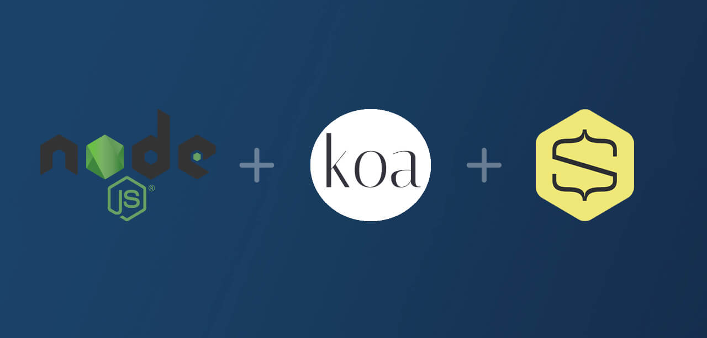
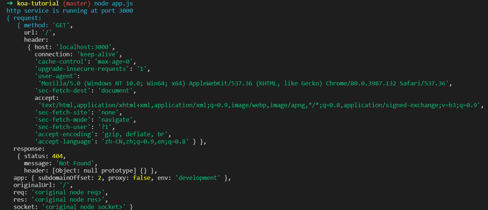
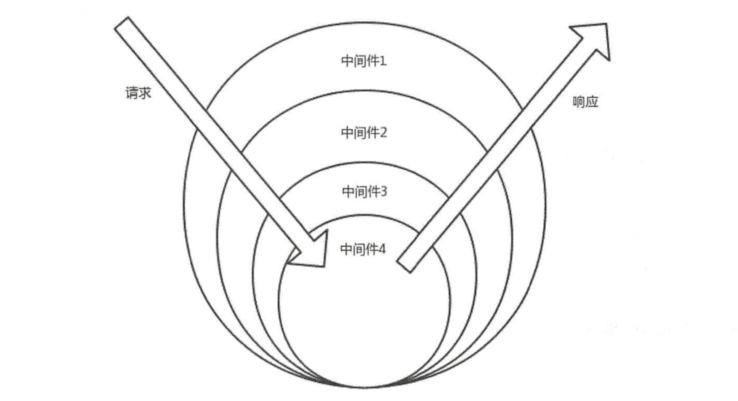
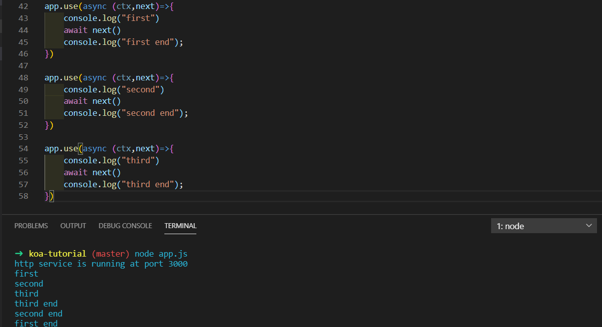

# 入门基于Node的Web框架——Koa

> "Koa是基于Node.js的web框架，由Express原班人马打造，有健壮、轻量的特点"


## 01 前言


之前介绍过Node.js的特点就是基于事件还有回掉函数的，由于这个特点，Node适合于高密度IO的场景。传统的数据操作是直接在数据库上面进行数据的增删改查，是精确到数据源本身，这种情况有可能导致性能问题。因为当遇到高并发的场景，数据库可能查询不过来而且还有锁的存在来防止数据冲突。

但是Node是基于事件与回调函数的，Node可以对应用的操作以事件的队列形式，每一次事件都准确记录下来，依次执行。这种方法不会对数据的直接操作，也不会数据产生冲突。




## 02 Koa介绍


##### **安装**

首先我们在本地新建一个文件夹用来存放项目的代码。然后再文件夹里面新建app.js文件，这里我们简单地在app.js文件里面写上：

```javascript
const koa = require('koa');
const app = new koa()
app.listen(3000, () => {
    console.log("http service is running at port 3000");
})

app.use(async (ctx,next)=>{
    ctx.body = '<h1>Hello Koa!</h1>'
})
```

然后安装koa，只需要一句命令即可。在终端输入：

```bash
npm i koa
```

我们在运行app.js文件之后，输出上面的那句话就证明我们成功创建了一个http服务器，当你打开localhost:3000你就会看到hello koa了。怎么样，是不是非常简单？


##### **context对象**

大家可以看到上面app.use函数使用了一个ctx的参数，其实就是context对象，这个对象包含了request和response对象的封装。我们可以在控制台打印出来这两个对象到底是什么。



可以看到包含了http请求头和响应头的相关信息。其实这是一个上下文的对象，我们在JavaScript中也知道有上下文的概念，就是一个环境。这里的上下文指的就是某次请求包含用户的环境是什么，包括你的状态、Token或者参数等等，来确定你当前所处的请求环境。

###### **request**

我们再来看一下context里面的request对象有哪些属性，我们把上面的代码改一下：

```javascript
const koa = require('koa');
const app = new koa()
app.listen(3000, () => {
    console.log("http service is running at port 3000");
})

app.use(async (ctx, next) => {
    console.log(ctx);
    ctx.response.body = {
        url:ctx.request.url,
        query:ctx.request.query,
        querystring:ctx.request.querystring
    }
})
```

然后启动代码，在浏览器输入http ://localhost:3000/?search=koa&keyword=context，你就会看到相关的属性和属性值。这样一来，我们就可以轻松获取请求参数和请求地址，在以后的接口编写会很有帮助。

```json
{
    "url": "/?search=koa&keyword=context",
    "query": {
        "search": "koa",
        "keyword": "context"
    },
    "querystring": "search=koa&keyword=context"
}
```


###### **response**

response对象是用于设置一些响应信息给客户端，这些和http请求的响应字段是一样的。比如说可以设置状态码、响应格式等相关信息。

```javascript
app.use(async (ctx)=>{
    ctx.response.status=200
    if(ctx.request.accepts('json')){
        ctx.response.body='<h1>Hello json</h1>'
        ctx.response.type = 'json'
    }else if(ctx.request.accepts('html')){
        ctx.response.type='html'
        ctx.response.body='<h1>Hello html!</h1>'
    }else{
        ctx.response.type='text'
        ctx.response.body = 'hello text!'
    }
})
```


###### **state**

> The recommended namespace for passing information through middleware and to your frontend views.

引用[官网](https://koajs.com/)的一句话，state是一个命名空间，用于通过中间件传递信息和前端视图。比如以下的代码可以把user放在state里面，传递给另一个中间件。

```javascript
ctx.state.user = yield User.find(id);
```


###### **cookies**

ctx.cookies用于获取和设置cookie。

- 设置：

  ```javascript
  ctx.cookies.set(name, value, [options])
  ```

- 获取

  ```javascript
  ctx.cookies.get(name, [options])
  ```

其中options就是一些cookie的相关属性，如设置过期时间、路径等。具体如下：

| key       | value                                |
| --- |  |
| maxAge    | cookie过期时间                       |
| signed    | cookie签名值                         |
| expires   | 过期日期                             |
| path      | 存储路径                             |
| domain    | 域名                                 |
| secure    | 只允许https访问                      |
| httpOnly  | 如果是true，则js无法访问             |
| overwrite | 布尔值，是否允许覆盖以前的同名cookie |


###### **throw**

用于抛出错误，返回错误信息给用户。

```javascript
app.use(async (ctx)=>{
	ctx.throw(500)
})
```


## 03 Koa中间件


中间件其实可以理解成一个执行函数，函数就是实现某一种功能的方法。可能这么说不太明白。举个例子：比如你购买商品，添加购物是要在登录状态的，下单也是要在登录状态的。这里每进行一次操作都应该判断一下用户是否是登录状态，我们可以把判断是否登录状态的函数抽离出来，形成一个中间件，可以在任何地方进行复用。

中间件有两个参数，第一个就是我们上面提到的ctx，还有一个就是next参数，下面就讲一下next参数到底是怎么用的，我们先来了解一下“洋葱模型”。



```javascript
router.post('/new', loginCheck, otherMiddleWare, async function (ctx, next) {
    const body = ctx.request.body
    body.author = ctx.session.username
    const data = await newBlog(body)
    ctx.body = new SuccessModel(data)
})
```

上面这段代码的意思就是新建文章的接口，新建之前就使用了loginCheck（验证是否登录）的中间件，如果还有其他也可以写在otherMiddleWare这里。

所以next的作用就是把中间件的执行权交给下一个中间件，如果没有next的话，otherMiddleWare就不会执行。洋葱模型类似于一种栈的数据结构，遵循先进后出的原则。



我们也可以一次性引入，把中间件都以函数的形式定义，然后使用koa-compose引入，效果一样。

```javascript
const compose = require('koa-compose');//增加

async function middleWare1(ctx,next){
    console.log("first")
    await next()
    console.log("first end");
} 

async function middleWare2(ctx,next){
    console.log("second")
    await next()
    console.log("second end");
}

async function middleWare3(ctx,next){
    console.log("third")
    await next()
    console.log("third end");
}
const all = compose([middleWare1,middleWare2,middleWare3])

app.use(all)
```


## 04 常用中间件


##### **koa-bodyparser**

koa-bodyparser这个中间件可以用于解析post方法传递过来的参数，常用于表单的提交信息获取，以一个JSON对象的形式返回，可以很方便地获取数据。

```javascript
const koa = require('koa')
const app = new koa()
const bodyparser = require('koa-bodyparser')
app.use(bodyparser())
app.use(async (ctx, next) => {
    if (ctx.method === 'GET') {
        ctx.body = `
        <h1>登录</h1>
        <form method="POST" action="/">
        <p>用户名</p><input name="username">
        <p>密码</p><input name="password">
        <button type="submit">提交</button>
    `
    } else if (ctx.method === 'POST') {
        let postData = ctx.request.body
        console.log(postData); //{ username: '123', password: '456' }
    }
})
app.listen(3000)
```


##### **koa-router**

上面介绍next的时候，代码里面有router的出现，这就是koa-router。使用这个方便获取你是使用哪一种方法，相应的逻辑也可以写在这个router里面。使用之前先安装，`npm i koa-router`

```
router.get('/',(ctx, next)=>{
	//
})

router.post('/',(ctx, next)=>{
	//获取json数据
})
```


##### **koa-compose**

上面我们已经介绍了，使用这个中间件可以把所有的中间件一次性引入，能够提高代码的可读性，中间件也可以单独写在一个js文件里面进行引入。这样就可以使页面更加简洁，耦合性更低，符合软件开发的要求。

##### **koa-jwt**

随着网站前后端分离方案的流行，越来越多的网站从Session Base转为使用Token Base，JWT(Json Web Tokens)作为一个开放的标准被很多网站采用，koa-jwt这个中间件使用JWT认证HTTP请求。

##### **koa-compress**

当响应体比较大时，我们一般会启用类似Gzip的压缩技术减少传输内容，koa-compress提供了这样的功能，可根据需要进行灵活的配置。

##### **koa-logger**

koa-logger提供了输出请求日志的功能，包括请求的url、状态码、响应时间、响应体大小等信息，对于调试和跟踪应用程序特别有帮助，koa-bunyan-logger提供了更丰富的功能。

##### **koa-session**

HTTP是无状态协议，为了保持用户状态，我们一般使用Session会话，koa-session提供了这样的功能，既支持将会话信息存储在本地Cookie，也支持存储在如Redis, MongoDB这样的外部存储设备。

##### **mysql**

可以使用mysql中间件更方便地连接数据库，提供了很多数据库相关的操作方法，也可以手动进行配置。而且还有防止数据库注入的预防。


## 05 小结


上面主要介绍了koa的用法以及常用的中间件的作用，koa是一个web框架，依靠强大的中间件可以很方便地实现一些Node.js应用。koa是基于Node的框架，大家学习之前应该先看一下Node的基本语法。

