> 从零开始，手把手教你搭建属于自己的博客


## 01 前言

平时我们写博客都可能会发布在掘金、知乎、简书等平台上面，但是一不小心就可能把你的文章给和谐了，而且还不给你任何理由。所以为了我们能够自己发送文章，不用经过别人的审核，那就更好了。

前几天看到一个开源的博客模板hexo，就想拿过来用一下，没想到效果还不错。所以特此总结一下小白如何搭建自己的博客，再也不用看别人的眼色了。从今天开始呢，我也尝试着使用markdown格式来写博客，记录学习心得等。

其实使用 Hexo 搭建属于自己博客是很简单的事情，这个博客要使用一个托管的仓库，一般作为程序员都应该知道 github 这个网站，所以没有任何理由我们就选择它作为仓库托管。

## 02 准备工作

在搭建博客之前我们应该安装一些环境。

- Node环境
- Git环境
- github账号
- 阿里云域名（非必要）

## 03 安装步骤

- 本地新建一个文件夹，用来存放项目代码
- 安装Hexo
- 与github进行关联
- 推送代码
- 域名关联（非必要）

---

好了，现在开始手把手教你搭建项目。

### 1、Github 部分

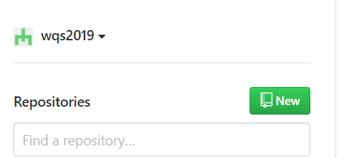

首先我们创建一个项目，点击new进行新建。因为我已经创建了，所以说项目已经存在。这里值得注意的是，项目名的创建一定要按照这种格式，不然会报错（别问我为什么，因为我试过）

> xxx.github.io （其中xxx是你的github账户名）

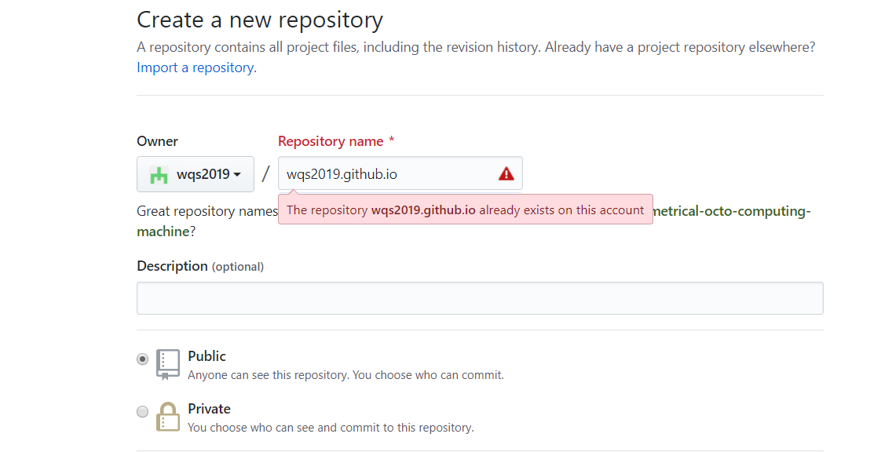

### 2、Git 添加Github 账号

如果你已经安装了git环境的话在桌面右击会出现 Git Bash Here的信息。然后进去就可以添加账号了，代码操作如下。

```Bash
git config --global user.name "你的GitHub用户名"
git config --global user.email "你的GitHub注册邮箱"
```

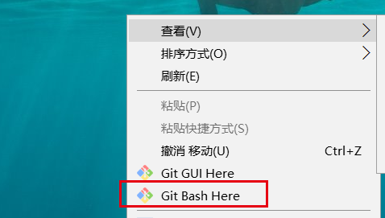


【注意】：这一步很重要，这里要进行ssh密钥的生成以及账号的关联，上面是为了可以利用 Git 进行代码推送到github。

```Bash
ssh-keygen -t rsa -C "你的GitHub注册邮箱"
```

输入之后一路回车，最后它会显示出来放在哪个路径，然后你就可以沿着路径在本地的文件夹里面看到刚刚生成的 id_rsa.pub 密钥。一般都是在C盘里面放着，进去就可以看到密钥了。

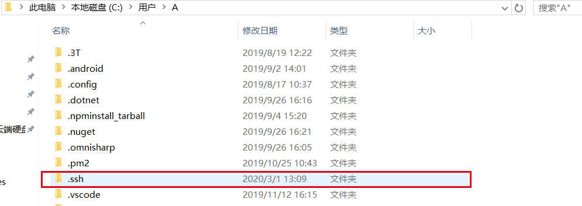

下一步返回你的 GIthub账户，进入设置那里添加一个SSH key，title随意（可取blog_key），然后把本地id_rsa.pub里的内容复制到Key里面来，点击添加即可。

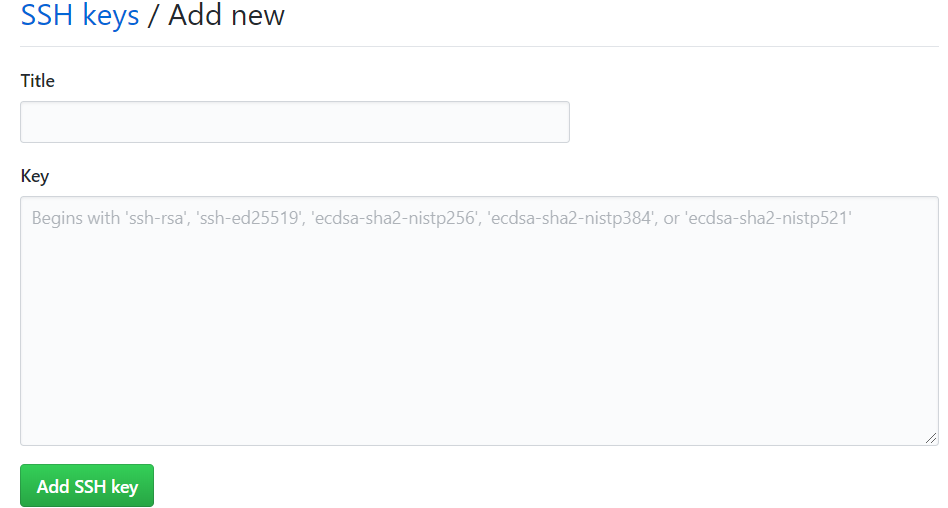


### 3、安装 Hexo

本地新建一个文件夹用来存放代码，可以放在任何位置。然后在这个文件夹下面运行cmd命令打开命令行。输入以下代码开始安装。

```Bash
npm install -g hexo-cli 
hexo init blog
```

上面已经创建完成了，下面你可以使用Hexo添加文章测试一下是否已经创建成功。

```Bash
hexo new test_my_site
hexo g
hexo s
```

如果没有意外的话你就可以成功创建属于你自己的博客了，在本地打开你的博客代码，我们可以在 _config.yml配置一下你的信息。配置如下，一定不能有错（注意冒号之后有一个空格，否则也会报错）。repo的地址就写你自己的地址，格式也要正确（<font color="#dd0000">账户名/项目名</font>）

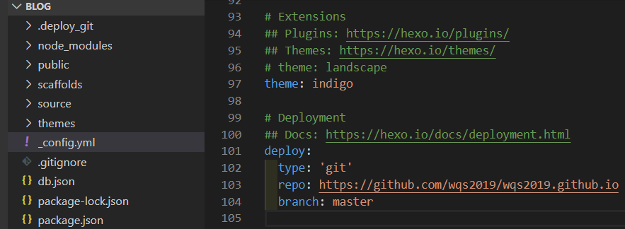

设置完成之后保存，我们就把项目推送到 Github仓库，这样别人就可以进行访问了。步骤也依次执行以下代码即可。

```Bash
npm install hexo-deployer-git --save

hexo clean  //清除缓存
hexo g      //生成文件
hexo d      //部署
```

到此为止，你已经成功新建你的博客，然后别人也可以进行访问了。但是我在整个过程当中也踩了不少的坑，使得最后才完美地运行自己的博客。我先讲一下如何更换博客主题，最后我再讲一下如何避免踩坑。

### 4、更换主题

我们可以去Hexo的[主题官方网站](https://hexo.io/themes/)下载你喜欢的主题文件，然后导入你的博客里面。直接把整一个文件夹都放在themes里面就好，然后在配置文件 _config.yml 里面的 theme 字段里面换成你的主题即可。然后重新进行部署。值得注意的是可能你的浏览器有缓存的原因，界面不会立马显示出来，你可以清除一下缓存或者换一个浏览器试一下，应该是没问题的。

```Bash
hexo clean  //清除缓存
hexo g      //生成文件
hexo d      //部署
```

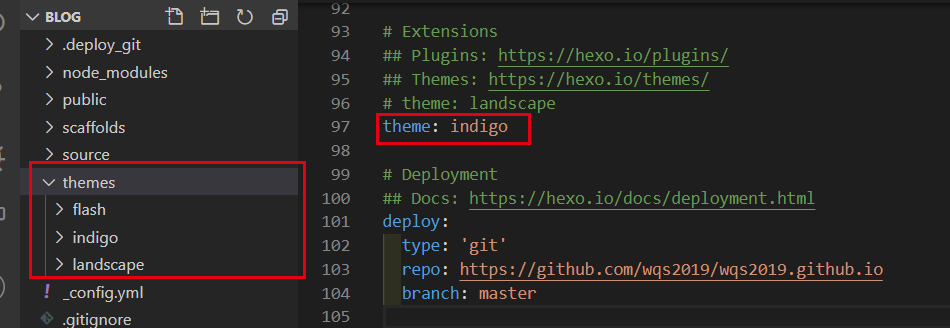


### 5、新建文章

博客新建好了之后我们就可以进行文章的新建和发布，新建文章可以运行下面的命令。

```Bash
hexo n "文章名字"
```

然后你就可以在你的目录 source 目录下面的 _posts 文件夹下面看到你新建的文章，然后你就可以使用markdown格式进行你的文章编写了。你可以在 tags 写上文章的便签，categories 写上文章的分类。编写完成之后你就可以进行文章的发布，发布同样也是运行上面那三条命令。

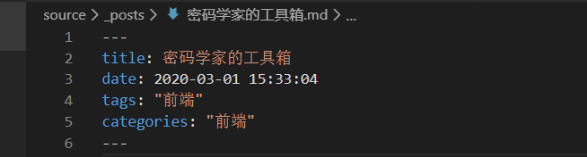


### ６、绑定你的域名

如果你已经有申请去了域名，那么你就可以进入你的域名，点击解析。然后进去添加记录。

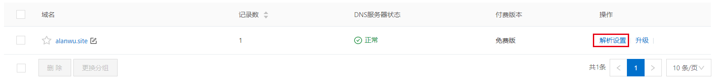

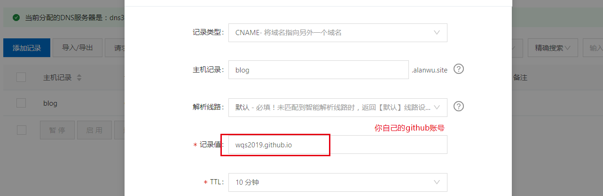


完成之后回到你的博客，在source目录之下新建CNAME文件，内容为你刚解析的域名 （blog.你的域名/如 blog.alanwu.site）保存成所有文件不是txt文本文件。

最后执行命令重新部署。

```Bash
hexo clean  //清除缓存
hexo g      //生成文件
hexo d      //部署
```

### ７、踩坑记录

通过这次的搭建博客，遇到了很多坑，但好在互联网时代比较好解决哈哈~~

<font color="#FF7F50" size=４>1. 搭建完成后发现 标签和分类跳转为 404</font>

我们可以在github的 issues 里面找到答案，主要是因为配置错误或者缺少文件。

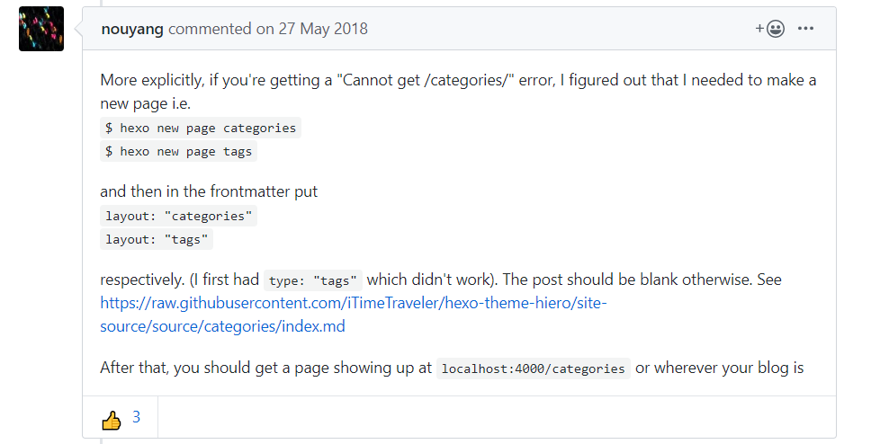


<font color="#FF7F50" size=４>2. 出现左侧栏目的 icon 缺失的情况</font>

一开始可能你不知道是什么问题，看了文档之后才发现原来是你的 icon没有写正确，它是基于font－awesome里面的图标库，你只要把图标写正确就好。

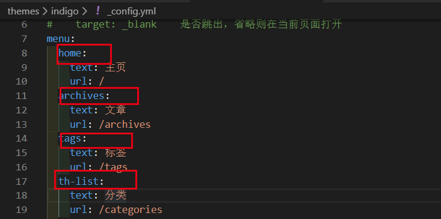


### 8、小结

到现在你应该知道了怎么去新建属于你自己的博客了，大家可以看一下效果，这是我部署完的博客（[blog.alanwu.site](http://blog.alanwu.site/)），现在还没有什么内容。自己搭建一个博客折腾了两天的时间，但是还好，希望大家通过这篇文章你们自己也可以新建属于你自己的博客空间。


