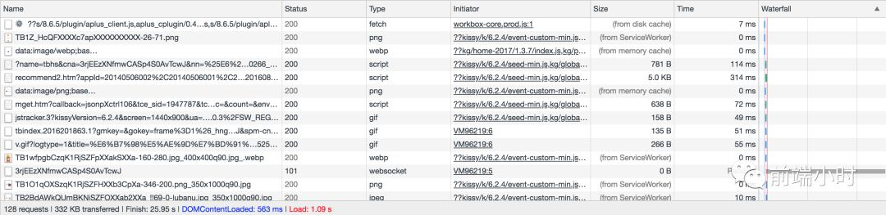
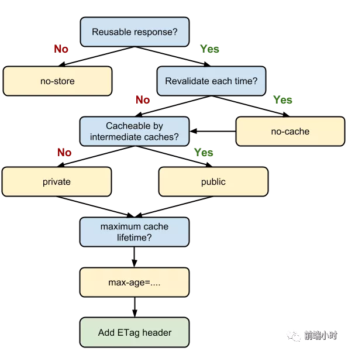

# 系统总结浏览器缓存

> "激情过后，总要回归平静的生活"


## 01 前言


前端的工作与各大浏览器的关系紧密相连，尤其是对于性能这一块的联系及其重要。在用户体验上来看，一个请求的时间超过3秒，那么就会失去这个用户，所以利用缓存来提升性能以及用户体验都是很重要的。

前端对于任一个网络请求来说，可以将请求分为三个阶段。网络请求，后端处理，浏览器响应。缓存可以优化我们的第一步和第三步，一个网络请求做到性能最优，就必须提升三者各自的性能，避免短板效应。

接下来我会从缓存位置，缓存策略来结合具体场景分析浏览器缓存机制。


## 02 缓存位置


> 通过网络获取内容既速度缓慢又开销巨大。较大的响应需要在客户端与服务器之间进行多次往返通信，这会延迟浏览器获得和处理内容的时间，还会增加访问者的流量费用。因此，缓存并重复利用之前获取的资源的能力成为性能优化的一个关键方面。 ——谷歌官方

浏览器缓存并非是一个“总体”概念，其实它也是有先后顺序的。总的来说分为以下4个方面。

1. Memory Cache
2. Service Worker Cache
3. Disk Cache
4. Push Cache



从这张图中我们可以清楚地看到浏览器缓存的具体位置，其中的网络请求都会有不同位置的缓存。考虑到HTTP缓存是最主要、最有代表性的缓存策略，也是每一位前端工程师都应该深刻理解并掌握的知识。

##### **Memory Cache**

Memory Cacha是指内存中的缓存。它是浏览器优先去命中的一种缓存，也是响应速度最快的一种缓存。但是它的缺点是缓存时间短，关闭tab页面缓存将不复存在，它与浏览器渲染进程紧密联系。

那么哪一些文件会被放到这一缓存里面呢？其实这没有官方的说明，由于浏览器的内存非常有限，浏览器并不会把所有文件都缓存在此处。一般来说会缓存一些体积不大的js或者css文件。

##### **Service Worker Cache**

Service Worker 是一种独立于主线程之外的javascript线程。它脱离于浏览器窗体，因此无法直接访问DOM元素。所以这一个独立的线程能够在不干扰主线程的情况下来提升性能。Service Worker 的缓存与浏览器内建的其他缓存机制不一样，它可以让我们自由缓存哪一些文件、如何匹配缓存等，且缓存具有持续性。

实现该缓存一般分为3个步骤：首先注册Service Worker ，然后监听install事件就可以缓存我们想要的文件。用户下次访问可以通过拦截请求的方式来获取缓存数据。若没有则会重新获取数据，然后再进行缓存。

Service Worker 可以用来实现离线缓存、消息推送以及网络代理等功能。那我们如何使用这种缓存呢？

注册：

```javascript
window.navigator.serviceWorker.register('/test.js').then(
   function () {
      console.log('注册成功')
   }).catch(err => {
      console.error("注册失败")
   })
})
```

监听事件：

```javascript

// Service Worker会监听 install事件，我们在其对应的回调里可以实现初始化的逻辑  
self.addEventListener('install', event => {
  event.waitUntil(
    // 考虑到缓存也需要更新，open内传入的参数为缓存的版本号
    caches.open('test-v1').then(cache => {
      return cache.addAll([
        // 此处传入指定的需缓存的文件名
        '/test.html',
        '/test.css',
        '/test.js'
      ])
    })
  )
})

// Service Worker会监听所有的网络请求，网络请求的产生触发的是fetch事件，我们可以在其对应的监听函数中实现对请求的拦截，进而判断是否有对应到该请求的缓存，实现从Service Worker中取到缓存的目的
self.addEventListener('fetch', event => {
  event.respondWith(
    // 尝试匹配该请求对应的缓存值
    caches.match(event.request).then(res => {
      // 如果匹配到了，调用Server Worker缓存
      if (res) {
        return res;
      }
      // 如果没匹配到，向服务端发起这个资源请求
      return fetch(event.request).then(response => {
        if (!response || response.status !== 200) {
          return response;
        }
        // 请求成功的话，将请求缓存起来。
        caches.open('test-v1').then(function(cache) {
          cache.put(event.request, response);
        });
        return response.clone();
      });
    })
  );
});
```

PS：大家注意 Server Worker 对协议是有要求的，必须以 https 协议为前提。

##### **Disk Cache**

Disk Cache也就是硬盘缓存。这种缓存的缓存位置在电脑硬盘上，什么文件都可以缓存，就是读取速度慢。所有缓存中，它的覆盖面是最广的，会根据HTTP Header中的字段判断哪一些资源需要缓存，哪些可以不请求直接使用，哪一些已过期需要重新请求。

浏览器通常会把哪些文件放进缓存呢?

- 大体积文件
- 系统内存使用率高

##### **Push Cache**

Push Cache又名推送缓存，是HTTP/2中的内容，只有以上三种缓存未正确命中，它才会使用。仅存在于会话阶段（session），结束就会释放，缓存时间短。

由于国内用的比较少，网上查找后总结几个结论：

- Push Cache 是一种存在于会话阶段的缓存，当 session 终止时，缓存也随之释放。
- 不同的页面只要共享了同一个 HTTP2 连接，那么它们就可以共享同一个 Push Cache
- Push Cache 是缓存的最后一道防线。浏览器均未命中以上的情况下才会去询问 Push Cache。
- Push Cache中的缓存只能被使用一次。


## 03 缓存策略


浏览器缓存策略通常分为两种：**强缓存**和**协商缓存**。

一次HTTP请求示意图如下所示。浏览器第一次发起请求，事先询问浏览器是否有缓存。没有则向服务器进行请求，然后结果进行缓存。


##### **强缓存**

强缓存是利用 http 头中的 Expires 和 Cache-Control 两个字段来控制的。强缓存中，当请求再次发出时，浏览器会根据其中的 expires 和 cache-control 判断目标资源是否“命中”强缓存，若命中则直接从缓存中获取资源，不会再与服务端发生通信。

expires 是一个时间戳，二次请求我们试图向服务器请求资源，浏览器就会先对比本地时间和 expires 的时间戳，如果本地时间小于 expires 设定的过期时间，那么就直接去缓存中取这个资源。

它最大的问题在于对“本地时间”有很大的依赖。如果服务端和客户端的时间设置可能不同，或者我直接手动去把客户端的时间改掉，那么 expires 将无法达到我们的预期。所以我们有第二种方法Cache-Control。

Cache-Control 是一个时间长度，我们通过 `max-age` 来控制资源的有效期，它意味着该资源在时间长度以内都是有效的，完美地规避了时间戳带来的潜在问题。它的优先级更高，当两者同时出现的时候我们以Cache-Control为准。

Cache-Control有如下字段比较常见。

###### **s-maxage 和 max-age**

```javascript
cache-control: max-age=3600, s-maxage=31536000
```

s-maxage的优先级比max-age高。s-maxage是代理服务器的缓存时间。客户端中我们以max-age为准。

###### **public 与 private**

public 与 private 是针对资源是否能够被代理服务缓存而存在的一组对立概念。如果我们为资源设置了 public，那么它既可以被浏览器缓存，也可以被代理服务器缓存；如果我们设置了 private，则该资源只能被浏览器缓存。private 为默认值。

###### **no-store 与 no-cache**

no-cache 绕开了浏览器：我们为资源设置了 no-cache 后，每一次发起请求都不会再去询问浏览器的缓存情况，而是直接向服务端去确认该资源是否过期（协商缓存）。

no-store 比较绝情，顾名思义就是不使用任何缓存策略。在 no-cache 的基础上，它连服务端的缓存确认也绕开了，只允许你直接向服务端发送请求、并下载完整的响应。


##### **协商缓存**

协商缓存依赖于服务端与浏览器之间的通信。

协商缓存机制下，浏览器需要向服务器去询问缓存的相关信息，进而判断是重新发起请求、下载完整的响应，还是从本地获取缓存的资源。

如果服务端提示缓存资源未改动（Not Modified），资源会被重定向到浏览器缓存，对应状态码是304。


协商缓存有两个字段：Last-Modified 和 Etag

Last-Modified 是一个时间戳，如果我们启用了协商缓存，它会在首次请求时随着 Response Headers 返回：

```bash
Last-Modified: Fri, 25 Oct 2018 06:35:57 GMT
```

随后我们每次请求时，会带上一个叫 If-Modified-Since 的时间戳字段，它的值正是上一次 response 返回给它的 last-modified 值：

```javascript
Last-Modified: Fri, 25 Oct 2018 06:35:57 GMT
```

服务器接收到这个时间戳后，会比对该时间戳和资源在服务器上的最后修改时间是否一致，从而判断资源是否发生了变化。如果发生了变化，就会返回一个完整的响应内容，并在 Response Headers 中添加新的 Last-Modified 值；否则，返回如上图的 304 响应，Response Headers 不会再添加 Last-Modified 字段。

**缺点与弊端：**

- 手动改动服务器内容，即使没有修改内容，但服务器也认为是新的内容。进而引发一次完整的响应——不该重新请求的时候，也会重新请求。
- 修改文件速度过快（比如花了 100ms 完成了改动），由于 If-Modified-Since 只能检查到以秒为最小计量单位的时间差，所以它是感知不到这个改动的——该重新请求的时候，反而没有重新请求了。

为了解决问题，Etag出现了。Etag 是由服务器为每个资源生成的唯一的标识字符串，这个标识字符串是基于文件内容编码的，只要文件内容不同，它们对应的 Etag 就是不同的，反之亦然。因此 Etag 能够精准地感知文件的变化。

Etag 和 Last-Modified 类似，当首次请求时，我们会在响应头里获取到一个最初的标识符字符串，它可以是这样的：

```
ETag: W/"2a3b-1602480f459"
```

那么下一次请求时，请求头里就会带上一个值相同的、名为 if-None-Match 的字符串供服务端比对了：

```
If-None-Match: W/"2a3b-1602480f459"
```

Etag 的生成过程需要服务器额外付出开销，会影响服务端的性能，这是它的弊端。因此启用 Etag 需要我们审时度势。Etag的优先级比Last-Modified高。





