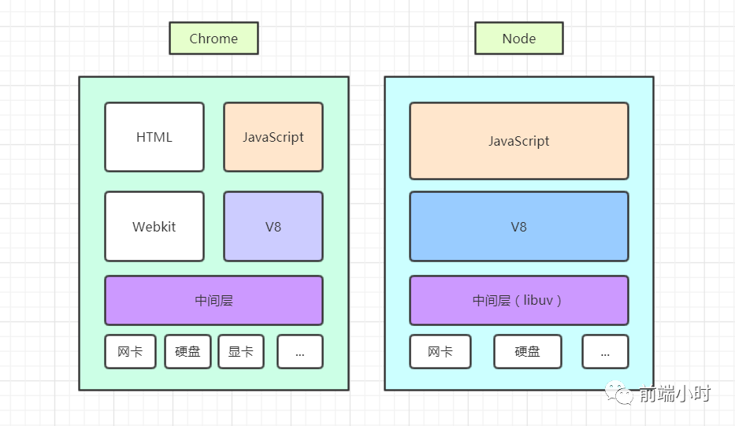
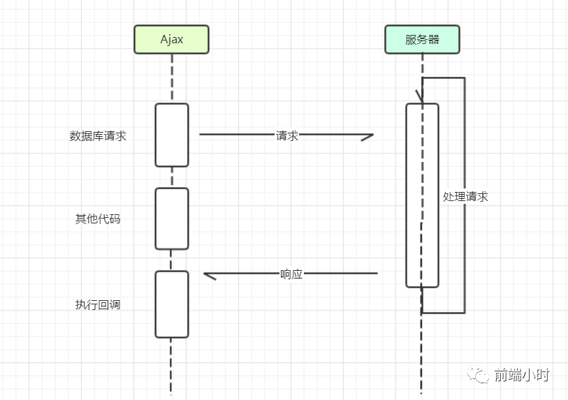
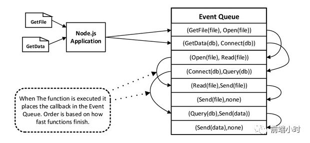
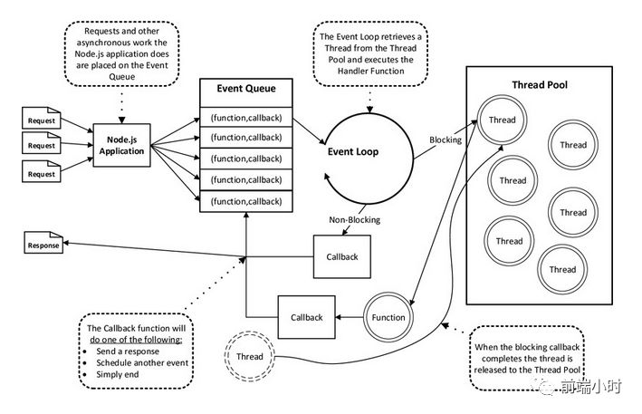

# 详解Node.js特点

> 今人不见古时月，今月曾经照古人

## 01 前言

由于JavaScript是单线程运行的原因，程序难免会发生请求阻塞的情况，试想如果请求一直没有得到回复，那就会一直处于卡死状态。这是很不好的体验，所以人们就想出了一种异步的方案，等待请求资源返回后执行回调函数。

但是Node的功能远远不止这样，Node打破了JavaScript代码只能在浏览器运行的局面，使得服务器也能运行JavaScript代码。进一步说明了JavaScript的功能不会局限于脚本，而是一门真正的后端语言。

## 02 Node.js

Node.js是一个环境，一个可以运行在服务端、跨平台的JavaScript环境。Node.js采用的是Google开发的V8运行代码，使用事件驱动、非阻塞以及异步IO模型，可以大幅度优化应用程序的传输量和规模。

我们可以看一下浏览器和Node在架构方面有什么不一样，两者都是可以提供一种运行环境。

总的来说，其实Node和谷歌浏览器的架构方面是很相似的，Node也是基于谷歌的V8引擎，使得在性能上有很大的提升。

## 03 Node的特点

所谓的特点，就是Node.js是如何解决服务器高性能瓶颈的问题。总结一下Node的特点主要有以下4个：

- 异步I/O
- 事件与回调函数
- 单线程
- 跨平台

##### **01 异步I/O**

当我们尝试去访问数据库的时候就会向服务器发送请求，时间长短取决于网络和数据库的性能如何。假如我们没有异步的机制，那我们就必须等待结果返回，什么也做不了。这就是单线程的缺点，会阻塞后续代码的执行，降低了程序的效率。

现在异步的机制是当我么执行请求的时候，立即执行后面的代码而不需要等待，请求结果放在回调函数当中，提高了效率。当I/O操作执行完毕之后会**以事件的形式通知**执行I/O操作的线程，“你要的结果处理好了，快来拿吧！”。

由于会有很多这样的异步请求，那就必须要有先后的顺序，这就是Node中的**事件循环机制**，JavaScript的不同。事件循环机制依次检查是否还有没有处理的回调函数，依次执行。

##### **02 事件与回调函数**

Node通过事件驱动的方式处理请求时，无需为每一个请求都创建一个线程，而是采用一个线程，以循环处理的方式进行。客户端每进行一个I/O操作，都会添加到事件队列当中，线程会留下一个处理结果的回调函数。线程循环处理队列上面的任务，知道全部处理完成。

**事件驱动模型**：在事件驱动中，所有异步任务仍然在同一个线程中。当I/O或其他昂贵操作时，注册一个回调到事件循环中，当I/O操作完成时继续执行。

##### **03 单线程**

Node中的单线程操作，不用在意一些状态同步问题，也不会有死锁的存在，也没有线程上下文交换带来的性能开销。但是单线程也存在一些问题：

- 无法利用多核CPU
- 错误产生会引起整个程序退出
- 繁重的计算会阻碍异步I/O

Node采用了HTML5标准定制的WebWorker  来解决单线程中大量计算的问题。可以通过将计算分发到各个子进程来计算，然后通过进程之间的事件消息来传递结果，保持了应用模型的简单与低依赖。

其实我们常说的Node单线程是**JavaScript的执行环境**是单线程的，但JavaScript的宿主环境是因为libuv中有**线程池**的概念存在，libuv通过类似线程池的实现来模拟不同操作系统的异步调用，开发者是不可见的。

##### **04 跨平台**

起初，Node只可以在Linux平台上进行，后台投入了一个团队对Windows进行兼容。通过对Node架构层面的改动，建立了一层平台层架构，即libuv。通过良好的架构，Node的第三方C++模块可以借助libuv实现跨平台。

## 04 小结

基于以上的特点，我们知道Node可以**应用于I/O密集型**的场景，能够有效地组织起更多的硬件资源，从而提供更好的服务。而I/O密集型的处理能力主要得益于Node利用**事件循环**的处理能力，而不是启动一个线程为每一个请求服务。

关于CPU密集型的操作，Node主要是通过以下两个方法来解决：

- 通过编写C/C++扩展模块来高效利用CPU
- 通过把计算分发成子进程进行计算的方式，然后利用进程间消息传递结果

参考文章

- 深入浅出Node.js
- Node.js事件驱动和非阻塞机制详解

