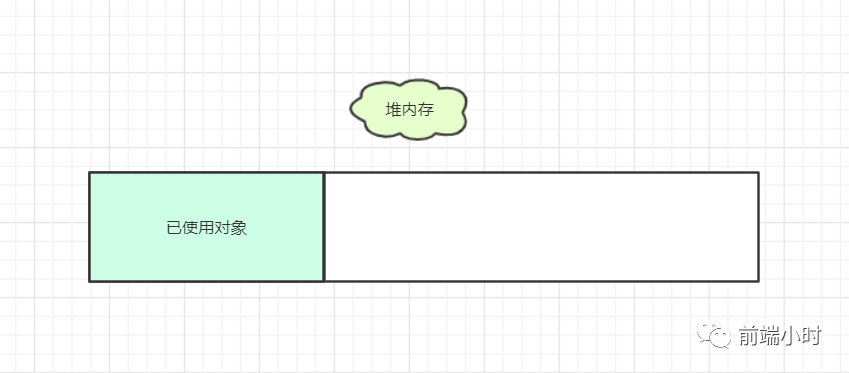
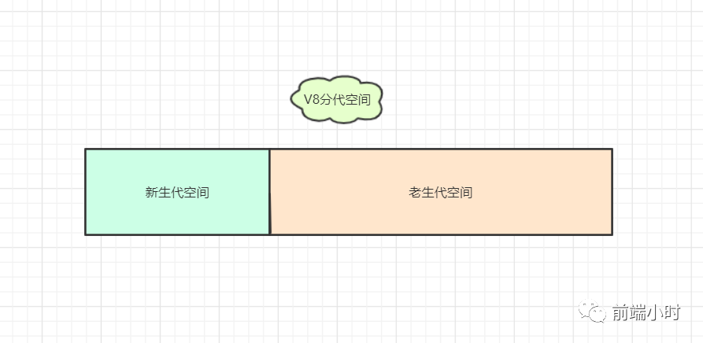
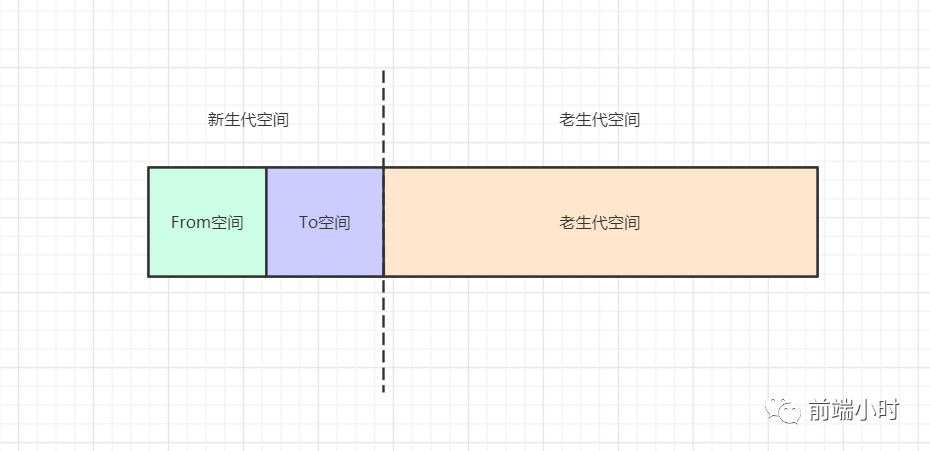
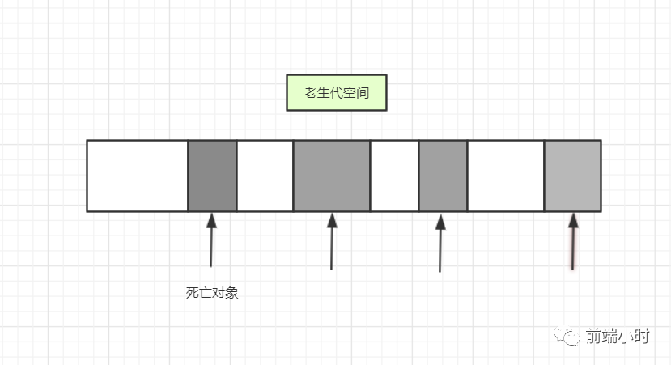
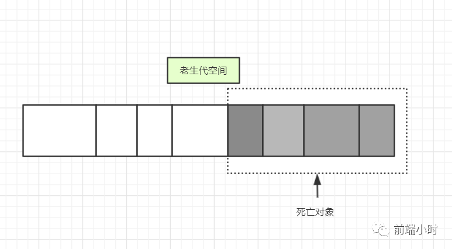
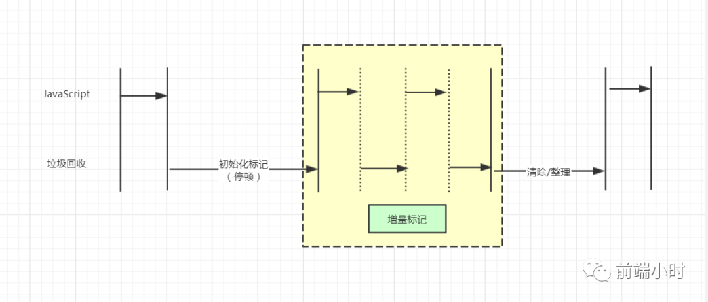

# 深入浅出Node.js——内存管理

>  一点浩然气，千里快哉风


## 01 前言

随着Node的发展，JavaScript的运行已经不再局限于运行在浏览器中了，Node在服务端的应用使得越来越多的问题也显现出来。对于刚接触JavaScript的开发者来说，基本上很少会想到内存分配或者内存泄露的问题，为了跟上潮流，就讲解一下Node是如何合理高效地使用内存，防止内存泄漏。


## 02 V8垃圾回收与内存限制

JavaScript编程不用关心内存的分配和释放的问题，因为它有垃圾回收机制来管理。但是我们对于内存管理更深一步的了解可谓是很少，到底内存是怎么分配的、垃圾回收是怎么运行的？

##### **01 Node与V8**

我们先来了解一下这两者是什么关系。首先V8是谷歌开发出来的浏览器引擎，性能可谓是十分优异，使得JavaScript编写服务器程序成为可能。V8的由来是虚拟机专家Lars Bak开发出来的，开发者之前的工作一直都是专注于高性能的虚拟机开发。

Node是一个构建在Chrome的JavaScript运行时平台，由此一来，Node的高性能就如同抱住了V8的大腿，可以随着V8的升级而享受更好的性能。

##### **02 V8的内存限制**

Node通过JavaScript使用内存的话会有限制，而且Node无法直接操作大内存对象。64位系统下约为1.4GB，而32位系统下约为0.7GB。原因是Node基于V8构建，它的内存分配和管理都是由V8来控制，虽然在浏览器下这种分配机制没有问题，但是在Node中却是有问题的。

##### **03 V8的对象分配**

在V8中，所有的JavaScript对象都是通过堆来分配的，对象占用的内存空间大小是不确定的。




当我们在代码里写上一些变量的时候，我们就会向堆中的内存空间进行申请。我们上面说过V8是有内存分配限制的，这是因为V8的垃圾回收机制影响。我们试想一下假如有1.5GB的垃圾需要等待回收，而V8的垃圾回收机制运行一次需要每50毫秒以上，在这段时间内，程序会无法运行。

假如说我非要打开这个限制也不是不行，我们可以在Node的启动时候更改一下参数即可：

```Bash
node --max-old-space-size=1700   xxx.js    //单位是MB
node --max-new-space-size=1024  xxx.js    //单位是KB
```

上面代码的意思就是新生代和老生代空间的更改，稍后解析什么是新生代和老生代空间。

##### **04 V8垃圾回收机制**

在V8中，我们知道内存空间可以分为新生代和老生代。新生代空间主要是保存一些存活时间较短的对象，而老生代空间主要存储一些存活时间较长的对象。

之前说过64位系统只能使用约1.4GB，32位只能使用0.7GB的空间。这空间是包含新生代和老生代空间，且老生代的空间比新生代要多。



|        | 32位  | 64位   |
| ------ | ----- | ------ |
| 新生代 | 16MB  | 32MB   |
| 老生代 | 700MB | 1400MB |


V8主要采用两种不同的算法，分别作用于新生代和老生代，因为两者的关系不一样。主要有类算法，第一是Scavenge算法，第二是Mark-Sweep & Mark-Compact。新老生代的特点如下：

**新生代：存活对象较少**

**老生代：存活对象较多**

<font color="#FF7F50">①Scavenge算法</font>

- 把新生代空间一分为二，为From空间和To空间
- 内存先分配到From空间，垃圾回收会检查From空间存活情况
- 把From空间的存活对象移到To空间，释放From空间
- 把From和To空间对换

这就完成了垃圾回收的一次清理过程。




<font color="#FF7F50">②Mark-Sweep算法</font>

- 遍历堆中的所有对象，标记存活的对象
- 清除没有被标记的对象




由于老生代空间中，存活的对象较多，使用 Scavenge 算法的话遍历的时间会相对来说比较长，而且还会浪费一半的空间来存放对象，效率比较低。总的来说，Scavenge 算法<font color="#FF7F50">复制存活</font>的对象，而 Mark-Sweep 算法<font color="#FF7F50">清除死亡</font>的对象。

<font color="#FF7F50">③Mark-Compact算法</font>

我们看到上面这种算法回收一次过后**<font color="#FF7F50">产生了零碎的内存空间</font>**，假如这时候进来一个比较大的内存对象就无法完成分配，提前触发新一轮的垃圾回收机制。所以基于这个问题，在原来算法的基础上，采用**<font color="#FF7F50">压缩</font>**的办法，在标记活对象的过程中，对象会往一边移动。然后标记完成之后直接清除边界的内存。




<font color="#FF7F50">④Incremental Marking算法</font>

与前面三种不一样的是，这种算法**<font color="#FF7F50">采用了“步进”的方式</font>**进行，因为垃圾回收机制运行一次的时间也是有的，对于垃圾回收机制运行时间过长，那么页面的应用逻辑都要停下来等待，这种影响也是比较大的。

对于新生代来说不用担心这个问题，因为新生代存活对象比较少，内存占用也比较小。但是对于老生代来说，**<font color="#FF7F50">对象比较多也比较大</font>**，停顿造成的影响大，所以必须要让应用逻辑受垃圾回收的影响小一点。

因此采用“步进”的方式，垃圾回收机制和逻辑代码**<font color="#FF7F50">分段执行</font>**，缓解停顿时间过长而导致应用逻辑执行不了的问题。




## 03 小结

Node将JavaScript的主要应用扩展到了服务器端，所以我们考虑的细节也要和浏览器的不同，更多的是对内存资源的分配问题，稍有不慎可能会写出一些内存泄漏的问题，使得垃圾回收机制不能清理释放内存，严重可能会导致服务器崩溃。

所以平时我们写代码也要谨慎一点，不要写全局变量或者频繁使用闭包，这些如果没有正确释放内存的话也会导致内存泄漏。


参考文章：

- 深入浅出Node.js


