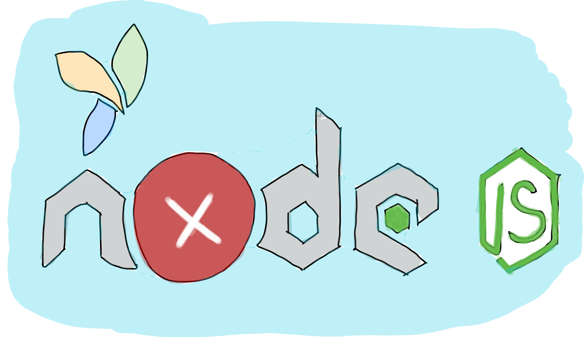

# 浅析Node是如何进行错误处理的

> node是对错误处理要求比较高的语言，假如对错误处理没有到位可能会造成程序进程退出


## 01 前言


错误处理是程序中一个重要的部分，也是判断你的程序是否专业的标准。一般来说我们写程序的时候都会选择使用try...catch来进行错误捕获，或者有时候我们会使用throw进行错误抛出，这是都是常用的错误捕获方法。但是我们在进行node进行开发的时候就会接触到异步过程的中的错误处理。

我们知道在node开发的时候会运用到很多第三方的模块，比如我们经常会使用最大的包管理工具npm，里面下载的包都会放到我们项目当中的node_modules里面，我们打开可以看到里面包含的文件很多，代码量也是巨大的。这里面就会有很多的bug隐患在里面，这时候使用错误捕获就非常有用了。

其实我们一开始想到的就是在全局范围内进行错误的监听，node提供了一个uncaughtException捕获异常，但是这种方法我们会难以定位到错误的发生位置。不应该把该函数当成万能的捕获模块，而是最后的解决方案。



## 02 Error模块


Error定义了Node中常见的错误类型，我们可以使用Error进行错误的抛出。Error模块里面包含了一个堆栈轨迹用于描述Error是从哪里产生的，一般来说我们可以准确知道错误发生在哪一部分的代码当中，根据错误的描述信息可以快速定位到错误。

```javascript
var fs = require("fs");
fs.readFile("file",function(err,data){
	if(err){
		throw new Error("Error!")
	}
})
```

Node程序中产生的所有Error都是使用Error类的实例或者继承自Error类。我们在程序代码不中不仅可以使用回调函数自带的Error模块，而且我们可以显示第捕获错误。比如当你知道逻辑代码运行都某一部分是不对的，应该进行错误的捕获和提醒，你就可以使用：

```javascript
throw new Error("自定义错误信息！")
```


## 03 错误捕获方式


接下来就简单介绍一下Node中我们是如何进行错误捕获的，总的来说我们可以有以下三种方式，try/catch、callback、event。之前我们常用的try/catch方式只适用于同步的调用情况，但是我们知道node中会出现很多的异步调用方式。

##### try/catch

首先我们应该了解的是在异步操作当中该方法是无法捕获错误的，主要原因就是因为异步调用返回时，代码的上下文已经改变，回调函数当中的代码已经脱离了try/catch的范围，所以是无法捕获的。

同步调用情况：

```javascript
//这里可以捕获
try{
	throw new Error("这里出错了！");
}catch(e){
	console.log(e)
}
```

异步调用情况：

```javascript
try{
	setTimeout(function(){throw new Error('这里出错了！')}，1000)
}catch(e){
	console.log(e);//这里无法进行捕获
}
```


##### callback

回调函数的方式主要是通过参数的判断来确定的，node中通常回调函数都会接受两个参数error和result。这两个值肯定会有一个不为空，我们通过读取本地文件的操作来举一个例子。（因为方法返回的是buffer对象难以阅读，我们就是使用utf8进行读取，最后字符串转成json）

```javascript
var fs = require("fs");
fs.readFile("./a.json",'utf8', function(error, result) {
  if (error) {
    console.log(error);
    return;
  }
  console.log(JSON.parse(result));
});
```

假如文件存在就会返回输出结果，故意写成a1.json不存在就会抛出错误：

```json
{ [Error: ENOENT: no such file or directory, open 'D:\test\a1.json']
  errno: -4058,
  code: 'ENOENT',
  syscall: 'open',
  path: 'D:\\test\\a1.json' }
```


##### Event错误处理

我们进行对文件流监听的时候，即使文件流读取是一个同步的方法，但是我们依旧不能使用try/catch来捕获，为什么呢？因为该方法返回了一个对象，只能使用事件处理的方式来处理异常。如果使用try/catch的话直接报错退出，使用事件监听的方式就不会影响程序的运行且会报出错误信息。

所以正确的方式应该是这样的：

```javascript
var fs = require("fs");
var stream = fs.createReadStream('./a.json');
stream.on("error",function(err){
	console.log(err)
})
```


## 04 Domain模块


domain模块视图在一个更高的维度上面解决以上提到的三种错误（可处理callback与event形式），但是现在这个模块已经是不推荐使用了。首先它的出发点就是把不同的处理方式统一到这个模块里面监听和捕获。

它的用法是使用了create方法进行创建Domain对象，然后通过Domain对象监听某对象的error事件，且定义好了相应的处理逻辑，最后使用run方法来启动整个Domain，run方法里面的内容就是我们准备监听的代码。

```javascript
//处理callback
var fs = require("fs");
var domain = require("domain");

var d = domain.create();
d.run(function(){
    fs.readFile('./a1.json','utf8',function(err,data){
        if(err){
            throw new Error('error')
        }
        console.log(data)
    })
})

d.on('error',function(err){
    console.log(err)
})
```

```javascript
//处理event
var fs = require("fs");
var domain = require("domain");

var d = domain.create();
d.run(function(){
    fs.createReadStream('./a1.json')
})

d.on('error',function(err){
    console.log(err)
})
```


除此之外，domain可以支持手动调用add方法把对象添加到监听列表当中。由此可见，Domain其实就是将需要管理的对象包裹起来然后通过run与add方法进行处理和实现。但是如果我们想要把整一个web服务监听的话就是把所有代码都放到run方法里面，可能会造成内存泄露，而且手动调用add方法很难以接受，假如对象被遗漏就可能会花费很多时间进行错误排查。

它的原理其实很简单：

- 通过add方法将对象添加到其监听列表当中（有一个menber属性，维护监听的对象）
- 监听process.uncaughtException捕获，假如代码被domain包裹就会触发domain的error事件
- 通过将异步的实现方式，加入domain进行监听，这样就可以把所有的不同的错误处理机制统一到一个对象


## 05 ES6中的错误处理


ES6我们在工作中用的比较多，比如我们常用的就有promise对象了，还有async/await的形式，被称为是异步的终极解决方案。所以我们也来谈一下ES6中如何进行错误处理。

##### Promise

首先第一个肯定是promise了，因为这对于回调函数的操作很友好，避免了一些回调地狱的产生，也提供了try/catch的形式捕获异常。

```javascript
var promise = new Promise((resolve,reject){
	throw new Error("出错啦！")
})
promise.catch(function(error){
	console.log(error);
})
```


Generator与async

可以使用try/catch语句进行错误捕获，当yield后面的异步操作发生了错误，一样可以使用try语句进行捕获。

```javascript
function * generator(){
	try{
		yield asyncFunction();
	}catch(e){
		console,log(e)
	}
	return 'end'
}
```

假如我们使用async的形式来写（其实就是语法糖，本质一样），也可以使用try/catch来捕获。假如await内部操作出错则后续代码不会执行，可使用try进行包裹。

```javascript
async function test(){
	try{
		await asyncFunction()
	}catch(e){
		console.log(e)
	}
}
```


## 06 小结

以上我们介绍了如何在异步的世界里面进行错误的捕获，之前我们进行的代码编写都是在同步的世界里，使用try/catch就可以解决大部分你的问题。但是近年来我们出现了Node，同步的世界被打破了，所以我们也有必要学习一下如何进行错误的捕获。

上面我们说了使用原始的方法try/catch、callback回调函数、事件触发机制三种方法。

假如我们遇到一些不可避免的错误，导致系统崩溃或者程序得不到正常运行，我们还是有最后的解决方法并且大部分是有效的，那就是：重启试试！


