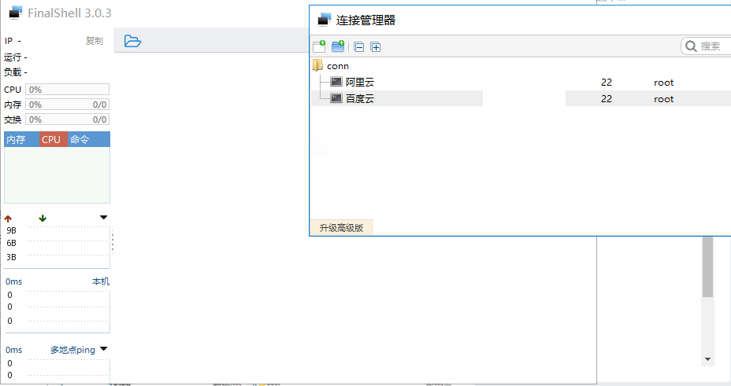
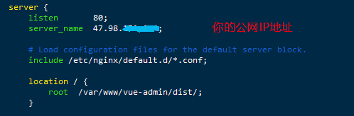
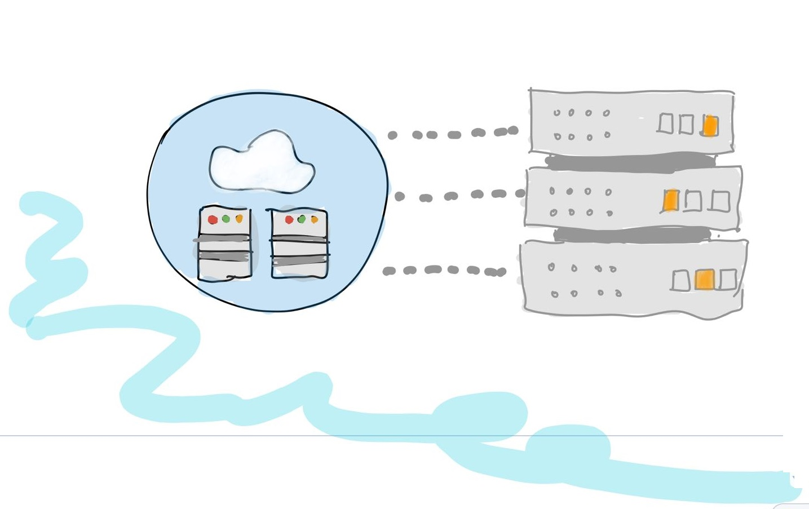

# 服务端小白也能搭建上线系统

> 继上一篇文章之后，我把开发的系统放到阿里云服务器当中，并且成功上线。


## 01 前言


继上一篇文章之后，上一次我写的是前端搭建的后台系统如何与本地数据库或者线上数据库连接的文章，但是我们所有开发的项目不可能是放在本地运行的，怎么也得把它放到服务器上面，让别人也可以通过你的公网地址访问，今天折腾了一下还是挺费劲的，遇到了几个坑，接下来就跟大家说一下如何解决这些问题。

但是你如果要把项目放到服务器的话肯定是要有一台属于你的服务器，不然的话也没办法做。如果你还没有的话可以去阿里云买一个，学生价也是比较便宜的，一年也就100多。这里我是推荐大家一定要玩一下服务器怎么操作，也是作为前端的必备技能之一，废话少说，开始。


## 02 连接服务器


首先我们购买服务器之后就进行连接一下，关于怎么购买和配置等的内容大家可以网上找一下，很简单的操作。

我们可以选择一个连接工具，我这里选择的是FinalShell，大家也可以选择其他的。我们先打开软件新建一个链接，输入服务器的公网IP和密码你就可以连接了。



由于服务器大都是使用linux系统，所以大家就必须知道一些linux的指令，方便我们进行文件操作。常用的指令就几种而已，复杂的基本上用不到，作为初学者的我们就了解即可。

- cd 进入某一个文件夹，可以进入多级，如 cd var/www/ 这种
- ls 查看当前的文件夹有哪些文件或者文件夹
- pwd 查看当前你的位置是哪里
- vim xxx 编辑xxx这个文件，进去之后输入i就可以编辑了，完了之后按退出键(esc)，然后输入:wq退出并保存
- cat xxx 查看xxx这个文件

了解了这些你就可以上手服务器部署了，其实是比较简单的操作，但是有一些删除的指令就不要乱学了，防止小白乱操作整坏了自己的服务器，这个finalshell可以通过右键进行上传或者删除操作，适合入门和那些习惯window的小伙伴。


## 03 文件上传


连接上了之后，基本上和window的操作差不多，你选择一个位置放你的项目，我一般是放在 var/www下面。大家也可以选择你任意的位置，记住放在哪里就好了。

##### **路径引入问题**

我们在上传之前要对你的项目进行打包，执行npm run build 进行项目的打包，这是你项目上线部署才需要做的，一般我们平时开发都是使用npm run dev 来启动一个本地的服务器。但是你在打包之前要改一些东西，不然你的项目放上去之后是无法访问的。要改哪里呢？

我们在项目根目录之下有一个config的文件夹，里面有一个index.js的配置文件，修改dev下面的assetsPublicPath的值，如：

```java
dev: {
    env: require('./dev.env'),
    port: process.env.PORT || 7999,
    autoOpenBrowser: true,
    assetsSubDirectory: 'static',
    assetsPublicPath: './',
    proxyTable: {
        '/api': {
            target: 'http://localhost:3000/api',
            changeOrigin: true,
            pathRewrite: {
                '^/api': ''
            }
        }
    },
```

我们平时开发的是 ‘/’ ，现在我们要改成 ‘./’。这个值表示你的项目打包之后，index.html里面引用资源的相对路径。不得不说，这个坑其实我之前就踩过一次，但是没办法之前没有好好总结下来，没有形成总结的习惯，现在我知道写博客的好处了，要是以后我再踩这个坑......不，以后不会了。

##### **静态资源引用**

我们进行项目打包之后，根目录下面会生成一个dist文件夹，然后我们可以看一下里面的内容，除了一个static和一个html文件其他就没有了。这就是单页应用，最后只导出一个出口。

我们可以在之前写好的server文件夹下面的index.js文件修改一下，我们之前是使用express框架搭建的，所以我们在部署上去的时候加上：

```javascript
const path = require('path');
app.use(express.static(path.join(__dirname, '../dist')));
```

这里的意思就是我们引入静态文件的内容，如果没有引用我们的项目也是无法启动的，显示不出什么页面。


##### **Nginx代理问题**

我们的上线网站是给别人看的，所以我们设置一下代理，让所有的请求都可以定向到你的项目地址。我们配置之前首先要进行一下nginx服务器的安装，在服务器上面也是比较简单的，当然你的服务器也要有node环境才可以，一行命令搞定：

```javascript
npm install -y nginx
```

然后安装完成之后我们就去它的配置文件看一下，默认的路径就是在 /etc/nginx/nginx.conf 下面，我们也不用去更改。我们可以通过cat命令查看一下，假如你要进行配置就使用vim命令。这里我们使用vim命令进去，找到server这一地方，像我这里配置：



server_name就是你的IP地址，也可以写你的域名，不过你要有域名相关的配置和解析，这里我们就暂时不管它。然后我们看到location这里，就是写你的项目放到的地方，我就是放到了var/www/vue-admin下面。修改完了之后我们退出并保存。重启一下nginx服务器，不然可能配置不生效：

```bash
service nginx restart
```

这样配置后我们就可以每次访问这个公网IP+端口之后（默认80端口）就会找你的项目，这样你的项目就会显示了。综上，其实我们就在写bug和找bug之间徘徊。


## 04 启动项目


大家先别急，我们上面是配置了一些东西，但是项目还没有启动的，我们要做的是先安装一下相关的依赖。我们把项目的package.json文件上传到与dist文件夹同级下面，然后执行npm install 就好，如果安装不成功或者网速很慢，大家可以切换到国内的淘宝镜像即可：

```bash
npm install --registry=https://registry.npm.taobao.org
```

这个过程可能有一点费时间。安装完成之后我们进入server的文件夹，执行node index.js启动我们的服务，它会进行数据库的连接，我们就可以使用写好的接口查询数据库。值得注意的是我们不能使用本地的数据库连接，因为线上是访问不到你的数据库的，最好在服务器上面安装mysql服务器，把数据都导进去里面，关于这部分也比较简单，大家网上查阅一下即可。

项目启动之后我们我们可以输入你的ip+端口访问你的项目，如12.56.567.789:3000这样。因为它默认的是80端口，我的端口已经被占用了，所以我就采用3000端口，就是server启动后的监听的3000端口，这里你可以改成其他的，但是访问的时候你也要跟着变。

可能有同学的服务器端口没有开放，导致项目运行不成功，我们可以去到阿里云的控制台看一下，找到安全组配置，开放你的端口就可以了，因为每次搞都比较麻烦，索性我所有端口都开放了。

如无意外我们就可以看到你自己的项目了，如果有报错或者其他的可以看一下浏览器的控制台。但是到这里我们就会出现一个问题，就是我们如果关闭了服务器我们的server服务就会停止了，这样不行呀，我的页面不可能一直这样挂着。所以我们就使用一个比较牛的东西 pm2 ，叫进程守候。



## 05 pm2

说实话一开始听说这个东西的时候就觉得挺厉害的，因为没有接触过，而且听起来也有点东西。其实当你用起来之后你就会觉得就是安装一个npm包一样的原理。

首先使用它肯定要进行安装的操作，也是简单的一句命令就搞定了，在 / 目录下面执行下面的命令：

```
npm install -g pm2
```

然后添加一下到环境变量里面，我们可以这样：

```
vim /etc/profile
```

在文件的最底部添加：

```bash
export NODE_HOME=/root/node-v8.9.1-linux-x64
export PATH=$PATH:$NODE_HOME/bin
```

退出并保存后重新编译一下这个文件：

```
source /etc/profile
```

到现在为止我们已经搞定了pm2的安装以及配置过程了，接下来我们就美滋滋地去启动我们的项目了。在server文件夹下面，输入以下的命令：

```
pm2 start index.js
```

我们发现即使我们关闭了窗口，程序一样完美运行。到此为止我们的配置以及所有的手续都弄完了，大家也应该顺利完成了自己的项目吧。


## 06 小结

其实回想一下整个过程，说简单也是有一点繁琐，但是这始终是我们都要去尝试一下的操作，我一开始接触的时候连基本的命令都不会，但是没关系，看教程慢慢搞就好，反正坏了你可以重装一下。计算机的同学都应该多折腾一下这种繁琐的配置，因为你以后也会接触的，提前锻炼一下。

假如一开始我们就顺利地执行下来，我想你已经不是一个小白了，而是变成了服务端老鸟了，如果自己对服务器比较感兴趣的可以多去学习一个一下linux相关的指令，以后转成运维工程师也不是不可。


