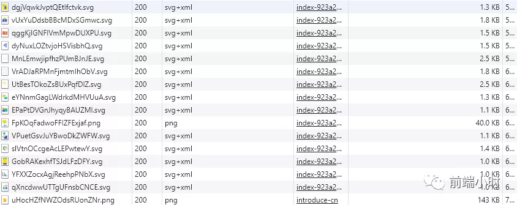
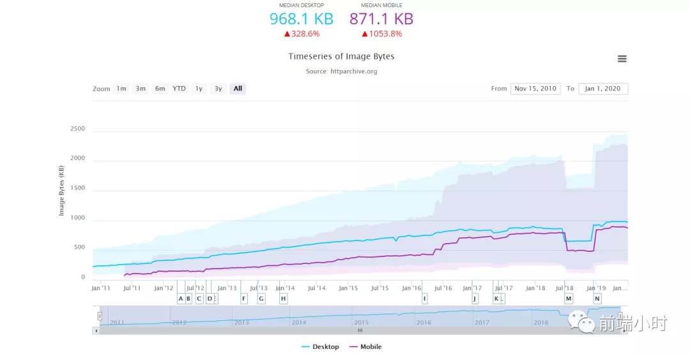

# 前端性能该如何做优化

> "学与思，琢与磨，知与行，相交错"

## 01 前言

当我们打开一个网页的时候，要是运行流畅，体验良好，我们很大程度会经常访问，这就有了用户。相反，如果网站卡顿，内容迟迟没有加载出来，即使你的网站质量很好，也有可能失去用户。前端如今越来越偏向于用户体验方面来，正如winter所说，前端仍然是一个比较新的岗位，有很多可以开发的地方。

那么我们如何让用户觉得这是一个运行流畅的网站呢？你想像淘宝那样航母级的移动应用，性能首先是放在很重要的位置，如果每一次打开都是卡顿，我想人们会变得急躁，也不愿意去用这个软件，当然有替代品的情况下。接下来我会总结一下前端到底可以在哪些方面可以做优化，其中有一些我也没有实践过。

## 02 首屏与白屏

我从用户体验上面，我讲一下如何让别人觉得你的网站性能不错，即使是一个假象。有两个方面，一个是首屏，一个是白屏。

- 首屏：首屏其实是页面从开始到完全显示出来所花费的时间，这个时间越短越好，会让人觉得你的网站性能不错，短时间就加载出来。因为用户想要他所需要的信息，一秒都不愿意多等。

- 白屏：白屏就是网站从一个空白页面，到第一张图片或者某一部分内容开始显示的时间，这个时间也是越短越好，基本上要做到一下子就可以显示出所有内容最好。

那么有哪些因素会影响这个时间呢？

- 网络速度
- 首屏的内容比较复杂
- 浏览器没有做缓存
- 初始化加载网站所有资源

首先第一个网络速度是我们的问题，假如网络速度很慢难免会出现这个问题，所以这一部分也需要网站的配合，把数据返回尽量减少，这样即使网络很慢也可以较快显示出来。

第二是页面内容不应该很复杂，一般打开某个官网都是介绍页面，尽量做得简洁明了，如果有图片尽量无损压缩一下或者使用svg格式的。页面也无需过于复杂，有三屏长度即可。比如Ant Design的官网就是比较简洁的，没有冗余部分，图片也是大多数是使用svg的格式。

关于浏览器缓存部分一定要做好，因为一般首屏都会固定的页面，没有过多的交互，一般也是静态的页面，浏览器可以直接缓存下来，用户再次打开就不用重新请求资源。

初始化加载一部分资源即可，从用户的角度来说，一般用户不会上来就把每一个按钮的点击一遍或者每条信息都打开。所以我们只需要加载首屏信息即可，后面点击后再加载，不要占用首屏的带宽。

## 03 优化方法

优化方法是多方面的内容，主要有以下几个方面：

- 加载优化
- CSS优化
- 图片优化
- 脚本优化
- 渲染优化

##### **加载优化**

加载无非也是发送HTTP请求，那么我们减少请求的发送或者压缩请求的大小即可达到效果。常见的做法有：

1. 合并CSS、JavaScript内容、图片（雪碧图）
2. 启用Gzip、压缩HTML、JavaScript和CSS资源
3. 异步加载第三方资源
4. 使用缓存
5. 避免重定向

##### **CSS优化**

常见优化做法：

1. 正确使用CSS选择符，避免嵌套
2. 减少使用display属性，可用visibility代替
3. 不要声明过多的font-size
4. 尽量避免写内部样式
5. 减少设置图片的大小

##### **图片优化**

图片是占用比较多的带宽资源，图片到了今天也依旧是比较大的，所以建议大家使用CSS3或者svg格式来代替传统图片，使用png和png类型的图片。HTTP-Archive这个网站会定期分析网络上的图片资源请求情况，我们可以看到图片的依旧是比较大的。

##### **脚本优化**

我们知道DOM的操作是昂贵的，因为这涉及到浏览器的解析线程和渲染线程的通信，频繁操作很产生比较大的线程通信消耗。我们常有以下方法：

1. 减少使用DOM操作
2. 使用事件代理，减少事件的批量绑定
3. 减少重绘和回流

##### **渲染优化**

1. 减少DOM节点的使用
2. 使用css3来制作动画
3. HTML使用Viewport

## 04 小结

优化做好之后，我们就可以提升用户体验，留住用户。其实优化的方案远不及以上的策略，还有很多可以使用的，比如现在前端离不开的pngack打包方案，也是可以优化的，只要配置好规则即可，剩下的交给pngack来做。

以上只是一些原理性的建议，还要好好实践一下才可以知道哪种方法适合我们的网站，利用谷歌浏览器F12调试可以查看到底是哪一个请求消耗的时间比较多，我们就可以具体优化。

