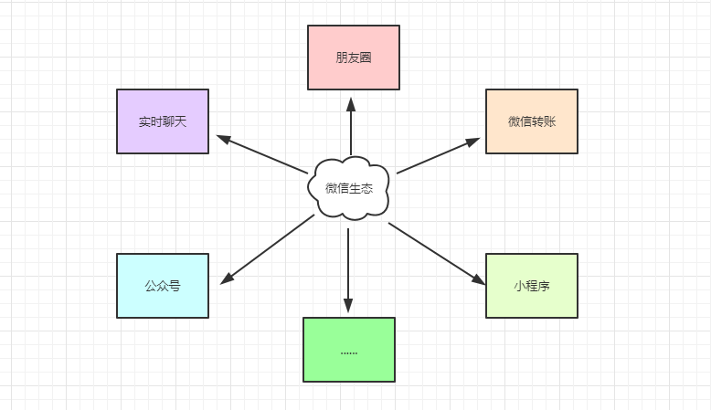
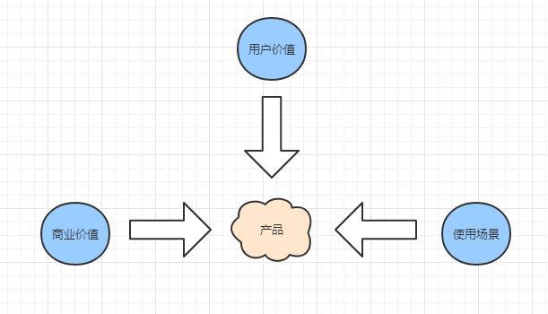
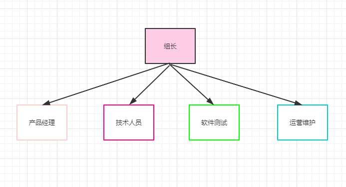

>  同样是为了一个需求服务，产品的思维是怎么想的

## 01 前言

从零开始设计一款全新的产品，其实前期的工作基本上是不用程序员的操心，工作开始由产品经理与客户进行初步的沟通和设计。这里所说的产品经理其实就是一个名称，并非是真正的经理职位。通常来说是由甲方提出初步的需求，然后由产品经理初步设计产品图，如果严谨的话一般会与客户进行再一步的沟通以确定第一版版本。

其实无论是哪一步的动作，沟通就是一个很关键的技能点，通过有效的沟通，能够让双方都在一个可接受的范围内进行产品的设计，才是真正可以让产品顺利落地的方式。产品经理其实是一个设计业务方非常多的一个职位，并非只是我们想象中的只和程序员和甲方打交道，而且你的技能除了沟通高效之外，会一点技术也是非常有必要的。

## 02 产品思维

我们可能经常会看到产品与研发打架的事情，其实这本可以有效的解决，但是可能是出于某些原因使得出现了无效沟通。接下来我来谈一下为什么会这样。

首先产品经理的出发点就是实现甲方的需求方案，而且会在项目的生命周期之内一直跟踪客户的需求，其实我们可以理解为产品监控方。其实咋一看，这和程序员的出发点也大同小异呀，也不至于打架吧。虽然是一样的，但是产品的出发点是基于产品思维的，那么什么是产品思维呢？总的来说它可以从以下的三点出发：

- 用户价值
- 使用场景
- 商业价值

首先是用户价值，通俗一点来说就是这款产品研发出来，对用户有哪些有用的地方。也就是产品可以有效地解决用户的痛点所在，如果可以解决用户的痛点，那么你的产品自然是有人使用的，当然还要通过后期的运营与推广的层面。拿我们伟大的产品微信举一下例子，首先微信解决用户的痛点非常之多，比如免费实时聊天、微信转账、娱乐（朋友圈）。这些都是很伟大的想法，你想要是没有了聊天的功能，大家可能会通过发短信/打电话的形式来沟通，而且不方便也不高效。所以当我们解决了用户痛点的时候，自然会有人使用你的产品，你的用户价值自然就实现了。

使用场景指的就是这一款产品适合在哪些场景下使用，比如小程序游戏，可以让人们在闲暇的时间或者无聊的时候来消遣，满足人们的日常需求。比如在疫情期间推出的穗康小程序，满足人们预约口罩和上报健康信息，满足特定场景下的使用。所以一款产品的诞生要结合使用场景的方面，定向研发。

商业价值，很多人都可能会认为上面提到的用户价值跟商业价值一样，其实不然。首先用户价值是用户寻找的一种满足自己需要的价值，包括用户的预期需求、质量需求、价格需求等相关的因素。假如有一方面的因素不满足用户的期望，那么你这款产品的用户价值可能会降低，因而导致商业价值也降低。

举个例子来说，早期我们都会使用百度搜索引擎，但是由于它搜索引擎的内容大部分不是我们想要的，以广告居多。所以这里就突出第一个问题就是用户价值缺失，只关注于商业价值大于用户价值。所以我们可能会寻找另外一种替代方案，如必应和谷歌。我们以常识来说，一般用户数量达到一定的时候，产品就会考虑实现它的商业价值，比如投放广告等涉及到商业利益的。首先百度就是一个很典型的例子，再而现在微信朋友圈也开始投放广告了，这也是一种商业价值实现的方式。但是鉴于现在大众可能找不到一种比微信更好的替代方案，所以基本上没有什么影响。

## 03 技术思维

与产品思维侧重感性的思维不一样，技术思维更重要的是关注产品本身的实现方式。简单一点来说就是产品偏重的是一个感性思维、商业价值以及用户体验等各方面的工作；而技术思维从技术的底层出发，关注产品的研发，也就是一种理性的思维来驱动的。

所以从程序员的角度来说，主要关注的有以下的几点：

- 技术框架与原理
- 可行性分析
- 研发周期

技术框架的选择一般是有软件的架构师来选择，通过权衡多方面的考虑，选用的工具也是看一下是否有缺陷或者社区反馈是否合理等因素。比如我们开发一个软件选用的技术大部分是用开源的框架/组件库，以减少我们业务的编写，选型的标准一般看一下这个框架是否能够实现我们的需求，遇到问题是否可以有技术支持（生态/社区是否完善）等。一般来说你一旦选型之后就不要更改了，选型是基础。就好比你建一栋大楼，地基已经打好了更改就难了，所以选型方面是经过讨论之后慎重决定的。

产品会有一份需求分析设计书，里面包括了需要实现的预期功能，以及产品的交互功能等，我们需要进行评估时候可以实现。比如让你根据用户手机壳颜色改变主题的需求就不能实现了。程序员通过对每一项的需求进行全面评估，确定可行性之后就反馈给产品。

最后一个就是研发周期，加入产品的研发评估需要一个月的时间，你要一个星期就让我交货怎么行？除非钱到位。

**总结：**

经过上面的分析，我们知道虽然两者的出发点是一致的，但是思维方式确实不一样的，这就导致了我们交流可能会有一点吃力。产品经理感性评估方面比较多，而程序员则是理性分析，以一种严谨的态度去看待每一个问题和需求。

## 04 小结

上面我们介绍了产品思维与技术思维的差异，我们从宏观方面来看，产品的研发有前期，主要是产品经理与客户进行沟通设计，然后写出一份报告书；中期主要是由技术人员来操作，通过编码方式实现产品；而后期就是运营推广的阶段了，还有维护产品的方面。

了解大家的分工之后，我们就对整个过程有一个清晰的认识，假如出现问题也能够快速定位到底是哪个环节出了问题。总的来说产品思维与技术思维相辅相成，可以高质量地打造一款产品。

