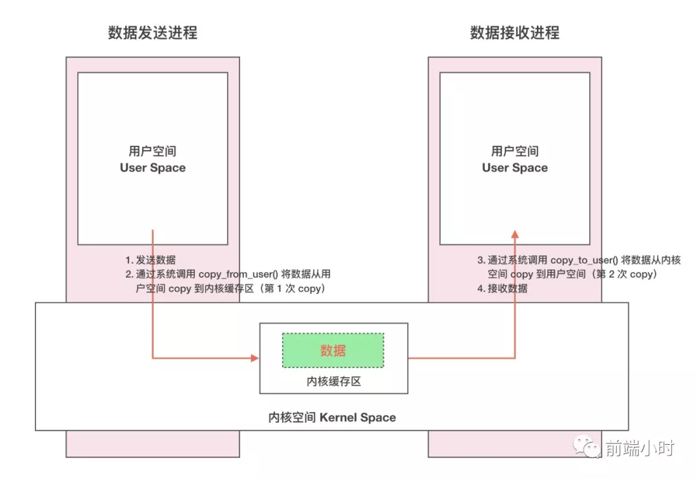
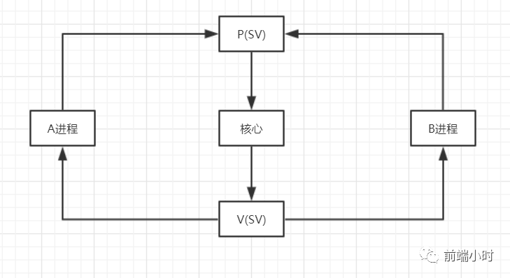
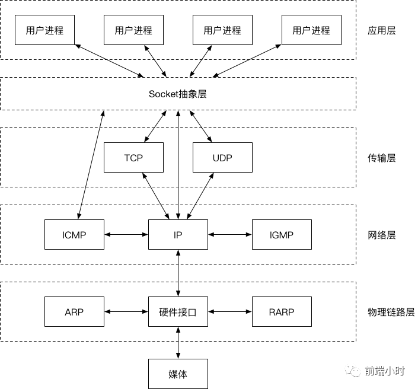

# 解读进程与线程区别、进程间通信

>  把简单的问题回答得不简单，谓之深度

## 01 前言

记得大学学习操作系统的时候，心里就想着这是啥子东西，然后面试的时候我们就想着为啥我没有学过这东西。当你确定好方向之后一般就很少去关注方向之外的东西，就比如我选择了前端开发，就很少关注操作系统和计算机基础的东西，但是面试却常考这些似乎比较偏僻的知识点。

我们常说一面面试会考你基础，这个基础可不是你方向的基础知识，而是接近底层的计算机基础。我记得第一次面试的时候就是百度的面试官，没有过多问我前端方向的知识，而是问我计算机的寻址方式，操作系统的I/O操作。说实话那些没有好好复习真的不会。所以我们对基础的东西一定要好好准备，说不定哪一天的用上了。

## 02 进程与线程

进程是系统进行资源分配和调度的一个单位，是操作系统结构的基础；线程是CPU调度和分配的基本单位，它包含于进程中，是进程中实际运作的单位。一个进程可以包含多个线程，分别执行不同的任务。

**进程和线程的区别**：

- 定义方面：进程是程序在某个数据集合上的一次运行活动；线程是进程中的一个执行路径。（进程可以创建多个线程）
- 角色方面：在支持线程机制的系统中，进程是系统资源分配的单位，线程是CPU调度的单位。
- 资源共享方面：进程之间不能共享资源，而线程共享所在进程的地址空间和其它资源。同时线程还有自己的栈和栈指针，程序计数器等寄存器。
- 独立性方面：进程有自己独立的地址空间，而线程没有，线程必须依赖于进程而存在。
- 开销方面。进程切换的开销较大。线程相对较小。

阮一峰老师在博客中写到：计算机就是一个巨大的工厂，工厂内有很多车间，但是电力只能每次供给一个车间。也就是说单个CPU一次只能执行一个任务。而进程就是一个车间，里面有很多工人负责不同的任务，就是线程。

车间的空间是工人共享的，这就表明了线程共享所在进程的地址空间和资源。但是进程中某些资源是不能同时共享的，比如卫生间一次只能进一个人，当该资源正在使用时其他线程就不能使用。

为什么要引入线程呢？

- **应用的需要：**比如打开一个浏览器，我想一边浏览网页，一边下载文件，一边播放音乐。如果一个浏览器是一个进程，那么这样的需求需要线程机制。
- **开销的考虑：**在进程内创建、终止线程比创建、终止进程要快。同一进程内的线程间切换比进程间的切换要快,尤其是用户级线程间的切换。线程之间相互通信无须通过内核（同一进程内的线程共享内存和文件）
- **性能的考虑：**多个线程中，任务功能不同（有的负责计算，有的负责I/O）,如果有多个处理器，一个进程就可以有很多的任务同时在执行。

## 03 进程通信

既然计算机是一个巨大的工厂，那么车间之间肯定要产生通信的情况。依照这种想法，那在车间之间开辟一个通道即可，这就是管道通信。

每个进程各自有不同的用户地址空间,任何一个进程的全局变量在另一个进程中都看不到，所以进程之间要交换数据必须通过内核,在内核中开辟一块缓冲区,进程A把数据从用户空间拷到内核缓冲区,进程B再从内核缓冲区把数据读走,内核提供的这种机制称为进程间通信。管道通信是半双工通信，数据只能单向流动。

**1、管道通信**

**2、共享内存通信**

共享内存就是允许两个不相关的进程访问同一个逻辑内存。共享内存是在两个正在运行的进程之间共享和传递数据的一种非常有效的方式。不同进程之间共享的内存通常安排为同一段物理内存。

进程可以将同一段共享内存连接到它们自己的地址空间中，所有进程都可以访问共享内存中的地址。但是并未提供同步机制，需要借助信号量来限制访问，不然会导致数据混乱。

**3、消息队列通信**

消息队列提供了一种从一个进程向另一个进程发送一个数据块的方法。每个数据块都被认为含有一个类型，接收进程可以独立地接收含有不同类型的数据结构。我们可以通过发送消息来避免命名管道的同步和阻塞问题。

**4、信号量通信**

为了防止出现因多个程序同时访问一个共享资源而引发的一系列问题，我们需要一种方法，它可以通过生成并使用令牌来授权，在任一时刻只能有一个执行线程访问代码的临界区域。

临界区域是指执行数据更新的代码需要独占式地执行。而信号量就可以提供这样的一种访问机制，让一个临界区同一时间只有一个线程在访问它，也就是说信号量是用来协调进程对共享资源的访问的。

由于信号量只能进行两种操作等待和发送信号，即P(sv)和V(sv),他们的行为是这样的：

P(sv)：如果sv的值大于零，就给它减1；如果它的值为零，就挂起该进程的执行。

V(sv)：如果有其他进程因等待sv而被挂起，就让它恢复运行，如果没有进程因等待sv而挂起，就给它加1。

举个例子，就是两个进程共享信号量sv，一旦其中一个进程执行了P(sv)操作，它将得到信号量，并可以进入临界区，使sv减1。而第二个进程将被阻止进入临界区，因为当它试图执行P(sv)时，sv为0，它会被挂起以等待第一个进程离开临界区域并执行V(sv)释放信号量，这时第二个进程就可以恢复执行。

**5、Socket通信**

在同一台计算机，进程之间上面提到的通信，如果是不同的计算机呢？网络上不同的计算机，也可以通信，那么就得使用网络套接字（socket）。socket就是在不同计算机之间进行通信的一个抽象。它工作于TCP/IP协议中应用层和传输层之间的一个抽象。

客户端的过程比较简单，创建 Socket，连接服务器，将 Socket 与远程主机连接，发送数据，读取响应数据，直到数据交换完毕，关闭连接，结束 TCP 对话。

服务端先初始化 Socket，建立流式套接字，与本机地址及端口进行绑定，然后通知 TCP，等待来自客户端的连接。如果这时客户端与服务器建立了连接，客户端发送数据请求，服务器接收请求并处理请求，然后把响应数据发送给客户端，客户端读取数据，直到数据交换完毕。最后关闭连接，交互结束。

## 04 小结

作为前端很有必要了解一下网络方面的知识，这也是计算机通用的基础。无论互联网还是内网，通信都是要经过连接后才能进行通信。对每一个知识背后的原理了解清楚，解决问题的能力就多一点。

**参考文章**：

- 阮一峰 进程与线程的一个简单解释
- Socket通信原理
- 进程间通信8种方式详解
- 进程与线程的区别

