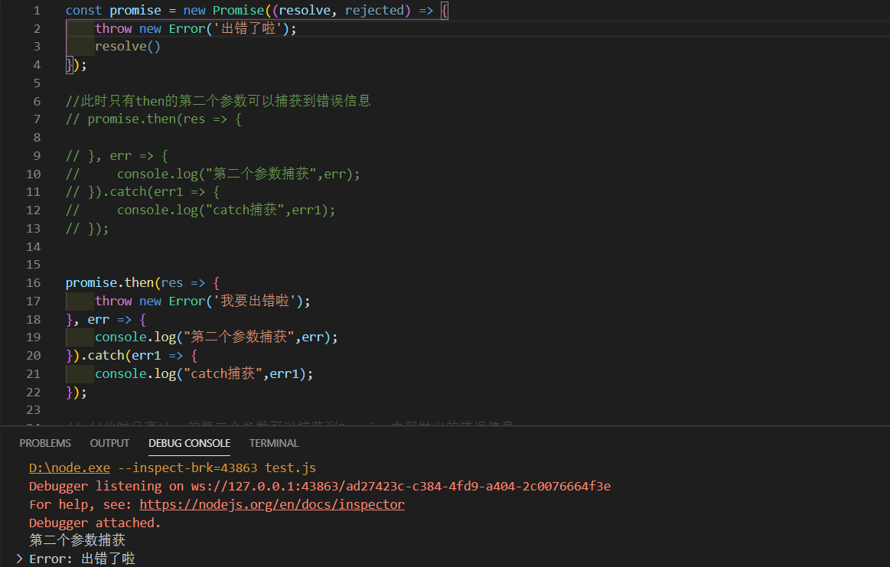
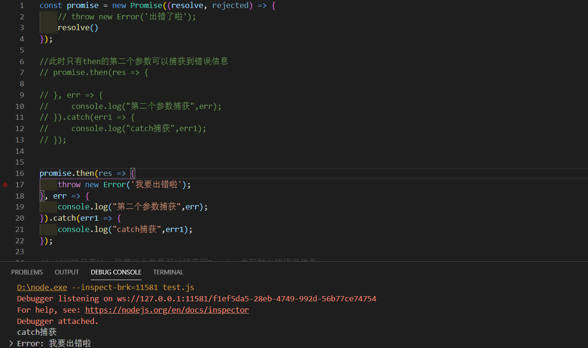

> ES6的异步解决方案，面试必考题之一


## 01 前言


由于同步的写法造成很多的问题，我们最早使用的异步解决方案可能就是jQuery的Ajax的请求函数了，其中提供了同步和异步的写法，但是我们还是会觉得诸多不便，例如一不小心就可能会造成回调地狱的问题，所以ES6就提出来一种更为优雅的写法——promise对象。


## 02 promise


在阮一峰老师的ES6入门标准中说到，所谓promise就是一个容器，里面保存着某个未来才会结束的事件（通常是是一个异步事件）。它有两个特点：

- **<font color="orange">状态不受外界影响</font>**：拥有三种状态（Pending、Fullfilled、Rejected）。状态只取决于异步执行结果，其他过程无法改变这个状态。
- **<font color="orange">状态改变不会再变</font>**：初始状态为Pending状态，它只可以变成Fullfill或者变成Rejected，但是一旦发生改变就不会再变。


promise可以使得异步操作的写法像同步写法一样优雅，代码可读性更高。但是缺点就是中途无法取消promise，一旦新建就会执行，假如没有设置回调函数，Promise内部如果出现错误不会反应到外部。


##### 基本用法：

```javascript
var promise = new Promise(function(resolve, reject){
	//...
	if(success){
		resolve(value);
	}else{
		reject(error)
	}
})
```


Promise构造函数可以接收两个参数，分别是**<font color="orange">resolve和reject</font>**，这两个函数有JavaScript内部提供。异步操作成功的时候就会走resolve这边，失败的话就走reject这边。除此之外，可以使用then方法分别对resolved或者rejected状态的结果进行回调操作。

```javascript
promise.then((res)=>{
	//success
},err=>{
	//error
})
```


## 03 then()和catch方法


##### **then()**

then方法可以接收两个函数参数，第一个是异步操作结果变成resolved的时候调用，第二个是结果变成rejected的时候使用。那有同学可能会问，第二个函数参数与catch错误捕获函数有什么区别呢？

我们首先来区别几个重要的概念，reject是异步结果错误的时候抛出的，但是catch是用来捕获异常的。跟传统的（try/catch）不同的是，如果没有使用catch方法指定错误处理测回调函数，那么Promise对象抛出的错误不会传递到外层代码，不会有任何反应。

**<font color="orange">Promise对象的错误具有“冒泡”的性质，会一直向后传递，直到被catch捕获为止</font>**。错误总会被下一个catch语句捕获。举个例子：

```javascript
Promise.resolve()
.catch(function(error) {
console.log(’ oh  no ’, error);
})
.then(function(){
console.log(’ carry  on ’);
});
```

上述代码由于异步操作结果变成了resolve状态，那么就不会走catch那里，而是直接走then函数了，但是一旦then函数里面有错误抛出，那么该错误就永远不会被捕获，也没有处理。


##### **catch()**

then的第二个参数和catch捕获错误信息的时候会就近原则，如果是promise内部报错，reject抛出错误后，then的第二个参数和catch方法都存在的情况下，只有then的第二个参数能捕获到，如果then的第二个参数不存在，则catch方法会捕获到。






通过上述代码可知，promise对象里面抛出的错误，then的第二个函数参数是可以捕获的。**<font color="orange">但是then的第一个函数参数抛出的错误，第二个函数参数是捕获不了的，只能通过catch函数来捕获</font>**。


## 04 all()/race()方法


##### **all方法**

Promise.all方法用于接收多个promise对象包装成一个新的Promise实例。

```
var p = Promise.all([p1,p2,p3]);
```

Promise.all方法有两种情况：

- p最终的状态由p1，p2，p3共同决定，只有三个promise实例的状态变成Fullfill，整个p才会变成Fullfill。然后p1，p2，p3的返回值组成一个数组，传递给p的回调函数。
- 只要其中一个变成rejected，p的状态就变成rejected，此时第一个rejected的实例的返回值就会传递给p的回调函数。


##### **race方法**

Promise.race方法同样也是接收多个promise实例，然后将多个promise实例包装成新的Promise实例。但是与all方法不同的是：

- 只要p1，p2，p3中有一个实例率先改变状态，那么真个p的状态的就跟着改变。


## 05 resolve()/reject()方法


##### **Promise.resolve()**

Promise.resolve()方法可以把对象转成Promise对象。该方法可以传入的参数类型有四种：

- Pormise实例：不做修改，直接返回实例
- thenable对象：转成promise实例，并执行相应的方法

```javascript
let  thenable  = {
	then : function(resolve,reject) {
	resolve (42);
}
let  p1=  Promise.resolve(thenable);
p1.then(function(value)  {
	console.log ( value );  //  42
});
```

- 不具有then方法的对象或者不是对象

```javascript
var  p = Promise.resolve(’Hello’);
p.then(function(s) {
	console.log(s)
});
//Hello
```

- 不带有任何参数：直接返回一个Resolved状态的Promise对象。


##### **Promise.rejected()**

该方法返回一个promise实例，状态为Rejected。下面的代码中，Promise.reject()方法的参数会原封不动地作为reject的理由变成后续方法的参数。

```javascript
const  thenable  = {
	then  (resolve,  reject)  {
		reject("Error")
	}
}
Promsie.reject(thenable)
.catch(e=>{
	console.log(e===thenable) //true
})
```


## 06 done()和finally()


##### **done()**

上面我们说到Promsie的实例抛出的错误，catch()方法可以进行捕获，但是大家有没有想过假如catch方法抛出了错误会怎么样呢？假如最后一个catch()方法抛出错误的话，理论上是无法捕获的。但是done方法出来了，它在回调链的尾端，保证抛出任何可能出现的错误。

done方法可以像then方法那样使用，提供了Fullfill和Rejected状态的回调函数，可以捕获可能出现的任何错误并向全局抛出。

```javascript
Promise.prototype.done = function(onFullfilled, onRejected){
	this.then(onFullfilled, onRejected)
	.catch(function(reason){
		setTimeout(()=>{throw reason}, 0);
	})
}
```


##### **finally()**

finally()方法用于指定不管Promise对象最后状态如何都会去执行这个方法。但是与done()不一样的是，它接受一个普通的回调函数作为参数。


## 07 小结


Promise对象是ES6中很重要的内容，前端工程师是必须掌握的。它解决了异步回调的问题，使得异步执行的代码像同步一样写法，可读性更高。实例提供的多种方法在实际的业务中非常常见，也很方便使用。


**<font color="green">参考文章</font>**

- 阮一峰 ES6入门标准（第三版）


