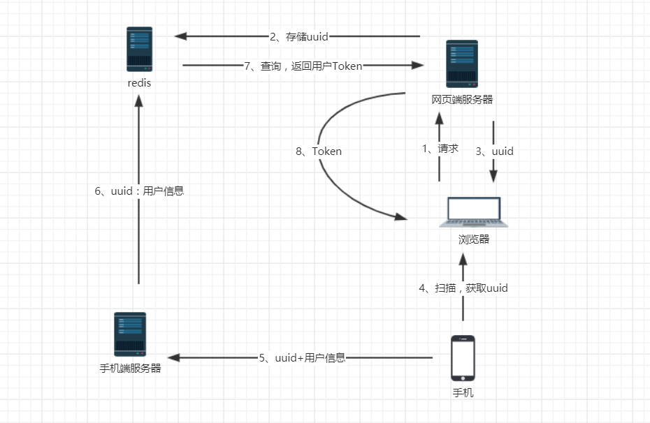

# 微信扫码登录原理分析

> 一文读懂微信扫码登录原理

## 01 前言

微信扫码登录的场景我们很常见，但是大家是否知道里面的原理是怎么实现的呢？这个二维码里面是否包含什么信息呢？或者怎么知道是哪一个手机扫描了二维码呢？

之前也看过一些介绍没有总结验证过，前些日子看到了面试有问微信扫码登录的原理，所以今天我就以登录网页版微信验证一下，通过控制台的请求查看具体过程。

## 02 总体流程

## 03 原理实现

##### **1、二维码与网页服务器**

当我们打开微信的网页版的时候，查看控制台发现发送了一个请求登录的请求，然后网页服务器就随机产生了一个uuid返回给浏览器，而且这个uuid是和二维码绑定在一起的。服务器会把uuid作为key存进redis缓存服务器里面，类似 uuid：xxxx 的形式。

然后接下来我们看到浏览器利用这一个uuid的值，每隔25s左右就发送一个请求。这个过程也是一个轮询的操作，目的就是为了判断用户是否已经扫码了，如果你已经扫码后确认登录轮询的停止。如果没有会一直持续几分钟，然后就二维码就过期了，页面刷新重新生成二维码。

##### **2、二维码与手机服务器**

手机进行扫描二维码，然后手机携带uuid和用户信息向手机的服务器发送请求，手机服务器收到之后携带uuid去redis服务器查询用户，并把uuid与用户信息绑定在一起。查询用户成功之后返回一个Token给网页服务器，通过解析这个Token可以拿出用户的信息，然后浏览器就成功登录微信了。

值得注意的是，这里的手机服务器和浏览器服务器不是同一台服务器，存储的信息也可能不一样。

## 04 小结

我们只要可以看懂流程就好了，因为扫码登录无非就是通过信息的层层传递，然后增加了安全性检查等确保用户在此过程中是安全的。其实不止是微信扫码是这样的流程，支付宝淘宝等的流程也是大同小异的。

