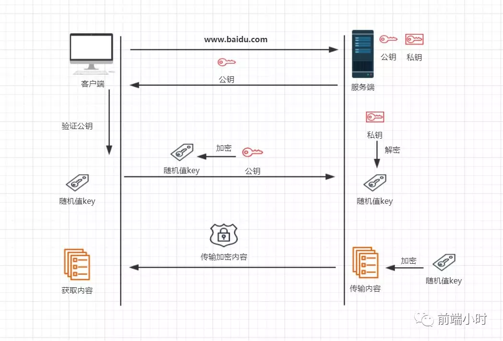

# 密码学家的工具箱

> 密码学，网络时代不可缺少的一部分

## 01 前言

我们平时的手机、银行卡、各种社交账号都会给它设置一个密码，这样就减少别人盗用你账号的几率。而在现在的网络时代，更离不开密码的存在。假如没有密码的保护，别人捡到你的银行卡就可以取出所有的钱，捡到你的手机就可以直接拿来用，这些都是很可怕的事情。接下来我就总结一下，密码的领域，专家都有什么工具呢？

## 02 加密与解密

我们首先来看一个例子，小明同学给小红同学发送一封电子邮件，在没有加密的情况之下很容易就收到中间人的截取纂改，邮件内容有可能会被破坏。

如果没有意外，那么加入密文没有被破解，那么信息还是安全的。但是假如中间人通过某种方式得到了密文，并且成功破解了然后进行纂改：“小红，明天准时上课”。那这样的话信息就不是小明的原本意思了。

如果中间人截获了密文，有哪些方式可能会破解呢？

- 暴力破解（穷举法）
- 频率分析法

##### **01 暴力破解**

这种方法常用于比较简单的场景，比如你是知道这个密码空间（所有密码的可能性）是有限的，那么就可以通过这种方法进行破解。比如你的银行卡密码一般都是6位数，通过随机排列组合可以有720种方法，但是很可惜你输入3次不对就会冻结你的卡。

如果没有限制的话，是可以得到你的密码的。我们也可以通过人的惯性思维来猜测密码，大部分人都是以生日来当作密码，那么我们可以从所有符合生日的密码来破解，大大减少难度。

##### **02频率分析**

我们先来了解一下凯撒密码，该密码诞生于公元前100年左右的古罗马，而他的发明人就是军事统领凯撒。他的思想就是把26个字母表通过平移 n 位来进行加密，所以一旦我们知道平移了多少位就可以正确破译密文。这里的n 就是密钥，也可以使用暴力破解进行破译。

但是他也有一种频率分析的破译方法，找出密文中每一个字符的出现数量，然后猜测单词。

使用哪种破译方法，可以根据密文来决定。

## 03 密码技术

要想信息不被别人窃取，那么常用的加密技术有哪些呢？

- 对称加密
- 公钥密码（非对称加密）
- 单向散列函数
- 数字签名

##### **01 对称加密**

说到对称加密，其实就是加密和解密公用一个密钥。这种方法的前提是双发都知道密钥是什么才可以正确解密。一旦密钥被窃取，加密也就没有意义。

##### 02 **非对称加密**

非对称加密就是加密和解密不是使用同一种密码，这种加密的话一般破解难度不是一般的大。首先我们要知道公钥和私钥是一对的。如果我们了解HTTPS的话，就知道为什么是安全的。我们继续以小明和小红的例子讲解一下：

- 小明给小红发送 ming_key
- 小红给小明发送 ming_key 来加密 随机值
- 小明收到后用私钥解密出来，得到随机值
- 后续使用 随机值来进行加密

##### **03 单向散列函数**

这种技术类似于http响应头的ETag，是标记了文件的一个值。一旦文件发生轻微的改变，这个值也是完全不一样的。利用这一种技术我们可以判断出来文件是否被他人纂改了。

##### **04 数字签名**

这种签名的技术其实在我们生活中经常看到，比如请假条需要老师的签名，银行办理业务也需要本人的签名。这种签名就是为了防止以后你不认这件事情。

那么网络中也是一样的道理，经过一种数字签名之后就是你的授权，可以通过这种技术防止你事后否认。签名技术是一种防止否认的密码技术。

小结：

- 确保信息的机密性：对称加密/非对称加密
- 确保信息不被纂改：单向散列函数
- 确保事后不可否认：数字签名

## 04 小结

通过密码技术我们可以更加安全地保护我们的信息，然后使得网络的世界也多了很多安全。我们从不敢在网上购物到现在热衷于网购，其实就是密码加密技术保护我们的财产。

网络当中存在着很多未知的因素，我们在一些网站中也要使用比较复杂的密码，不要使用一些简单数字结合的密码，因为会很容易被别人破解，输入一个特殊字符可能会使破译难度增加几个等级。

