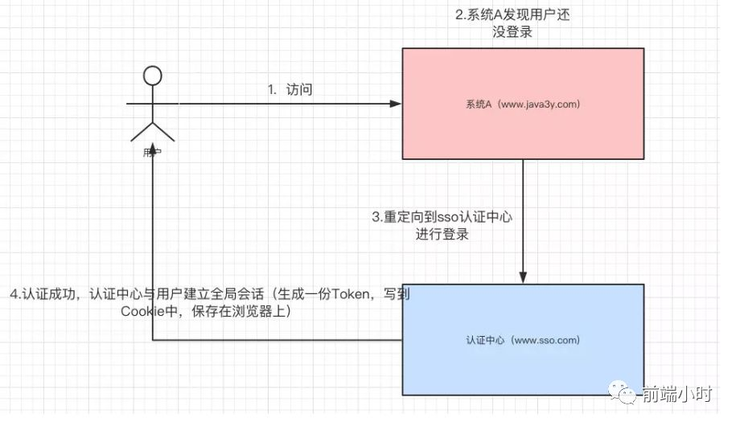

# 如何实现单点登录(single sign on)

> " 人生天地间，忽如远行客 "

## 01 前言

我们访问淘宝的时候，点击查看天猫商品的时候发现天猫的账户也同样是登陆的状态，这就是单点登录系统。使用单点登录是因为我们可以更好地抽离子系统，做到模块的拆分，降低系统的耦合程度。

如果我们不是单点登陆，那状态就不能共享了。比如淘宝的购物车是不能查看天猫的商品的，这就不合理了。

## 02 单点登录

那么单点登录是如何实现的呢？我们可以举个简单的例子，我们去某一个地方（广州、深圳），那就必须购买那个城市的普通车票。假如我们去车站买了一张万能的车票，然后你可以选择去广州、深圳等各种地方。

之前的系统都是耦合程度比较高的，一次登录只能访问一个系统，也就是你必须有那个系统的通行证（普通车票）。但是现在你有万能车票，这个车票是车站发给你的，此时车站就是中心处理点（认证中心），广州/深圳的站台验证你的车票（Token）后就可以放行。

这张图我们可以理解为客户去车站买票，认证中心颁发的Token就是万能车票。我们利用这个Token就可以随意访问子系统的信息，前提是你的Token有效。

当你买了万能车票之后你就可以访问各种子系统，那么过程就可以理解为下面的图。

用户首次登录过程：

- 用户第一次访问，未登录则重定向认证中心
- 登录成功，颁发Token给用户
- 重定向系统A，带上Token访问系统A
- 系统A拿到Token与认证中心比较，正确则创建session局部会话

用户非首次登录过程：

- 用户带上Token访问系统B
- 系统B拿到Token与认证中心比较，正确则创建session局部会话

我们请求系统A/B的时候，会带上Token，一般来说我们可以把Token存储到客户端的浏览器中，以**cookie的形式保存**。那么这里就有一个问题，cookie是不可以跨域的，可能系统A个系统B不是同一个域名怎么办呢？

针对这个问题，我们可以把cookie写到浏览器的时候设置Cookie的domain。domain是可以设置**二级域名跨域**的，比如abc.server.com与wer.server.com的。这样就可以成功跨域，认证中心也可以正确取出Token。

或者我们也可以把Token保存在**SessionStorage**中，不依赖cookie就可以避开这个问题。

## 03 Redis缓存

其实Redis也是一个数据库，是一个开源的，基于内存的数据结构存储，可以用于数据缓存、消息中间件。既然是这样，那其实我们也可以把用户的登录信息全部缓存到Redis中，以后每一次访问都要去Redis看一下有没有登录信息即可。

使用Redis的优点就是可以实现**分布式缓存**，如果有多台机器的话，每一台机器都会共享一份缓存，并且缓存还具有**一致性**。一般来说，Redis是专业用来缓存数据的，可以承受10G+的缓存数据，也可将缓存数据放到硬盘中，Redis重启后也可以恢复。

我们可以看到，SSO本身也是一个系统，只是专门用来管理用户的登录信息而已，那么它的信息是可以与数据库进行对接，其中Redis就可以做缓存信息的功能，不用每次请求都定向到数据库。

## 04 小结

到现在我们应该可以理解SSO的原理是怎么样的，一般像淘宝，网易等公司的系统都会这样设置，能够避免访问系统的时候重复登陆，也优化了架构的方案，使得架构更加清晰而不臃肿。

参考文章

- 什么是单点登录
- cookie的domain属性
- 从零单排学Redis
- 单点登录（SSO）的设计与实现

