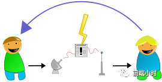

## 如何实现浏览器不同Tab页面通信

>  闻道有先后，术业有专攻


## 01 前言


我们知道，浏览器打开一个Tab页面就会打开一个进程，同时会开启若干个线程，这就涉及到进程之间通信的问题。一般来说单纯使用HTML5的相关特性是无法完成的，我们需要其他的方法来实现。


## 02 通信方法


我们可以分几种情况来讨论这个问题。

**1、postMessage**

页面A通过window.open方法打开另一个页面B，或者B页面通过iframe的形式嵌入A页面，这种情况比较简单，可以使用HTML5的API来完成通信。我们知道window是一个全局对象，前提是页面A或者页面B可以获取另一个页面的window对象，完成单向通信。

```javascript
//B页面
window.addEventListner('message',(e)=>{
    let {data,source,origin} = e;
    source.postMessage('message echo','/');
});
```


postMessage的第一个参数为消息实体，它是一个结构化对象，即可以通过“JSON.stringify和JSON.parse”函数还原的对象；第二个参数为消息发送范围选择器，设置为“/”意味着只发送消息给同源的页面，设置为“*”则发送全部页面。



**2、localStorage**

此方法适用于同源范围的通信，因此可以通过共享localStorage的方式进行通信，通过约定localStorage的某一个名，然后共享方式通信。通过window对象侦听storage事件，会侦听localStorage对象的变化事件（包括item的添加、修改和删除）

```javascript
//A 页面
window.addEventListener("storage", function(ev){
    if (ev.key == 'message') {
        // removeItem同样触发storage事件，此时ev.newValue为空
        if(!ev.newValue)
            return;
        var message = JSON.parse(ev.newValue);
        console.log(message);
    }
});
function sendMessage(message){
    localStorage.setItem('message',JSON.stringify(message));
    localStorage.removeItem('message');
}
// 发送消息给B页面
sendMessage('this is message from A');
```

```javascript
//B 页面
window.addEventListener("storage", function(ev){
    if (ev.key == 'message') {
        // removeItem同样触发storage事件，此时ev.newValue为空
        if(!ev.newValue)
            return;
        var message = JSON.parse(ev.newValue);
        // 发送消息给A页面
        sendMessage('message echo from B');
    }
});
function sendMessage(message){
    localStorage.setItem('message',JSON.stringify(message));
    localStorage.removeItem('message');
}
```


**3、BroadcastChannel**

这种方法与localStorage的思想一样。

```javascript
// A.html
const channel = new BroadcastChannel('tabs')
channel.onmessage = evt => {
  // evt.data
}

// B.html
const channel = new BroadcastChannel('tabs')
channel.postMessage('hello')
```


**4、WebSocket**

WebSocket可以实现全双工通信，自然可以实现多个标签页之间的通信的问题。

WebSocket连接必须由浏览器发起，特点：

（1）建立在 TCP 协议之上，服务器端的实现比较容易。

（2）与 HTTP 协议有着良好的兼容性。默认端口也是80和443，并且握手阶段采用 HTTP 协议，因此握手时不容易屏蔽，能通过各种 HTTP 代理服务器。

（3）数据格式比较轻量，性能开销小，通信高效。

（4）可以发送文本，也可以发送二进制数据。

（5）没有同源限制，客户端可以与任意服务器通信。

（6）协议标识符是`ws`（如果加密，则为`wss`），服务器网址就是 URL。


**5、cookie+setInterval**

在页面A设置一个使用 setInterval 定时器不断刷新，检查 Cookies 的值是否发生变化，如果变化就进行刷新的操作。

由于 Cookies 是在同域可读的，所以在页面 B 审核的时候改变 Cookies 的值，页面 A 自然是可以拿到的。这样做确实可以实现我想要的功能，但是这样的方法相当浪费资源。虽然在这个性能过盛的时代，浪费不浪费也感觉不出来，但是这种实现方案，确实不够优雅。


**6、sharedWorker**

SharedWorker本身并不是为了解决通讯需求的，它的设计初衷应该是类似总控，将一些通用逻辑放在SharedWorker中处理，不过因为也能实现通讯。

```javascript
// A.html
var sharedworker = new SharedWorker('worker.js')
sharedworker.port.start()
sharedworker.port.onmessage = evt => {
  // evt.data
}

// B.html
var sharedworker = new SharedWorker('worker.js')
sharedworker.port.start()
sharedworker.port.postMessage('hello')

// worker.js
const ports = []
onconnect = e => {
  const port = e.ports[0]
  ports.push(port)
  port.onmessage = evt => {
    ports.filter(v => v!== port) // 此处为了贴近其他方案的实现，剔除自己
    .forEach(p => p.postMessage(evt.data))
  }
}
```


## 03 小结


其实页面之间的通信用的不是很多，但是在技术发展的同时我们都要关注一下，特别是为什么能够进行通信，每一个Tab背后都是由什么组成的，这些了解清楚最好。还有关于进程和线程的区别，知道这些才会更好的理解。


**<font color="green">参考文章</font>**：

- Communication between tabs or windows
- 跨浏览器tab页面的通信解决方案尝试
- 浏览器多个标签页之间的通信
- 跨页面通信的各种姿势


