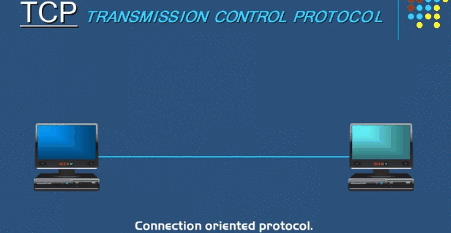
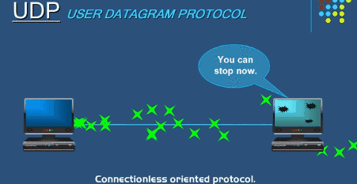
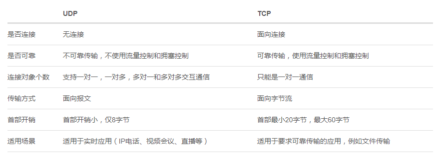
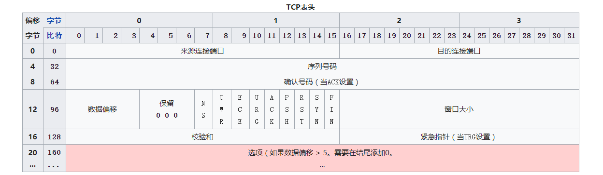
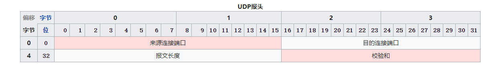

# 网络协议TCP和UDP的区别

> 读懂此文，从此又少一个问题

## 01 前言

前端工程师跟网络打交道的时间不比网络工程师的少，浏览器就是我们天天都要用的，发送请求/响应数据其中的过程都要通过网络协议，所以网络协议已经成为前端的必要掌握知识了。而TCP和UDP协议是最关键也是最常见的两个协议，下面我们就来好好总结一下。

## 02 协议介绍

##### **TCP**

TCP是一种面向来连接的、可靠的、基于字节流的传输层通信协议。在计算机网络的OSI模型中，它完成第四层传输层所指定的功能。

**面向连接**：数据在发送之前必须在两端建立连接，方法就是我们熟知的三次握手连接。

**可靠传输**：通过多种机制来保证数据的正确传输，比如序列号/确认应答机制、检验和机制、超时重传机制、流量控制、拥塞避免机制等。

**基于字节流**：虽然应用程序和TCP的交互是一次一个数据块（大小不等），但TCP把应用程序看成是一连串的无结构的字节流。TCP有一个缓冲，当应用程序传送的数据块太长，TCP就可以把它划分短一些再传送。如果应用程序一次只发送一个字节，TCP也可以等待积累有足够多的字节后再构成报文段发送出去。

**特点**：

- 面向连接
- 仅支持单播传输
- 面向字节流
- 可靠传输
- 提供全双工通信

##### **UDP**

UDP是一种简单的面向数据报、面向无连接、不可靠的通信协议，位于OSI模型的传输层。在网络中它与TCP协议一样用于处理数据包，是一种无连接的协议。

**面向无连接**：UDP 是不需要和 TCP一样在发送数据前进行三次握手建立连接的，想发数据就可以开始发送了。并且也只是数据报文的搬运工，不会对数据报文进行任何拆分和拼接操作。

**不可靠**：不可靠性体现在无连接上，通信都不需要建立连接，想发就发，这样的情况肯定不可靠。并且收到什么数据就传递什么数据，并且也不会备份数据，发送数据也不会关心对方是否已经正确接收到数据了。

**面向报文**：面向报文的传输方式是应用层交给UDP多长的报文，UDP就照样发送，即一次发送一个报文。UDP对应用层交下来的报文，既不合并，也不拆分，而是保留这些报文的边界，照样发送。

再者网络环境时好时坏，但是 UDP 因为没有拥塞控制，一直会以恒定的速度发送数据。即使网络条件不好，也不会对发送速率进行调整。这样实现的弊端就是在网络条件不好的情况下可能会导致丢包，但是优点也很明显，在某些实时性要求高的场景（比如电话会议）就需要使用 UDP 而不是 TCP。

**特点**：

- 面向无连接
- 不可靠传输
- 提供单播、多播和广播
- 面向报文

## 03 协议比较

**01 图解过程**

**02 特性比较**

**03 头部比较**

- 来源连接端口（16位长）－识别发送连接端口

- 目的连接端口（16位长）－识别接收连接端口

- 序列号（seq，32位长）
  - 如果含有同步化旗标（SYN），则此为最初的序列号；第一个数据比特的序列码为本序列号加一。
  - 如果没有同步化旗标（SYN），则此为第一个数据比特的序列码。
  
- 确认号（ack，32位长）—期望收到的数据的开始序列号。也即已经收到的数据的字节长度加1。

- 数据偏移（4位长）—表示数据部分应该从TCP包的哪个部分开始计算，也可看作TCP首部长度。

- 保留（3比特长）—须置0，但如果收到的包在该字段，此包也不会丢弃。

- 标志符（9比特长）
  - NS—ECN-nonce。ECN显式拥塞通知（Explicit Congestion Notification）是对TCP的扩展，定义于RFC 3540（2003）。ECN允许拥塞控制的端对端通知而避免丢包。ECN为一项可选功能，如果底层网络设施支持，则可能被启用ECN的两个端点使用。在ECN成功协商的情况下，ECN感知路由器可以在IP头中设置一个标记来代替丢弃数据包，以标明阻塞即将发生。数据包的接收端回应发送端的表示，降低其传输速率，就如同在往常中检测到包丢失那样。
  - CWR—与ECE标志都用于IP首部的ECN字段，当ECE标志为1时，通知对方已将拥塞窗口缩小。
  - ECE—置为1时通知对方到这边的网络有拥塞。
  - URG—为1表示高优先级数据包，紧急指针字段有效。
  - ACK—为1表示确认应答有效
  - PSH—为1表示是带有PUSH标志的数据，指示接收方应该尽快将这个报文段交给应用层而不用等待缓冲区装满。
  - RST—为1表示出现严重差错，必须强制断开连接。
  - SYN—为1表示希望建立连接。
  - FIN—为1表示发送方没有数据要传输了，要求释放连接。
  
- 窗口（WIN，16位长）—表示从确认号开始，本报文的发送方可以接收的字节数，即接收窗口大小。用于流量控制。

- 校验和（Checksum，16位长）—对整个的TCP报文段，包括TCP头部和TCP数据，以16位字进行计算所得。这是一个强制性的字段。

- 紧急指针（16位长）—本报文段中的紧急数据的最后一个字节的序号。

- 选项字段—用于提高TCP传输性能，最大长度40字节。

  

  

- 来源连接端口（16位长）－识别发送连接端口
- 目的连接端口（16位长）－识别接收连接端口
- 报文长度：保存了UDP首部和数据的长度之和
- 检验和：为了提供可靠的UDP传输而设计的

## 04 应用场景

由于TCP保证数据的可靠传输，所以互联网上的很多场景都会使用TCP协议，比如网页浏览、信息发送、文件传输等，可以保证了数据的完整性。

相比于TCP，UDP更适用于实时通信的场景，因为丢了几个包对整体的影响不大，比如视频会议，直播等。

## 05 小结

我们通过讲解TCP和UDP的区别，也知道它们对应的应用场景以及他们的关系。其实两者都是属于传输层的协议，为的就是传输数据是以何种方式而已。TCP的头部有20字节，协议传输会消耗更多的资源，但是保证数据的传输；而UDP头部只有8个字节，传输相对消耗较少，但是不保证数据的传输。

**参考文章**

- 维基百科 TCP/UDP
- fundebug 一文TCP与UDP的区别

