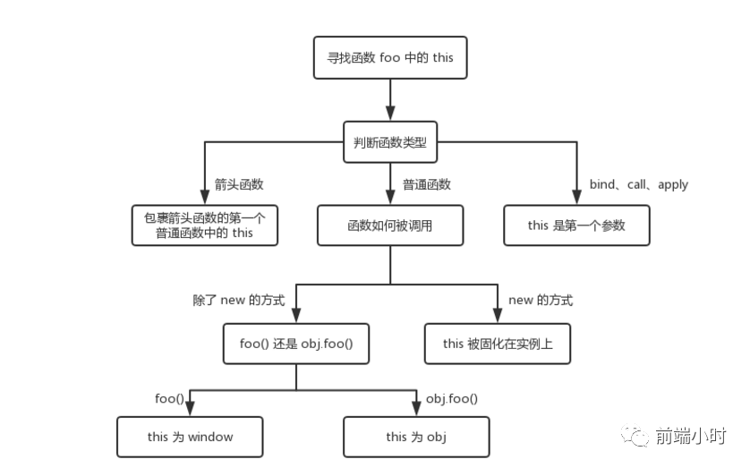

# 函数作用域、闭包与this指向问题

> 纸上得来终觉浅，绝知此事要躬行


## 01 前言


之前学习C语言的时候基本语法还好理解，但是后来出了一个this的东西，然后我的脑子就卡壳了，总觉得指针这东西让人琢磨不透，心想以后肯定不搞这个。现在学习了JavaScript之后发现原来也有this这玩意，想着这次逃不过了，那就好好总结一下吧，彻底把它弄懂就好。


##  02 作用域


作用域是可访问变量的集合，在JavaScript中对象和函数同样是变量，作用域为可访问变量，对象，函数的集合。作用域可以分为全局作用域和局部作用域。

**<font color="orange">全局作用域</font>**： 变量在函数外定义，即为全局变量，全局变量有全局作用域，网页中所有脚本和函数都可以使用。如果变量在函数内没有声明，也是全局变量。

```javascript
var name = "hello World";
// 此处可调用 name 变量
function myFunction() {
    // 函数内可调用 name 变量
}
```

```javascript
// 此处可调用 name 变量
function myFunction() {
    name = "hello World";
    // 此处可调用 name 变量
}
```

**<font color="orange">局部作用域</font>**：变量在函数内声明，变量为局部作用域，只能在函数内部访问。

```javascript
// 此处不能调用 name 变量
function myFunction() {
    var name = "hello World";
    // 函数内可调用 name 变量
}
```

局部变量只作用于函数内，所以不同的函数可以使用相同名称的变量。局部变量在函数执行时创建，函数执行完毕后局部变量就会自动销毁。

JavaScript变量生命周期，局部变量函数执行完毕后销毁，全局变量在页面关闭后销毁。函数参数只在函数内起作用，属于局部变量。

## 03 闭包


**<font color="orange">闭包</font>**：函数A内部有函数B，函数B可以访问函数A的变量，那么函数B就是闭包。本质上，闭包就是将函数内部和函数外部连接起来的一座桥梁。

```javascript
function A(){
    var a = 123;
    function B(){
        console.log(a) //123
    }
    return B()
}
A()();
```

**<font color="orange">闭包有3大特性：</font>**

- 函数嵌套函数
- 函数内部可以引用函数外部的参数和变量
- 参数和变量不会被垃圾回收机制回收


**<font color="orange">闭包优点：</font>**

1. 可读取函数内部的变量
2. 局部变量可以保存在内存中，实现数据共享
3. 执行过程所有变量都匿名在函数内部


**<font color="orange">闭包缺点：</font>**

1. 使函数内部变量存在内存中，内存消耗大
2. 滥用闭包可能会导致内存泄漏
3. 闭包可以在父函数外部改变父函数内部的值，慎操作


**<font color="orange">使用场景：</font>**

1. 模拟私有方法
2. setTimeout的循环
3. 匿名自执行函数
4. 结果要缓存场景
5. 实现类和继承


## 04 this指向


this是在函数运行时，在函数体内部自动生成的一个对象，只能在函数体内部使用。通过捣鼓这么多代码，无非就是几种情况，在不同的环境下会有不同的值。发现网上很多关于this的文章都会让人觉得很难以理解，讲解一大堆例子但是没有讲到点上。

首先我们来看一下代码

```javascript
var a = 1
function foo() {
    console.log(this.a)
}
foo()

const obj = {
 a: 2,
 foo: foo
}
obj.foo()

const c = new foo()
```

- 对于直接调用函数来说，不管foo函数被放在了什么地方，this的指向一定是window
- 对于obj.foo()来说，谁调用了函数那么谁就是this
- 对于new操作实例化来说，this就会绑定在实例化对象上面且不会被改变
- 箭头函数this只取决于包裹箭头函数的第一个普通函数的this

**<font color="orange">PS</font>**：箭头函数是没有this的，只会从自己的作用域链的上一层继承this。箭头函数的this在它被定义的时候就确定了，之后永远不会改变。



## 05 小结


函数作用域和闭包等知识点都是一些很基础的，只不过我们经常会忽略了最基础的内容，忙着去学习前端框架等其他技术。所以我们一定要重视起来，这也是面试基础，但很多人也答不出来。


**<font color="green">参考文章</font>**

- 阮一峰 JavaScript 的this 用法
- 菜鸟教程 JavaScript函数作用域

