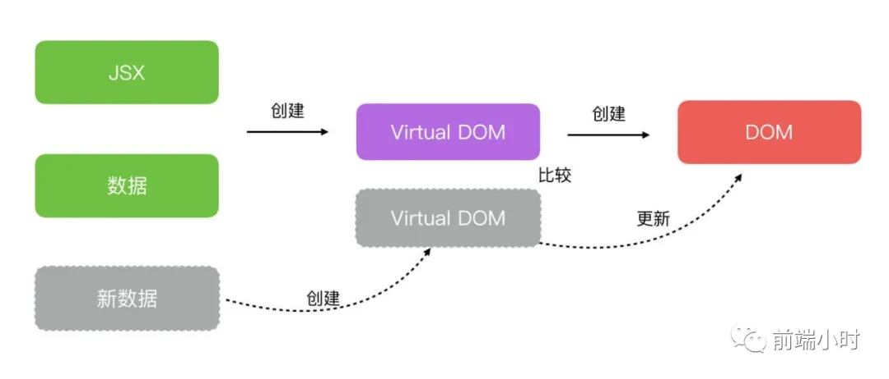

# 浅谈Vue虚拟DOM技术

> 身无彩凤双飞翼，心有灵犀一点通

## 01 前言

自从vue框架出现以来，越来越多的人们都在讨论虚拟DOM的技术，说虚拟DOM是比较高效的、不会操作DOM等等。但是我觉得我们应该从更深的层面去看到这个问题，尝试去阅读一下vue中的虚拟DOM源码，弄清楚到底它是怎么操作的。

接下我就说一下什么是虚拟DOM、为什么引入虚拟DOM以及Vue中的虚拟DOM。其实我们可能会产生一种错觉，认为Vue中才会有虚拟DOM的技术，其实React中也有，Angular中也有一种脏检查的技术，都是同样的原理。

## 02 虚拟DOM

我们之前已经知道，操作DOM是一种昂贵的操作，到底“贵”在哪呢？这也涉及到浏览器引擎的知识，现在我们回忆一下，JavaScript是解析引擎的，页面渲染是渲染引擎的。因此不可避免地要进行两个线程之间的通信，操作越频繁，两个线程通信消耗的性能就越多。

##### **01 虚拟DOM由来**

假如我们的DOM操作不涉及到通信的话，我们大可以把DOM全部去除然后渲染一份完整的DOM树。总的来说，虚拟DOM就是为了提高页面渲染性能，是随着时代发展而诞生的产物。

**虚拟DOM的解决方式是**：通过状态生成一个虚拟节点树，然后使用虚拟节点树进行渲染。假如是首次节点的渲染就直接渲染，但是第二次的话就需要进行虚拟节点树的比较，只渲染不同的部分。

##### **02 何有引入虚拟DOM**

我们知道虚拟DOM是为了提高性能，在React中是虚拟DOM比对，在Angular中是脏检查技术。但是在vue/1.0的时候还没有引入虚拟DOM技术，当时vue的检查流程跟前两者的都不一样，直接检测具体到节点的状态变化，采用更细粒度来绑定更新视图。

但是细粒度监听状态会产生大量的watcher实例，导致内存开销和依赖追踪的开销比较大。而是用低粒度会导致状态无法精确监听，所以vue 2.0 采用中等粒度方案监听，**只能监听到组件的变化，而组件的内部就使用虚拟DOM进行状态比对**，也就是DIFF算法。

## 03 Vue的虚拟DOM

平时我们在Vue中写html代码的时候，可以使用变量，循环等指令来编写。可以这样写的原因是Vue中有模板解析的函数，可以对html代码进行解析编译，从而转变成渲染函数，渲染函数执行后就变成了虚拟DOM节点树。

当虚拟节点准备映射到视图的时候，为了避免额外的性能开销，会先和上一次的虚拟DOM节点树进行比较，然后**只渲染不同的部分**到视图中，无需改动其他的节点状态。

vNode是一个普通的JavaScript对象，保存了DOM节点需要的一些数据，比如文本节点，属性等，以DOM对象的形式表现出来。其中主要的技术就是节点比对算法patch。

上述过程总结：

- **获取监听变化后生成的虚拟节点树**
- **与上一次虚拟DOM节点树进行比较**
- **找到差异的部分，渲染到真实的DOM节点上面**
- **更新试图**

## 04 小结

虚拟DOM技术使得我们的页面渲染的效率更高，减轻了节点的操作从而提高性能。虚拟节点树其实是一个普通JavaScript对象，新旧节点的对象比较，得出差异直接渲染页面。

vue的状态侦测只能到某一个组件上面，这是基于性能的考虑而得出的方案。组件内部通过diff算法来比对，从而渲染试图。

vue中通过模板来描述状态与试图之间的映射关系，把模板编译成渲染函数然后得到虚拟DOM节点树，最后使用虚拟节点树渲染页面。

参考文章：

- 深入浅出Vue.js  虚拟DOM简介

