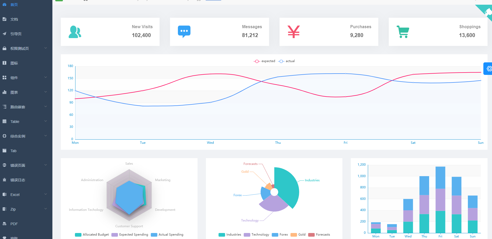
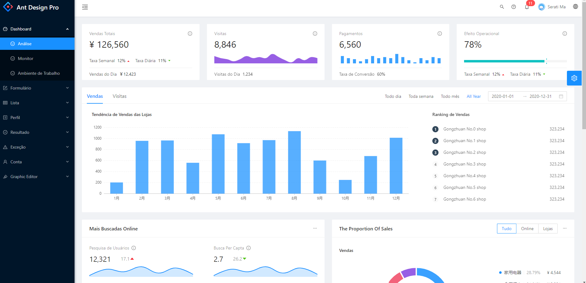
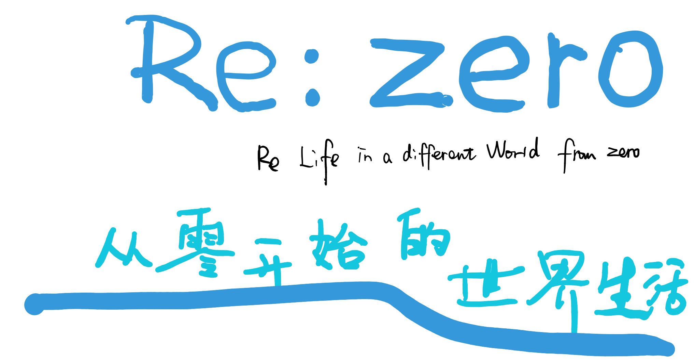
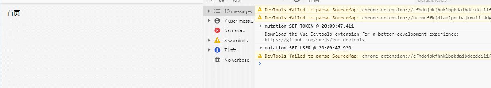

# 教你十分钟开发后台管理系统

> 本文叫你如何轻松配置系统设计的功能架构，让开发不再困难，剩下的你就可以cv操作了。


## 01 前言


如无意外，大家最近也应该也是在家里学（闲）习（鱼）吧，不过我还是建议一下大家，新的风暴已经出现，怎么能够停滞不前... 似乎想起了什么。不论如何现在是大四狗最忙碌的时候了，而且大家也应该利用这段时间好好巩固自己的知识点，争取在一两个月内做出一个比较像样的项目，好给自己的大学一个交代。

不管怎么说，一个好的项目是可以写在自己的简历上面的，一不小心可能你就凭着这个项目拿到满意的offer。所以本文就给那些还在困惑的孩子们一个导向，希望你们也可以做出一个属于自己的项目。我深知大家的难处，因为我之前也是苦于这种设计系统的问题，找了多方资料也不怎么理想，所以我觉得分享是对我们程序员最好的回报。

最近我也是在弄相关的事情，奈何导师又给你一个新的需求。还能怎么办，做呗。这一次我就新增了一个后台管理系统，方便管理人员的操作，折腾了一晚上加一早上，尝试了几种方案都不太满意，现在我就把自己遇到的坑和问题都说出来，为大家填坑。我使用开源的项目vue+element-ui+mysql+node+express的组合。


## 02 开源管理系统


大家应该对现在的前端框架vue比较熟悉了，基本上如果你是从事前端行业的话是必学的框架之一。推荐这个框架是因为上手比较简单，对新手比较友好，而且生态完善，每天都有无数的程序员为你排忧解难，这就是生态好的好处。好了废话不多说，接下来就是推荐两个比较好的开源项目。

- [vue-element-admin](https://panjiachen.gitee.io/vue-element-admin-site/zh/)

这是一个比较大型的后台管理系统，包含了很多的东西与功能，如果你是一个新手的话可能hold不住，毕竟他的项目是比较完善的，但好在也有完善的文档。大家自己可以自由查看，当然你也可以好好研究里面的架构层次是怎么设计的。一般来说你要学习某一项新的技术，查看别人现成的项目是很有帮助的。毕竟人家可是掉了一地的头发才开发出这么一个伟大的系统，造福大家年轻的程序员。




- [Ant Design Pro](https://preview.pro.ant.design/dashboard/analysis)

这是一个由蚂蚁金服出品的后台管理系统，也是非常不错的模板项目，可以做到开箱即用，界面美观，文档详细，居家旅行都可以一看。跟前面的一样，这也是一个庞大的框架，因为也有很多集成的功能，但是大家也可以看一下里面的架构是怎么设计的，相信你会有一个很不错的收获。




不过大家千万不要直接拿来当毕业设计哦，但是说一个比较实在的话，很多高校的讲师并不会关注互联网的发展，也有一些还是教你用jQuery的，想想都觉得可怕。上面提到的模板有老师不知道也是正常。所以同学们一定要关注互联网的发展，特别是前端，隔三差五更新一个新的技术出来也是正常的。

我相信很多高校也该没有教你这些东西和技术，也没有推荐你看一下那个开源项目很不错，基本上都是c语言、c++、java、jsp等编程语言的入门级学习，好了不扯这个了。

比较好的我就觉得是这两个了，有一些是结合bootstrap的，大家也可以看一下。不过现在主流的都是使用element-ui和ant-design组件库，所以我们也顺应潮流。


## 03 从零开始


说是从零开始，但是你也必须要有js基础，有命令行的基础，你知道什么是node和npm这些东西。你可以去官网上面先安装vue，使用他们的脚手架[vue-cli](https://cli.vuejs.org/zh/guide/installation.html)搭建一个项目。这个过程比较简单，你只需要几个常用的命令就可以实现了。不过这次我使用了github上面的一个开源项目，因为省去了自己配置的步骤（是因为懒）。[查看地址](https://github.com/luichooy/vue-admin)

接下来讲的就是如何自己写接口，连接mysql数据库以及通过前端的调用返回数据，这里就不是假数据了，而是真实存在的数据。

在开始之前，你需要把项目clone下来，执行npm i 安装一下本身的依赖。

假如你的网不是很好，你可以切换到淘宝的镜像源地址，只需在命令后面加上--registry= https: //registry.npm.taobao.org即可。国内的相对来说比较快，也不容易出错，假如你不加的话可能会安装失败。示例如下：

```javascript
npm install --registry=https://registry.npm.taobao.org
```

然后你还要安装一下以下依赖：

```bash
npm install element-ui --save  （回车，这是组件库）
npm install axios --save  （回车，这是请求发送的方法）
npm install mysql --save  （回车，数据库连接）
npm install express --save  （回车，便于获取数据）
npm install body-parser --save  （回车，解析响应体）
```

然后我们可以在main.js下面把axios添加到vue的原型上面，方便调用。

```javascript
import axios from 'axios';
Vue.prototype.$axios = axios //全局注册，使用方法为:this.$axios
```



## 04 数据库


数据库我们选用的是关系型数据库mysql，可视化工具是navicat。

首先大家可以看一下刚创建好的项目，我们可以在src目录下面创建一个文件夹server，这个文件夹用于存放数据库配置和数据库连接相关的代码。

文件夹里面创建几个文件，分别用于存放配置，连接等相关内容。为什么要分这么多个呢？原因就是我们之前提到的解耦问题，把耦合性降到最低。方便以后修改和更新接口等操作，不然如果你全都写在一个文件里面就会很繁琐。

- api.js 用于配置一些接口，就是你以后调用的接口返回相应的数据库数据
- sqlMap.js 用于编写一些sql语句，就是上面的接口的实际实现过程
- router.js 接口路由相关
- index.js 这里就是总的导出文件，就是简单的http服务

接下来实现每一个文件的编写

##### **api.js**

```javascript
const mysql = require('mysql');
const sqlMap = require('./sqlMap');
//创建链接对象
const pool = mysql.createPool({
    host: '47.98.151.134',
    user: 'root',
    port: 3306,
    password: 'Wqs2019..',
    database: 'design',
    multipleStatements: true    // 多语句查询
})

module.exports = {
    getValue(req, res, next) {
      pool.getConnection((err, connection) => {
        var sql = sqlMap.getValue;
        connection.query(sql, (err, result) => {
            res.json(result);
            connection.release();
        })
      })
    }
  }
```

##### **sqlMap.js**

```javascript
var sqlMap = {
  getValue: 'SELECT * FROM test;'
}
module.exports = sqlMap;
```

##### **router.js**

```javascript
const express = require('express');
const router = express.Router();
const api = require('./api');

router.get('/getValue', (req, res, next) => {
  api.getValue(req, res, next);
});

module.exports = router;
```

##### **index.js**

```javascript
const routerApi = require('./router');
const bodyParser = require('body-parser'); // post 数据是需要
const express = require('express');
const app = express();

app.use(bodyParser.json());

// 后端api路由
app.use('/api', routerApi);

// 监听端口
app.listen(3000);
console.log('success listen at port:3000......');
```

上面的代码完善之后你就可以在server的目录下面执行，node index.js开启服务，它会监听3000端口的内容。


## 05 前端文件


接下来我们就随便找一个文件测试一下，我们可以选择刚刚创建好的helloworld.vue文件测试一下，写一个点击事件，然后在methods里面实现请求。

```vue
<template>
  <div class="home">
    <p @click="go">首页</p>
  </div>
</template>
<script>
  export default {
    data() {
      return {}
    },
    methods: {
      go() {
         this.$axios.get('/api/getValue', {
            params: {}
          }).then( (res) => {
            console.log('res', res);
          })
      }
    }
  }
</script>
```

如无意外，当你运行vue项目的时候，这是会报错的。

因为我们刚刚说到你的服务器是监听3000端口，但是你的vue项目是监听8080端口，是不通的。所以我们想一下在项目的config目录下面的index.js文件，里面是可以设置跨域相关的配置，我们只需要把dev下面的proxyTable写成：

```javascript
dev: {
    env: require('./dev.env'),
    port: process.env.PORT || 8080,
    autoOpenBrowser: true,
    assetsSubDirectory: 'static',
    assetsPublicPath: '/',
    proxyTable: {
      '/api': {
        target: 'http://localhost:3000/api',
        changeOrigin: true,
        pathRewrite: {
          '^/api': ''
        }
      }
    },
```

这段代码的意思就是把任何以api开头的请求都定向到target这个地址下面。所以配置完成之后重新编译一下，应该就没有问题了，能够正确返回数据。我点击首页的时候就会发送请求并顺利返回数据。



另外注意的是：

假如你想要请求本地的json数据数据，我发现一定要放在static的目录下才可以，不然是无法获取的。不过我们一般也要或者线上的数据，或者连接你本地的数据库。


## 06 小结


不得不说，代码是要经常打的，不然时间久了你就会忘记很多事情，也忘记很多配置啥的。一开始我遇到的坑就是直接调用mysql的时候，发现Net.createConnection is not a function的问题，困扰许久，后来才知道不是mysql的锅而是在于node本身。你需要起服务才可以访问数据相关的内容。

在此也推荐大家去看一下node相关的技术，以及express和koa2等，可以方便地搭建后台以及编写接口，这些都是web框架，详情大家也可以去官网看一下，也有很多入门级别的教程，值得一学。毕竟现在node已经走进了大家的视野，就像之前那句话说的，是业务成就了人，驱动了你的成长。

好了，本文就说到这里，文章同步发送到微信公众号《前端小时》，欢迎大家关注，觉得不错可以点赞收藏转发。大家加油！


参考文章

- segmentfault  vue+node+mysql搭建个人博客（一） https://segmentfault.com/a/1190000012186439#item-1


