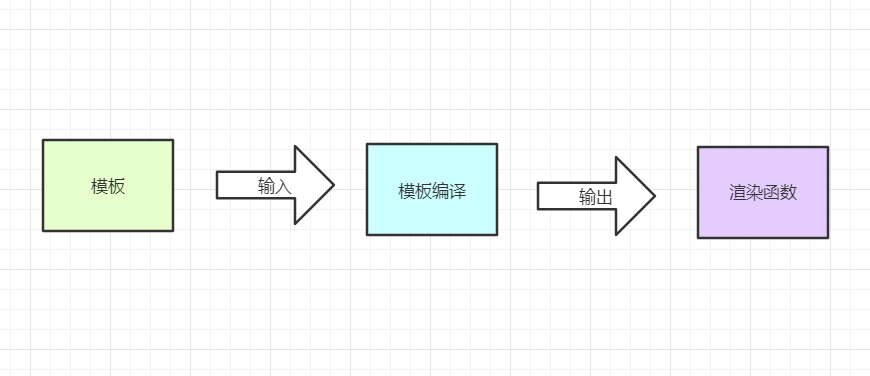
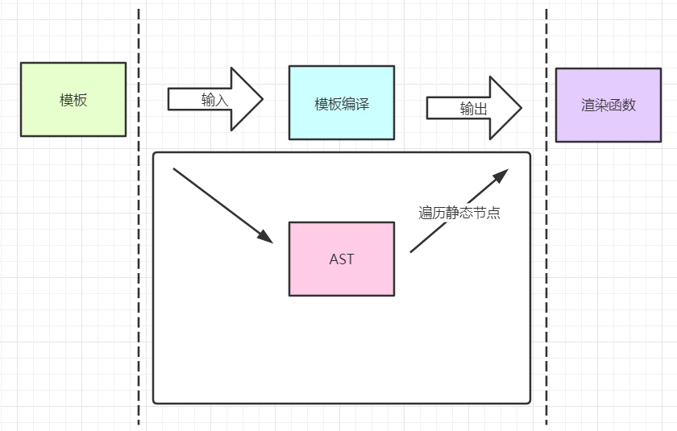
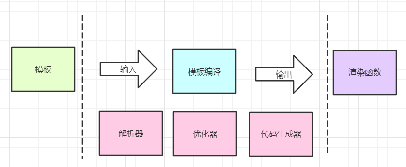

# 浅析Vue内部模板编译和解析

> 我们写在组件里面的HTML代码，最后是怎么渲染到页面的？


## 01 前言


由于Vue框架是大多数人都会用的，因此也成为了前端面试的必问内容。我们平时在组件里面编写的HTML代码，最后神奇地渲染在页面上，中间怎么做的过程我们从来也没有过多关心。但是这往往也成了我们的弱点，面试遇到可能就是直接跳过了。所以本着有时间（面试），就好好总结一下这其中神奇的内容吧。


## 02 模板编译


我们知道最终的页面渲染时通过patch函数来进行的，把新的vdom与旧的vdom对比后，重新渲染页面。那么在此过程之前，vdom是怎么出现的呢？它是怎么生成的呢？最就涉及到模板编译的一系列过程了，而这个过程的总体流程如下图：



我们所写的HTML代码，里面可能会有一些变量，有一些for循环等各种指令，或者还有一些静态节点等等。不管有什么，只要是template里面的内容，都是模板的部分。

中间模板编译部分就是我们要详细讲解的部分，输出之后就会转成渲染函数，渲染函数里面通过一些函数就可以生成虚拟节点树，也就是vdom树。


## 03 渲染函数


变成渲染函数是经过AST（抽象语法树）来形成的。但是HTML代码当中可能会存在一些静态节点，没有变量或者其他的操作，那么这个静态节点就不需要每一次都编译。所以为了提高一点点的性能，通常会在生成渲染函数之前，遍历一遍AST找出静态节点，打上静态节点的标签，假如更新虚拟DOM的时候就不会重新渲染它。

所以总结一下，变成渲染函数需要通过三部分：

- 模板变成AST
- AST遍历静态节点
- 生成渲染函数

而这三部分中也对应着三个模块，在其中起着重要的作用：

- 解析器
- 优化器
- 代码生成器







##### **解析器**

解析器的主要过程就是把模板变成AST，目标很明确，但是解析器内部又可以分成多个解析器，比如HTML解析器、文本解析器等；其中HTML解析器就是核心模块。当解析到HTML标签的时候，会识别标签的开始、结束位置以及文本等，都会触发一系列的钩子函数，然后数据通过参数的形式传递出来。

##### **优化器**

我们之前说了会遍历静态节点，然后打上标签。这里的优化器就是遍历作用，检测静态节点。这种节点比较特殊，一旦渲染完成之后以后都不会重新渲染了，而是直接克隆已有的虚拟节点。通过解析器的操作，可以来提升一下性能。

```html
<span>我是静态节点，快给我打上标签吧</span>
```

##### **代码生成器**

通过前面的几个步骤，我们就可以得到抽象语法树（AST）了，那么代码生成器的作用就是将AST通过函数的作用变成虚拟DOM节点。

```html
<p title="alanwu" @click="go">冲冲冲</p>
```

```
`with(this){
	return _c(
		'p',
		{
			attrs:{"title":"alanwu"},
			on:{"click":go}
		},
		[_v("冲冲冲")]
	)
}`
```

上面一段话经过处理过后会生成代码字符串，然后代码字符串经过导出之后，会把这段代码字符串以参数形式放到渲染函数里面。至此模板编译就完成了。

上面的 _ c 和 _ v 函数的作用分别是创建元素类型的vnode和创建文本类型的vnode。由于vnode有多种类型，所以除了这两个函数以外，虚拟DOM提供了很多种创建vnode的方法。vnode的类型有以下几种：

- 注释节点
- 文本节点
- 元素节点
- 组件节点
- 函数式组件
- 克隆节点

每一种不同的节点，虚拟DOM都提供了不一样的方法来创建vnode。


## 04 小结


通过对模板编译的大概解析，我们可以知道其中的过程有几个部分，其一是模板变成AST，其二是AST遍历静态节点，其三是AST变成代码字符串给渲染函数用。中间对应的三个重要部分是解析器、优化器以及代码生成器。


