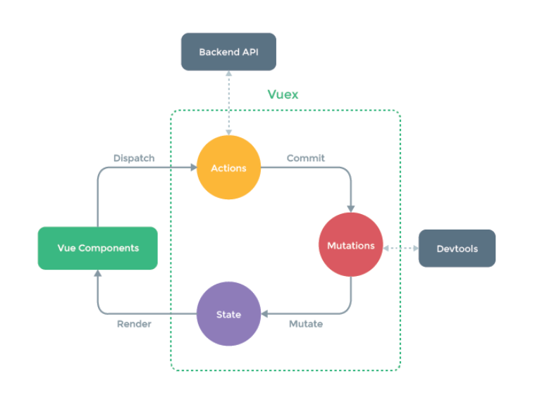
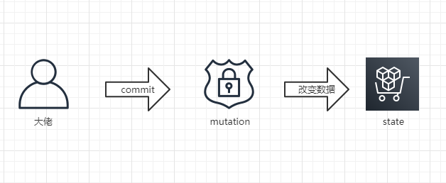

# 总结Vuex如何在项目中的使用

> 使用全局的数据管理，让我们更方便地处理数据？


## 01 前言


作为vue框架中的一个重要部分，vuex到底是什么呢？

vuex是一种**状态管理模式**，它保存着组件的公用的状态，并且以相应的规则保证状态变化。vuex的核心就是一个store，它相当于是一个容器，其中state包含了我们组件所有的状态，除了有state还有action,mutation,getter,modules。

- state：用于数据的存储，是store中的唯一数据源
- getters：如vue中的计算属性一样，基于state数据的二次包装，常用于数据的筛选和多个数据的相关性计算
- mutation：类似函数，改变state数据的唯一途径，且不能用于处理异步事件
- action：类似于mutation，用于提交mutation来改变状态，而不直接变更状态，可以包含任意异步操作
- modules：类似于命名空间，用于项目中将各个模块的状态分开定义和操作，便于维护

它与全局的对象有两点不同：

1. Vuex的状态是响应式的。当vue组件从store中读取状态时，若state中的状态发生变化，那么相应引用的组件就会得到更新。
2. 不能直接改变store的状态。唯一的方法就是通过显示提交（commit）mutation。



## 02 简单的例子


##### **安装vuex**

一般我们都会通过NPM或者Yarn来进行安装

```bash
npm install vuex --save
//或者
yarn add vuex
```

然后当你需要使用的时候就注册安装一下vuex即可。

```javascript
import Vue from 'vue'
import Vuex from 'vuex'
Vue.use(Vuex)
```

```javascript
// 如果在模块化构建系统中，请确保在开头调用了 Vue.use(Vuex)
const store = new Vuex.Store({
  state: {
    count: 0
  },
  mutations: {
    increment (state) {
      state.count++
    }
  }
})
```

上面的例子中，state中存储的就是我们的数据源，而mutation就用用来改变数据源的操作，也是唯一的方式。当我们改变count的时候，我们就可以：

```javascript
store.commit('increment')
```


## 03 核心概念


vuex中有几个核心的概念，我们先来认识一下：

- State
- Getter
- Mutation
- Action
- Module

##### **State**

首先State我们知道，就是一个大仓库，存储着很多变量的值，任何人都不可以直接去改变里面的值，必须要经过一个信任的人（mutation）来改变。



通过把vuex挂载到根组件，就不用每一次使用都要Vue.use(vuex)了，挂载之后就可以使用this.$store获取store实例了。

```javascript
// 创建一个 Banker 组件
const Banker = {
  template: `<div>My bank account have{{ money }}$</div>`,
  computed: {
    count () {
      return this.$store.state.count
    }
  }
}
```

当然，要是组件里面有多种状态，你总不能都声明为计算属性吧

```javascript
import { mapState } from 'vuex'
export default {
  computed: mapState({
    count: state => state.count,

    // 传字符串参数 'count' 等同于 `state => state.count`, 这样html代码里面的变量可以写成 countAlias
    countAlias: 'count'
  })
}
```

或者如果变量与state相同，可以直接传递一个数组

```javascript
computed: mapState([
  // 映射 this.count 为 store.state.count
  'count'
])
```


##### **Getter**

通俗一点来讲，就是在获取数据的时候先做一遍处理。而且这个处理是全实例通用的，比如以下的例子，获取符合条件的数据，就不用把函数复制放在每一个的computed中，直接从store中拿来用就好。

```javascript
const store = new Vuex.Store({
  state: {
    todos: [
      { id: 1, text: '...', done: true },
      { id: 2, text: '...', done: false }
    ]
  },
  getters: {
    doneTodos: state => {
      return state.todos.filter(todo => todo.done)
    }
  }
})
```

那么当我们的组件需要的时候就直接：

```javascript
store.getters.doneTodos // -> [{ id: 1, text: '...', done: true }]
```

如果你有多个Getter，那也可以像上面mapState一样，有同样的方法mapGetters可以用：

```javascript
import { mapGetters } from 'vuex'
export default {
  computed: {
  // 使用对象展开运算符将 getter 混入 computed 对象中
    ...mapGetters([
      'doneTodos',
      'anotherGetter',
      // ...
    ])
  }
}
```


##### **Mutation**

我们前面提到过，要想改变状态就必须要提交mutation。值得注意的是，mutation必须是同步函数，因为异步的回调函数在状态的改变上是不可以跟踪的。

```javascript
const store = new Vuex.Store({
  state: {
    count: 1
  },
  mutations: {
    increment (state) {
      // 变更状态
      state.count++
    }
  }
})
```

这里的mutation是定义了数据是怎么改变的，但是还没有变的，因为没有去触发它。当你想数据改变的时候必须手动去触发，你可以在组件中使用如下的方式：

```javascript
store.commit('increment')
```

当然你也可以传入一个参数，比如像这样：

```javascript
mutations: {
  increment (state, n) {
    state.count += n
  }
}
```

```javascript
store.commit('increment', 10)
```

除了是单一的参数，还支持对象的形式（大部分是对象）:

```javascript
mutations: {
  increment (state, payload) {
    state.count += payload.amount
  }
}
```

```javascript
store.commit('increment', {
  amount: 10
})
//或者
store.commit({
  type: 'increment',
  amount: 10
})
```


##### **Action**

Action与mutation是类似的，不同的是：

- Action提交的是mutation，而不是直接改变状态
- Action可以包含异步操作，而Mutation是不可以的

```javascript
const store = new Vuex.Store({
  state: {
    count: 0
  },
  mutations: {
    increment (state) {
      state.count++
    }
  },
  actions: {
    increment (context) {
      context.commit('increment')
    }
  }
})
```

大家可能发现了，increment的参数是一个context，这个其实就是与store实例具有相同方法和属性的对象。你可以使用：

```javascript
context.commit('increment')
//你也可以使用以下的方式获取state/getters
//context.state
//context.getters
```

来提交一个mutation。

前面我们定义mutation的时候，只是定义而已，实际触发还需要commit的方式。所以这里也是一样的，需要dispatch来触发action。像这样：

```javascript
store.dispatch('increment')
```

上面我们提到可以异步操作的，类似这样来定义action：

```javascript
actions: {
  incrementAsync ({ commit }) {
    setTimeout(() => {
      commit('increment')
    }, 1000)
  }
}
```

也可以传递参数，比如这样：

```
store.dispatch('incrementAsync', {
  amount: 10
})

// 以对象形式分发
store.dispatch({
  type: 'incrementAsync',
  amount: 10
})
```


##### **Module**

我们知道，当项目非常大的时候，把所有的mutation或action都写在一起，难免会显得很臃肿，变得难以维护。所以我们就有了module模块的概念，把内容进行不同的分类，每一个模块都有自己的mutation或者getter等。例如：

```javascript
const moduleA = {
  state: { ... },
  mutations: { ... },
  actions: { ... },
  getters: { ... }
}

const moduleB = {
  state: { ... },
  mutations: { ... },
  actions: { ... },
  getters: { ... }
}

const store = new Vuex.Store({
  modules: {
    a: moduleA,
    b: moduleB
  }
})

store.state.a // -> moduleA 的状态
store.state.b // -> moduleB 的状态
```


## 04 小结


Vuex 是一个专为 Vue.js 应用程序开发的**状态管理模式**。它采用集中式存储管理应用的所有组件的状态，并以相应的规则保证状态以一种可预测的方式发生变化。通过定义和隔离状态管理中的各种概念并通过强制规则维持视图和状态间的独立性，我们的代码将会变得更结构化且易维护。

Vuex 可以帮助我们管理共享状态，并附带了更多的概念和框架。这需要对短期和长期效益进行权衡。

如果您不打算开发大型单页应用，使用 Vuex 可能是繁琐冗余的。确实是如此——如果您的应用够简单，您最好不要使用 Vuex。一个简单的 [store 模式](https://cn.vuejs.org/v2/guide/state-management.html#简单状态管理起步使用)就足够您所需了。但是，如果您需要构建一个中大型单页应用，您很可能会考虑如何更好地在组件外部管理状态，Vuex 将会成为自然而然的选择。


