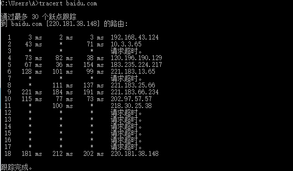
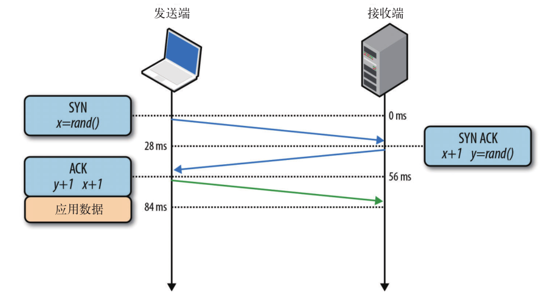

# 浅谈传输层协议的优化方案

> 近年来web性能优化越来越重要，用户体验很大程度与高性能相关

## 01 前言

现在的前端开发已不再局限于页面的编写，我们现在已经进入了一个性能优化的阶段。很多现象都明确表明，只有你的网站速度够快，性能最优，用户的转化率就会越高，用户的忠诚度也会越高。所以为了解决网站性能优化的瓶颈，我们需要从头开始进行性能的分析。今天我们来聊一下如何进行web方面的性能分析，因为最近也在阅读关于web性能方面的知识，特此发文总结一下。

## 02 网络的概述

### 延迟与带宽

###### 延迟时间组成

- 延迟指的就是从发送源到接收源经历的时间
- 带宽指的就是逻辑或物理路径最大的吞吐量

从发送源开始到接收源，中间可能经过很多的基站或者运营商等，那么延迟到底由哪些部分组成呢？从客户端到服务端之间历经的过程会涉及到以下的延迟：

- 传播延迟：从发送端到接收端的时间，是传播距离与速度的关系
- 传输延迟：传输的信息转移到链路中需要的时间，是消息长度与链路速率的关系
- 处理延迟：处理分组首部、检查位错误以及确定分组目标所需的时间
- 排队延迟：到来的分组排队等待的时间

之前我们介绍过CDN的原理，就是让用户从最近的服务器加载内容，大幅度降低传播分组的时间，在距离与时间的选择当中，我们选择缩短距离的方式来减少加载时间。

其实我们应该明白，造成用户加载时间过慢的原因不是带宽的问题，而是延迟的问题。比如从中国请求美国的网站，中间花的时间不是横跨大洋或者大陆产生的，而是你当前接收的地址（一般是家或者办公室）与最近的服务运营商之间的连接，中间可能会经过多个路由器，路由器进行网络数据的分发，最终才会与运营商连接起来。

在linux平台上可以使用traceroute 命令最终信息的传输过程，计算每一跳所需要的时间，window就通过tracert命令。

###### 高带宽与低延迟

由于人们对视频的需求增长迅速，所以我们提高传输的带宽是非常有必要的，比如部署更多的光纤、拥塞路由之间改善链路、或者使用光纤波分复用（WDN）等技术来让现有的硬件设备传输更多的数据。

WDN:波分复用(WDM)是将两种或多种不同波长的光载波信号(携带各种信息)在发送端经复用器(亦称合波器)汇合在一起，并耦合到光线路的同一根光纤中进行传输的技术；在接收端，经解复用器(亦称分波器或称去复用器)将各种波长的光载波分离，然后由光接收机作进一步处理以恢复原信号。这种在同一根光纤中同时传输两个或众多不同波长光信号的技术,称为波分复用

除了提高带宽，我们也可以利用减少延迟的方式改善，可以让光信号传输的速率更接近光速，如采用折射率更低的材料、速度更快的路由器或者中继器。上面我们就提到过其实信息分组的传输中，延迟是最难以解决的。

### TCP的具体构成

###### TCP/IP协议

我们这两种协议并不陌生，IP协议（因特网协议），负责联网主机之间的路由选择与寻址；TCP协议（传输控制协议），负责不可靠的传输信道之上提供可靠的抽象层。对于信息传输的过程中发生的事情，如丢包、拥塞控制等隐藏，所以在优化的时候我们可能会有一些挑战。

###### 三次握手

在客户端与服务器进行应用数据交换之前进行操作。

在三次握手阶段其实是比较耗费性能的，因此我们想要优化网络也可以从这一方面下手，任何两段数据想要通过TCP传输，那么握手就是必不可少的阶段。谷歌的开发人员研究出一种TCP Fast Open的技术，通过客户端连接时附加一个Cookie（一个TCP选项，此Cookie通常采用一种分组密码，私钥由服务器根据客户端的IP地址保存）来验证是否之前就连接过，如果成功则可以在服务器收到第三个包之前就发送数据。

###### 拥塞控制及预防

- 流量控制

流量控制是一种预防发送端向服务端发送过多数据的一种机制。如果超过了接收端的接收量，可能会造成负载重而处理不过来的情况。每一方都要向对方告知自己的接收窗口，确保能够开辟一个数据缓冲区接收对方的信息。

- 慢启动

慢启动出现的原因其实就是连接刚建立的双发都不知道网络中可用的带宽是多少，必须要有一个估算的机制，而且这个机制还要随着网络传输的带宽而进行动态变化。我们不可能一上来就完全利用连接的最大带宽，都需要慢慢地传输数据信息以防止网络拥堵。

- 拥塞预防

###### 队首阻塞

我们都知道TCP有顺序交付的特点，从一开始的确认应答机制到滑动窗口的机制，前者是只有确认前一个包才可以进行下一个包的发送，后者是允许你发送一定数量的包到接收端，但假如有一个包接收端一直收不到，那就必须停止后面包的发送，重发丢失的包。

###### TCP优化建议

要对TCP进行优化，必须要最大限度地利用底层协议的原理，其原理性的东西无非就是以下的几点：

- 三次握手就是一次往返时间
- 慢启动在每个连接中都应用
- 流量控制和拥塞控制会影响到所有连接的吞吐量
- 吞吐量由当前拥塞窗口大小控制

**服务器调优**

- 增大TCP的初始化拥塞窗口
- 慢启动重启
- 窗口缩放
- TCP快速打开

通过进行服务器的最优调整，把主机的操作系统升级到最新版本，可以确保每个TCP连接都具有较低的延迟和较高的吞吐量。

**应用程序行为调优**

- 数据能不发就不发
- 使用CDN让传输距离变短
- 复用TCP连接

请求的影响因素就是减少请求与压缩体积，通过减少一些不必要的数据传输和减少传输距离，能够使应用程序的行为最优。

`小结`

- 升级服务器内核版本
- 拥塞窗口大小为10
- 禁用空闲后的慢启动
- 确保启动窗口缩放
- 减少传输冗余数据
- 压缩传输的数据
- 服务器放到离用户最近的地方（CDN）
- 重用TCP连接

### UDP的优化
由于UDP是一种简单的协议，它的高效性正是因为它忽略了很多TCP的特性，但是由于这样的高效性，可能也会造成麻烦。举个例子来说，当你看视频的时候假如没有经过拥塞处理，可能会占用大量的带宽，导致一些正常的TCP连接无法发送正常的数据，如网页也可能无法打开。另一种情况也有可能造成视频一直卡顿，无法加载。

所以我们针对这种情况必须进行有效的处理，根据RFC的文档，主要有几种优化方案。

- 控制传输速度
- 对所有的流量进行拥塞控制
- 使用与TCP相近的带宽
- 处理数据包丢失、重复和重排

以上的优化必须是应用程序做出的优化。

## 03 小结

上面我们讨论了如何进行对传输层两个协议的优化，以及中间的细节性东西，可能还有很多没有讲到，但是把主要的几个点都大概说了一下，也对其中的几个点有所了解。

前端与网络的关系大家都知道，理解TCP的核心机制已经是web优化的必修课，我们在项目中一般不会深入到链路物理层面进行优化，但是应用层的优化我们还是可以做的。

