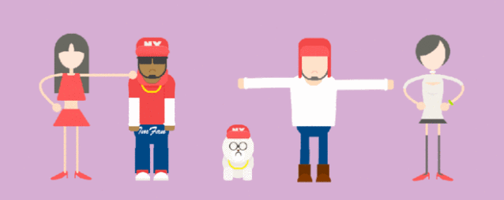

## Web前端安全知多少

> **“**  绳锯木断，水滴石穿**”**




## 01 前言


近年来前端的功能再也不是简单的页面开发这么简单，前端难免会和浏览器打交道，大多数人们都会通过浏览器进行网上的业务办理，信息查找等。但是这意味着我们会泄露自身的隐私，如手机号、身份证号等。

早期没有任何防护措施的浏览器发生了很多诈骗事件，随着浏览器的不断更新换代，安全系数也越来越高，接下来我将通过几种常见的前端安全策略，阐述一下我们的隐私如何被保障。


## 02 前端安全分类


前端主要通过浏览器进行交互操作，涉及到浏览器安全的主要有以下5种。

- 浏览器安全
- 跨站脚本攻击(XSS)
- 跨站请求伪造(CSRF)
- 点击劫持(ClickJacking)

##### **浏览器安全**

浏览器拥有同源策略，它可以说是浏览器的核心功能，如果没有同源策略的保护，浏览器的正常功能将受到很大的影响。那么什么是同源策略呢？

**浏览器的同源策略，限制来自不同源的脚本对当前域的调用和访问。**


听起来很抽象，举个例子，小明正在浏览 a.com，如果没有同源策略，那么a.com的网站可能会执行来自b.com的一段脚本数据，从而纂改a.com的内容，造成混乱。所以为了不让a.com调用其它页面的脚本或者数据，限制在同一个源内。那么如何才是同一个源呢？


想要满足同源策略，必须满足以下3个条件，才会被视为同源。

- 协议相同
- 域名相同
- 端口相同

以上条件缺一不可，首先是协议方面，网站有http协议和https协议之分，https比http更安全，原因是https通过（SSL/TSL）来加密数据，防止数据被窃听和修改。SSL是安全套接层，TSL是传输层安全协议。

然后是域名相同，如 www .a.com , www .b.com就是不同的域名，域名不一样也是不满足策略。最后是端口相同，www .a.com:3000 , www .b.com:5000就是端口不同，也不满足条件。


##### **跨站脚本攻击(XSS)**

XSS攻击，通常是通过“HTML”注入修改网页，当浏览器执行恶意脚本时可能会被他人控制。XSS攻击危害极大，如果网页开发者不注意防范XSS攻击，可能会对用户产生危害。

```javascript
<div><script>alert("XSS攻击！")</script></div>
```


XSS攻击可以分为两种：

- 持久型
- 非持久型

①持久型：代码被写进数据库，比如在评论界面的输入框注入恶意代码，那么每一个用户访问帖子的时候都会执行恶意代码。这种类型的攻击影响最大，特别是对于那种日访问量以千万计算的网站。

②非持久型：一般是通过修改URL的参数方式加入攻击代码，利用某种方式诱导用户进行点击，从而实施攻击。比如以下的代码不加过滤处理就会发生攻击。谷歌浏览器是可以防御此类攻击的。

```php+HTML
<!-- http://www.domain.com?name=<script>alert(1)</script> -->
<div>{{name}}</div>
```


那么既然危害如此之大，该如何防御呢？主要有以下方法：  

- 转义字符
- CSP
- HtppOnly

①转义字符：因为一般恶意代码都会是脚本语言，由<script></script>包含，所以我们的思想就是把<，>等转义就可以高效防御。

```javascript
function escape(str) {
  str = str.replace(/&/g, '&amp;')
  str = str.replace(/</g, '&lt;')
  str = str.replace(/>/g, '&gt;')
  str = str.replace(/"/g, '&quto;')
  str = str.replace(/'/g, '&#39;')
  str = str.replace(/`/g, '&#96;')
  str = str.replace(/\//g, '&#x2F;')
  return str
}
```

但是对于富文本那样的编辑器，通过过滤转义等方式可能加大任务量，所以另外一种就是通过CSP的方式，也就是建立白名单的方式进行防御。

②CSP：建立白名单，明确告诉浏览器哪些外部资源可以被加载并执行。通过前端配置规则，浏览器则会自动拦截。

- 通过设置HTTP Header中的 Content-Security-Policy
- 设置meta标签的方式 <meta http-equiv="Content-Security-Policy">

比如：

- 只允许加载本站资源

```javascript
Content-Security-Policy: default-src 'self'
```

- 只允许加载https协议的照片

```javascript
Content-Security-Policy: img-src https://*
```

- 允许加载任何来源框架

```javascript
Content-Security-Policy: child-src 'none'
```

只有当前端配置好之后，剩下的就交给浏览器处理。


③HttpOnly：浏览器将禁止页面的JavaScript访问带有HttpOnly属性的Cookie。实际上HttpOnly并非是为了防御XSS攻击，而是XSS攻击之后的Cookie劫持。

首先解释一下Cookie的产生过程：

1. 浏览器向服务器发送请求，这时还没有Cookie
2. 服务器返回时带有 Set-Cookie 头，向浏览器写入Cookie
3. Cookie会有一个过期时间，在到期之前，浏览器访问该域名下的页面都会带上Cookie

```javascript
header("Set-Cookie: name=zhangsan");
header("Set-Cookie: age=12; HttpOnly");
```


##### **CSRF**攻击

CSRF 中文名为跨站请求伪造。原理就是攻击者构造出一个后端请求地址，诱导用户点击或者通过某些途径自动发起请求。如果用户是在登录状态下的话，后端就以为是用户在操作，从而进行相应的逻辑。

我们来看一下典型的CSRF攻击（假设）：

1. A用户登陆某银行账号，本地留有登陆信息cookie
2. A突然收到黑客B发来的诱导链接，A在登陆状态下打开链接

其实这就产生攻击。

我们在这里假设A，B都有银行账户，链接就是一个转账申请（按照银行的转账申请格式手动构造请求），然后提交申请后银行服务器误以为是A在操作，所以转账就会成功，此时就产生了攻击。


那么如何预防CSRF攻击呢？

我们知道一般这个攻击都是第三方网站发起的，被攻击的网站无法阻止攻击的发生。所以我们只能增强自己的网站来提升安全性。

通常我们根据CSRF的攻击的特点来进行防御：

- 同源检测
- Samesite Cookie
- CSRF Token
- 双重cookie验证

①同源策略：在HTTP协议中，每一个异步请求都会携带两个Header，用于标记来源域名：

- Origin Header
- Referer Header

这两个Header在浏览器发起请求时，大多数情况会自动带上，并且不能由前端自定义内容。服务器可以通过解析这两个Header中的域名，确定请求的来源域。若不是来自同一个域的HTTP请求则不会生效。

②Samesite Cookie：HTTP响应头中有Set-Cookie属性，属性有两个值，Strict 和 Lax。

```javascript
Set-Cookie: foo=1; Samesite=Strict
Set-Cookie: bar=2; Samesite=Lax
Set-Cookie: baz=3
```

当设置为Strict的时候，伪造的请求是不会带上本地的cookie进行请求，所以这时候CSRF攻击不会生效。当设置为Lax的时候，在同源内发送请求是可以带上的。

③CSRF Token：用户打开页面的时候服务器下发一个Token，值为通过加密算法进行加密。每次请求都要加上这个Token值，服务端验证是否有效，无效则拒绝。

④双重Cookie验证：用户在发送请求的时候生成一个Cookie值，内容为随机字符串，前端向后端发送请求时取出Cookie值与服务端进行比较，若一致则有效，不一致则拒绝。


##### **点击劫持**

点击劫持是一种视觉欺骗的攻击手段。攻击者将需要攻击的网站通过 iframe 嵌套的方式嵌入自己的网页中，并将 iframe 设置为透明，在页面中透出一个按钮诱导用户点击。


防御方法：

- X-FRAME-OPTIONS
- JS防御

①X-FRAME-OPTIONS：X-FRAME-OPTIONS 是一个 HTTP 响应头，在现代浏览器有一个很好的支持。这个 HTTP 响应头 就是为了防御用 iframe 嵌套的点击劫持攻击。该响应头有三个属性可选：

- DENY，表示页面不允许通过 iframe 的方式展示
- SAMEORIGIN，表示页面可以在相同域名下通过 iframe 的方式展示
- ALLOW-FROM，表示页面可以在指定来源的 iframe 中展示

②JS防御：对于某些远古浏览器来说，并不能支持上面的这种方式，那我们只有通过 JS 的方式来防御点击劫持了。

```php+HTML
//作用就是当通过 iframe 的方式加载页面时，
//攻击者的网页直接不显示所有内容了
<head>
  <style id="click-jack">
    html {
      display: none !important;
    }
</style>
</head>
<body>
  <script>
    if (self == top) {
      var style = document.getElementById('click-jack')
      document.body.removeChild(style)
    } else {
      top.location = self.location
    }
</script>
</body>
```


## 03 小结


前端安全已经成为了面试必问的知识点，前端的发展离不开浏览器的更新换代，互联网人数的激增始终会有一些不法分子利用安全漏洞进行网络诈骗，我们作为离用户最近的开发人员，有义务去保护我们的用户的隐私安全，给用户一个良好的体验和信任。


