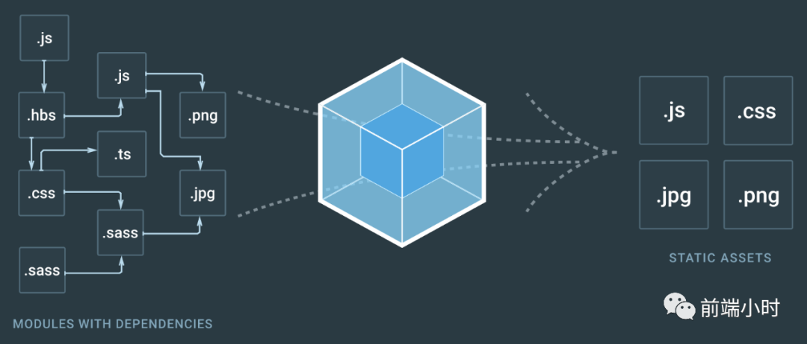

# webpack面试常考点——深入浅出webpack

> 梅须逊雪三分白，雪却输梅一段香


## 01 前言


大家可以想一下，假如你在面试当中最不想遇到的是什么？其实无非就是问到你不会的知识点，很多人可能会存着侥幸的心理不想面对那些看不懂的知识。所以我就想奉劝大家一句，还是好好恶补一下吧。


前端现在越来越向着工程化的方向发展，我们可以做的事情越来越多了，而且功能都很丰富。前端框架的发展就是因为效率的问题，搭建一个通用脚手架就可以为以后的开发省下不少的时间。

前端的构建工具有很多种，下面我就总结一下前端打包工具webpack到底是什么？有什么作用。还有顺便总结一下面试通常会问些什么问题。


## 02 webpack


webpack是一个开源的前端打包工具，提供了前端开发缺乏的模块化开发方式，将各种静态资源视为模块，并从它生成优化过的代码。可以从配置文件里面配置资源入口、匹配规则等多种功能。




##### **<font color="#FF7F50">webpack的构建作用</font>**

- **代码转换**：将es6转换成es5代码，把.scss文件转化成.css文件
- **文件优化**：可以合并图片，压缩代码
- **代码分割**：把每个页面的公共代码提取，异步加载首屏不需要的部分
- **模块合并**：构建过程可以合并相同类型的文件
- **自动刷新**：监听代码修改，自动刷新浏览器内容
- **代码校验**：校验代码是否符合规范
- **自动发布**：代码更新后自动构建，上线发布并提交给系统


##### **<font color="#FF7F50">webpack的打包原理</font>**

- **初始化参数**：从配置文件和shell文件语句中读取与合并，得出最终的配置参数。
- **开始编译**：根据参数初始化Compiler对象，加载所有配置的插件
- **确定入口**：根据entry确定所有入口文件
- **模块编译**：从入口文件开始，调用loader对模块进行翻译，递归找出所有依赖文件
- **完成编译**：使用loader翻译完之后，得到模块之间的关系以及模块内容
- **输出资源**：根据入口和模块关系，组装成包含多个模块的Chunk，将每个Chunk转换成一个单独文件加入输出列表


##### **<font color="#FF7F50">webpack核心概念</font>**

- **Entry**：入口，webpack的构建入口从这里开始
- **Module**：模块，webpack处理模块的规则，在webpack里一切文件都是模块，webpack会从配置的Entry开始递归找到所有依赖的模块
- **Loader**：模块翻译器，用于把一些新的语法文件，如ES6、.scss文件转换成ES5和.css文件等可让浏览器识别的。
- **Resolve**：配置webpack的寻找模块规则，用于提高效率
- **Plugin**：插件，webpack在构建的过程中会广播对应的事件，插件的作用就是可以监听事件，然后执行相应的操作
- **Output**：输出结果，webpack在经过一系列的处理最终得到的代码结果
- **Chunk**：代码块，一个Chunk由多个模块组成，用于代码合并与分割


##### **<font color="#FF7F50">webpack的loader和plugin</font>**

对于loader，它是一个转换器，将A文件进行编译形成B文件，这里操作的是文件，用原模块的内容按照loader翻译成另外的内容。比如将A.scss转换为A.css，单纯的文件转换过程。

plugin是一个扩展器，它丰富了webpack本身，针对是loader结束后。webpack在整个构建过程中特定时机会广播出对应的事件，plugin就可以监听这些事件并执行相应的过程，它并不直接操作文件，而是基于事件机制工作。


## 03 webpack优化


**<font color="#FF7F50">1. 缩小文件范围</font>**

- 优化loader，尽可能少的文件被loader处理翻译。

  （1）优化正则匹配

  （2）开启cacheDirectory缓存

  （3）配置include、exclude

- 优化resolve.modules，指定路径减少查找范围
- 配置resolve.alias，配置别名
- 配置resolve.extensions，正确填写文件后缀名，减少查找
- 配置resolve.noParse，忽略部分没采用模块化的文件处理

**<font color="#FF7F50">2. 减少冗余代码</font>**

babel-plugin-transform-runtime，可以减少冗余代码，减少编译后的文件大小

**<font color="#FF7F50">3. 使用HappyPack</font>**

运行在node之上的webpack是单线程模型，HappyPack可以分解任务给多个子进程并发执行，处理完之后再发送给主线程

**<font color="#FF7F50">4. 使用ParalleUglifyPlugin</font>**

原来js代码输出会使用Uglify逐个压缩，但是ParalleUglifyPlugin会把多个文件压缩工作分配给多个子进程完成，加快压缩时间

**<font color="#FF7F50">5. 使用自动刷新</font>**

当你修改本地代码之后，webpack会监听改变并自动构建完成输出可以运行代码，然后控制浏览器刷新

```javascript

devServer: {
  watchOptions: {
    // 不监听的文件或文件夹，支持正则匹配
    ignored: /node_modules/,
    // 监听到变化后等300ms再去执行动作
    aggregateTimeout: 300,
    // 默认每秒询问1000次
    poll: 1000
  }
},
```

**<font color="#FF7F50">6. 开启模块热替换</font>**

配置devServer中的热模块替换，可在不刷新浏览器情况下实时预览。原理是源码变化后使用重新编译的模块替换旧模块。

**<font color="#FF7F50">7. 提取公共代码</font>**

将多个页面的公共代码抽取出来，形成单独的文件，避免多次加载浪费用户流量。可使用CommonsChunkPlugin插件来解决。

**<font color="#FF7F50">8. 按需加载代码</font>**

工程化构建项目的时候会引入很多不需要的文件，比如引入Ant Design可以按需引入，提高首屏的现实速度。

**<font color="#FF7F50">9. 优化SourceMap</font>**

上线代码会进行压缩，缺点就是开发人员难以定位错误和检查bug。SourceMap可以进行定位。

**<font color="#FF7F50">10. 构建结果图形化</font>**

可以使用webpack-bundle-analyzer进行可视化构建结果，分析项目的构建还可以有哪些优化问题。


## 04 小结


webpack是一个构建打包工具，现在几乎前端的框架都可以使用它进行项目的打包和优化，里面的可配置性非常高，可以做的事情非常多。现在社区的生态也很活跃，越来越多的插件被开发者开发出来，值得我们好好去学习。

<font color="#32CD32">参考文章</font>

- Webpack再深入在总结
- Vue项目Webpack优化实践，构建效率提高50%
- 《深入浅出Webpack》

