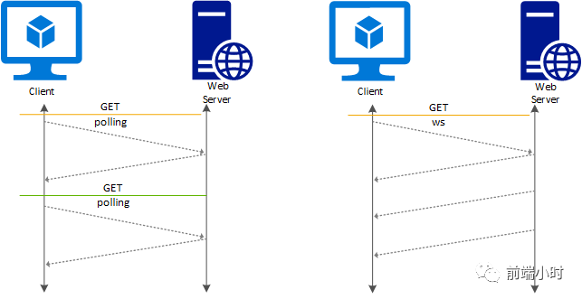
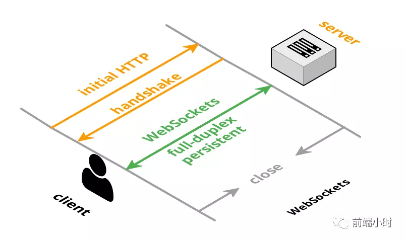

# WebSocket 协议系统解析

> 读书之法, 在循序而渐进, 熟读而精思


## 01 前言


早期的网站使用的是轮询技术，用来实现定时请求资源，由客户端发送HTTP请求。但是这种请求可能存在很长的http请求头，真正的数据可能很少，这就造成了带宽的消耗。现在比较新的技术是Comet，可以实现全双工通信，但也需要反复发出请求，而且HTTP长连接在Comet中是普遍使用的，也会消耗服务器资源。

所以为了解决上面的情况，HTML5定义了WebSocket协议，能够更好地节约服务器资源和带宽，并且能够实现实时通讯。




## 02 webSocket


WebSocket与HTTP和HTTPS使用的是相同的TCP端口，由于这个的原因，可以绕过大多数的防火墙限制。默认是使用80端口，但是在TLS协议的时候会使用443端口。具体实现上是通过http协议建立通道，然后在此基础上用真正的WebSocket协议进行通信，所以WebSocket协议和http协议是有一定的交叉关系的。




该协议最大的特点是实现了服务端推送，以往获取资源只能由客户端发起，现在服务端可以主动发起了。实现了真正的全双工通信。它有以下的优点：

- 较少的控制开销
- 更强的实时性
- 能够保持长连接
- 更好的二进制支持
- 可以支持扩展
- 能够压缩数据提高效率
- 没有同源限制


## 03 通信原理


当客户端与服务端建立WebSocket连接，在客户端与服务端的握手过程中，客户端会先发送一个HTTP请求，包含一个Upgrade请求头来告诉服务端要升级为WebSocket协议。

```javascript
let ws = new WebSocket('ws://localhost:9000');//建立连接
```


发送请求头：

```javascript
Host: localhost:9000
Origin: http://localhost:9000
Pragma: no-cache
Sec-WebSocket-Extensions: permessage-deflate; client_max_window_bits
Sec-WebSocket-Key: 5fTJ1LTuh3RKjSJxydyifQ== // 与响应头 Sec-WebSocket-Accept 相对应
Sec-WebSocket-Version: 13    // 表示 websocket 协议的版本
Upgrade: websocket    // 表示要升级到 websocket 协议
```

响应头：

```javascript
Connection: Upgrade
Sec-WebSocket-Accept: ZUip34t+bCjhkvxxwhmdEOyx9hE=
Upgrade: websocket
```

此时如果正常，服务器就会返回101状态码并切换为WebSocket协议建立全双工连接，后续信息将会通过这个协议进行传输。

```javascript
GUID = "258EAFA5-E914-47DA-95CA-C5AB0DC85B11"; //  一个固定的字符串
accept = base64(sha1(key + GUID));    
// key 就是 Sec-WebSocket-Key 值，
//accept 就是 Sec-WebSocket-Accept 值
```

Sec-WebSocket-Key：客户端随机生成的一个base64编码

Sec-WebSocket-Accept：服务端经过算法处理后回传给客户端

Connection和Upgrade字段告诉服务器，客户端发起的是WebSocket协议请求

最后一步客户端拿到服务端的值之后使用相同算法进行解码之后，跟服务端的进行对比，如果一致则成功连接。

```javascript
function connectWebsocket() {
    ws = new WebSocket('ws://localhost:9000');
    // 监听连接成功
    ws.onopen = () => {
        console.log('连接服务端WebSocket成功');
        // send 方法给服务端发送消息
        ws.send(JSON.stringify(msgData));    
    };

    // 监听服务端消息(接收消息)
    ws.onmessage = (msg) => {
        let message = JSON.parse(msg.data);
        console.log('收到的消息：', message)
        elUl.innerHTML += `<li class="b">小秋：${message.content}</li>`;
    };

    // 监听连接失败
    ws.onerror = () => {
        console.log('连接失败，正在重连...');
        connectWebsocket();
    };

    // 监听连接关闭
    ws.onclose = () => {
        console.log('连接关闭');
    };
};
connectWebsocket();
```


## 04 心跳包


当连接后长时间不进行通信就可能会出现连接不稳定的情况，那么就会影响数据的传输，比如在聊天室的信息可能出现不同步的情况。所以客户端会定时发送一个包告诉服务器我连接正常，服务器也会回应正常。称之为心跳包。

```javascript
setInterval(() => {    ws.send('这是一条心跳包消息');}, 60000)
```


## 05 应用场景


WebSocket协议多用于实时通讯方面的场景，对实时数据要求比较高的，可以应用于以下的场景：

- 即时聊天通信
- 多玩家游戏
- 在线协同编辑/编辑
- 实时数据流的拉取与推送
- 体育/游戏实况
- 实时地图位置


## 06 与HTTP的异同


##### **相同点**

- 都是基于TCP的应用层协议；
- 都使用Request/Response模型进行连接的建立；
- 在连接的建立过程中对错误的处理方式相同，在这个阶段WS可能返回和HTTP相同的返回码；
- 都可以在网络中传输数据。

##### **不同点**

- WS使用HTTP来建立连接，但是定义了一系列新的header域，这些域在HTTP中并不会使用；
- WS的连接不能通过中间人来转发，它必须是一个直接连接；
- WS连接建立之后，通信双方都可以在任何时刻向另一方发送数据；
- WS连接建立之后，数据的传输使用帧来传递，不再需要Request消息；
- WS的数据帧有序。


## 07 小结


WebSocket可写的东西还挺多，比如WebSocket扩展。客户端、服务端之间是如何协商、使用扩展的。WebSocket扩展可以给协议本身增加很多能力和想象空间，比如数据的压缩、加密，以及多路复用等。理论还是要联系实际才可以。


**<font color="green">参考文章</font>**

- WebSocket教程 阮一峰博客
- 深入剖析WebSocket的原理
- WebSocket详解（四）：刨根问底HTTP与WebSocket的关系
- 维基百科 WebSocket
- WebSocket 原理浅析与实现简单聊


